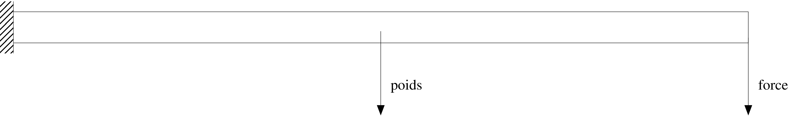
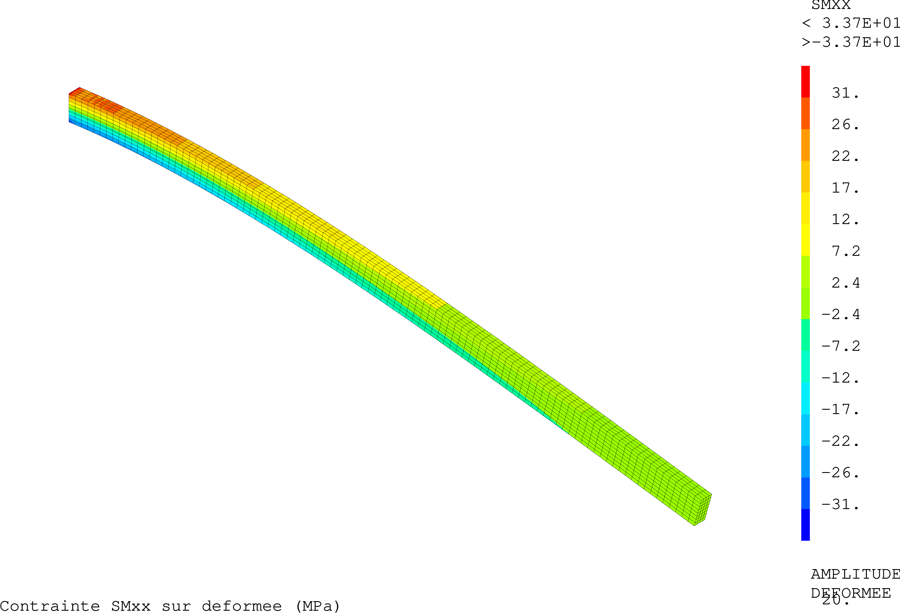
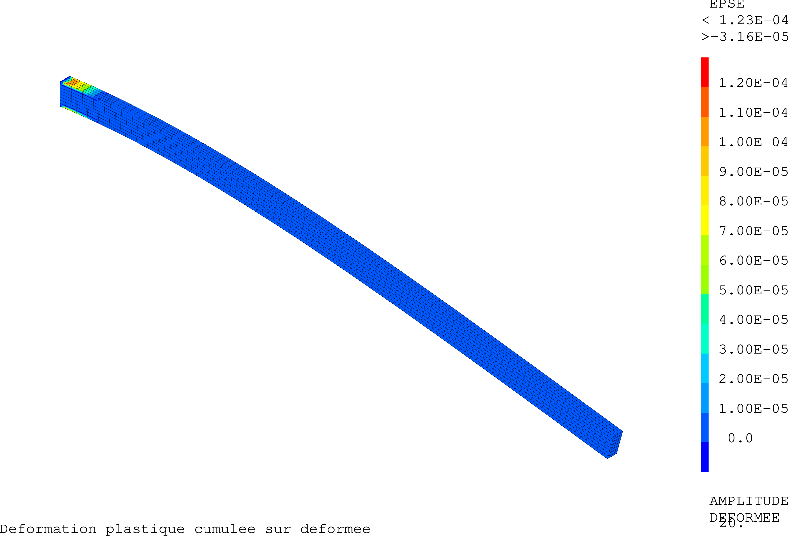

.. _sec:mecanique_statique_application:

Application
===========

.. _sec:statique1:

Exemple : statique1.dgibi
-------------------------

Description
~~~~~~~~~~~

  On propose de résoudre l'équilibre d'une poutre en flexion simple
  soumise à son poids propre. Une de ses extrémités est donc encastrée ;
  l'autre est soumise à un effort tranchant \ :math:`\vec{F}`. Sous
  l'effet de la pesanteur, elle est également soumise à une densité
  volumique de force :math:`\vec{f}=\rho\vec{g}`. Le problème mécanique
  ainsi posé est illustré par la figure \ `5.1 <#fig:statique1>`__.

   
   Schéma d'une poutre en flexion simple soumise à son poids propre.
   
.. fin de la figure (commentaire necessaire pour clore ???)

  Le comportement mécanique de la poutre est élasto-plastique parfait.
  Ses caractéristiques mécaniques sont données dans la
  table \ `[tab:mateex1] <#tab:mateex1>`__ et ses dimensions, dans la
  table \ `[tab:dimeex1] <#tab:dimeex1>`__. Son épaisseur étant fournie
  (dimension normale au plan de la figure \ `5.1 <#fig:statique1>`__),
  ce problème sera modélisé en trois dimensions.

============== ====================== ================ ================
Module d'Young Coefficient de Poisson Limite élastique Masse volumique
(Gpa)                                 (MPa)            (kg/m:math:`^3`)
============== ====================== ================ ================
40             0,2                    25               :math:`2.10^3`
============== ====================== ================ ================

[tab:mateex1]

======== ======= =========
Longueur Hauteur Épaisseur
(m)      (m)     (m)
15       0,6     0,3
======== ======= =========

[tab:dimeex1]

Mise en données
~~~~~~~~~~~~~~~

  La mise en données de ce problème est fournie en
  annexe \ `6.1 <#ann:dgibiex1>`__, page . Ce jeu de données est
  également disponible sur le `Site <%
  http://www-cast3m.cea.fr/index.php?page=exemples&exemple=statique1>`__.
  Pour résoudre l'équilibre, on a programmé l'algorithme de minisation
  du résidu présenté au chapitre \ `4 <#sec:resoeque>`__,
  figure \ `[fig:algominires1] <#fig:algominires1>`__. La programmation
  en Gibiane de la boucle de résolution de l'équilibre est présentée à
  la figure \ `[fig:algoex1] <#fig:algoex1>`__.
  Le problème est résolu en un pas de calcul. Les conditions initiales
  étant nulles, l'expression du premier résidu se limite à :
  :math:`R_1 = F_1^V + F_1^S` (variable R1, ligne 5). On initialise
  également le champ de déplacement solution par un champ nul (variable
  U1, ligne 6). La valeur de l'effort de référence \ :math:`F^{ref}` est
  fixée à la première itération de la boucle de résolution (variable
  Fref1, ligne 20). La précision \ :math:`\zeta` est définie en tête du
  jeu de donnée et vaut :math:`1.10^{-4}` (variable zprec1, ligne 25).

Exécution
~~~~~~~~~

  La figure \ `[fig:ecranex1] <#fig:ecranex1>`__ présente les messages
  affichés par le jeu de données au cours de la résolution de
  l'équilibre. Ces affichages indiquent que l'équilibre est atteint en
  10 itérations. En plus de la valeur du critère sur le résidu (Critère
  Forces), le jeu de données affiche également la valeur de la
  déformation plastique cumulée (Epse).

Pour illustrer le résultat du calcul, les
figures \ `5.2 <#fig:SMXXex1>`__ et \ `5.3 <#fig:ESPEex1>`__ présentent,
respectivement, les isovaleurs de la contrainte \ :math:`\sigma_{xx}` et
de la déformation plastique cumulée  :math:`\varepsilon^p_{eq}` obtenues
à l'équilibre, affichées sur le maillage déformé avec un facteur
d'amplification de 20.

   Illustration du résultat :
   contrainte :math:`\sigma_{xx}` sur la configuration déformée (x 20).

   Illustration du résultat : 
   déformation plastique cumulée :math:`\varepsilon^p_{eq}` sur la configuration déformée (x 20).
