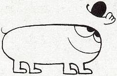

.. Documentation théorique de Cast3M,
   fichier principal

Documentation théorique de Cast3M
*********************************
Bienvenue dans la documentation théorique de Cast3M.

Vous y trouverez quelques éléments théoriques pour mieux comprendre le fonctionnement
de certains opérateurs/directives et procédures du code Cast3M.

.. toctree::
   :caption: Mécanique
   :maxdepth: 1

   mecanique_quasi_statique/index
   mecanique_dynamique/index
   mecanique_revue_modeles_beton/index

.. toctree::
   :caption: Thermique
   :maxdepth: 1

   thermique_transitoire/index

.. toctree::
   :caption: Divers
   :maxdepth: 1

   optimisation_topologique/index
