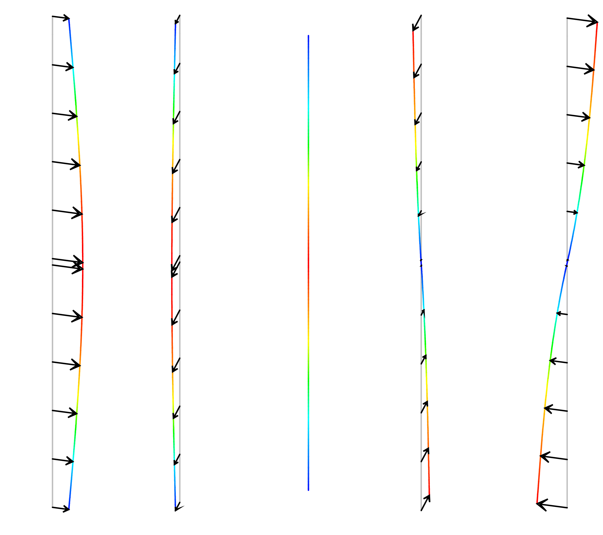
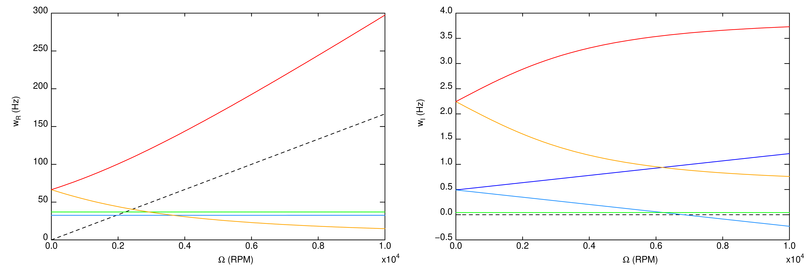
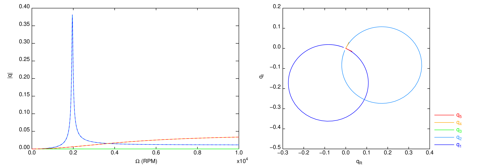

.. _ex:rotor_laval_poutre:

Modélisation d'un rotor de Laval : calcul des modes propres réels et complexes, réponse au balourd 
--------------------------------------------------------------------------------------------------

Descriptif
""""""""""

Un rotor dit *de Laval* est étudié à l'aide d'éléments *poutre de Timoshenko*
dans le repère fixe.

.. admonition:: Extrait du script Cast3M : Données, maillage et modélisation

   .. literalinclude:: ./rotor_laval_poutre.dgibi
      :language: gibiane
      :lines: 1-174
      :linenos:

      
Calcul des modes réels
""""""""""""""""""""""

On calcule les 5 premiers modes propres réels de la structure au repos
(vitesse de rotation :math:`\Omega = 0`).

.. admonition:: Extrait du script Cast3M : Calcul des modes réels

   .. literalinclude:: ./rotor_laval_poutre.dgibi
      :language: gibiane
      :lines: 175-216
      :lineno-start: 175

   
   Déformées :math:`\varphi` des premiers modes réels
   

Calcul du diagramme Campbell
""""""""""""""""""""""""""""

On calcule l'évolution des modes complexes du rotor
avec la vitesse de rotation :math:`\Omega`.

.. admonition:: Extrait du script Cast3M : Calcul des modes complexes

   .. literalinclude:: ./rotor_laval_poutre.dgibi
      :language: gibiane
      :lines: 217-322
      :lineno-start: 217

   
   Partie réelles et imaginaire des fréquences des modes complexes
      
      
Calcul de la réponse au balourd
"""""""""""""""""""""""""""""""

On calcule la réponse du rotor à une excitation tournante synchrone
avec la vitesse de rotation :math:`\Omega`.

.. admonition:: Extrait du script Cast3M : Calcul de la réponse au balourd

   .. literalinclude:: ./rotor_laval_poutre.dgibi
      :language: gibiane
      :lines: 323-426
      :lineno-start: 323

   
   Amplitude et diagramme de Nyquist de la réponse modale à un balourd

Fichiers à télécharger
""""""""""""""""""""""

- :download:`Jeu de données Cast3M <./rotor_laval_poutre.dgibi>`
- :download:`Fichier graphique résultat pour le cas avec 5 modes <./rotor_laval_poutre-5.pdf>`
- :download:`Fichier graphique résultat pour le cas avec 9 modes <./rotor_laval_poutre-9.pdf>`
