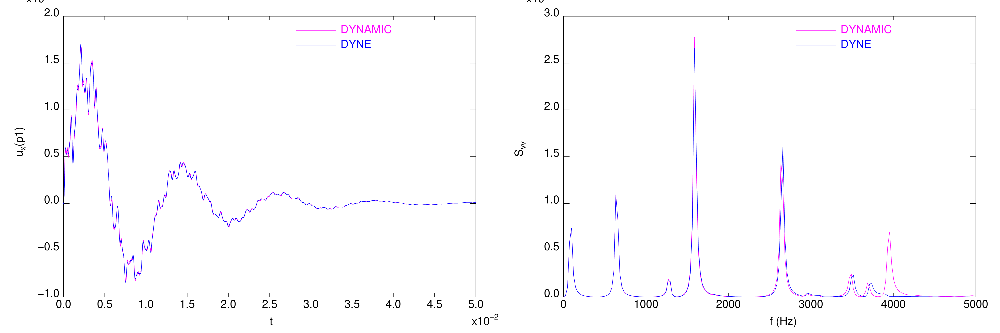

.. _ex:vibrations_cloche:

Modélisation des vibrations d'une cloche : calcul des modes propres et réponse à un choc
----------------------------------------------------------------------------------------

Descriptif
""""""""""

Une cloche est étudiée à l'aide d'éléments massif quadratique.

.. admonition:: Extrait du script Cast3M : Données, maillage et modélisation

   .. literalinclude:: ./vibrations_cloche.dgibi
      :language: gibiane
      :lines: 1-81
      :linenos:

      
Calcul des modes réels
""""""""""""""""""""""

On calcule les 30 premiers modes propres réels de la structure,
ce qui permet de couvrir la plage 0 - 4000 Hz.

.. admonition:: Extrait du script Cast3M : Calcul des modes réels

   .. literalinclude:: ./vibrations_cloche.dgibi
      :language: gibiane
      :lines: 82-118
      :lineno-start: 81

.. figure:: ./vibrations_cloche-MODES.png
   :width: 600px
   :align: center
   
   Quelques exemple de déformées modales :math:`\varphi` en vue de face et de dessus
   

Calcul de la réponse à un choc par intégration temporelle
"""""""""""""""""""""""""""""""""""""""""""""""""""""""""

On simule un choc par une force de courte durée (0.1 ms).
Deux intégrations temporelles sont menées avec le même pas de temps (:math:`\Delta t = 10` µs)
et comparées :

- avec la procédure `DYNAMIC <http://www-cast3m.cea.fr/index.php?page=notices&notice=DYNAMIC>`_,
  en utilisant le schéma de l'accélération moyenne et sur base éléments finis.
- avec l'opérateur `DYNE <http://www-cast3m.cea.fr/index.php?page=notices&notice=DYNE>`_,
  en utilisant le schéma des différences centrées et sur base modale.

On observe des résultats très proches, mais une bien meilleure efficacité en utilisant
`DYNE <http://www-cast3m.cea.fr/index.php?page=notices&notice=DYNE>`_,
due à l'utilisation de la base réduite (diminution du nombre de ddl) et au travail en
lagage compilé (Fortran pour un opérateur) plutôt qu'interprété (Gibiane pour une procédure).

.. admonition:: Extrait du script Cast3M : Calcul de la réponse au balourd

   .. literalinclude:: ./vibrations_cloche.dgibi
      :language: gibiane
      :lines: 119-320
      :lineno-start: 119

   
   Evolution temporelle (à gauche) et densité spectrale de puissance (à droite)
   du déplacement en un point en bas de la cloche pour les intégrations temporelles par
   DYNAMIC et DYNE.

Fichiers à télécharger
""""""""""""""""""""""

- :download:`Jeu de données Cast3M <./vibrations_cloche.dgibi>`
- :download:`Fichier graphique résultat <./vibrations_cloche.pdf>`
