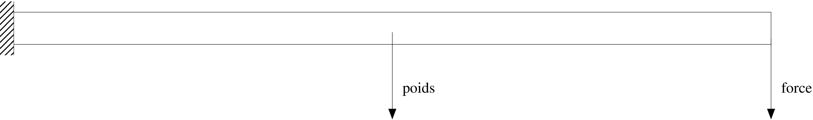
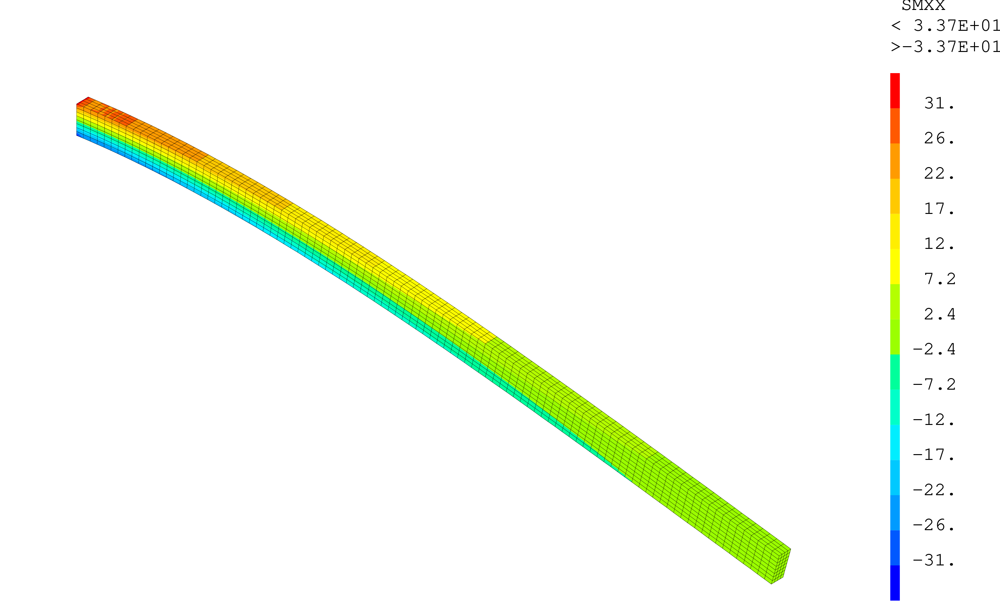
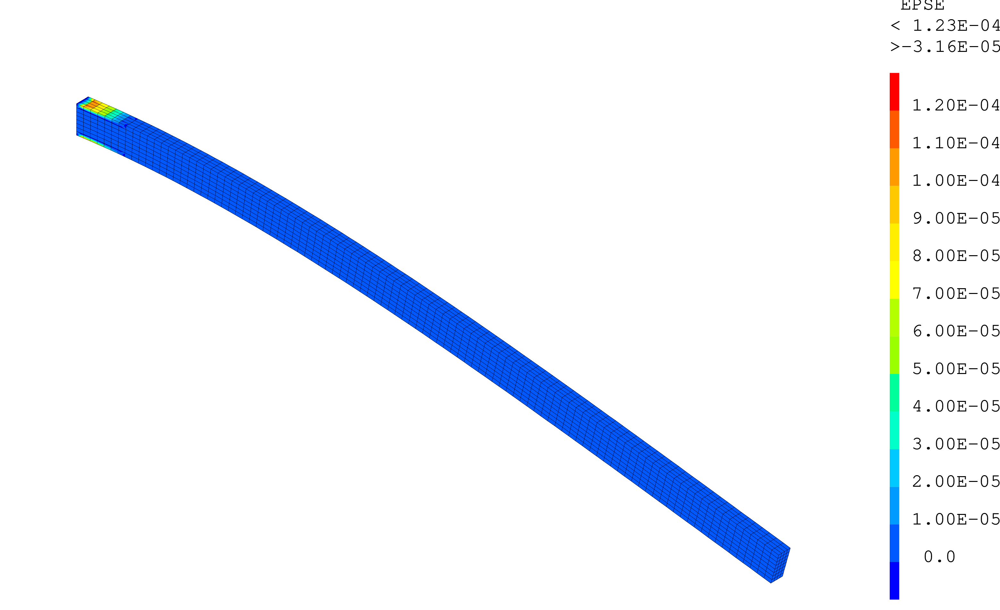

.. _sec:meca_stat_application:

Application
===========

.. _sec:meca_stat_statique1:

Exemple : statique1.dgibi
-------------------------

Description
~~~~~~~~~~~

On propose de résoudre l'équilibre d'une poutre en flexion simple
soumise à son poids propre. Une de ses extrémités est donc encastrée ;
l'autre est soumise à un effort tranchant \ :math:`\vec{F}`. Sous
l'effet de la pesanteur, elle est également soumise à une densité
volumique de force :math:`\vec{f}=\rho\vec{g}`. Le problème mécanique
ainsi posé est illustré par la figure ci-dessous.

   Schéma d'une poutre en flexion simple soumise à son poids propre

Le comportement mécanique de la poutre est élasto-plastique parfait.
Ses caractéristiques mécaniques et ses dimensions sont données dans les
tables ci-dessous. Son épaisseur étant fournie (dimension normale au plan de
la figure :ref:`ci-dessus <fig:meca_stat_statique1>`), ce problème sera modélisé
en trois dimensions.

.. table:: Caractéristiques du matériau
   :align: center

   +---------------+------------------+-------------------+---------------------+
   | Module de     | Coefficient de   | Limite            | Masse volumique     |
   |               |                  |                   |                     |
   | Young (GPa)   | Poisson          | élastique (MPa)   | (kg.m\ :sup:`-3`)   |
   +---------------+------------------+-------------------+---------------------+
   | 40            | 0,2              | 25                | 2000                |
   +---------------+------------------+-------------------+---------------------+

.. table:: Caractéristiques géométriques
   :align: center

   +--------------+-------------+---------------+
   | Longueur (m) | Hauteur (m) | Épaisseur (m) |
   +--------------+-------------+---------------+
   | 15           | 0,6         | 0,3           |
   +--------------+-------------+---------------+

Mise en données
~~~~~~~~~~~~~~~

La mise en données de ce problème est fournie en :ref:`annexe <ann:meca_stat_dgibi1>`.
Ce jeu de données est également disponible sur le
`site Cast3M <http://www-cast3m.cea.fr/index.php?page=exemples&exemple=statique1>`_.

Pour résoudre l'équilibre, on a programmé le précédent
:ref:`algorithme de minisation du résidu <algo:meca_stat_minires>`.
La programmation en Gibiane de la boucle de résolution de l'équilibre
est présentée dans le code :ref:`annexe <code:meca_stat_minires>`.

Le problème est résolu en un pas de calcul. Les conditions initiales
étant nulles, l'expression du premier résidu se limite à :
:math:`R_1 = F_1^V + F_1^S` (variable ``R1``, ligne 5).

On initialise également le champ de déplacement solution par un champ nul (variable ``U1``, ligne 6).

La valeur de l'effort de référence \ :math:`F^{ref}` est fixée à la première itération de
la boucle de résolution (variable ``Fref1``, ligne 20).

La précision \ :math:`\zeta` est définie en tête du jeu de donnée et vaut 10\ :sup:`-4`
(variable ``zprec1``, ligne 25).

.. _code:meca_stat_minires:

.. admonition:: Extrait du script Cast3M statique1.dgibi : algorithme de minimisation du résidu

   .. literalinclude:: dgibi/statique1.dgibi
      :language: gibiane
      :lines: 63-92
      :linenos:

Exécution
~~~~~~~~~

Les lignes :ref:`ci-dessous <code:meca_stat_ecran1>` présentent les messages
affichés par le jeu de données au cours de la résolution de
l'équilibre. Ces affichages indiquent que l'équilibre est atteint en
10 itérations. En plus de la valeur du critère sur le résidu ``Critère Forces``,
le jeu de données affiche également la valeur de la déformation plastique cumulée ``Epse``.

.. _code:meca_stat_ecran1:

.. admonition:: Messages affichés par le jeu de données au cours de la résolution de l’équilibre

   .. literalinclude:: dgibi/statique1.ecran
      :linenos:

Pour illustrer le résultat du calcul, les figures suivantes présentent les isovaleurs de
la contrainte :math:`\sigma_{xx}` et de la déformation plastique cumulée :math:`\varepsilon^p_{eq}`
obtenues à l'équilibre, affichées sur le maillage déformé avec un facteur d'amplification de 20.

   Illustration du résultat : contrainte :math:`\sigma_{xx}` sur la configuration déformée (x 20)

   Illustration du résultat : déformation plastique cumulée :math:`\varepsilon^p_{eq}` sur la configuration déformée (x 20)
