.. _sec:modeles_beton_tests:

Spécification des cas tests
===========================

Ce chapitre présente l'ensembe des cas de chargement appliqués pour effectuer les tests des lois de comportement pour
le béton disponibles dans Cast3M. Il se limite à la seule description des chargements et des phénomènes étudiés.

D'autres chapitres sont dédiés à la :ref:`vérification <sec:modeles_beton_verif>` et à la :ref:`validation <sec:modeles_beton_valid>`.
Ils détaillent les résultats de ces tests sur l'ensemble des lois de comportement.

Cas tests pour les modèles poutre à fibres
------------------------------------------

.. _sec:modeles_beton_test_pout_trac_mono:

Traction monotone
~~~~~~~~~~~~~~~~~

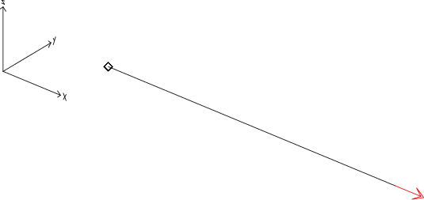

   Traction simple sur un modèle d'éléments finis poutre.

Description
"""""""""""

Il s'agit d'un test de traction simple monotone. On considère une poutre de longueur :math:`L` et section transversale :math:`S` soumise à un chargement de traction dans la direction de son axe.

Blocages et chargement
""""""""""""""""""""""
Le chargement consiste à piloter le déplacement **UX** de l'extrémité (:math:`L` 0 0) de l'élément **TIMO** en l'augmentant progressivement jusqu'à une valeur :math:`u_{max}`. On bloque les déplacements et les rotations de l'autre extrémité (0 0 0) de l'élément *[nh145313 : ainsi que les rotations de l'extrémité pilotée en déplacement]*.

Les instructions Gibiane correspondantes sont :

.. admonition:: Traction monotone : blocages et chargement

   .. literalinclude:: dgibi/01_traction.dgibi
      :language: gibiane
      :lines: 255-266
      :linenos:
      :lineno-start: 255

Liste des exemples dgibi
""""""""""""""""""""""""
Les jeux de données Gibiane correspondants à ce cas de chargement sont téléchargeables aux liens suivants :

- :download:`Test pour la loi de Mazars <./dgibi/01_traction.dgibi>`
- :download:`Test pour la loi de RICBET <./dgibi/01_traction.dgibi>`

.. _sec:modeles_beton_test_pout_comp_mono:

Compression monotone
~~~~~~~~~~~~~~~~~~~~

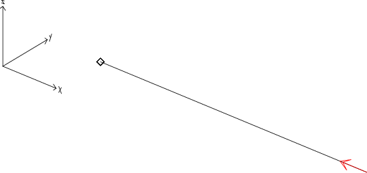

   Compression simple sur un modèle d'éléments finis poutre.

Description
"""""""""""

Il s'agit d'un test de compression simple monotone. On considère une poutre de longueur :math:`L` et section transversale :math:`S` soumise à un chargement de compression dans la direction de son axe.

Blocages et chargement
""""""""""""""""""""""
Le chargement consiste à piloter le déplacement **UX** de l'extrémité (:math:`L` 0 0) de l'élément **TIMO** en l'augmentant (en valeur absolue) progressivement jusqu'à une valeur :math:`u_{max} (<0)`. On bloque les déplacements et les rotations de l'autre extrémité (0 0 0) de l'élément *[nh145313 : ainsi que les rotations de l'extrémité pilotée en déplacement]*.

Les instructions Gibiane correspondantes sont :

.. admonition:: Compression monotone : blocages et chargement

   .. literalinclude:: dgibi/02_compression.dgibi
      :language: gibiane
      :lines: 283-294
      :linenos:
      :lineno-start: 283

Liste des exemples dgibi
""""""""""""""""""""""""
Les jeux de données Gibiane correspondants à ce cas de chargement sont téléchargeables aux liens suivants :

- :download:`Test pour la loi de Mazars <./dgibi/02_compression.dgibi>`
- :download:`Test pour la loi de RICBET <./dgibi/02_compression.dgibi>`

.. _sec:modeles_beton_test_pout_trac_cycl:

Traction cyclique
~~~~~~~~~~~~~~~~~

   Traction simple cyclique sur un modèle d'éléments finis poutre.

Description
"""""""""""

Il s'agit d'un test de traction simple cyclique. On considère une poutre de longueur :math:`L` et section transversale :math:`S` soumise à un chargement de traction dans la direction de son axe.

Blocages et chargement
""""""""""""""""""""""
Le chargement consiste à piloter le déplacement **UX** de l'extrémité (:math:`L` 0 0) de l'élément **TIMO** entre 0 et un pic de façon cyclique avec retour à 0 entre chaque cycle. La valeur du déplacement au pic augmente progressivement jusqu'à une valeur :math:`u_{max}`. On bloque les déplacements et les rotations de l'autre extrémité (0 0 0) de l'élément ainsi que les rotations de l'extrémité pilotée en déplacement.

Les instructions Gibiane correspondantes sont :

.. admonition:: Traction cyclique : blocages et chargement

   .. literalinclude:: dgibi/03_traction_cyclique.dgibi
      :language: gibiane
      :lines: 300-312
      :linenos:
      :lineno-start: 300

Liste des exemples dgibi
""""""""""""""""""""""""
Les jeux de données Gibiane correspondants à ce cas de chargement sont téléchargeables aux liens suivants :

- :download:`Test pour la loi de Mazars <./dgibi/03_traction_cyclique.dgibi>`
- :download:`Test pour la loi de RICBET <./dgibi/03_traction_cyclique.dgibi>`

.. _sec:modeles_beton_test_pout_comp_cycl:

Compression cyclique
~~~~~~~~~~~~~~~~~~~~

   Compression simple cyclique sur un modèle d'éléments finis poutre.

Description
"""""""""""

Il s'agit d'un test de compression simple cyclique. On considère une poutre de longueur :math:`L` et section transversale :math:`S` soumise à un chargement de compression dans la direction de son axe.

Blocages et chargement
""""""""""""""""""""""
Le chargement consiste à piloter le déplacement **UX** de l'extrémité (:math:`L` 0 0) de l'élément **TIMO** entre 0 et un pic de façon cyclique avec retour à 0 entre chaque cycle. La valeur du déplacement au pic augmente (en valeur absolue) progressivement jusqu'à une valeur :math:`u_{max} (<0)`. On bloque les déplacements et les rotations de l'autre extrémité (0 0 0) de l'élément ainsi que les rotations de l'extrémité pilotée en déplacement.

Les instructions Gibiane correspondantes sont :

.. admonition:: Compression cyclique : blocages et chargement

   .. literalinclude:: dgibi/04_compression_cyclique.dgibi
      :language: gibiane
      :lines: 329-341
      :linenos:
      :lineno-start: 329

Liste des exemples dgibi
""""""""""""""""""""""""
Les jeux de données Gibiane correspondants à ce cas de chargement sont téléchargeables aux liens suivants :

- :download:`Test pour la loi de Mazars <./dgibi/04_compression_cyclique.trace>`
- :download:`Test pour la loi de RICBET <./dgibi/04_compression_cyclique.trace>`

.. _sec:modeles_beton_test_pout_trac_comp:

Traction compression
~~~~~~~~~~~~~~~~~~~~

   Traction compression sur un modèle d'éléments finis poutre.

Description
"""""""""""

Il s'agit d'un test de traction compression alternées. On considère une poutre de longueur :math:`L` et section transversale :math:`S` soumise successivement à un chargement de traction puis de compression dans la direction de son axe.

Blocages et chargement
""""""""""""""""""""""
Le chargement consiste à piloter le déplacement **UX** de l'extrémité (:math:`L` 0 0) de l'élément **TIMO** en deux phases successives de sens opposés : tout  d'abord en augmentant progressivement le déplacement jusqu'à la valeur :math:`u_{t max} > 0` (traction), puis après changement de sens en l'augmentant (en valeur absolue) progressivement jusqu'à la valeur :math:`u_{c max} < 0` (compression). On bloque les déplacements et les rotations de l'autre extrémité (0 0 0) de l'élément *[nh145313 : ainsi que les rotations de l'extrémité pilotée en déplacement]*.

Les instructions Gibiane correspondantes sont :

.. admonition:: Traction compression : blocages et chargement

   .. literalinclude:: dgibi/05_traction_compression.dgibi
      :language: gibiane
      :lines: 414-426
      :linenos:
      :lineno-start: 414

Liste des exemples dgibi
""""""""""""""""""""""""
Les jeux de données Gibiane correspondants à ce cas de chargement sont téléchargeables aux liens suivants :

- :download:`Test pour la loi de Mazars <./dgibi/05_traction_compression.dgibi>`
- :download:`Test pour la loi de RICBET <./dgibi/05_traction_compression.dgibi>`

.. _sec:modeles_beton_test_pout_trac_comp_trac:

Traction compression traction
~~~~~~~~~~~~~~~~~~~~~~~~~~~~~

   Traction compression traction sur un modèle d'éléments finis poutre.

Description
"""""""""""

Il s'agit d'un test dont le chargement passe alternativement de traction à compression puis à nouveau traction. On considère une poutre de longueur :math:`L` et section transversale :math:`S` soumise successivement à un chargement de traction, de compression, puis à nouveau de traction dans la direction de son axe.

Blocages et chargement
""""""""""""""""""""""
Le chargement consiste à piloter le déplacement **UX** de l'extrémité (:math:`L` 0 0) de l'élément **TIMO** en trois phases successives de sens opposés : tout  d'abord en augmentant progressivement le déplacement jusqu'à la valeur :math:`u_{t1 max} > 0` (traction), puis après changement de sens en l'augmentant (en valeur absolue) progressivement jusqu'à la valeur :math:`u_{c2 max} < 0` (compression) et enfin, après un ultime retour au sens initial, en augmentant à nouveau progressivement le déplacement jusqu'à la valeur :math:`u_{t3 max} > 0` (traction). On bloque les déplacements et les rotations de l'autre extrémité (0 0 0) de l'élément ainsi que les rotations de l'extrémité pilotée en déplacement.

Les instructions Gibiane correspondantes sont :

.. admonition:: Traction compression traction : blocages et chargement

   .. literalinclude:: dgibi/06_traction_compression_traction.dgibi
      :language: gibiane
      :lines: 590-602
      :linenos:
      :lineno-start: 590

Liste des exemples dgibi
""""""""""""""""""""""""
Les jeux de données Gibiane correspondants à ce cas de chargement sont téléchargeables aux liens suivants :

- :download:`Test pour la loi de Mazars <./dgibi/06_traction_compression_traction.dgibi>`
- :download:`Test pour la loi de RICBET <./dgibi/06_traction_compression_traction.dgibi>`

.. _sec:modeles_beton_test_pout_cisa_mono:

Cisaillement
~~~~~~~~~~~~

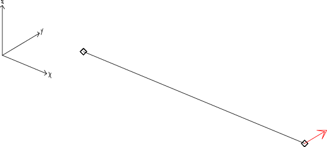

   Cisaillement simple sur un modèle d'éléments finis poutre.

Description
"""""""""""

Il s'agit d'un test de cisaillement simple. On considère une poutre de longueur :math:`L` et section transversale :math:`S` soumise à un chargement de cisaillement dans le plan de sa section d'extrémité.

Blocages et chargement
""""""""""""""""""""""
Le chargement consiste à piloter le déplacement **UY** de l'extrémité (:math:`L` 0 0) de l'élément **TIMO** en l'augmentant progressivement jusqu'à une valeur de déplacement maximal correspondant à une déformation de cisaillement :math:`\gamma_{xy_{max}}` (glissement) fixée arbitrairement. On bloque les déplacements et les rotations de l'autre extrémité (0 0 0) de l'élément ainsi que les rotations de l'extrémité pilotée en déplacement.

Les instructions Gibiane correspondantes sont :

.. admonition:: Cisaillement : blocages et chargement

   .. literalinclude:: dgibi/07_cisaillement.dgibi
      :language: gibiane
      :lines: 236-248
      :linenos:
      :lineno-start: 236

Liste des exemples dgibi
""""""""""""""""""""""""
Les jeux de données Gibiane correspondants à ce cas de chargement sont téléchargeables aux liens suivants :

- :download:`Test pour la loi de Mazars <./dgibi/07_cisaillement.dgibi>`

Cas tests pour les modèles massifs
----------------------------------

.. _sec:modeles_beton_test_mass_trac_mono:

Traction monotone
~~~~~~~~~~~~~~~~~

Description
"""""""""""

Il s'agit d'un test de traction simple monotone. Les dimensions dépendent de l'hypothèse de calcul retenue :

- en 3D, on considère un cube d'arête :math:`L` ;
- en 2D plan, on considère un domaine carré de côté :math:`L` et d'épaisseur :math:`e` ;
- en 2D axisymétrique, on considère un cylindre de rayon :math:`R` et de hauteur :math:`H`.

Blocages et chargement
""""""""""""""""""""""
Le chargement consiste à piloter le déplacement d'une des faces en l'augmentant progressivement jusqu'à une valeur :math:`u_{max}`. On bloque les déplacements de l'autre face en laissant libre la contraction par effet de Poisson.

- En 3D, on pilote le déplacement **UX** de la face "droite" (située dans le plan :math:`x=L`) et
  on bloque le déplacement **UX** de la face opposée "gauche" (dans le plan :math:`x=0`).
  Le mouvement de corps rigide est empêché en bloquant les déplacements **UY** et **UZ** du coin (0 0 0) et **UZ** du coin (0 :math:`L` 0).
- En 2D plan, les conditions sont similaires mais limitées aux degrés de liberté **UX** et **UY**.
- En 2D axisymétrique on pilote le déplacement **UZ** de la ligne "haute" (située en :math:`z=L`).
  On bloque alors le déplacement **UZ** de la ligne opposée "basse" (en :math:`z=0`).

Les instructions Gibiane correspondantes sont :

.. admonition:: Traction monotone : blocages et chargement pour le cas 3D

   .. literalinclude:: dgibi/01_traction.dgibi
      :language: gibiane
      :lines: 78-87
      :linenos:
      :lineno-start: 78

.. admonition:: Traction monotone : blocages et chargement pour le cas 2D axisymétrique

   .. literalinclude:: dgibi/01_traction.dgibi
      :language: gibiane
      :lines: 601-609
      :linenos:
      :lineno-start: 601

Les blocages et le chargement sont représentés sur les figures suivantes.

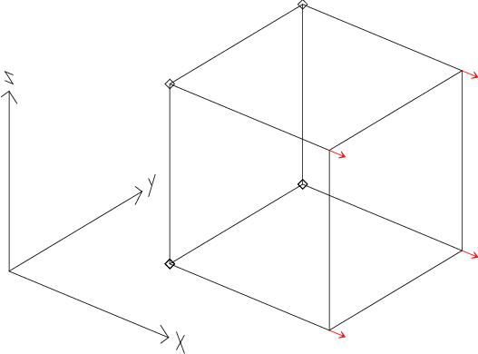
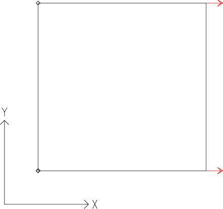
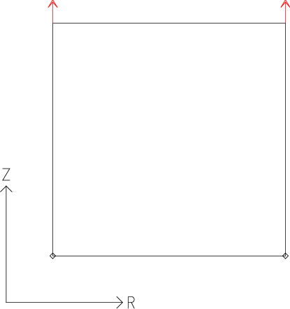

   Traction - Blocages et chargement de déplacement imposé sur le cube (3D), le carré (2D plan) et le cylindre (2D axisymétrique).

Liste des exemples dgibi
""""""""""""""""""""""""
Les jeux de données Gibiane correspondants à ce cas de chargement sont téléchargeables aux liens suivants :

- :download:`Test pour la loi de Mazars <./dgibi/01_traction.dgibi>`
- :download:`Test pour la loi de RICBET <./dgibi/01_traction.dgibi>`

.. _sec:modeles_beton_test_mass_comp_mono:

Compression monotone
~~~~~~~~~~~~~~~~~~~~

Description
"""""""""""

Il s'agit d'un test de compression simple monotone. Les dimensions dépendent de l'hypothèse de calcul retenue :

- en 3D, on considère un cube d'arête :math:`L` ;
- en 2D plan, on considère un domaine carré de côté :math:`L` et d'épaisseur :math:`e` ;
- en 2D axisymétrique, on considère un cylindre de rayon :math:`R` et de hauteur :math:`H`.

Blocages et chargement
""""""""""""""""""""""
Le chargement consiste à piloter le déplacement d'une des faces en l'augmentant (en valeur absolue) progressivement jusqu'à une valeur :math:`u_{max} (<0)`. On bloque les déplacements de l'autre face en laissant libre l'expansion par effet de Poisson.

- En 3D, on pilote le déplacement **UX** de la face "droite" (située dans le plan :math:`x=L`) et
  on bloque le déplacement **UX** de la face opposée "gauche" (dans le plan :math:`x=0`).
  Le mouvement de corps rigide est empêché en bloquant les déplacements **UY** et **UZ** du coin (0 0 0) et **UZ** du coin (0 :math:`L` 0).
- En 2D plan, les conditions sont similaires mais limitées aux degrés de liberté **UX** et **UY**.
- En 2D axisymétrique on pilote le déplacement **UZ** de la ligne "haute" (située en :math:`z=L`).
  On bloque alors le déplacement **UZ** de la ligne opposée "basse" (en :math:`z=0`).

Les instructions Gibiane correspondantes sont :

.. admonition:: Compression monotone : blocages et chargement pour le cas 3D

   .. literalinclude:: dgibi/02_compression.dgibi
      :language: gibiane
      :lines: 78-87
      :linenos:
      :lineno-start: 78

.. admonition:: Compression monotone : blocages et chargement pour le cas 2D axisymétrique

   .. literalinclude:: dgibi/02_compression.dgibi
      :language: gibiane
      :lines: 665-673
      :linenos:
      :lineno-start: 665

Les blocages et le chargement sont représentés sur les figures suivantes.

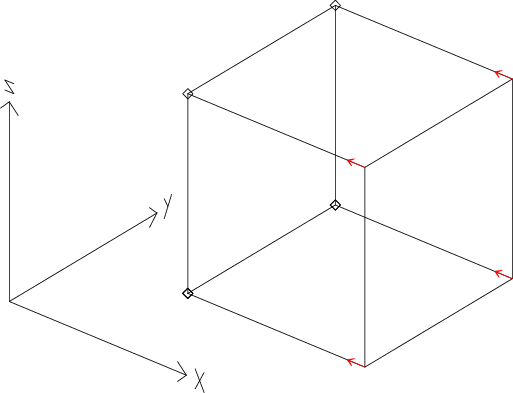
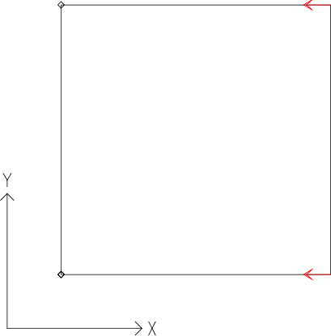
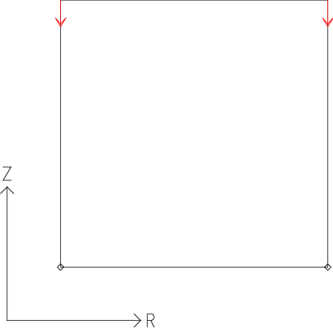

   Compression - Blocages et chargement de déplacement imposé sur le cube (3D), le carré (2D plan) et le cylindre (2D axisymétrique).

Liste des exemples dgibi
""""""""""""""""""""""""
Les jeux de données Gibiane correspondants à ce cas de chargement sont téléchargeables aux liens suivants :

- :download:`Test pour la loi de Mazars <./dgibi/02_compression.dgibi>`
- :download:`Test pour la loi de RICBET <./dgibi/02_compression.dgibi>`

.. _sec:modeles_beton_test_mass_trac_cycl:

Traction cyclique
~~~~~~~~~~~~~~~~~

Description
"""""""""""

Il s'agit d'un test de traction simple cyclique. Les dimensions dépendent de l'hypothèse de calcul retenue :

- en 3D, on considère un cube d'arête :math:`L` ;
- en 2D plan, on considère un domaine carré de côté :math:`L` et d'épaisseur :math:`e` ;
- en 2D axisymétrique, on considère un cylindre de rayon :math:`R` et de hauteur :math:`H`.

Blocages et chargement
""""""""""""""""""""""
Le chargement consiste à piloter le déplacement d'une des faces entre 0 et un pic de façon cyclique avec retour à 0 entre chaque cycle. La valeur du déplacement au pic augmente progressivement jusqu'à une valeur :math:`u_{max}`. On bloque les déplacements de l'autre face en laissant libre la contraction par effet de Poisson.

- En 3D, on pilote le déplacement **UX** de la face "droite" (située dans le plan :math:`x=L`) et
  on bloque le déplacement **UX** de la face opposée "gauche" (dans le plan :math:`x=0`).
  Le mouvement de corps rigide est empêché en bloquant les déplacements **UY** et **UZ** du coin (0 0 0) et **UZ** du coin (0 :math:`L` 0).
- En 2D plan, les conditions sont similaires mais limitées aux degrés de liberté **UX** et **UY**.
- En 2D axisymétrique on pilote le déplacement **UZ** de la ligne "haute" (située en :math:`z=L`).
  On bloque alors le déplacement **UZ** de la ligne opposée "basse" (en :math:`z=0`).

Les instructions Gibiane correspondantes sont :

.. admonition:: Traction cyclique : blocages et chargement pour le cas 3D

   .. literalinclude:: dgibi/03_traction_cyclique.dgibi
      :language: gibiane
      :lines: 78-88
      :linenos:
      :lineno-start: 78

.. admonition:: Traction cyclique : blocages et chargement pour le cas 2D axisymétrique

   .. literalinclude:: dgibi/03_traction_cyclique.dgibi
      :language: gibiane
      :lines: 737-746
      :linenos:
      :lineno-start: 737

Les blocages et le chargement sont représentés sur les figures suivantes.

   Traction cyclique - Blocages et chargement de déplacement imposé sur le cube (3D), le carré (2D plan) et le cylindre (2D axisymétrique).

Liste des exemples dgibi
""""""""""""""""""""""""
Les jeux de données Gibiane correspondants à ce cas de chargement sont téléchargeables aux liens suivants :

- :download:`Test pour la loi de Mazars <./dgibi/03_traction_cyclique.dgibi>`
- :download:`Test pour la loi de RICBET <./dgibi/03_traction_cyclique.dgibi>`

.. _sec:modeles_beton_test_mass_comp_cycl:

Compression cyclique
~~~~~~~~~~~~~~~~~~~~

Description
"""""""""""

Il s'agit d'un test de compression simple cyclique. Les dimensions dépendent de l'hypothèse de calcul retenue :

- en 3D, on considère un cube d'arête :math:`L` ;
- en 2D plan, on considère un domaine carré de côté :math:`L` et d'épaisseur :math:`e` ;
- en 2D axisymétrique, on considère un cylindre de rayon :math:`R` et de hauteur :math:`H`.

Blocages et chargement
""""""""""""""""""""""
Le chargement consiste à piloter le déplacement d'une des faces entre 0 et un pic de façon cyclique avec retour à 0 entre chaque cycle. La valeur du déplacement au pic augmentant (en valeur absolue) progressivement jusqu'à une valeur :math:`u_{max} (<0)`. On bloque les déplacements de l'autre face en laissant libre l'expansion par effet de Poisson.

- En 3D, on pilote le déplacement **UX** de la face "droite" (située dans le plan :math:`x=L`) et
  on bloque le déplacement **UX** de la face opposée "gauche" (dans le plan :math:`x=0`).
  Le mouvement de corps rigide est empêché en bloquant les déplacements **UY** et **UZ** du coin (0 0 0) et **UZ** du coin (0 :math:`L` 0).
- En 2D plan, les conditions sont similaires mais limitées aux degrés de liberté **UX** et **UY**.
- En 2D axisymétrique on pilote le déplacement **UZ** de la ligne "haute" (située en :math:`z=L`).
  On bloque alors le déplacement **UZ** de la ligne opposée "basse" (en :math:`z=0`).

Les instructions Gibiane correspondantes sont :

.. admonition:: Compression cyclique : blocages et chargement pour le cas 3D

   .. literalinclude:: dgibi/04_compression_cyclique.dgibi
      :language: gibiane
      :lines: 78-88
      :linenos:
      :lineno-start: 78

.. admonition:: Compression cyclique : blocages et chargement pour le cas 2D axisymétrique

   .. literalinclude:: dgibi/04_compression_cyclique.dgibi
      :language: gibiane
      :lines: 789-798
      :linenos:
      :lineno-start: 789

Les blocages et le chargement sont représentés sur les figures suivantes.

   Compression cyclique - Blocages et chargement de déplacement imposé sur le cube (3D), le carré (2D plan) et le cylindre (2D axisymétrique).

Liste des exemples dgibi
""""""""""""""""""""""""
Les jeux de données Gibiane correspondants à ce cas de chargement sont téléchargeables aux liens suivants :

- :download:`Test pour la loi de Mazars <./dgibi/04_compression_cyclique.dgibi>`
- :download:`Test pour la loi de RICBET <./dgibi/04_compression_cyclique.dgibi>`

.. _sec:modeles_beton_test_mass_trac_comp:

Traction compression
~~~~~~~~~~~~~~~~~~~~

Description
"""""""""""

Il s'agit d'un test de traction compression alternées. Les dimensions dépendent de l'hypothèse de calcul retenue :

- en 3D, on considère un cube d'arête :math:`L` ;
- en 2D plan, on considère un domaine carré de côté :math:`L` et d'épaisseur :math:`e` ;
- en 2D axisymétrique, on considère un cylindre de rayon :math:`R` et de hauteur :math:`H`.

Blocages et chargement
""""""""""""""""""""""
Le chargement consiste à piloter le déplacement d'une des faces en deux phases successives de sens opposés : tout  d'abord en augmentant progressivement le déplacement jusqu'à la valeur :math:`u_{t max} > 0` (traction), puis après changement de sens en l'augmentant (en valeur absolue) progressivement jusqu'à la valeur :math:`u_{c max} < 0` (compression). On bloque les déplacements de l'autre face en laissant libre la contraction par effet de Poisson.

- En 3D, on pilote le déplacement **UX** de la face "droite" (située dans le plan :math:`x=L`) et
  on bloque le déplacement **UX** de la face opposée "gauche" (dans le plan :math:`x=0`).
  Le mouvement de corps rigide est empêché en bloquant les déplacements **UY** et **UZ** du coin (0 0 0) et **UZ** du coin (0 :math:`L` 0).
- En 2D plan, les conditions sont similaires mais limitées aux degrés de liberté **UX** et **UY**.
- En 2D axisymétrique on pilote le déplacement **UZ** de la ligne "haute" (située en :math:`z=L`).
  On bloque alors le déplacement **UZ** de la ligne opposée "basse" (en :math:`z=0`).

Les instructions Gibiane correspondantes sont :

.. admonition:: Traction compression : blocages et chargement pour le cas 3D

   .. literalinclude:: dgibi/05_traction_compression.dgibi
      :language: gibiane
      :lines: 83-93
      :linenos:
      :lineno-start: 83

.. admonition:: Traction compression : blocages et chargement pour le cas 2D axisymétrique

   .. literalinclude:: dgibi/05_traction_compression.dgibi
      :language: gibiane
      :lines: 1067-1076
      :linenos:
      :lineno-start: 1067

Les blocages et le chargement sont représentés sur les figures suivantes.

   Traction compression - Blocages et chargement de déplacement imposé sur le cube (3D), le carré (2D plan) et le cylindre (2D axisymétrique).

Liste des exemples dgibi
""""""""""""""""""""""""
Les jeux de données Gibiane correspondants à ce cas de chargement sont téléchargeables aux liens suivants :

- :download:`Test pour la loi de Mazars <./dgibi/05_traction_compression.dgibi>`
- :download:`Test pour la loi de RICBET <./dgibi/05_traction_compression.dgibi>`

.. _sec:modeles_beton_test_mass_trac_comp_trac:

Traction compression traction
~~~~~~~~~~~~~~~~~~~~~~~~~~~~~

Description
"""""""""""

Il s'agit d'un test dont le chargement passe alternativement de traction à compression puis à nouveau traction. Les dimensions dépendent de l'hypothèse de calcul retenue :

- en 3D, on considère un cube d'arête :math:`L` ;
- en 2D plan, on considère un domaine carré de côté :math:`L` et d'épaisseur :math:`e` ;
- en 2D axisymétrique, on considère un cylindre de rayon :math:`R` et de hauteur :math:`H`.

Blocages et chargement
""""""""""""""""""""""
Le chargement consiste à piloter le déplacement d'une des faces en trois phases successives de sens opposés : tout  d'abord en augmentant progressivement le déplacement jusqu'à la valeur :math:`u_{t1 max} > 0` (traction), puis après changement de sens en l'augmentant (en valeur absolue) progressivement jusqu'à la valeur :math:`u_{c2 max} < 0` (compression) et enfin, après un ultime retour au sens initial, en augmentant à nouveau progressivement le déplacement jusqu'à la valeur :math:`u_{t3 max} > 0` (traction). On bloque les déplacements de l'autre face en laissant libre la contraction par effet de Poisson.

- En 3D, on pilote le déplacement **UX** de la face "droite" (située dans le plan :math:`x=L`) et
  on bloque le déplacement **UX** de la face opposée "gauche" (dans le plan :math:`x=0`).
  Le mouvement de corps rigide est empêché en bloquant les déplacements **UY** et **UZ** du coin (0 0 0) et **UZ** du coin (0 :math:`L` 0).
- En 2D plan, les conditions sont similaires mais limitées aux degrés de liberté **UX** et **UY**.
- En 2D axisymétrique on pilote le déplacement **UZ** de la ligne "haute" (située en :math:`z=L`).
  On bloque alors le déplacement **UZ** de la ligne opposée "basse" (en :math:`z=0`).

Les instructions Gibiane correspondantes sont :

.. admonition:: Traction compression traction : blocages et chargement pour le cas 3D

   .. literalinclude:: dgibi/06_traction_compression_traction.dgibi
      :language: gibiane
      :lines: 90-100
      :linenos:
      :lineno-start: 90

.. admonition:: Traction compression traction : blocages et chargement pour le cas 2D axisymétrique

   .. literalinclude:: dgibi/06_traction_compression_traction.dgibi
      :language: gibiane
      :lines: 1586-1595
      :linenos:
      :lineno-start: 1586

Les blocages et le chargement sont représentés sur les figures suivantes.

   Traction compression traction - Blocages et chargement de déplacement imposé sur le cube (3D), le carré (2D plan) et le cylindre (2D axisymétrique).

Liste des exemples dgibi
""""""""""""""""""""""""
Les jeux de données Gibiane correspondants à ce cas de chargement sont téléchargeables aux liens suivants :

- :download:`Test pour la loi de Mazars <./dgibi/06_traction_compression_traction.dgibi>`
- :download:`Test pour la loi de RICBET <./dgibi/06_traction_compression_traction.dgibi>`

.. _sec:modeles_beton_test_mass_cisa_mono:

Cisaillement
~~~~~~~~~~~~

Description
"""""""""""

Il s'agit d'un test de cisaillement simple. Les dimensions dépendent de l'hypothèse de calcul retenue :

- en 3D, on considère un cube d'arête :math:`L` ;
- en 2D plan, on considère un domaine carré de côté :math:`L` et d'épaisseur :math:`e` ;

Blocages et chargement
""""""""""""""""""""""
Le chargement consiste à piloter le déplacement d'une des faces en l'augmentant progressivement jusqu'à une valeur de déplacement maximal correspondant à une déformation de cisaillement :math:`\gamma_{xy_{max}}` (glissement) fixée arbitrairement. On bloque les déplacements de l'autre face en laissant libre la contraction par effet de Poisson tout en s'assurant que les deux faces restent des sections droites.

- En 3D, on pilote le déplacement **UY** de la face "droite" (située dans le plan :math:`x=L`) tout en conservant le déplacement **UX** uniforme sur cette face (la section reste droite) et on bloque les déplacements **UY** et **UX** de la face opposée "gauche" (dans le plan :math:`x=0`). La contraction par effet de Poisson est possible dans la direction **Z**. Le mouvement de corps rigide est empêché en bloquant, dans la face "gauche", les déplacements **UZ** de l'arête du bas de direction **Y** en :math:`(x=0, z=0)` ainsi que les déplacements **UX** et **UY** de l'arête de devant de direction **Z** en :math:`(x=0, y=0)`.
- En 2D plan, les conditions sont similaires mais limitées aux degrés de liberté **UX** et **UY**.

Les instructions Gibiane correspondantes sont :

.. admonition:: Cisaillement : blocages et chargement pour le cas 3D

   .. literalinclude:: dgibi/07_cisaillement.dgibi
      :language: gibiane
      :lines: 95-108
      :linenos:
      :lineno-start: 95

Les blocages et le chargement sont représentés sur les figures suivantes.

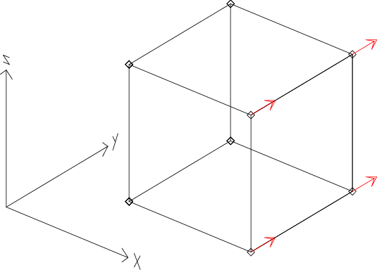
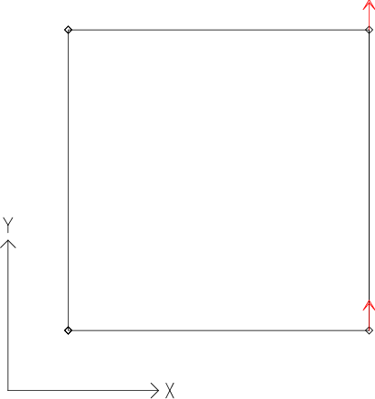

   Cisaillement - Blocages et chargement de déplacement imposé sur le cube (3D) et le carré (2D plan).

Liste des exemples dgibi
""""""""""""""""""""""""
Les jeux de données Gibiane correspondants à ce cas de chargement sont téléchargeables aux liens suivants :

- :download:`Test pour la loi de Mazars <./dgibi/07_cisaillement.dgibi>`

.. _sec:modeles_beton_test_mass_biax:

Biaxial
~~~~~~~

Description
"""""""""""

Il s'agit d'un test combinant des chargements monotones de traction ou de compression en contrainte imposée, exercés dans deux directions de l'espace tridimensionnel de manière proportionnelle. Les dimensions dépendent de l'hypothèse de calcul retenue :

- En 3D on considère un cube d'arête :math:`L`.
- En 2D plan on considère un carré de coté :math:`L`.

Blocages et chargement
""""""""""""""""""""""
Le chargement consiste à imposer, sur les faces :math:`x=L` et :math:`y=L`, les contraintes
normales de manière proportionnelle via une relation trigonométrique :

.. math::
   \sigma_{xx}=\sigma_{max} \textrm{cos} \theta

.. math::
   \sigma_{yy}=\sigma_{max} \textrm{sin} \theta
   
Suivant la valeur de :math:`\theta`, la combinaison biaxiale :math:`(\sigma_{xx};\sigma_{yy})` est de type soit (traction ; traction), soit (traction ; compression) ou l'inverse, soit (compression ; compression).

On effectue autant de calculs que l'on souhaite de combinaisons biaxiales en faisant varier la valeur de :math:`\theta` et en imposant :math:`\sigma_{max}` suffisament grand pour atteindre la ruine. 

Les calculs sont arrêtés à la detection de la ruine complète (dommage proche de 1), qui résulte d'une combinaison entre un critère sur le nombre de sous-pas de convergence limité à 1 et un critère sur l'incrément de déformation entre 2 pas de calcul consécutifs limité à :math:`2.10^{-3}`. C'est au pas de calcul précédant cet instant que sont relevées les valeurs de :math:`\sigma_{xx}` et :math:`\sigma_{yy}` qui constituent les coordonnées des points de la courbe de biaxialité.

Les critères de détection de la ruine pour arrêter le calcul sont définis dans la procédure ``PERSO1`` de Cast3M.

L’objectif est de caractériser la courbe de biaxialité qui représente la surface de charge du modèle dans le plan :math:`(\sigma_{xx} ; \sigma_{yy})`.
On peut ainsi évaluer la contrainte maximale en traction / compression / cisaillement du modèle.

Les déplacements des faces opposées :math:`x=0` et :math:`y=0` sont bloqués en laissant libre la
contraction ou l'expansion par effet de Poisson (de manière à être en état de contraintes planes). 
En 3D, le mouvement de corps rigide est empêché en bloquant [les déplacements **UY** et **UZ** du coin (0 0 0)
et **UZ** du coin (0 :math:`L` 0) -> nh145313 : le déplacement **UZ** du coin (0 0 0)].

Les instructions Gibiane correspondantes sont :

.. admonition:: Biaxial : chargement

   .. literalinclude:: dgibi/08_biaxial.dgibi
      :language: gibiane
      :lines: 86
      :linenos:
      :lineno-start: 86

   .. literalinclude:: dgibi/08_biaxial.dgibi
      :language: gibiane
      :lines: 90-91
      :linenos:
      :lineno-start: 90

   .. literalinclude:: dgibi/08_biaxial.dgibi
      :language: gibiane
      :lines: 97-102
      :linenos:
      :lineno-start: 97

.. admonition:: Biaxial : blocages pour le cas 3D

   .. literalinclude:: dgibi/08_biaxial.dgibi
      :language: gibiane
      :lines: 82-83
      :linenos:
      :lineno-start: 82

.. admonition:: Biaxial : blocages pour le cas 2D plan

   .. literalinclude:: dgibi/08_biaxial.dgibi
      :language: gibiane
      :lines: 361-362
      :linenos:
      :lineno-start: 361

Les blocages et le chargement sont représentés sur la figure suivante.

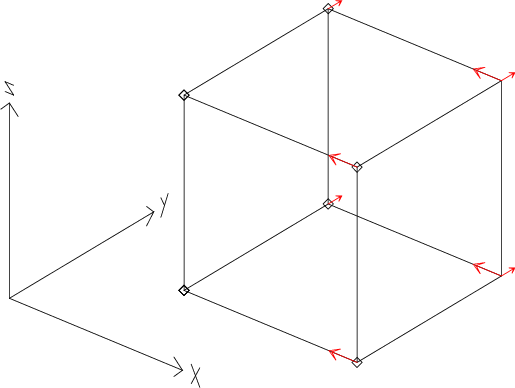
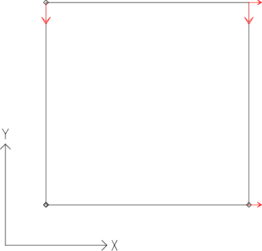

   Biaxial - Blocages et chargement biaxial de contraintes imposées sur le cube (3D) et le carré (2D plan).

Liste des exemples dgibi
""""""""""""""""""""""""
Les jeux de données Gibiane correspondants à ce cas de chargement sont téléchargeables aux liens suivants :

- :download:`Test pour la loi de Mazars <./dgibi/08_biaxial.dgibi>`
- :download:`Test pour la loi de RICBET <./dgibi/08_biaxial.dgibi>`

.. _sec:modeles_beton_test_mass_triax:

Triaxial
~~~~~~~~

Description
"""""""""""

Il s'agit d'un test combinant un chargement de pression hydrostatique et un chargement de compression axiale simple monotone. 
Quatre calculs successifs sont effectués pour autant de valeurs croissantes de la pression hydrostatique. Les dimensions dépendent de l'hypothèse de calcul retenue :

- en 3D, on considère un parallélépipède rectangle de base carrée de côté :math:`L=\sqrt{\pi}R` et de hauteur :math:`H` ;
- en 2D axisymétrique, on considère un cylindre de rayon :math:`R` et de hauteur :math:`H`.

Blocages et chargement
""""""""""""""""""""""
Le chargement consiste à imposé au préalable une contrainte normale de compression sur l'enveloppe de l'échantillon, puis à piloter le déplacement de sa face supérieure en l'augmentant (en valeur absolue) progressivement jusqu'à une valeur :math:`u_{max}(<0)`. La particularité de l'essai est que l'expansion par effet de Poisson est entravée par la pression hydrostatique.

- En 3D, la contrainte normale de compression est appliquée sur les faces "droite" (située dans le plan :math:`x=L`), "arrière" (dans le plan :math:`y=L`) et "supérieure" (dans le plan :math:`z=H`) et on bloque les déplacements des faces opposées dans les directions normales aux faces. Puis on pilote le déplacement **UZ** de la face supérieure (dans le plan :math:`z=H`), le déplacement **UZ** de la face opposée inférieure (dans le plan :math:`z=0`) étant déjà bloqué.
- En 2D axisymétrique, la contrainte normale de compression est appliquée sur la surface latérale cylindrique (située en :math:`r=R`) et sur la surface plane supérieure (dans le plan :math:`z=H`), puis on pilote le déplacement **UZ** de cette même face. On bloque le déplacement **UZ** de la face opposée inférieure (dans le plan :math:`z=0`).

Les quatres valeurs de contrainte normale de compression (pression hydrostatique) pour lesquelles on effectue des calculs sont les suivantes : P = 0 Pa/ 1,5 MPa/ 4,5 MPa/ 9 MPa.

Les instructions Gibiane correspondantes sont :

.. admonition:: Triaxial : chargements de pression hydrostatique pour les cas 3D et 2D axisymétrique

   .. literalinclude:: dgibi/09_triaxial.dgibi
      :language: gibiane
      :lines: 40-41
      :linenos:
      :lineno-start: 40

.. admonition:: Triaxial : blocages et chargements pour le cas 3D

   .. literalinclude:: dgibi/09_triaxial.dgibi
      :language: gibiane
      :lines: 85-91
      :linenos:
      :lineno-start: 85
   .. literalinclude:: dgibi/09_triaxial.dgibi
      :language: gibiane
      :lines: 96-99
      :linenos:
      :lineno-start: 96
   .. literalinclude:: dgibi/09_triaxial.dgibi
      :language: gibiane
      :lines: 102-107
      :linenos:
      :lineno-start: 102
   .. literalinclude:: dgibi/09_triaxial.dgibi
      :language: gibiane
      :lines: 109-110
      :linenos:
      :lineno-start: 109
   .. literalinclude:: dgibi/09_triaxial.dgibi
      :language: gibiane
      :lines: 118-122
      :linenos:
      :lineno-start: 118
   .. literalinclude:: dgibi/09_triaxial.dgibi
      :language: gibiane
      :lines: 137-138
      :linenos:
      :lineno-start: 137

.. admonition:: Triaxial : blocages et chargements pour le cas 2D axisymétrique

   .. literalinclude:: dgibi/09_triaxial.dgibi
      :language: gibiane
      :lines: 243-249
      :linenos:
      :lineno-start: 243
   .. literalinclude:: dgibi/09_triaxial.dgibi
      :language: gibiane
      :lines: 254-257
      :linenos:
      :lineno-start: 254
   .. literalinclude:: dgibi/09_triaxial.dgibi
      :language: gibiane
      :lines: 260-264
      :linenos:
      :lineno-start: 260
   .. literalinclude:: dgibi/09_triaxial.dgibi
      :language: gibiane
      :lines: 268-269
      :linenos:
      :lineno-start: 268
   .. literalinclude:: dgibi/09_triaxial.dgibi
      :language: gibiane
      :lines: 275-279
      :linenos:
      :lineno-start: 275
   .. literalinclude:: dgibi/09_triaxial.dgibi
      :language: gibiane
      :lines: 294-295
      :linenos:
      :lineno-start: 294

Les blocages et les chargements (pour la pression hydrostatique maximale de 9 MPa) sont représentés sur les figures suivantes.

.. list-table::
   :width: 100%
   :class: borderless
   
   * - .. image:: figures/mazars_triax_char_3d.png
          :width: 100%
          :align: center
          
     - .. image:: figures/mazars_triax_char_2daxi.png
          :width: 50%
          :align: center

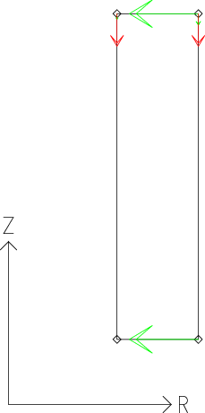

   Triaxial - Blocages et chargement triaxial de pression hydrostatique (9 MPa, en vert) et de déplacement axial (en rouge) imposés sur le parallélépipède (3D) et le cylindre (2D axisymétrique).

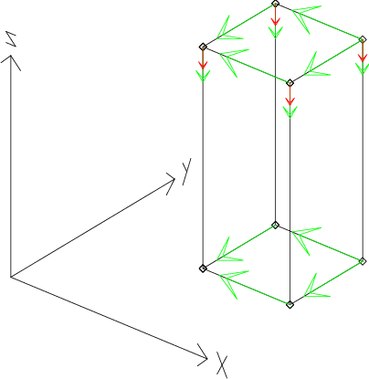
   

   Triaxial - Blocages et chargement triaxial de pression hydrostatique (9 MPa, en vert) et de déplacement axial (en rouge) imposés sur le parallélépipède (3D) et le cylindre (2D axisymétrique).

|pic1| .............................. |pic2|

   Triaxial - Blocages et chargement triaxial de pression hydrostatique (9 MPa, en vert) et de déplacement axial (en rouge) imposés sur le parallélépipède (3D) et le cylindre (2D axisymétrique).

Liste des exemples dgibi
""""""""""""""""""""""""
Les jeux de données Gibiane correspondants à ce cas de chargement sont téléchargeables aux liens suivants :

- :download:`Test pour la loi de Mazars <./dgibi/09_triaxial.dgibi>`
- :download:`Test pour la loi de RICBET <./dgibi/09_triaxial.dgibi>`

.. _sec:modeles_beton_test_mass_willam:

Test de Willam
~~~~~~~~~~~~~~

Description
"""""""""""

Il s'agit d'un test comprenant une première phase de chargement en traction simple, suivie d'une seconde phase combinant de la bi-traction dans la direction de la traction initiale et dans sa direction orthogonale et du cisaillement dans le plan orthogonal à la direction de traction initiale. Les dimensions dépendent de l'hypothèse de calcul retenue :

- en 3D, on considère un cube d'arête :math:`L` ;
- en 2D plan, on considère un domaine carré de côté :math:`L` et d'épaisseur :math:`e` ;

L'objectif du test est d'observer la réponse du modèle de comportement lorsque le repère du chargement, c'est-à-dire le repère des contraintes principales, tourne. Il n'existe pas de résultat expérimental de référence pour ce test, étant données les conditions aux limites et de chargement difficiles à mettre en oeuvre expérimentalement. En revanche, il existe un certain nombre de résultats numériques dans la littérature auxquels les résultats de calcul peuvent être comparés.

Paramètres issus de la bibliographie
""""""""""""""""""""""""""""""""""""

L'article d'origine décrivant le test de Willam est le suivant :

 [1] Willam, K.; Pramono, E.; Sture, S. Fundamental issues of smeared crack models. In Proc. of the SEM-RILEM Int. conf. on fracture of concrete and rock, TX USA 17-19 June 1987, Shah S.P., Swartz S.E. (eds), 1989, pp. 142-157.

La géométrie du problème, les paramètres élastiques du matériau et certains paramètres du modèle de comportement, ainsi que les réultats numériques de références (courbes **4a. LGCNSN Iso**) otenues avec un modèle d'endommagement isotrope comparable au modèle Mazars implémenté dans Cast3M, sont issus de l'article suivant :

 [2] Ghavamian, S.; Carol, I.; Delaplace A. Discussions over MECA project results. Revue Française de Génie Civil. 7 (2003) pp. 543-581. doi:10.1080/127951119.2003.9692509.

Les paramètres de la seconde phase de chargement sont issus de l'article suivant :

 [3] Wosatko, A.; Szczecina, M.; Winnicki A. Selected Concrete Models Studied Using Willam's Test. Materials 2020, 13, 4756; doi:10.3390/ma13214756.

Enfin, le paramètre **BTRA** du modèle Mazars est issu d'une communication personnelle de L. Jason (CEA/DES/ISAS/DM2S/SEMT), d'après sa contribution au benchmark [2]. Le paramètre **ATRA**, qui pilote la valeur asymptotique vers laquelle tendent les contraintes lorsque l'endommagement est maximal, est choisi pour optimiser la corrélation du calcul avec les résultats numériques de référence.

.. admonition:: Test de Willam : Paramètres géométrique et matériau

   .. literalinclude:: dgibi/10_willam.ecr
      :lines: 96-117
      :linenos:
      :lineno-start: 96

Blocages et chargement
""""""""""""""""""""""

Le test se décompose en deux phases successives. Dans la phase 1, le chargement consiste à piloter la déformation du maillage dans l'une de ses directions principales en l'augmentant progressivement jusqu'à atteindre la déformation seuil d'endommagement, l'une des deux faces dont la normale est colinéaire à cette direction étant bloquée en déplacement et libre de se contracter par effet de Poisson. Plusieurs chargements se superposent dans la phase 2 : tout d'abord, le chargement de la phase 1 est poursuivi avec une amplitude de la moitié de ce dernier ; ensuite, un deuxième chargement de traction orthogonale consiste à piloter la déformation du maillage dans une direction perpendiculaire à la première en l'augmentant progressivement jusqu'à atteindre les trois quarts de la déformation maximale de la phase 1 ; enfin, un troisième chargement de cisaillement consiste à piloter le glissement du maillage dans les directions orthogonales des deux premiers chargements de la phase 2 en l'augmentant progressivement jusqu'à atteindre la moitié de la déformation maximale de la phase 1.

En pratique dans Cast3M, on applique sur tout le maillage les deux phases du chargement de déformation imposée souhaité dans un premier calcul élastique, en tenant compte des conditions aux limites adéquates aux frontières du maillage (une face encastrée et libre en striction). Puis on récupère les champs de déplacements ainsi calculés pour les appliquer comme chargement en déplacement imposé sur tout le maillage d'un second calcul prenant en compte le comportement non linéaire endomageable du matériau. A noter que ce second calcul ne requiert pas de conditions aux limites cinématique, l'ensemble du maillage étant piloté en déplacement imposé.

- En 3D, pour le premier calcul élastique, on pilote les déformations **EPXX**, **EPYY**, **EPZZ** et **GAXY** dans tout le maillage et on bloque le déplacement **UX** de la face "gauche" (dans le plan :math:`x=0`). Le mouvement de corps rigide est empêché en bloquant les déplacements **UY** et **UZ** du coin (0 0 0) et **UZ** du coin (0 :math:`L` 0) ; pour le second calcul non linéaire, on utilise les champs de déplacements résultat du premier calcul pour piloter les déplacements de tout le maillage.
- En 2D plan, les conditions sont similaires mais limitées aux degrés de liberté **UX** et **UY**.

Les instructions Gibiane correspondantes sont :

.. admonition:: Test de Willam : blocages et chargement pour le cas 3D

   .. literalinclude:: dgibi/10_willam.dgibi
      :language: gibiane
      :lines: 107-153
      :linenos:
      :lineno-start: 107

   .. literalinclude:: dgibi/10_willam.dgibi
      :language: gibiane
      :lines: 155-183
      :linenos:
      :lineno-start: 183

L'état initial (noir) et déformé (rouge) résultant des blocages et du chargement sont représentés sur les figures suivantes.

.. list-table::
   :width: 100%
   :class: borderless
   
   * - .. image:: figures/mazars_will_char_3d.png
          :width: 100%
          :align: center
          
     - .. image:: figures/mazars_will_char_2dplan.png
          :width: 50%
          :align: center

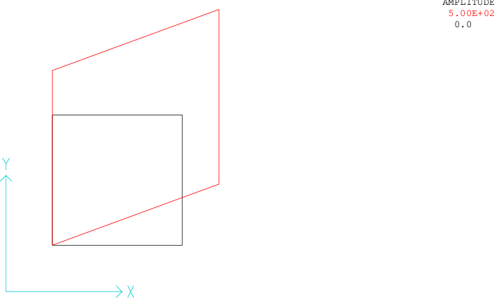

   Test de Willam - Etat initial (noir) et déformé (x500, rouge) résultant des blocages et du chargement imposés sur le parallélépipède (3D) et le carré (2D plan).

La rotation du repère du chargement, c'est-à-dire du repère des contraintes principales, est représenté sur les figures suivantes.

.. list-table::
   :width: 100%
   :class: borderless
   
   * - .. image:: figures/mazars_will_prin_3d.png
          :width: 100%
          :align: center
          
     - .. image:: figures/mazars_will_prin_2dplan.png
          :width: 50%
          :align: center

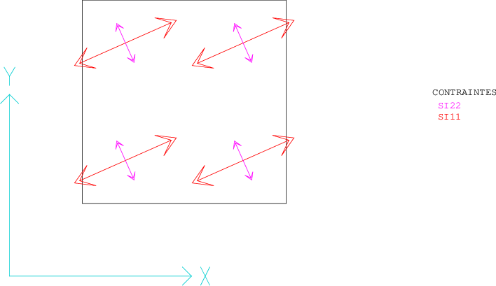

   Test de Willam - Rotation du repère des contraintes principales sur le parallélépipède (3D) et le carré (2D plan).

Liste des exemples dgibi
""""""""""""""""""""""""
Les jeux de données Gibiane correspondants à ce cas de chargement sont téléchargeables aux liens suivants :

- :download:`Test pour la loi de Mazars <./dgibi/10_willam.dgibi>`
- :download:`Test pour la loi de RICBET <./dgibi/10_willam.dgibi>`

TODO

