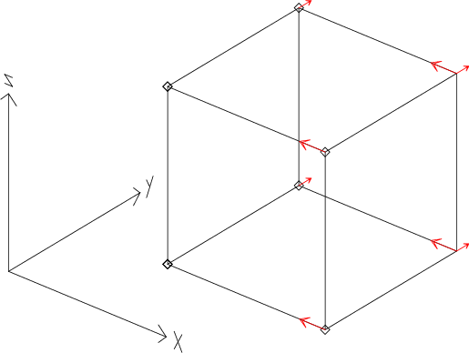
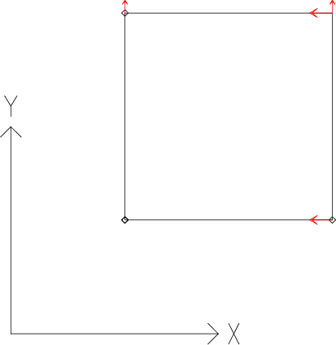

.. _sec:modeles_beton_tests:

Spécification des cas tests
===========================

Ce chapitre présente l'ensembe des cas de chargement appliqués pour effectuer les tests des lois de comportement pour
le béton disponibles dans Cast3M. Il se limite à la seule description des chargements et des phénomènes étudiés.

D'autres chapitres sont dédiés à la :ref:`vérification <sec:modeles_beton_verif>` et à la :ref:`validation <sec:modeles_beton_valid>`.
Ils détaillent les résultats de ces tests sur l'ensemble des lois de comportement.

Cas tests pour les modèles poutre à fibres
------------------------------------------

.. _sec:modeles_beton_test_pout_trac_mono:

Traction monotone
~~~~~~~~~~~~~~~~~

   Traction simple sur un modèle d'éléments finis poutre.

Description
"""""""""""

Il s'agit d'un test de traction simple monotone. On considère une poutre de longueur :math:`L` et section transversale :math:`S` soumise à un chargement de traction dans la direction de son axe.

Blocages et chargement
""""""""""""""""""""""
Le chargement consiste à piloter le déplacement **UX** de l'extrémité (:math:`L` 0 0) de l'élément **TIMO** en l'augmentant progressivement jusqu'à une valeur :math:`u_{max}`. On bloque les déplacements et les rotations de l'autre extrémité (0 0 0) de l'élément *[nh145313 : ainsi que les rotations de l'extrémité pilotée en déplacement]*.

Les instructions Gibiane correpondantes sont :

.. admonition:: Traction monotone : blocages et chargement

   .. literalinclude:: dgibi/01_traction.dgibi
      :language: gibiane
      :lines: 255-266
      :linenos:
      :lineno-start: 255

Liste des exemples dgibi
""""""""""""""""""""""""
Les jeux de données Gibiane correspondants à ce cas de chargement sont téléchargeables aux liens suivants :

- :download:`Test pour la loi de Mazars <./dgibi/01_traction.dgibi>`
- :download:`Test pour la loi de RICBET <./dgibi/01_traction.dgibi>`

.. _sec:modeles_beton_test_pout_comp_mono:

Compression monotone
~~~~~~~~~~~~~~~~~~~~

   Compression simple sur un modèle d'éléments finis poutre.

Description
"""""""""""

Il s'agit d'un test de compression simple monotone. On considère une poutre de longueur :math:`L` et section transversale :math:`S` soumise à un chargement de compression dans la direction de son axe.

Blocages et chargement
""""""""""""""""""""""
Le chargement consiste à piloter le déplacement **UX** de l'extrémité (:math:`L` 0 0) de l'élément **TIMO** en l'augmentant (en valeur absolue) progressivement jusqu'à une valeur :math:`u_{max} (<0)`. On bloque les déplacements et les rotations de l'autre extrémité (0 0 0) de l'élément *[nh145313 : ainsi que les rotations de l'extrémité pilotée en déplacement]*.

Les instructions Gibiane correpondantes sont :

.. admonition:: Compression monotone : blocages et chargement

   .. literalinclude:: dgibi/02_compression.dgibi
      :language: gibiane
      :lines: 283-294
      :linenos:
      :lineno-start: 283

Liste des exemples dgibi
""""""""""""""""""""""""
Les jeux de données Gibiane correspondants à ce cas de chargement sont téléchargeables aux liens suivants :

- :download:`Test pour la loi de Mazars <./dgibi/02_compression.dgibi>`
- :download:`Test pour la loi de RICBET <./dgibi/02_compression.dgibi>`

Traction cyclique
~~~~~~~~~~~~~~~~~
TODO

Compression cyclique
~~~~~~~~~~~~~~~~~~~~
TODO

.. _sec:modeles_beton_test_pout_trac_comp:

Traction compression
~~~~~~~~~~~~~~~~~~~~

   Traction compression sur un modèle d'éléments finis poutre.

Description
"""""""""""

Il s'agit d'un test de traction compression alternées. On considère une poutre de longueur :math:`L` et section transversale :math:`S` soumise successivement à un chargement de traction puis de compression dans la direction de son axe.

Blocages et chargement
""""""""""""""""""""""
Le chargement consiste à piloter le déplacement **UX** de l'extrémité (:math:`L` 0 0) de l'élément **TIMO** en deux phases successives de sens opposés : tout  d'abord en augmentant progressivement le déplacement jusqu'à la valeur :math:`u_{t max} > 0` (traction), puis après changement de sens en l'augmentant (en valeur absolue) progressivement jusqu'à la valeur :math:`u_{c max} < 0` (compression). On bloque les déplacements et les rotations de l'autre extrémité (0 0 0) de l'élément *[nh145313 : ainsi que les rotations de l'extrémité pilotée en déplacement]*.

Les instructions Gibiane correpondantes sont :

.. admonition:: Compression traction : blocages et chargement

   .. literalinclude:: dgibi/05_traction_compression.dgibi
      :language: gibiane
      :lines: 414-426
      :linenos:
      :lineno-start: 414

Liste des exemples dgibi
""""""""""""""""""""""""
Les jeux de données Gibiane correspondants à ce cas de chargement sont téléchargeables aux liens suivants :

- :download:`Test pour la loi de Mazars <./dgibi/05_traction_compression.dgibi>`
- :download:`Test pour la loi de RICBET <./dgibi/05_traction_compression.dgibi>`

Traction compression traction
~~~~~~~~~~~~~~~~~~~~~~~~~~~~~
TODO

Cas tests pour les modèles massifs
----------------------------------

.. _sec:modeles_beton_test_mass_trac_mono:

Traction monotone
~~~~~~~~~~~~~~~~~

Description
"""""""""""

Il s'agit d'un test de traction simple monotone. Les dimensions dépendent de l'hypothèse de calcul retenue :

- en 3D, on considère un cube d'arête :math:`L` ;
- en 2D plan, on considère un domaine carré de côté :math:`L` et d'épaisseur :math:`e` ;
- en 2D axisymétrique, on considère un cylindre de rayon :math:`R` et de hauteur :math:`H`.

Blocages et chargement
""""""""""""""""""""""
Le chargement consiste à piloter le déplacement d'une des faces en l'augmentant progressivement jusqu'à une valeur :math:`u_{max}`. On bloque les déplacements de l'autre face en laissant libre la contraction par effet de Poisson.

- En 3D, on pilote le déplacement **UX** de la face "droite" (située dans le plan :math:`x=L`) et
  on bloque le déplacement **UX** de la face opposée "gauche" (dans le plan :math:`x=0`).
  Le mouvement de corps rigide est empêché en bloquant les déplacements **UY** et **UZ** du coin (0 0 0) et **UZ** du coin (0 :math:`L` 0).
- En 2D plan, les conditions sont similaires mais limitées aux degrés de liberté **UX** et **UY**.
- En 2D axisymétrique on pilote le déplacement **UZ** de la ligne "haute" (située en :math:`z=L`).
  On bloque alors le déplacement **UZ** de la ligne opposée "basse" (en :math:`z=0`).

Les instructions Gibiane correpondantes sont :

.. admonition:: Traction monotone : blocages et chargement pour le cas 3D

   .. literalinclude:: dgibi/01_traction.dgibi
      :language: gibiane
      :lines: 78-87
      :linenos:
      :lineno-start: 78

.. admonition:: Traction monotone : blocages et chargement pour le cas 2D axisymétrique

   .. literalinclude:: dgibi/01_traction.dgibi
      :language: gibiane
      :lines: 601-609
      :linenos:
      :lineno-start: 601

Les blocages et le chargement sont représentés sur les figures suivantes.

   Traction - Blocages et chargement de déplacement imposé sur le cube (3D), le carré (2D plan) et le cylindre (2D axisymétrique).

Liste des exemples dgibi
""""""""""""""""""""""""
Les jeux de données Gibiane correspondants à ce cas de chargement sont téléchargeables aux liens suivants :

- :download:`Test pour la loi de Mazars <./dgibi/01_traction.dgibi>`
- :download:`Test pour la loi de RICBET <./dgibi/01_traction.dgibi>`

.. _sec:modeles_beton_test_mass_comp_mono:

Compression monotone
~~~~~~~~~~~~~~~~~~~~

Description
"""""""""""

Il s'agit d'un test de compression simple monotone. Les dimensions dépendent de l'hypothèse de calcul retenue :

- en 3D, on considère un cube d'arête :math:`L` ;
- en 2D plan, on considère un domaine carré de côté :math:`L` et d'épaisseur :math:`e` ;
- en 2D axisymétrique, on considère un cylindre de rayon :math:`R` et de hauteur :math:`H`.

Blocages et chargement
""""""""""""""""""""""
Le chargement consiste à piloter le déplacement d'une des faces en l'augmentant (en valeur absolue) progressivement jusqu'à une valeur :math:`u_{max} (<0)`. On bloque les déplacements de l'autre face en laissant libre l'expansion par effet de Poisson.

- En 3D, on pilote le déplacement **UX** de la face "droite" (située dans le plan :math:`x=L`) et
  on bloque le déplacement **UX** de la face opposée "gauche" (dans le plan :math:`x=0`).
  Le mouvement de corps rigide est empêché en bloquant les déplacements **UY** et **UZ** du coin (0 0 0) et **UZ** du coin (0 :math:`L` 0).
- En 2D plan, les conditions sont similaires mais limitées aux degrés de liberté **UX** et **UY**.
- En 2D axisymétrique on pilote le déplacement **UZ** de la ligne "haute" (située en :math:`z=L`).
  On bloque alors le déplacement **UZ** de la ligne opposée "basse" (en :math:`z=0`).

Les instructions Gibiane correpondantes sont :

.. admonition:: Compression monotone : blocages et chargement pour le cas 3D

   .. literalinclude:: dgibi/02_compression.dgibi
      :language: gibiane
      :lines: 78-87
      :linenos:
      :lineno-start: 78

.. admonition:: Compression monotone : blocages et chargement pour le cas 2D axisymétrique

   .. literalinclude:: dgibi/02_compression.dgibi
      :language: gibiane
      :lines: 665-673
      :linenos:
      :lineno-start: 665

Les blocages et le chargement sont représentés sur les figures suivantes.

   Compression - Blocages et chargement de déplacement imposé sur le cube (3D), le carré (2D plan) et le cylindre (2D axisymétrique).

Liste des exemples dgibi
""""""""""""""""""""""""
Les jeux de données Gibiane correspondants à ce cas de chargement sont téléchargeables aux liens suivants :

- :download:`Test pour la loi de Mazars <./dgibi/02_compression.dgibi>`
- :download:`Test pour la loi de RICBET <./dgibi/02_compression.dgibi>`

Traction cyclique
~~~~~~~~~~~~~~~~~
TODO

Compression cyclique
~~~~~~~~~~~~~~~~~~~~
TODO

.. _sec:modeles_beton_test_mass_trac_comp:

Traction compression
~~~~~~~~~~~~~~~~~~~~

Description
"""""""""""

Il s'agit d'un test de traction compression alternées. Les dimensions dépendent de l'hypothèse de calcul retenue :

- en 3D, on considère un cube d'arête :math:`L` ;
- en 2D plan, on considère un domaine carré de côté :math:`L` et d'épaisseur :math:`e` ;
- en 2D axisymétrique, on considère un cylindre de rayon :math:`R` et de hauteur :math:`H`.

Blocages et chargement
""""""""""""""""""""""
Le chargement consiste à piloter le déplacement d'une des faces en deux phases successives de sens opposés : tout  d'abord en augmentant progressivement le déplacement jusqu'à la valeur :math:`u_{t max} > 0` (traction), puis après changement de sens en l'augmentant (en valeur absolue) progressivement jusqu'à la valeur :math:`u_{c max} < 0` (compression). On bloque les déplacements de l'autre face en laissant libre la contraction par effet de Poisson.

- En 3D, on pilote le déplacement **UX** de la face "droite" (située dans le plan :math:`x=L`) et
  on bloque le déplacement **UX** de la face opposée "gauche" (dans le plan :math:`x=0`).
  Le mouvement de corps rigide est empêché en bloquant les déplacements **UY** et **UZ** du coin (0 0 0) et **UZ** du coin (0 :math:`L` 0).
- En 2D plan, les conditions sont similaires mais limitées aux degrés de liberté **UX** et **UY**.
- En 2D axisymétrique on pilote le déplacement **UZ** de la ligne "haute" (située en :math:`z=L`).
  On bloque alors le déplacement **UZ** de la ligne opposée "basse" (en :math:`z=0`).

Les instructions Gibiane correpondantes sont :

.. admonition:: Traction compression : blocages et chargement pour le cas 3D

   .. literalinclude:: dgibi/05_traction_compression.dgibi
      :language: gibiane
      :lines: 83-93
      :linenos:
      :lineno-start: 83

.. admonition:: Traction compression : blocages et chargement pour le cas 2D axisymétrique

   .. literalinclude:: dgibi/01_traction.dgibi
      :language: gibiane
      :lines: 1067-1076
      :linenos:
      :lineno-start: 1067

Les blocages et le chargement sont représentés sur les figures suivantes.

   Traction compression - Blocages et chargement de déplacement imposé sur le cube (3D), le carré (2D plan) et le cylindre (2D axisymétrique).

Liste des exemples dgibi
""""""""""""""""""""""""
Les jeux de données Gibiane correspondants à ce cas de chargement sont téléchargeables aux liens suivants :

- :download:`Test pour la loi de Mazars <./dgibi/05_traction_compression.dgibi>`
- :download:`Test pour la loi de RICBET <./dgibi/05_traction_compression.dgibi>`

Traction compression traction
~~~~~~~~~~~~~~~~~~~~~~~~~~~~~
TODO

Cisaillement
~~~~~~~~~~~~
TODO

.. _sec:modeles_beton_test_mass_biax:

Biaxial
~~~~~~~

Description
"""""""""""

Il s'agit d'un test combinant des chargements monotones de traction ou de compression en contrainte imposée, exercés dans deux directions de l'espace tridimensionnel de manière proportionnelle. Les dimensions dépendent de l'hypothèse de calcul retenue :

- En 3D on considère un cube d'arête :math:`L`.
- En 2D plan on considère un carré de coté :math:`L`.

Blocages et chargement
""""""""""""""""""""""
Le chargement consiste à imposer, sur les faces :math:`x=L` et :math:`y=L`, les contraintes
normales de manière proportionnelle via une relation trigonométrique :

.. math::
   \sigma_{xx}=\sigma_{max} \textrm{cos} \theta

.. math::
   \sigma_{yy}=\sigma_{max} \textrm{sin} \theta
   
Suivant la valeur de :math:`\theta`, la combinaison biaxiale :math:`(\sigma_{xx};\sigma_{yy})` est de type soit (traction ; traction), soit (traction ; compression) ou l'inverse, soit (compression ; compression).

On effectue autant de calculs que l'on souhaite de combinaisons biaxiales en faisant varier la valeur de :math:`\theta` et en imposant :math:`\sigma_{max}` suffisament grand pour atteindre la ruine. 

Les calculs sont arrêtés à la detection de la ruine complète (dommage proche de 1), qui résulte d'une combinaison entre un critère sur le nombre de sous-pas de convergence limité à 1 et un critère sur l'incrément de déformation entre 2 pas de calcul consécutifs limité à :math:`2.10^{-3}`. C'est au pas de calcul précédant cet instant que sont relevées les valeurs de :math:`\sigma_{xx}` et :math:`\sigma_{yy}` qui constituent les coordonnées des points de la courbe de biaxialité.

Les critères de détection de la ruine pour arrêter le calcul sont définis dans la procédure ``PERSO1`` de Cast3M.

L’objectif est de caractériser la courbe de biaxialité qui représente la surface de charge du modèle dans le plan :math:`(\sigma_{xx} ; \sigma_{yy})`.
On peut ainsi évaluer la contrainte maximale en traction / compression / cisaillement du modèle.

Les déplacements des faces opposées :math:`x=0` et :math:`y=0` sont bloqués en laissant libre la
contraction ou l'expansion par effet de Poisson (de manière à être en état de contraintes planes). 
En 3D, le mouvement de corps rigide est empêché en bloquant [les déplacements **UY** et **UZ** du coin (0 0 0)
et **UZ** du coin (0 :math:`L` 0) -> nh145313 : le déplacement **UZ** du coin (0 0 0)].

Les instructions Gibiane correpondantes sont :

.. admonition:: Biaxial : chargement

   .. literalinclude:: dgibi/08_biaxial.dgibi
      :language: gibiane
      :lines: 86
      :linenos:
      :lineno-start: 86

   .. literalinclude:: dgibi/08_biaxial.dgibi
      :language: gibiane
      :lines: 90-91
      :linenos:
      :lineno-start: 90

   .. literalinclude:: dgibi/08_biaxial.dgibi
      :language: gibiane
      :lines: 97-102
      :linenos:
      :lineno-start: 97

.. admonition:: Biaxial : blocages pour le cas 3D

   .. literalinclude:: dgibi/08_biaxial.dgibi
      :language: gibiane
      :lines: 82-83
      :linenos:
      :lineno-start: 82

.. admonition:: Biaxial : blocages pour le cas 2D plan

   .. literalinclude:: dgibi/08_biaxial.dgibi
      :language: gibiane
      :lines: 361-362
      :linenos:
      :lineno-start: 361

Les blocages et le chargement sont représentés sur la figure suivante.

   Biaxial - Blocages et chargement biaxial de contraintes imposées sur le cube (3D) et le carré (2D plan).

Liste des exemples dgibi
""""""""""""""""""""""""
Les jeux de données Gibiane correspondants à ce cas de chargement sont téléchargeables aux liens suivants :

- :download:`Test pour la loi de Mazars <./dgibi/08_biaxial.dgibi>`
- :download:`Test pour la loi de RICBET <./dgibi/08_biaxial.dgibi>`

Triaxial
~~~~~~~~
TODO

Test de Willam
~~~~~~~~~~~~~~
TODO

