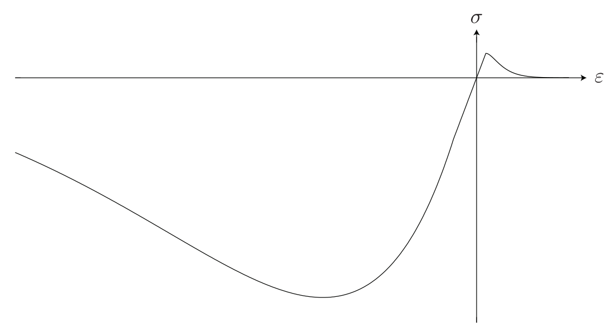

.. _sec:modeles_betons_lois:

Lois de comportement pour les bétons
====================================

La liste suivante concerne les lois de comportement pour le béton.

Loi MAZARS
----------

'MAZARS'    : Modele d'endommagement scalaire pour le beton (bien adapte aux chargements monotones).

Description
~~~~~~~~~~~
La loi de comportement élastique endommageable en traction/compression selon le modèle de Mazars, corrigé pour prendre en compte de manière plus réaliste l'endommagement en cisaillement, est présentée ici [MAZARS-1984]_ [MAZARS-1986]_ [PIJAUDIER-1991]_.

Characteristiques et limitations principales :

- Dans ce modèlela dégradation des propriétés élastiques du matériau est représentée à l'aide d'une variable scalaire :math:`D` variant entre zéro (matériau sain) et l'unité (matériau totalement endommagé). Cette dernière est obtenue par la combinaison de deux variables scalaires représentant l'endommagement sous sollicitations de compression et de traction séparément ;

- Cela permet de modéliser convenablement la dyssimétrie traction-compression observée expérimentalement pour les bétons. Cependant, aucune reprise de raideur lors du passage d'une sollicitation de compression à une sollicitation de traction ne peut être prise en compte, c'est-à-dire que l'effet unilatéral n'est pas modélisé ;

- Compte tenu de cela, cette loi est adaptée à la simulation de la réponse du béton sous chargement monotone, mais nécessite des modifications pour une utilisation dans le cadre d'un calcul sous sollicitations cycliques et/ou dynamiques. Dans ce dernier cas, des limitations supplémentaires sont présentes (par exemple, l'impossibilité de modéliser des boucles d'hystérésis).

Anomalies observées
~~~~~~~~~~~~~~~~~~~

Anomalie 1
++++++++++
[valable au 19/09/2024]

Une anomalie a été identifiée dans la source idendo.eso. Elle est datée du 21/08/2023 et cause une erreur d'initialisation du paramètre BETA dans cmazars.eso. Cette anomalie ne rend pas le modèle Mazars inutilisable mais corrompt ses résultats avec des éléments volumiques. Elle impacte la version 2024.0 de Cast3M. Elle est corrigée dans la version du jour ainsi que dans la version 2024.1.

Anomalie 2
++++++++++
nh145313 : L'anomalie suivante est corrigée en bloquant les rotation de l'extrémité libre de la poutre à fibre.
[**Compte tenu des résultats des cas tests de vérification @, l'utilisation de cette loi dans le cadre d'une modèlisation de type multi-fibre est proscrite !**.]

Anomalie 3 (?)
++++++++++++++
Le modèle Mazars dans Cast3M, tant dans la configuration éléments volumiques (source cmazars.eso) que poutres à fibre (source fibmaz.eso), exhibe un domaine post-ruine consolidant non physique. Cet artefact numérique est dû à la limitation du dommage maximum :

.. math::
   D_{max}=(1 - \epsilon)
   
où :math:`\epsilon` est un paramètre arbitrairement petit, défini dans les sources Cast3M du modèle Mazars, permettant de se prémunir de l'absence complète de rigidité aux points de Gauss ayant atteint la ruine, ce qui empêcherait la poursuite du calcul. Plus ce paramètre est grand, plus le domaine apparait précocement.

La consolidation qui peut possiblement en découler dans une zone jugée trop grande du modèle E.F. peut conduire à des résultats numériques qui ne sont pas physiquement admissible et ainsi fausser le jugement du spécialiste du béton, ce qui est préjudiciable à la confiance accordée au modèle.

.. _mazars:

Formulation du modèle
~~~~~~~~~~~~~~~~~~~~~
La rélation contrainte-déformation s'écrit :

.. math::

   \boldsymbol{\sigma} = (1-D) \mathbb{E} : \boldsymbol{\varepsilon}

où :math:`\boldsymbol{\sigma}` est le tenseur des contraintes de Cauchy, :math:`\boldsymbol{\varepsilon}` est le tenseur des déformations infinitesimales, et :math:`\mathbb{E}` est le tenseur d'elasticité d'ordre 4. 

La variable d'endommagement evolue au cours du chargement en fonction critère d'endommagement :

.. math::

   f = f(e) = e - \kappa
   
où :math:`e` est une mésure scalaire du tenseur de déformation et :math:`\kappa` est une variable d'histoire fournissant le maximum atteint par la déformation équivalente pendant le chargement du matériau. 

Selon la formulation proposée par Mazars, la déformation équivalente est définie par :

.. math::

   {e}=\sqrt{\langle\boldsymbol{\varepsilon}\rangle:\langle\boldsymbol{\varepsilon}\rangle} = \sqrt{\sum_{i=1}^{^{n}}\langle\epsilon_{i}\rangle^{2}}
   
où :math:`\langle\boldsymbol{\varepsilon}\rangle` est la partie positive du tenseur des déformations, :math:`\epsilon_{i}` est la i-ème déformation
principale, :math:`\langle\cdot\rangle_+` est l'opérateur de MacAuley, et :math:`n` répresente la dimension du problème consideré. 

La variable d'histoire :math:`\kappa` est donc définie par :

.. math::

   \kappa = \max_t (\kappa,e) \qquad \kappa(t=0) = e_0

avec :math:`e_0` une valeur seuil initiale et :math:`t` une variable répresentant le temps (ou bien le pseudo-temps dans un calcul quasi-statique). 

L’évolution de cette surface de charge doit respecter le conditions Kuhn-Tucker :

.. math::

   f \leq 0 \qquad \dot{\kappa} \geq 0 \qquad \dot{\kappa} f = 0
   
En d'autres termes, la surface de charge ne peut croître que si le seuil de déformation actuel est dépassé. Cela implique que l'endommagement ne progresse pas pendant les phases de décharge ou les phases de charge où les niveaux de déformation sont inférieurs au maximum atteint précédemment au cours de l'historique du chargement.

Pour prendre en compte la nature fortement dissymétrique du comportement en traction et en compression du béton, Mazars introduit deux fonctions :math:`D_t` et :math:`D_c` représentant respectivement les dégradations en traction et compression. Elles sont définies comme suit :

.. math::

   D_{t(c)} = 1 - \frac{e_0 (1-A_{t(c)})}{\kappa} - A_{t(c)} \exp\left[ -B_t(\kappa - e_0)\right]

avec :math:`A_{t(c)}` et :math:`B_{t(c)}` les quatre paramètres additionnels permettant de définir, avec le seuil de première fissuration en traction :math:`e_0`, les lois d'évolution de l'endommagement  en traction (t) et en compression (c). Le paramètre :math:`A_{t}` permet de controler la contrainte résiduelle en traction uniaxiale tandis que le paramètre :math:`B_{t}` controle la forme de la loi d'evolution de l'endommagement dans la phase post pic de contrainte. 

La variable d'endommagement :math:`D` est finalement obtenue par combinaison lineaire des variables :math:`D_{t}` et :math:`D_{c}` 
comme suit :

.. math::

   D = \alpha_t^\beta D_t + \alpha_c^\beta D_c
   
avec :math:`\alpha_{t(c)} \in [0,1]` des facteurs de combinaison qui s'expriment en fonction des déformations principales comme suit :

.. math::

   \alpha_t = \sum_{i=1}^{n} \frac{\varepsilon_i^t \langle \varepsilon_i \rangle_+}{e} \qquad \alpha_c = 1 - \alpha_t

avec :math:`\varepsilon_i^t` les déformations associées aux contraintes principales positives. Le paramètre :math:`\beta` a été introduit historiquement plus tatd dans le modèle pour éviter une évolution trop rapide de l'endommagement en cisaillement [PIJAUDIER-1991]_.

Réponses typiques
"""""""""""""""""

.. figure:: figures/Figure_Mazars_1.png
   :width: 15cm
   :align: center
   
   Critère de Mazars. (a) Surface seuil dans l'espace des contraintes. (b) Trace dans le plan :math:`\sigma_3=0`. Giry 2001.

   
   Loi contrainte - déformation pour une sollicitation uniaxiale.

Quelques commentaires
"""""""""""""""""""""
Grâce à sa simplicité et sa robustesse, ce modèle a été et est encore largement utilisé pour modéliser le comportement du béton. Certaines pathologies peuvent néanmoins être citées et pour lesquelles des développements sont à considérer :

- Le modèle présente une fragilité excessive dans son comportement en cisaillement, et l'introduction du paramètre :math:`\beta` pour atténuer cet effet entraîne une reprise de rigidité à des niveaux de déformation élevés ;

- Le modèle ne prend pas en compte l'effet unilatéral, c'est-à-dire que la refermeture des fissures expérimentalement observée entraîne une reprise de raideur. En conséquence, le modèle ne parvient pas à reproduire correctement le comportement sous chargements cycliques ;

- En termes numériques, l'utilisation de l'opérateur de Mac Cauley dans l'expression des coefficients :math:`\alpha_{t(c)}` entraîne une dérivée non définie de ceux-ci en zéro. Cela empêche ainsi l'utilisation de l'opérateur tangent dans le schéma de résolution. Par conséquent, seul l'opérateur sécant est utilisé, ce qui limite la vitesse de convergence du schéma de résolution ;
  
- Le caractère isotrope de l’endommagement ne permet pas de bien suivre l’évolution des nonlinéarités pour des chargements non radiaux.

Implémentation Cast3M (esope)
~~~~~~~~~~~~~~~~~~~~~~~~~~~~~

@Détailler les sources de l'implémentation multi-fibre@

Dans la suite, nous détaillons les étapes du calcul en mettant l'accent sur les parties de code correspondantes aux aspects théoriques mentionnés précédemment. Pour une analyse détaillée de l'implémentation et des aspects plus strictement techniques concernant la signification des variables, veuillez vous référer aux commentaires présents dans le fichier source mazars.eso.	  

	.. literalinclude:: sources/mazars.eso
		:language: fortran
		:lines: 1-3
		:linenos:
		:lineno-start: 1

Entrées
""""""""""""""""
	
	.. literalinclude:: sources/mazars.eso
		:language: fortran
		:lines: 9-30
		:linenos:
		:lineno-start: 9
		
	.. literalinclude:: sources/mazars.eso
		:language: fortran
		:lines: 34-38
		:linenos:
		:lineno-start: 34

Sorties
"""""""""""""""""

	.. literalinclude:: sources/mazars.eso
		:language: fortran
		:lines: 42-44
		:linenos:
		:lineno-start: 42

Algorithme
""""""""""

Le calul de l'endommagement est réalisé par une procédure purement explicite.

- On calcule la déformation totale au niveau du point d'intégration ;
	
- On calcule le tenseur des déformations principales ;
	
- On calcule la matrice d'élasticite et les contraintes principales ;
	
- On calcule la déformation équivalente de Mazars :
		
	* Si le calcul est local (**ISTEP = 0**), la déformation principale est évaluée directement sur la base des déformations principales ;
	* 
	* En cas d'un calcul non-local, l'évolution de l'endommagement est pilotée par la contrepartie non-locale de la déformation de Mazars. Celle-ci est évaluée avec deux passages dans la loi de comportement :
		- Lors du premier passage (**ISTEP = 1**), on calcule la déformation locale et on sort de la loi de comportement. La déformation non-locale est calculée via une procédure ad-hoc en dehors de la loi de comportement, par exemple, via une méthode non-locale intégrale ou bien une formulation de type gradient implicite ;
		- Cette déformation non-locale est une variable d'entrée de la loi de comportement (**ISTEP = 2**) et est utilisée pour faire évoluer l'endommagement;

- On vérifie le dépassement du seuil de déformation. Si le seuil n'est pas dépassé, l'endommagement n'est pas mis à jour. Sinon, on procède comme suit.
				
- On calcule les coéfficients :math:`\alpha_{t(c)} \in [0,1]`. Pour cela faire :
		
	* On calcule le signe des contraines elastiques :
	
		.. literalinclude:: sources/mazars.eso
			:language: fortran
			:lines: 198-208
			:linenos:
			:lineno-start: 198		
			
	* On calcule les déformations associées aux contraintes positives :math:`\varepsilon_i^t` :

		.. literalinclude:: sources/mazars.eso
			:language: fortran
			:lines: 212-214
			:linenos:
			:lineno-start: 212		

		
	* On calcule :math:`\alpha_{t(c)}` :
	
		.. literalinclude:: sources/mazars.eso
			:language: fortran
			:lines: 218-222
			:linenos:
			:lineno-start: 218		

	* On corrige les paramètres de combinaison linéaire via le coefficient :math:`\beta > 1` pour amémiorer la réponse en cisaillement :
		
		.. literalinclude:: sources/mazars.eso
			:language: fortran
			:lines: 235-242
			:linenos:
			:lineno-start: 235		

- On corrige la déformation equivalente pour améliorer la réponse en bi- ou tri-compression. Pour cela faire, on modifie :math:`e` comme suit :

	.. math::
		e = e \gamma \qquad \gamma = \frac{\sum_{i=1}^n \langle \sigma_i \rangle_{-}^2}{\sum_{i=1}^n \langle \sigma_i \rangle_{-}}
		 
  avec :math:`\langle \cdot \rangle_{-}` l'opérateur partie négative.
	
	.. literalinclude:: sources/mazars.eso
		:language: fortran
		:lines: 226-231
		:linenos:
		:lineno-start: 226		

- Le calcul de la variable d'endommagement est effectué après avoir vérifié si le seuil initial a été dépassé. Cette vérification est nécessaire car il est possible que la valeur ait été multipliée par :math:`\gamma` :

	.. literalinclude:: sources/mazars.eso
		:language: fortran
		:lines: 250-259
		:linenos:
		:lineno-start: 250		

			
  La variable d'endommagement est ensuite bornée supérieurement à 0.99999 afin d'éviter un trop mauvais conditionnement de la matrice de rigidité ;

- On calcule la nouvelle contrainte et on sort de la loi de comportement ;

- Les données de sortie sont la contrainte et les variables internes mises à jour.

Implémentation MFront
~~~~~~~~~~~~~~~~~~~~~

Une implémentation de la loi de Mazars a été réalisée sous MFront. Le code suivant détaille l'implémentation pour une utilisation avec des elements volumiques/surfaciques. La formulation implémentée est une version simplifiée de celle disponible dans Cast3M. En particulier, aucun correctif n'est pas introduit pour améliorer la réponse du modèle en cisaillement et compression bi-/tri-axiale. 

	.. literalinclude:: sources/mazars_mfront.mfront
		:linenos:

Hypothèses de calcul et éléments finis disponibles
~~~~~~~~~~~~~~~~~~~~~~~~~~~~~~~~~~~~~~~~~~~~~~~~~~
- Cette loi est disponible pour les éléments massifs 3D et 2D sous l'hypothèse de contraintes/déformations planes (@lien vers section éléments finis?@).

- De plus, elle est également applicable aux poutres multi-fibres (éléments finis de section). Dans ce dernier cas, le modèle a été implémenté dans le modèle à fibre selon sa formulation 3D complète, plutôt qu'uniaxiale.

- Elle peut être utilisée avec des éléments de type coque sous l'hypothèse de contraintes planes. 

Mots clefs dans l'opérateur MODE
~~~~~~~~~~~~~~~~~~~~~~~~~~~~~~~~
Exemple d'utilisation de la loi Mazars pour des éléments finis de section **CUB8** :

.. code-block:: gibiane

   MODE maillage 'ELASTIQUE' 'ENDOMMAGEMENT' 'MAZARS' 'CUB8' ;

Exemple d'utilisation de la loi Mazars pour des éléments finis de section **QUAS** :

.. code-block:: gibiane

   MODE mail_section 'ELASTIQUE' 'PLASTIQUE' 'MAZARS' 'QUAS' ;

Paramètres de la loi non linéaire
~~~~~~~~~~~~~~~~~~~~~~~~~~~~~~~~~

- **KTR0**: seuil en déformation pour la traction, :math:`e_0`
- **ACOM**: paramètre pour la compression, :math:`A_c`
- **BCOM**: paramètre pour la compression, :math:`B_c`
- **ATRA**: paramètre pour la traction, :math:`A_t`
- **BTRA**: paramètre pour la traction, :math:`B_t`
- **BETA**: correction pour le cisaillement, :math:`\beta`

Valeurs typiques
""""""""""""""""

Pour un béton ordinaire, on peut choisir :
- :math:`e_0= 10^{-4}`
- :math:`A_c= 10^{-4}`
- :math:`A_t= 10^{-4}`
- :math:`B_t= 10^{-4}`
- :math:`B_c= 10^{-4}`

Prise en compte de la régularisation dans la définition des paramètre matériaux
"""""""""""""""""""""""""""""""""""""""""""""""""""""""""""""""""""""""""""""""
- Régularisation énergetique 
- Régularisation non-locale (quelle formulation? quelle variable est rendue non-locale?)
