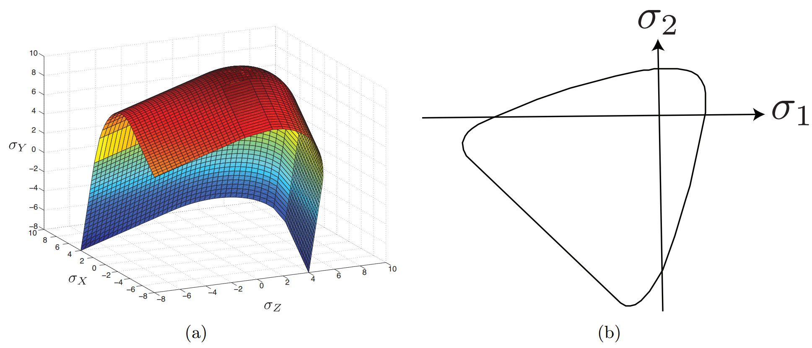
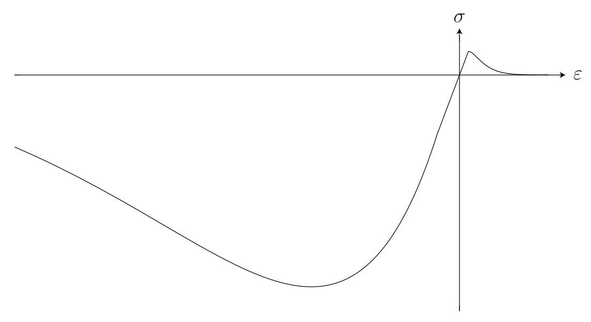
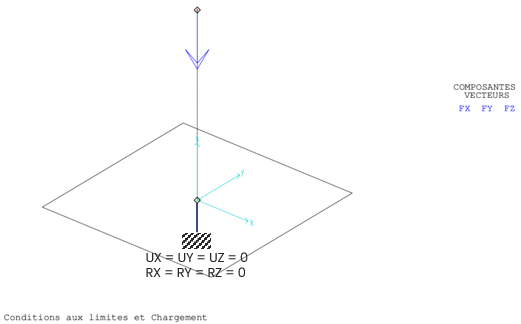
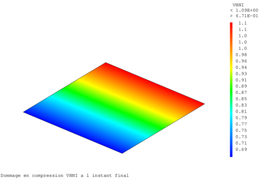
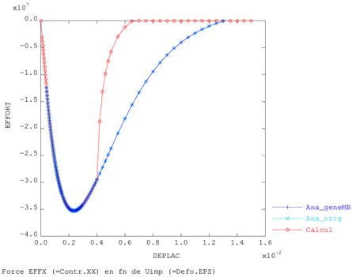
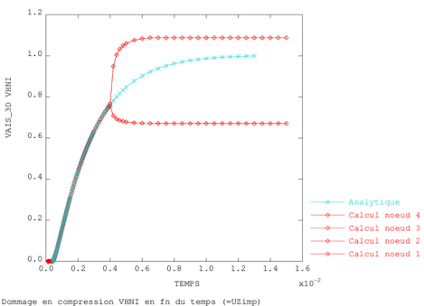
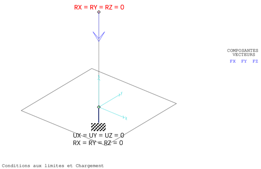
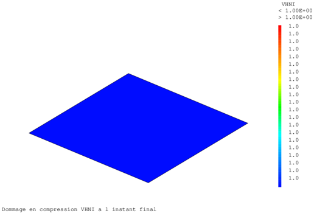
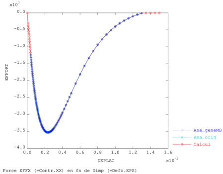
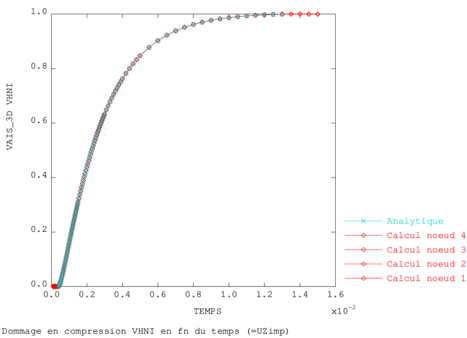

.. _sec:modeles_betons_lois:

Lois de comportement pour les bétons
====================================

La liste suivante concerne les lois de comportement pour le béton.

Loi MAZARS
----------

'MAZARS'    : Modele d'endommagement scalaire pour le béton (bien adapté aux chargements monotones).

Description
~~~~~~~~~~~
La loi de comportement élastique endommageable en traction/compression selon le modèle de Mazars, corrigé pour prendre en compte de manière plus réaliste l'endommagement en cisaillement, est présentée ici [MAZARS-1984]_ [MAZARS-1986]_ [PIJAUDIER-1991]_.

Caracteristiques et limitations principales :

- Dans ce modèle la dégradation des propriétés élastiques du matériau est représentée à l'aide d'une variable scalaire :math:`D` variant entre zéro (matériau sain) et l'unité (matériau totalement endommagé). Cette dernière est obtenue par la combinaison de deux variables scalaires représentant l'endommagement sous sollicitations de compression et de traction séparément ;

- Cela permet de modéliser convenablement la dyssimétrie traction-compression observée expérimentalement pour les bétons. Cependant, aucune reprise de raideur induite par la refermeture des fissures lors du passage d'une sollicitation de traction à une sollicitation de compression ne peut être prise en compte, c'est-à-dire que l'effet unilatéral n'est pas modélisé ;

- Compte tenu de cela, cette loi est adaptée à la simulation de la réponse du béton sous chargement monotone, mais nécessite des modifications pour une utilisation dans le cadre d'un calcul sous sollicitations cycliques et/ou dynamiques. Dans ce dernier cas, des limitations supplémentaires sont présentes (par exemple, l'impossibilité de modéliser des boucles d'hystérésis).

.. _mazars:

Formulation du modèle
~~~~~~~~~~~~~~~~~~~~~
La relation contrainte-déformation s'écrit :

.. math::

   \boldsymbol{\sigma} = (1-D) \mathbb{E} : \boldsymbol{\varepsilon}

où :math:`\boldsymbol{\sigma}` est le tenseur des contraintes de Cauchy, :math:`\boldsymbol{\varepsilon}` est le tenseur des déformations infinitésimales, et :math:`\mathbb{E}` est le tenseur d'élasticité d'ordre 4. 

La variable d'endommagement évolue au cours du chargement en fonction du critère d'endommagement :

.. math::

   f = f(e) = e - \kappa
   
où :math:`e` est une mésure scalaire du tenseur de déformation et :math:`\kappa` est une variable d'histoire fournissant le maximum atteint par la déformation équivalente pendant le chargement du matériau. 

Selon la formulation proposée par Mazars, la déformation équivalente est définie par :

.. math::

   {e}=\sqrt{\langle\boldsymbol{\varepsilon}\rangle:\langle\boldsymbol{\varepsilon}\rangle} = \sqrt{\sum_{i=1}^{^{n}}\langle\epsilon_{i}\rangle^{2}}
   
où :math:`\langle\boldsymbol{\varepsilon}\rangle` est la partie positive du tenseur des déformations, :math:`\epsilon_{i}` est la i-ème déformation
principale, :math:`\langle\cdot\rangle_+` est l'opérateur de Macauley, et :math:`n` répresente la dimension du problème consideré. 

La variable d'histoire :math:`\kappa` est donc définie par :

.. math::

   \kappa = \max_t (\kappa,e) \qquad \kappa(t=0) = e_0

avec :math:`e_0` une valeur seuil initiale et :math:`t` une variable répresentant le temps (ou bien le pseudo-temps dans un calcul quasi-statique). 

L’évolution de cette surface de charge doit respecter les conditions Kuhn-Tucker :

.. math::

   f \leq 0 \qquad \dot{\kappa} \geq 0 \qquad \dot{\kappa} f = 0
   
En d'autres termes, la surface de charge ne peut croître que si le seuil de déformation actuel est dépassé. Cela implique que l'endommagement ne progresse pas pendant les phases de décharge ou les phases de charge où les niveaux de déformation sont inférieurs au maximum atteint précédemment au cours de l'historique du chargement.

Pour prendre en compte la nature fortement dissymétrique du comportement en traction et en compression du béton, Mazars introduit deux fonctions :math:`D_t` et :math:`D_c` représentant respectivement les dégradations en traction et compression. Elles sont définies comme suit :

.. math::

   D_{t(c)} = 1 - \frac{e_0 (1-A_{t(c)})}{\kappa} - A_{t(c)} \exp\left[ -B_{t(c)}(\kappa - e_0)\right]

avec :math:`A_{t(c)}` et :math:`B_{t(c)}` les quatre paramètres additionnels permettant de définir, avec le seuil de première fissuration en traction :math:`e_0`, les lois d'évolution de l'endommagement  en traction (t) et en compression (c). Le paramètre :math:`A_{t(c)}` permet de controler la contrainte résiduelle en traction (respectivement compression) uniaxiale tandis que le paramètre :math:`B_{t(c)}` contrôle la forme de la loi d'evolution de l'endommagement dans la phase post pic de contrainte. 

.. _sec:beta:

La variable d'endommagement :math:`D` est finalement obtenue par combinaison linéaire des variables :math:`D_{t}` et :math:`D_{c}` 
comme suit :

.. math::

   D = \alpha_t^\beta D_t + \alpha_c^\beta D_c
   
avec :math:`\alpha_{t(c)} \in [0,1]` des facteurs de combinaison qui s'expriment en fonction des déformations principales comme suit :

.. math::

   \alpha_t = \frac{\sum_{i=1}^{n} \varepsilon_i^t \langle \varepsilon_i \rangle_+}{e^2} \qquad \alpha_c = 1 - \alpha_t

avec :math:`\varepsilon_i^t` les déformations associées aux contraintes principales positives. Le paramètre :math:`\beta` a été introduit historiquement plus tard dans le modèle pour éviter une évolution trop rapide de l'endommagement en cisaillement [PIJAUDIER-1991]_.

Réponses typiques
+++++++++++++++++

   
   Critère de Mazars. (a) Surface seuil dans l'espace des contraintes. (b) Trace dans le plan :math:`\sigma_3=0`. Giry 2001.

   
   Loi contrainte - déformation pour une sollicitation uniaxiale.

Quelques commentaires
+++++++++++++++++++++
Grâce à sa simplicité et sa robustesse, ce modèle a été et est encore largement utilisé pour modéliser le comportement du béton. Certaines pathologies peuvent néanmoins être citées et pour lesquelles des développements sont à considérer :

- Le modèle présente une fragilité excessive dans son comportement en cisaillement, et l'introduction du paramètre :math:`\beta` pour atténuer cet effet entraîne une reprise de rigidité à des niveaux de déformation élevés ;

- Le modèle ne prend pas en compte l'effet unilatéral, c'est-à-dire une reprise de raideur due à la refermeture des fissures expérimentalement observée. En conséquence, le modèle ne parvient pas à reproduire correctement le comportement sous chargements cycliques ;

- En termes numériques, l'utilisation de l'opérateur de Macauley dans l'expression des coefficients :math:`\alpha_{t(c)}` entraîne une dérivée non définie de ceux-ci en zéro. Cela empêche ainsi l'utilisation de l'opérateur tangent dans le schéma de résolution. Par conséquent, seul l'opérateur sécant est utilisé, ce qui limite la vitesse de convergence du schéma de résolution ;
  
- Le caractère isotrope de l’endommagement ne permet pas de bien suivre l’évolution des nonlinéarités pour des chargements non radiaux.

Implémentation Cast3M (esope)
~~~~~~~~~~~~~~~~~~~~~~~~~~~~~

Dans la suite, nous détaillons les étapes du calcul pour les éléments volumiques (sources cmazar.eso) d'une part et pour les éléments poutres à fibres (sources fibmaz.eso) d'autre part, en mettant l'accent sur les parties de code correspondantes aux aspects théoriques mentionnés précédemment. Pour une analyse détaillée de l'implémentation et des aspects plus strictement techniques concernant la signification des variables, veuillez vous référer aux commentaires présents dans les fichiers sources.	  

Implémentation pour les éléments volumiques 
+++++++++++++++++++++++++++++++++++++++++++

L'implémentation est réalisée dans le fichier source cmazar.eso

	.. literalinclude:: sources/cmazar.eso
		:language: fortran
		:lines: 1-3
		:linenos:
		:lineno-start: 1

Entrées
"""""""
	
	.. literalinclude:: sources/cmazar.eso
		:language: fortran
		:lines: 10-31
		:linenos:
		:lineno-start: 10
		
	.. literalinclude:: sources/cmazar.eso
		:language: fortran
		:lines: 35-39
		:linenos:
		:lineno-start: 35

Sorties
"""""""

	.. literalinclude:: sources/cmazar.eso
		:language: fortran
		:lines: 43-45
		:linenos:
		:lineno-start: 43

Algorithme
""""""""""

Le calul de l'endommagement est réalisé par une procédure purement explicite.

- On calcule la déformation totale au niveau du point d'intégration ;
	
- On calcule le tenseur des déformations principales ;
	
- On calcule la matrice d'élasticite et les contraintes principales ;
	
- On calcule la déformation équivalente de Mazars :
		
	* Si le calcul est local (**ISTEP = 0**), la déformation principale est évaluée directement sur la base des déformations principales ;
	        
	* En cas d'un calcul non-local, l'évolution de l'endommagement est pilotée par la contrepartie non-locale de la déformation de Mazars. Celle-ci est évaluée avec deux passages dans la loi de comportement :

		- Lors du premier passage (**ISTEP = 1**), on calcule la déformation locale et on sort de la loi de comportement. La déformation non-locale est calculée via une procédure ad-hoc en dehors de la loi de comportement, par exemple, via une méthode non-locale intégrale ou bien une formulation de type gradient implicite ;
		- Cette déformation non-locale est une variable d'entrée de la loi de comportement (**ISTEP = 2**) et est utilisée pour faire évoluer l'endommagement ;

- On vérifie le dépassement du seuil de déformation. Si le seuil n'est pas dépassé, l'endommagement n'est pas mis à jour. Sinon, on procède comme suit.
				
- On calcule les coefficients :math:`\alpha_{t(c)} \in [0,1]`. Pour cela :
		
	* On calcule le signe des contraines elastiques de compression **SIGPC(i)** (négative) et de traction **SIGPT(i)** (positive) et les traces associées :
	
		.. literalinclude:: sources/cmazar.eso
			:language: fortran
			:lines: 184-194
			:linenos:
			:lineno-start: 184		
			
	* On calcule les déformations associées aux contraintes positives :math:`\varepsilon_i^t` :

		.. literalinclude:: sources/cmazar.eso
			:language: fortran
			:lines: 198-200
			:linenos:
			:lineno-start: 198		

	* On calcule :math:`\alpha_{t}` puis on en déduit :math:`\alpha_{c}` :
	
		.. literalinclude:: sources/cmazar.eso
			:language: fortran
			:lines: 204-208
			:linenos:
			:lineno-start: 204		

	* On corrige les paramètres de combinaison linéaire via le coefficient :math:`\beta > 1` pour amémiorer la réponse en cisaillement :
		
		.. literalinclude:: sources/cmazar.eso
			:language: fortran
			:lines: 221-228
			:linenos:
			:lineno-start: 221		

- On corrige la déformation equivalente de Mazars :math:`e` par le coefficient :math:`\gamma` pour améliorer la réponse en bi ou tri-compression :

	.. math::
		e = e \gamma
		 
  le coefficient :math:`\gamma` est calculé de la façon suivante :

	.. math::
		\gamma = -\frac{\sqrt{\sum_{i=1}^n \langle \sigma_i \rangle_{-}^2}}{\sum_{i=1}^n \langle \sigma_i \rangle_{-}}
  
  avec :math:`\langle \cdot \rangle_{-}` l'opérateur partie négative.
	
	.. literalinclude:: sources/cmazar.eso
		:language: fortran
		:lines: 212-217
		:linenos:
		:lineno-start: 212		

- Le calcul de la variable d'endommagement **D** est effectué après avoir vérifié si le seuil de dommage initial a été dépassé. Cette vérification est nécessaire car il est possible que la valeur de la déformation equivalente de Mazars ait été multipliée par :math:`\gamma`. Tandis que l'évolution du dommage en compression **DC** suit la loi de Mazars classique, trois lois d'évolution différentes du dommage en traction **DT** sont proposées selon la valeur du paramètre **ATRA** :

	* **ATRA > 0** : loi de mazars classique ;
	* **-10 < ATRA < 0** : loi d'évolution exponentielle modifiée pour prendre en compte l'énergie de fissuration :math:`G_{f}` via le paramètre **BTRA** ;
	* **ATRA < -10** : loi d'évolution linéaire. Le paramètre **BTRA** représente alors la déformation pour laquelle la contrainte s'annule.

	.. literalinclude:: sources/cmazar.eso
		:language: fortran
		:lines: 252-272
		:linenos:
		:lineno-start: 252		

			
  La variable d'endommagement est ensuite bornée supérieurement à 0.99999999 afin d'éviter un trop mauvais conditionnement de la matrice de rigidité ;

- On calcule la nouvelle contrainte et on sort de la loi de comportement ;

- Les données de sortie sont la contrainte et les variables internes mises à jour.

Implémentation pour les éléments poutres à fibres
+++++++++++++++++++++++++++++++++++++++++++++++++

L'implémentation est réalisée dans le fichier source fibmaz.eso.

	.. literalinclude:: sources/fibmaz.eso
		:language: fortran
		:lines: 1-2
		:linenos:
		:lineno-start: 1

Entrées
"""""""
	
	.. literalinclude:: sources/fibmaz.eso
		:language: fortran
		:lines: 14-22
		:linenos:
		:lineno-start: 14

Sorties
"""""""

	.. literalinclude:: sources/fibmaz.eso
		:language: fortran
		:lines: 27-29
		:linenos:
		:lineno-start: 27

Algorithme
""""""""""

Le calul de l'endommagement est réalisé selon la même méthode que celle décrite précédemment dans le fichier source cmazar.eso pour les éléments volumiques, dans la mesure où il s'appuie sur la formulation 3D complète du modèle de Mazars.

- On calcule la déformation totale au niveau du point d'intégration ;

- On calcule les terme de la matrice 3x3 de déformation à partir de la théorie des poutres de Timoshenko ;

	.. literalinclude:: sources/fibmaz.eso
		:language: fortran
		:lines: 65-73
		:linenos:
		:lineno-start: 65
	
- On calcule le tenseur des déformations principales ;
	
- On calcule les contraintes principales à partir des déformations principales de de la matrice de Hook 3D (cas général) ;

	.. literalinclude:: sources/fibmaz.eso
		:language: fortran
		:lines: 86-97
		:linenos:
		:lineno-start: 86
	
- On calcule la déformation équivalente de Mazars en se plaçant toujours dans le cas où le calcul est local (**ISTEP = 0**). En conséquence, elle est évaluée directement sur la base des déformations principales ;

	.. literalinclude:: sources/fibmaz.eso
		:language: fortran
		:lines: 102-110
		:linenos:
		:lineno-start: 102
				
- On calcule les coefficients :math:`\alpha_{c(t)} \in [0,1]`. Pour cela :
		
	* On calcule le signe des contraines elastiques de compression **SIGPC(i)** (négative) et la trace associée :
	
		.. literalinclude:: sources/fibmaz.eso
			:language: fortran
			:lines: 120-123
			:linenos:
			:lineno-start: 120		
		
	* On vérifie le dépassement du seuil de déformation. Si le seuil n'est pas dépassé, l'endommagement n'est pas mis à jour. Sinon, on procède comme suit ;
			
	* On calcule les déformations associées aux contraintes négatives :math:`\varepsilon_i^c` :

		.. literalinclude:: sources/fibmaz.eso
			:language: fortran
			:lines: 142-144
			:linenos:
			:lineno-start: 142		

		
	* On calcule :math:`\alpha_{c}` puis on en déduit :math:`\alpha_{t}` :
	
		.. literalinclude:: sources/fibmaz.eso
			:language: fortran
			:lines: 148-152
			:linenos:
			:lineno-start: 148		

	* On corrige les paramètres de combinaison linéaire via le coefficient :math:`\beta > 1` pour amémiorer la réponse en cisaillement :
		
		.. literalinclude:: sources/fibmaz.eso
			:language: fortran
			:lines: 156-163
			:linenos:
			:lineno-start: 156		

- A noter que la correction :math:`\gamma` en cas de bi ou tri-compression n'a pas de sens avec la modélisation poutre à fibres qui ne traite que des chargements de type traction-compression dans la direction de sa fibre neutre et cisaillement dans le plan de sa section. 

- Le calcul de la variable d'endommagement **D** est effectué en ayant vérifié au préalable si le seuil de dommage initial a été dépassé. L'évolution du dommage en compression **DC** comme celle du dommage en traction **DT** suivent la loi de Mazars classique :

	.. literalinclude:: sources/fibmaz.eso
		:language: fortran
		:lines: 169-173
		:linenos:
		:lineno-start: 169		
			
  La variable d'endommagement est ensuite bornée supérieurement à 0.99999 afin d'éviter un trop mauvais conditionnement de la matrice de rigidité ;

- On calcule la nouvelle contrainte et on sort de la loi de comportement ;

- Les données de sortie sont la contrainte et les variables internes mises à jour.

Implémentation MFront
~~~~~~~~~~~~~~~~~~~~~

Une implémentation de la loi de Mazars a été réalisée sous MFront pour une utilisation avec des elements volumiques/surfaciques. La formulation implémentée est une version simplifiée de celle disponible dans Cast3M. En particulier, aucun correctif n'est introduit pour améliorer la réponse du modèle en cisaillement et en situation de bi ou tri-compression. 

	.. literalinclude:: sources/mazars_mfront.mfront
		:linenos:

Hypothèses de calcul et éléments finis disponibles
~~~~~~~~~~~~~~~~~~~~~~~~~~~~~~~~~~~~~~~~~~~~~~~~~~
- Cette loi est disponible pour les éléments massifs 3D et 2D sous l'hypothèse de contraintes/déformations planes (@lien vers section éléments finis?@).

- De plus, elle est également applicable aux poutres à fibres (éléments finis poutre à modèle section). Dans ce dernier cas, le modèle a été implémenté dans le modèle poutre à fibres selon sa formulation 3D complète, plutôt qu'uniaxiale.

- Elle peut être utilisée avec des éléments de type coque sous l'hypothèse de contraintes planes. 

Mots clefs dans les opérateurs MODE et MATE
~~~~~~~~~~~~~~~~~~~~~~~~~~~~~~~~~~~~~~~~~~~
Exemple d'utilisation de la loi Mazars pour des éléments finis massifs 3D **CUB8** :

.. code-block:: gibiane

   MODE maillage 'ELASTIQUE' 'ENDOMMAGEMENT' 'MAZARS' 'CUB8' ;
   MATE modele 'YOUN' val_youn 'NU' val_nu ('RHO' val_rho)
               'KTR0' val_e0 'ACOM' val_ac 'BCOM' val_bc 'ATRA' val_at 'BTRA' val_bt 'BETA' val_beta ;

Exemple d'utilisation de la loi Mazars pour des éléments finis poutres à fibres constituée d'éléments finis **TIMO** dont la section est constituée d'éléments finis **QUAS** :

- pour la section :

.. code-block:: gibiane

   MODE mail_section 'ELASTIQUE' 'PLASTIQUE' 'MAZARS' 'QUAS' ;
   MATE mode_section 'YOUN' val_youn 'NU' val_nu
                     'KTR0' val_e0 'ACOM' val_ac 'BCOM' val_bc 'ATRA' val_at 'BTRA' val_bt 'BETA' val_beta
                     'ALPY' 1. 'ALPZ' 1. ;

- pour la poutre :

.. code-block:: gibiane

   MODE mail_poutre 'ELASTIQUE' 'SECTION' 'PLASTIQUE' 'SECTION' 'TIMO' ;
   MATE mode_poutre 'MODS' mode_section 'MATS' mate_section 'VECT' (0. 1. 0.) ;

Paramètres de la loi non linéaire
~~~~~~~~~~~~~~~~~~~~~~~~~~~~~~~~~

- **KTR0** : seuil en déformation pour la traction, :math:`e_0`
- **ATRA** : paramètre pour la traction, :math:`A_t`
- **ACOM** : paramètre pour la compression, :math:`A_c`
- **BTRA** : paramètre pour la traction, :math:`B_t`
- **BCOM** : paramètre pour la compression, :math:`B_c`
- **BETA** : correction pour le cisaillement, :math:`\beta`

Valeurs typiques
++++++++++++++++

Pour un béton ordinaire, on peut choisir :

- :math:`e_0= 10^{-4}`
- :math:`A_t= 1`
- :math:`A_c= 1,5`
- :math:`B_t= 8000`
- :math:`B_c= 1550`
- :math:`\beta= 1`

Prise en compte de la régularisation dans la définition des paramètres matériaux
++++++++++++++++++++++++++++++++++++++++++++++++++++++++++++++++++++++++++++++++
- Régularisation énergetique 
- Régularisation non-locale (quelle formulation? quelle variable est rendue non-locale?)

Anomalies observées et limitation numérique
~~~~~~~~~~~~~~~~~~~~~~~~~~~~~~~~~~~~~~~~~~~

Anomalie 1
++++++++++

Une anomalie a été identifiée dans les sources fibmaz.eso (modèles poutres à fibres) et cmazar.eso (modèles massifs) concernant le mauvais calibrage du test de bicompression dans le modèle Mazars. Dans fibmaz.eso, le critère trop sévère (1.D-12) générait à tort la correction :math:`\gamma` de bicompression, même lorsqu'on est en situation de traction simple ; tandis que, dans cmazar.eso, il conduisait à mal calculer les contraintes en situation de bicompression. 

En ce qui concerne la source cmazar.eso pour les modèles massif, ce test à été recalibré à 1 Pa, valeur jugée suffisamment proche de 0 selon le REX (Thèse de Martin Debuisne, 2024). 

- Constatée le 24/07/2024.
- **Anomalie #12209 corrigée dans la version 2025 de Cast3M.**

En ce qui concerne la source fibmaz.eso pour les modèles poutres à fibres, la correction :math:`\gamma` a été inhibée car la biaxialité du chargement n'a pas de sens avec l'élément poutre à fibres qui ne traite que des chargements de type traction-compression dans la direction de sa fibre neutre et cisaillement dans le plan de sa section. 

- Constatée le 24/07/2024.
- **Anomalie #11959 corrigée dans la version 2025 de Cast3M.**

Anomalie 2
++++++++++

- Constatée le 13/06/2024.
- **Anomalie #11948 corrigée dans la version 2024.1 de Cast3M.**

Une anomalie a été identifiée dans la source idendo.eso. Elle est datée du 21/08/2023 et cause une erreur d'initialisation du paramètre BETA dans cmazar.eso. Cette anomalie ne rend pas le modèle Mazars inutilisable mais corrompt ses résultats avec des éléments volumiques. Elle impacte la version 2024.0 de Cast3M.

Anomalie 3
++++++++++

- Constatée le 04/02/2025.
- **Non corrigée à ce jour.**

Une anomalie de fonctionnement des modélisations poutre à fibres a été identifiée dans différents cas de chargement élémentaire (traction, compression, flexion, ...) et avec différents modèles de comportement (Mazars, ACIER_UNI, ...). Il s'agit d'une instabilité numérique de type "flambement" qui conduit soit à un arrêt du calcul par non convergence de PASAPAS, soit à des résultats erronés produits après l'instabilité, comme ici un champ de dommage devenant hétérogène dans la section du modèle poutre à fibres, avec une bifurcation entre les résultats de deux paires de points de Gauss conduisant à des valeurs anormales (cf. figure ci-dessous).

   
   Anomalie constatée dans le cas d'une modélisation poutre à fibres soumise à un chargement uniaxial de compression en déplacement imposé à l'extrémité libre d'une poutre encastrée à son autre extrémité - Maillage et conditions aux limites, champ de dommage hétérogène dans la section en fin de calcul, évolutions anormales au cours du chargement de la contrainte moyenne en fonction de la déformation moyenne et du dommage en chaque point de Gauss de la section en fonction du temps.

Cette anomalie, qui concerne donc le modèle poutre à fibres et pas le modèle Mazars, est contournée dans tous les cas rencontrés jusqu'ici en bloquant les rotations du point correspondant à l'extrémité libre soumise au chargement de la poutre à fibres (cf. figure ci-dessous).

   
   Anomalie contournée en bloquant les rotations du point d'extrémité libre de la poutre - Maillage et conditions aux limites, champ de dommage homogène en fin de calcul, évolutions normales au cours du chargement de la contrainte moyenne en fonction de la déformation moyenne et du dommage en chaque point de Gauss de la section en fonction du temps.

Limitation numérique
++++++++++++++++++++
Le modèle Mazars dans Cast3M, tant dans la configuration éléments volumiques (source cmazar.eso) que poutres à fibres (source fibmaz.eso), exhibe un domaine post-ruine consolidant non physique. Cet artefact numérique est dû à la limitation du dommage maximum :

.. math::
   D_{max}=(1 - \epsilon)
   
où :math:`\epsilon` est un paramètre arbitrairement petit, défini dans les sources Cast3M du modèle Mazars, permettant de se prémunir de l'absence complète de rigidité aux points de Gauss ayant atteint la ruine, ce qui empêcherait la poursuite du calcul. L'augmentation de la valeur de ce paramètre est favorable à la stabilité numérique mais défavorable au réalisme de la simulation.

En effet, la consolidation qui en découlerait dans une zone jugée trop grande du modèle E.F. peut conduire à des résultats numériques qui ne sont pas physiquement admissibles et ainsi fausser le jugement du spécialiste du béton, ce qui est préjudiciable à la confiance accordée au modèle. 

Le choix de la valeur du paramètre :math:`\epsilon` résulte donc d'un compromis à faire entre convergence numérique et représentativité physique du modèle.

L'historique des valeurs attribuées au paramètre :math:`\epsilon` est le suivant :

- dans la configuration éléments volumiques (source cmazar.eso) :

  - :math:`\epsilon=10^{-20}` : valeur d'origine ;

  - :math:`\epsilon=10^{-4}` : valeur dans la version du jour de Cast3M jusqu'au 9/10/2024 ;

  - :math:`\epsilon=10^{-8}` : valeur dans la version du jour de Cast3M depuis le 10/10/2024 ;
   
- dans la configuration éléments poutres à fibres (source fibmaz.eso) :

  - :math:`\epsilon=10^{-5}` : valeur d'origine.

