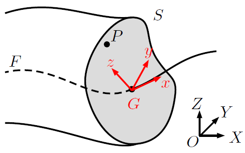
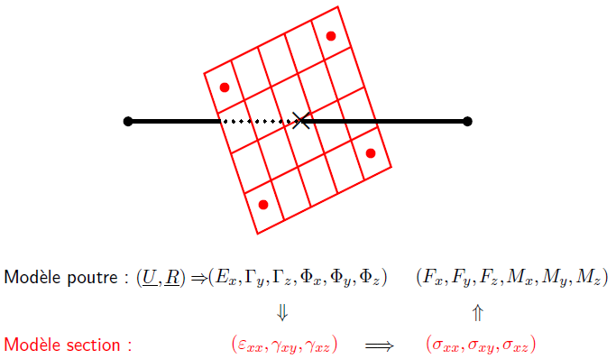

.. _sec:modeles_beton_rappels_poutres:

Rappels sur les éléments finis barre, poutres et poutres à fibre
================================================================

Généralités sur les éléments barres et poutres
----------------------------------------------

Plusieurs types d'éléments finis de type *poutre* sont disponibles dans Cast3M pour l'étude
de structures. Ces éléments finis sont basés sur des supports géométriques de segments à deux
noeuds (éléments géométrique **SEG2**).

Les noms d'éléments finis disponibles pour ces supports géométriques sont :

- l'élément **BARR**, modélisant uniquement la traction et la compression.
- l'élément **POUT**, basé sur la théorie des poutres d'Euler-Beroulli,
  où la section droite reste droite et orthogonale à la fibre moyenne,
  négligeant la déformation de cisaillement et avec une répartition de
  courbure linéaire sur l’élément ;
- l’élément **TIMO**, basé sur la théorie des poutres de Timoshenko,
  où la section droite reste droite mais pas nécessairement orthogonale à la
  fibre moyenne, avec déformation de cisaillement et avec une répartition
  de courbure constante sur l’élément.

Ces éléments finis fonctionnent en 3D et en 2D (contraintes planes et déformations planes).

À ces éléments finis s'ajoute la modélisation *poutre multifibres*. Il s'agit d'un
élément **TIMO**, représentant la fibre moyenne de la poutre, auquel on lie un second
modèle de section représentant une échelle plus fine : celle de la section droite.
Le *modèle de section* est basé sur un maillage d'éléments finis massifs classique 2D.

.. admonition:: To Do

   *Récapitulatif des paramètres materiau et géométriques obligatoires en élasticité
   YOUN, NU, SECT, INRY, INRZ, INRX, et aussi sections réduites*

Dans la suite de cette documentation, nous traiterons de l'élément fini **TIMO** car plus générique
et distinguerons l'élément **POUT** quand nécessaire.

Bibliographie
-------------

Plus d'informations sur la modélisation *multifibres* peuvent être trouvées dans les références
suivantes (dont une partie de ces rappels sont issus) : [COMBESCURE-2001]_ [GUEDES-1994]_ et [ADELAIDE-2011]_

Éléments finis poutre de Timoshenko
-----------------------------------

Notations
~~~~~~~~~
La figure suivante illustre les notations utilisées dans la suite du document.
Il s'agit de fixer les conventions d'écriture des grandeurs mécaniques dans
le *repère global* de l'espace et le *repère local* de la poutre ainsi que de
définir les *déformations et contraintes généralisées*.

**Dans le repère global** :math:`(O,\underline{X},\underline{Y},\underline{Z})` :

- :math:`P` désigne un point quelconque de la poutre et :math:`(X,Y,Z)` ses coordonnées ;
- :math:`S` désigne la *section droite* de la poutre où se trouve :math:`P` ;
- :math:`G` désigne le centre la section droite :math:`S` ;
- :math:`F` désigne la ligne formée par l'ensemble des points :math:`G` de toutes les
  sections droites de la poutre, cette ligne est appelée *fibre moyenne* ;
- :math:`U_X, U_Y, U_Z` désignent les déplacement de :math:`G` (composantes **UX**, **UY**, **UZ** du modèle Cast3M) ;
- :math:`R_X, R_Y, R_Z` désignent les rotations de :math:`S` (composantes **RX**, **RY**, **RZ** du modèle Cast3M).

On note :math:`x` l'abscisse curviligne du point :math:`G` le long de :math:`F`
et on définit un repère local :math:`(G,\underline{x},\underline{y},\underline{z})`
où :math:`\underline{x}` est tangent à la fibre moyenne :math:`F` et
:math:`\underline{y}` et :math:`\underline{z}` sont dans le plan de la
section droite :math:`S`.

**Dans le repère local** :math:`(G,\underline{x},\underline{y},\underline{z})` :

- :math:`P` peut être repéré par ses coordonnés :math:`(x,y,z)`, où
  :math:`x` est l'abscisse curviligne de :math:`G` et :math:`(y,z)` les
  distances de :math:`P` à :math:`G` dans le plan de :math:`S` ;
- :math:`U_x, U_y, U_z` désignent les déplacements de :math:`G` ;
- :math:`R_x, R_y, R_z` désignent les rotations de :math:`S`.

   
   Schéma de la poutre avec sa fibre moyenne :math:`F` et une section droite :math:`S`.
   Le repère local au centre :math:`G` de la section droite est en rouge.
   

Déplacements
~~~~~~~~~~~~

Les hypothèses cinématiques de la théorie de Timoshenko permettent d'exprimer la
cinématique de tout point :math:`P` de la poutre en fonction des déplacements de
:math:`G`, des rotations de :math:`S` et des coordonnées de :math:`P`.

Ainsi, le *déplacement* :math:`\underline{u}` du point :math:`P` s'écrit:

.. math::
   \underline{u}=
   \left[ \begin{array}{c}
   u_x \\
   u_y \\
   u_z \end{array} \right]=
   \left[ \begin{array}{l}
   U_x + zR_y - yR_z \\
   U_y - zR_x \\
   U_z + yR_x \end{array} \right]

Déformations
~~~~~~~~~~~~

Sous l'hypothèse des petites déformations, les composantes du *tenseur des
déformations* au point :math:`P` s'écrivent :

.. math::
   :name: eq_defo_loc_1

   \varepsilon_{xx} & = \frac{\partial u_x}{\partial x}\phantom{+\frac{\partial u_x}{\partial x}} & = \frac{dU_x}{dx}+z\frac{dR_y}{dx}-y\frac{dR_z}{dx} \\
   \gamma_{xy}      & = \frac{\partial u_x}{\partial y}+\frac{\partial u_y}{\partial x}           & = \frac{dU_y}{dx}-R_z-z\frac{dR_x}{dx} \\
   \gamma_{xz}      & = \frac{\partial u_x}{\partial z}+\frac{\partial u_z}{\partial x}           & = \frac{dU_z}{dx}+R_y+y\frac{dR_x}{dx}

où :

- :math:`\varepsilon_{xx}` est la déformation axiale au point :math:`P` ;
- :math:`\gamma_{xy},\gamma_{xz}` sont les cisaillements au point :math:`P`.

On peut réécrire les déformations au point :math:`P` en faisant apparaitre celles du
point :math:`G`, centre de la fibre moyenne :

.. math::
   :name: eq_defo_loc_2

   \varepsilon_{xx} & = E_x+z\Phi_y-y\Phi_z \\
   \gamma_{xy}      & = \Gamma_y-z\Phi_x \\
   \gamma_{xz}      & = \Gamma_z+y\Phi_x

Les déformations au centre de la section :math:`G` sont appelées les **déformations généralisées** :

.. math::
   :name: eq_defo_gen

   E_x = \frac{dU_x}{dx}      & \qquad & \Phi_x = \frac{dR_x}{dx} \\
   \Gamma_y = \frac{dU_y}{dx} & \qquad & \Phi_y = \frac{dR_y}{dx} \\
   \Gamma_z = \frac{dU_z}{dx} & \qquad & \Phi_z = \frac{dR_z}{dx}

Contraintes
~~~~~~~~~~~

La théorie des poutres définit *l'effort axial* :math:`F_x` et les *moments de flexion* :math:`M_y,M_z`
en intégrant la contrainte axiale :math:`\sigma_{xx}` correspondante à la déformation axiale :math:`\varepsilon_{xx}`.

.. math::
   :name: eq_cont_gen_1

   F_x & = \int_{S}\sigma_{xx}dS \\
   M_y & = \int_{S}z\sigma_{xx}dS \\
   M_z & = -\int_{S}y\sigma_{xx}dS

De même, on définit les *efforts tranchants* :math:`F_y, F_z` et le *moment de torsion* :math:`M_x`
en intégrant les contraintes tangentielles :math:`\sigma_{xy}, \sigma_{xz}` déduites des
cisaillements :math:`\gamma_{xy}, \gamma_{xz}`.

.. math::
   :name: eq_cont_gen_2

   F_y & = \int_{S}\sigma_{xy}dS \\
   F_z & = \int_{S}\sigma_{xz}dS \\
   M_x & = \int_{S}(y\sigma_{xz}-z\sigma_{xy})dS

Les forces :math:`F_x, F_y, F_z` et les moments :math:`M_x, M_y, M_z` sont
appelées les **contraintes généralisées**.

Remarques
~~~~~~~~~

.. admonition:: Loi de comportement

   Pour un élément *poutre* **TIMO** ou **POUT**, l'écriture de la loi
   de comportement locale consiste à écrire une relation entre les déformations
   généralisées :math:`\left(E_x, \Gamma_y, \Gamma_z, \Phi_x, \Phi_y, \Phi_z\right)` et
   les contraintes généralisées :math:`\left(F_x, F_y, F_z, M_x, M_y, M_z\right)`.

   Cette écriture est donc très différente des lois de comportement habituelles de la mécanique
   des milieux continus, que l'on retrouve dans les éléments finis *massifs* (où l'on écrit une
   relation entre les déformations et contraintes locales). De plus, dans les éléments finis de
   poutre, la loi de comportement est appliquée seulement aux pointx de Gauss de la fibre moyenne
   de la poutre, ce qui ne permet pas de capter l'hétérogénéité du comportement à travers la section.

.. admonition:: Intégration

   L'élément **TIMO** est sous intégré pour éviter les problèmes de blocage en cisaillement
   (*shear locking*). Les fonctions de forme sont donc :

   - de degré 1 pour les rotations, les déplacements transverses et axial ;
   - constante pour les courbures, les déformations de cisaillement et axiale.

   L'élément possède un unique point de Gauss situé au centre de l'élément.

.. admonition:: Tableau synthétique des composantes des champs mécaniques

   .. table:: Déplacements/Rotations (inconnues primales)
      :align: center

      +-------------+--------------------------+-------------+---------+-------------------------------------------------------+
      | Notation    | Description              | Composante  | Support | Exprimé dans                                          |
      |             |                          |             |         |                                                       |
      |             |                          | dans Cast3M |         | le repère                                             |
      +=============+==========================+=============+=========+=======================================================+
      | :math:`U_X` | déplacement de :math:`G` | **UX**      | Nœuds   | Global                                                |
      |             |                          |             |         |                                                       |
      |             | selon :math:`X`          |             | CHPOINT | :math:`(O,\underline{X},\underline{Y},\underline{Z})` |
      +-------------+--------------------------+-------------+---------+-------------------------------------------------------+
      | :math:`U_Y` | déplacement de :math:`G` | **UY**      | Nœuds   | Global                                                |
      |             |                          |             |         |                                                       |
      |             | selon :math:`Y`          |             | CHPOINT | :math:`(O,\underline{X},\underline{Y},\underline{Z})` |
      +-------------+--------------------------+-------------+---------+-------------------------------------------------------+
      | :math:`U_Z` | déplacement de :math:`G` | **UZ**      | Nœuds   | Global                                                |
      |             |                          |             |         |                                                       |
      |             | selon :math:`Z`          |             | CHPOINT | :math:`(O,\underline{X},\underline{Y},\underline{Z})` |
      +-------------+--------------------------+-------------+---------+-------------------------------------------------------+
      | :math:`R_X` | rotation de :math:`S`    | **RX**      | Nœuds   | Global                                                |
      |             |                          |             |         |                                                       |
      |             | autour de :math:`X`      |             | CHPOINT | :math:`(O,\underline{X},\underline{Y},\underline{Z})` |
      +-------------+--------------------------+-------------+---------+-------------------------------------------------------+
      | :math:`R_Y` | rotation de :math:`S`    | **RY**      | Nœuds   | Global                                                |
      |             |                          |             |         |                                                       |
      |             | autour de :math:`Y`      |             | CHPOINT | :math:`(O,\underline{X},\underline{Y},\underline{Z})` |
      +-------------+--------------------------+-------------+---------+-------------------------------------------------------+
      | :math:`R_Z` | rotation de :math:`S`    | **RZ**      | Nœuds   | Global                                                |
      |             |                          |             |         |                                                       |
      |             | autour de :math:`Z`      |             | CHPOINT | :math:`(O,\underline{X},\underline{Y},\underline{Z})` |
      +-------------+--------------------------+-------------+---------+-------------------------------------------------------+

   .. table:: Forces/Moments (inconnues duales)
      :align: center

      +-------------+--------------------------+-------------+---------+-------------------------------------------------------+
      | Notation    | Description              | Composante  | Support | Exprimé dans                                          |
      |             |                          |             |         |                                                       |
      |             |                          | dans Cast3M |         | le repère                                             |
      +=============+==========================+=============+=========+=======================================================+
      | :math:`F_X` | force en :math:`G`       | **FX**      | Nœuds   | Global                                                |
      |             |                          |             |         |                                                       |
      |             | selon :math:`X`          |             | CHPOINT | :math:`(O,\underline{X},\underline{Y},\underline{Z})` |
      +-------------+--------------------------+-------------+---------+-------------------------------------------------------+
      | :math:`F_Y` | force en :math:`G`       | **FY**      | Nœuds   | Global                                                |
      |             |                          |             |         |                                                       |
      |             | selon :math:`Y`          |             | CHPOINT | :math:`(O,\underline{X},\underline{Y},\underline{Z})` |
      +-------------+--------------------------+-------------+---------+-------------------------------------------------------+
      | :math:`F_Z` | force en :math:`G`       | **FZ**      | Nœuds   | Global                                                |
      |             |                          |             |         |                                                       |
      |             | selon :math:`Z`          |             | CHPOINT | :math:`(O,\underline{X},\underline{Y},\underline{Z})` |
      +-------------+--------------------------+-------------+---------+-------------------------------------------------------+
      | :math:`M_X` | moment en :math:`G`      | **MX**      | Nœuds   | Global                                                |
      |             |                          |             |         |                                                       |
      |             | autour de :math:`X`      |             | CHPOINT | :math:`(O,\underline{X},\underline{Y},\underline{Z})` |
      +-------------+--------------------------+-------------+---------+-------------------------------------------------------+
      | :math:`M_Y` | moment en :math:`G`      | **MY**      | Nœuds   | Global                                                |
      |             |                          |             |         |                                                       |
      |             | autour de :math:`Y`      |             | CHPOINT | :math:`(O,\underline{X},\underline{Y},\underline{Z})` |
      +-------------+--------------------------+-------------+---------+-------------------------------------------------------+
      | :math:`M_Z` | moment en :math:`G`      | **MZ**      | Nœuds   | Global                                                |
      |             |                          |             |         |                                                       |
      |             | autour de :math:`Z`      |             | CHPOINT | :math:`(O,\underline{X},\underline{Y},\underline{Z})` |
      +-------------+--------------------------+-------------+---------+-------------------------------------------------------+

   .. table:: Déformations généralisées
      :align: center

      +------------------------------------+---------------------------------+-------------+----------------+-------------------------------------------------------+
      | Notation                           | Description                     | Composante  | Support        | Exprimé dans                                          |
      |                                    |                                 |             |                |                                                       |
      |                                    |                                 | dans Cast3M |                | le repère                                             |
      +====================================+=================================+=============+================+=======================================================+
      | :math:`E_x = \frac{dU_x}{dx}`      | déformation/élongation          | **EPS**     | Point de Gauss | Local                                                 |
      |                                    |                                 |             |                |                                                       |
      |                                    | axiale moyenne                  |             | MCHAML         | :math:`(G,\underline{x},\underline{y},\underline{z})` |
      +------------------------------------+---------------------------------+-------------+----------------+-------------------------------------------------------+
      | :math:`\Gamma_y = \frac{dU_y}{dx}` | déformation de                  | **GXY**     | Point de Gauss | Local                                                 |
      |                                    |                                 |             |                |                                                       |
      |                                    | cisaillement :math:`xy` moyenne |             | MCHAML         | :math:`(G,\underline{x},\underline{y},\underline{z})` |
      +------------------------------------+---------------------------------+-------------+----------------+-------------------------------------------------------+
      | :math:`\Gamma_z = \frac{dU_z}{dx}` | déformation de                  | **GXZ**     | Point de Gauss | Local                                                 |
      |                                    |                                 |             |                |                                                       |
      |                                    | cisaillement :math:`xz` moyenne |             | MCHAML         | :math:`(G,\underline{x},\underline{y},\underline{z})` |
      +------------------------------------+---------------------------------+-------------+----------------+-------------------------------------------------------+
      | :math:`\Phi_x = \frac{dR_x}{dx}`   | dérivé de la rotation           | **CX**      | Point de Gauss | Local                                                 |
      |                                    |                                 |             |                |                                                       |
      |                                    | de torsion                      |             | MCHAML         | :math:`(G,\underline{x},\underline{y},\underline{z})` |
      +------------------------------------+---------------------------------+-------------+----------------+-------------------------------------------------------+
      | :math:`\Phi_y = \frac{dR_y}{dx}`   | courbure autour de :math:`y`    | **CY**      | Point de Gauss | Local                                                 |
      |                                    |                                 |             |                |                                                       |
      |                                    |                                 |             | MCHAML         | :math:`(G,\underline{x},\underline{y},\underline{z})` |
      +------------------------------------+---------------------------------+-------------+----------------+-------------------------------------------------------+
      | :math:`\Phi_z = \frac{dR_z}{dx}`   | courbure autour de :math:`z`    | **CZ**      | Point de Gauss | Local                                                 |
      |                                    |                                 |             |                |                                                       |
      |                                    |                                 |             | MCHAML         | :math:`(G,\underline{x},\underline{y},\underline{z})` |
      +------------------------------------+---------------------------------+-------------+----------------+-------------------------------------------------------+

   .. table:: Contraintes généralisées
      :align: center

      +----------------------------------------------------+--------------------+-------------+----------------+-------------------------------------------------------+
      | Notation                                           | Description        | Composante  | Support        | Exprimé dans                                          |
      |                                                    |                    |             |                |                                                       |
      |                                                    |                    | dans Cast3M |                | le repère                                             |
      +====================================================+====================+=============+================+=======================================================+
      | :math:`F_x = \int_{S}\sigma_{xx}dS`                | effort axial       | **EFFX**    | Point de Gauss | Local                                                 |
      |                                                    |                    |             |                |                                                       |
      |                                                    | selon :math:`x`    |             | MCHAML         | :math:`(G,\underline{x},\underline{y},\underline{z})` |
      +----------------------------------------------------+--------------------+-------------+----------------+-------------------------------------------------------+
      | :math:`F_y = \int_{S}\sigma_{xy}dS`                | effort tranchant   | **EFFY**    | Point de Gauss | Local                                                 |
      |                                                    |                    |             |                |                                                       |
      |                                                    | selon :math:`y`    |             | MCHAML         | :math:`(G,\underline{x},\underline{y},\underline{z})` |
      +----------------------------------------------------+--------------------+-------------+----------------+-------------------------------------------------------+
      | :math:`F_z = \int_{S}\sigma_{xz}dS`                | effort tranchant   | **EFFZ**    | Point de Gauss | Local                                                 |
      |                                                    |                    |             |                |                                                       |
      |                                                    | selon :math:`z`    |             | MCHAML         | :math:`(G,\underline{x},\underline{y},\underline{z})` |
      +----------------------------------------------------+--------------------+-------------+----------------+-------------------------------------------------------+
      | :math:`M_x = \int_{S}(y\sigma_{xz}-z\sigma_{xy})dS`| moment de torsion  | **MOMX**    | Point de Gauss | Local                                                 |
      |                                                    |                    |             |                |                                                       |
      |                                                    | autour de :math:`x`|             | MCHAML         | :math:`(G,\underline{x},\underline{y},\underline{z})` |
      +----------------------------------------------------+--------------------+-------------+----------------+-------------------------------------------------------+
      | :math:`M_y = \int_{S}z\sigma_{xx}dS`               | moment fléchissant | **MOMY**    | Point de Gauss | Local                                                 |
      |                                                    |                    |             |                |                                                       |
      |                                                    | autour de :math:`y`|             | MCHAML         | :math:`(G,\underline{x},\underline{y},\underline{z})` |
      +----------------------------------------------------+--------------------+-------------+----------------+-------------------------------------------------------+
      | :math:`M_z = -\int_{S}y\sigma_{xx}dS`              | moment fléchissant | **MOMZ**    | Point de Gauss | Local                                                 |
      |                                                    |                    |             |                |                                                       |
      |                                                    | autour de :math:`z`|             | MCHAML         | :math:`(G,\underline{x},\underline{y},\underline{z})` |
      +----------------------------------------------------+--------------------+-------------+----------------+-------------------------------------------------------+

Éléments finis poutre multifibres
---------------------------------

Dans Cast3M, les éléments finis de poutre multifibres sont basés sur des éléments poutre
de Timoshenko mais présentent deux niveaux de modélisation :

- le niveau "poutre" repose sur un modèle linéique de la fibre moyenne, constitué d'éléments
  finis **TIMO**, présentés dans le paragraphe précédent ;
- le niveau "section" repose sur un modèle surfacique de la section droite, constitué d'éléments
  finis massifs classiques 2D (triangles et/ou quadrangles linéaires).

Les liaisons entre les deux niveaux de modélisation peuvent être résumées sur la
figure :ref:`ci-dessous <fig:poutre_2>`.

   
   Schéma du modèle de poutre multifibres. Pour un élément fini poutre **TIMO**
   (noir) est associé un modèle de section (rouge).

- À partir des déplacements et rotations aux noeuds du modèle poutre
  :math:`(\underline{U},\underline{R})`, on peut déduire les déformations
  généralisées :math:`(E_x,\Gamma_y,\Gamma_z,\Phi_x,\Phi_y,\Phi_z)` au point
  de Gauss de la poutre :eq:`eq_defo_gen`. Ces déformations traduisent la déformation
  moyenne de la section.
- On peut localiser, en chaque point de Gauss du modèle section, les déformations
  :math:`(\varepsilon_{xx},\gamma_{xy},\gamma_{xz})` en appliquant les équations
  :eq:`eq_defo_loc_2`.
- La loi de comportement est appliquée en chaque point de Gauss du modèle section
  ce qui donne les contraintes :math:`(\sigma_{xx},\sigma_{xy},\sigma_{xz})`.
- On remonte, par homogénéisation, aux contraintes généralisées du modèle
  poutre :math:`(F_x,F_y,F_z,M_x,M_y,M_z)` en appliquant les équations
  :eq:`eq_cont_gen_1` et :eq:`eq_cont_gen_2`.

Les lois de comportement locales du modèle de section, sont similaires à celles
de la mécanique des milieux continus car elles portent sur de "vraies"
déformations et contraintes, et non pas entre les contraintes et déformations
généralisées du modèle poutre. De plus, la finesse du maillage de la section
permet de représenter les hétérogéités de comportement dans la section.

Ce type d'élément a notamment été développé pour des applications en génie
civil où, par exemple, une structure en béton armé peut être modélisée de
manière simplifiée à l'échelle de la structure (modèle linéique et homogène
de poutre) tout en prenant en compte la présences des ferraillages dans la
section (modèle hétérogène de section) et notamment la différence de comportement
entre le béton et les armatures en acier.

Cependant, la cinématique des poutres de Timoshenko contraint l'écriture
de la loi de comportement locale dans la section à une forme *unidimensionnelle*
associant les contraintes axiale :math:`\sigma_{xx}` et tangentielles
:math:`\sigma_{xy}, \sigma_{xz}` respectivement aux déformations axiale
:math:`\varepsilon_{xx}` et de cisaillement :math:`\gamma_{xy},\gamma_{xz}`.
Dans Cast3M, les lois de comportement locales des poutres multifibres sont
écrites en supposant que la non linéarité n'est portée que sur la composante
axiale :math:`x`.

.. admonition:: To Do

   *exemple d'utilisation modèle de SECTION sur les éléments TIMO et de leurs paramètres obligatoires MODS, MATS, VECT*

   *exemple d'utilisation modèles non linéaires sur les éléments QUAS/TRIS/SEGS/POJS*
   
   *récapitulatif paramètres materiau/géométriques obligatoires en élasticité YOUN, NU, ALPY, ALPZ, SECT (pour les POJS et BARR), LARG (pour les SEGS)*
