.. _sec:modeles_beton_verif:

Vérification
============

Ce chapitre présente la démarche de vérification élémentaire pour l'ensemble des lois de comportement pour
le béton disponibles dans Cast3M. Pour chaque loi de comportement y sont décrit :

- les cas de chargement appliqués (selon la :ref:`spécification des tests <sec:modeles_beton_tests>`) ;
- les phénomènes observés ;
- la solution de référence ;
- les résultats et leur comparaison à la référence.

Pour les tests unitaires, c'est-à-dire portant sur un seul élément fini, la géométrie considérée est toujours :

- en 3D/2D poutre à fibres : 1 élément **TIMO** avec :math:`L=1` m et 1 élément **QUAS** de section carré avec :math:`S=1` m² [nh145313 : actuellement :math:`S=10^{-2}` m²];
- en 3D volumique : 1 élément **CUB8** avec :math:`L=1` m ;
- en 2D contraintes planes : 1 élément **QUA4** avec :math:`L=1` m et :math:`e=0,1` m (paramètre **DIM3**) ;
- en 2D axisymétrique : 1 élément **QUA4** avec :math:`R=1` m et :math:`H=1` m.

Loi MAZARS
----------

.. _sec:mazars_ana_trac:

Traction monotone
~~~~~~~~~~~~~~~~~
Le cas-test se dénomme ``01_traction.dgibi``

On applique le cas de chargement de traction simple pour les modélisations :ref:`poutre <sec:modeles_beton_test_pout_trac_mono>`
et :ref:`massif <sec:modeles_beton_test_mass_trac_mono>` en déplacement imposé croissant jusqu’à atteindre l’endommagement autour de 0,9.

Pour tous les modes de calcul le déplacement imposé vaut :math:`u_{max}=5.10^{-4}` m.

L’objectif est d’évaluer la limite en traction puis le comportement post-pic du modèle.

L'analyse des résultats porte sur les courbes :

- d'endomagemment soit en chaque point de Gauss de la section de la poutre pour les modèles poutre à fibres, soit moyen pour les modèles massifs, en fonction du temps ;
- de la contrainte soit en chaque point de Gauss de la section de la poutre pour les modèles poutre à fibres, soit moyenne pour les modèles massifs, en fonction de la déformation moyenne ;
- de la force de réaction globale en fonction du déplacement imposé.

Solution de référence
+++++++++++++++++++++
La solution de référence est obtenue de manière analytique à partir de l'équation donnant la loi de l'évolution de l'endommagement en traction.

Endommagement
"""""""""""""

.. math::
   D_t = 1 - \frac{e_0 (1 - A_t)}{e} - A_t\exp\left[-B_t (e - e_0)\right]
   
où :

- :math:`A_t` et :math:`B_t` sont les paramètres de la loi de Mazars en traction ;
- :math:`e_0` est le seuil d'endommagement en déformation ;
- :math:`e` est la déformation équivalente selon la formulation proposée par Mazars :

.. math::
   {e} = \sqrt{\sum_{i=1}^{^{n}}\langle\epsilon_{i}\rangle^{2}}
   
où :math:`\langle\epsilon_{i}\rangle` est la partie positive de la i-ème déformation principale et :math:`n` répresente la dimension du problème consideré (cf. chapitre :ref:`mazars`).
   
L'expression de la déformation équivalente :math:`e` dépend du mode de représentation géométrique (choix de modélisation E.F. et dimension spatiale) et doit donc être spécifiée dans chaque cas.

Contrainte
""""""""""
Pour un problème en déplacement imposé (i.e. en déformation imposée dans la cas présent unitaire géométrique), l'expression de la contrainte se déduit de la relation contrainte-déformation et de l'expression de l'endommagement :

.. math::

   \boldsymbol{\sigma} = (1-D_{t}) \mathbb{E} : \boldsymbol{\varepsilon}

Résultats du cas 3D poutre à fibres
+++++++++++++++++++++++++++++++++++

Solution de référence
"""""""""""""""""""""
Dans la source fibmaz.eso décrivant le modèle Mazars pour la poutre à fibres, quelque soit la dimension géométrique du problème, le tenseur des déformations est défini en 3D de la façon suivante :

.. math::

   \boldsymbol{\epsilon} = 
      \begin{bmatrix}
         \epsilon_{xx} & \epsilon_{xy} & \epsilon_{xz} \\
         \epsilon_{xy} & -\nu\epsilon_{xx} & 0 \\
         \epsilon_{xz} & 0 & -\nu\epsilon_{xx}
      \end{bmatrix}

Or, la traction est uniaxiale dans la direction :math:`x`, donc :math:`\epsilon_{xy}=\epsilon_{xz}=0`, d'où :

.. math::

   \boldsymbol{\epsilon} = 
      \begin{bmatrix}
         \epsilon_{xx} & 0 & 0 \\
         0 & -\nu\epsilon_{xx} & 0 \\
         0 & 0 & -\nu\epsilon_{xx}
      \end{bmatrix}

Sachant que :math:`\epsilon_{xx}>0` (traction), on a :

- :math:`\langle\epsilon_{xx}\rangle=\epsilon_{xx}`
- :math:`\epsilon_{yy}=\epsilon_{zz}=-\nu\epsilon_{xx}<0`, donc :math:`\langle\epsilon_{yy}\rangle=\langle\epsilon_{zz}\rangle=0`

La déformation équivalente s'exprime donc par :

.. math::
   {e} = \sqrt{\langle\epsilon_{xx}\rangle^{2}+\langle\epsilon_{yy}\rangle^{2}+\langle\epsilon_{zz}\rangle^{2}}=\epsilon_{xx}

On en déduit la solution de référence de l'endommagement :

.. math::
   D_t = 1 - \frac{e_0 (1 - A_t)}{\epsilon_{xx}} - A_t\exp\left[-B_t (\epsilon_{xx} - e_0)\right]

Puis la solution de référence de la contrainte dans la direction de la poutre :

.. math::
   \sigma_{xx}=(1-D_t) E \epsilon_{xx}

Dans Cast3M, 

- :math:`\epsilon_{xx}` correspond à la composante ``'VISXX'``, rebaptisée ci-dessous ``'EPXX'``, du sous-champs ``'VAIS'`` du champs des variables internes ``TAB1.'VARIABLES_INTERNES'`` en sortie de ``PASAPAS``.

- :math:`\sigma_{xx}` correspond à la composante ``'SMXX'`` du sous-champs ``'VONS'`` du champs des variables internes ``TAB1.'VARIABLES_INTERNES'`` en sortie de ``PASAPAS``.

Courbe d'évolution de l'endommagement
"""""""""""""""""""""""""""""""""""""

.. figure:: figures/mazars_trac_mono_d_3dpaf.png
   :width: 15cm
   :align: center
   
   Endommagement aux points de Gauss en fonction du temps.

Courbe d'évolution de la contrainte en fonction de la déformation
"""""""""""""""""""""""""""""""""""""""""""""""""""""""""""""""""

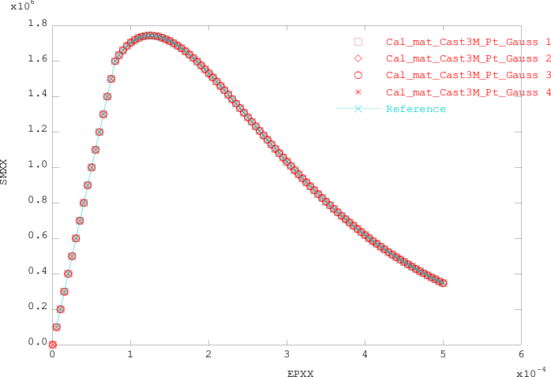
   
   Contrainte aux points de Gauss en fonction de la déformation moyenne.

L'écart relatif maximum en contrainte entre la solution calculée et la solution de référence est :

.. math::
   3,18393.10^{-15} < 1.10^{-10}
   
En conséquence, les résultats du cas-test ``01_traction.dgibi`` en mode 3D poutre à fibres sont jugés satisfaisants.

Courbe d'évolution de la force de réaction en fonction du déplacement imposé
""""""""""""""""""""""""""""""""""""""""""""""""""""""""""""""""""""""""""""

.. figure:: figures/mazars_trac_mono_f_3dpaf.png
   :width: 15cm
   :align: center
   
   Force de réaction en fonction du déplacement imposé.

Résultats du cas 2D poutre à fibres
+++++++++++++++++++++++++++++++++++

Solution de référence
"""""""""""""""""""""
Dans la mesure où le tenseur des déformations est défini en 3D dans le modèle Mazars pour la poutre à fibres, son expression dans le cas 2D est la même que dans le cas 3D :

.. math::

   \boldsymbol{\epsilon} = 
      \begin{bmatrix}
         \epsilon_{xx} & \epsilon_{xy} & \epsilon_{xz} \\
         \epsilon_{xy} & -\nu\epsilon_{xx} & 0 \\
         \epsilon_{xz} & 0 & -\nu\epsilon_{xx}
      \end{bmatrix}

Or, la traction est uniaxiale dans la direction :math:`x`, donc :math:`\epsilon_{xy}=\epsilon_{xz}=0`, d'où :

.. math::

   \boldsymbol{\epsilon} = 
      \begin{bmatrix}
         \epsilon_{xx} & 0 & 0 \\
         0 & -\nu\epsilon_{xx} & 0 \\
         0 & 0 & -\nu\epsilon_{xx}
      \end{bmatrix}

Sachant que :math:`\epsilon_{xx}>0` (traction), on a :

- :math:`\langle\epsilon_{xx}\rangle=\epsilon_{xx}`
- :math:`\epsilon_{yy}=\epsilon_{zz}=-\nu\epsilon_{xx}<0`, donc :math:`\langle\epsilon_{yy}\rangle=\langle\epsilon_{zz}\rangle=0`

La déformation équivalente s'exprime donc par :

.. math::
   {e} = \sqrt{\langle\epsilon_{xx}\rangle^{2}+\langle\epsilon_{yy}\rangle^{2}+\langle\epsilon_{zz}\rangle^{2}}=\epsilon_{xx}

On en déduit la solution de référence de l'endommagement :

.. math::
   D_t = 1 - \frac{e_0 (1 - A_t)}{\epsilon_{xx}} - A_t\exp\left[-B_t (\epsilon_{xx} - e_0)\right]

Puis la solution de référence de la contrainte dans la direction de la poutre :

.. math::
   \sigma_{xx}=(1-D_t) E \epsilon_{xx}

Dans Cast3M, 

- :math:`\epsilon_{xx}` correspond à la composante ``'VISXX'``, rebaptisée ci-dessous ``'EPXX'``, du sous-champs ``'VAIS'`` du champs des variables internes ``TAB1.'VARIABLES_INTERNES'`` en sortie de ``PASAPAS``.

- :math:`\sigma_{xx}` correspond à la composante ``'SMXX'`` du sous-champs ``'VONS'`` du champs des variables internes ``TAB1.'VARIABLES_INTERNES'`` en sortie de ``PASAPAS``.

Courbe d'évolution de l'endommagement
"""""""""""""""""""""""""""""""""""""

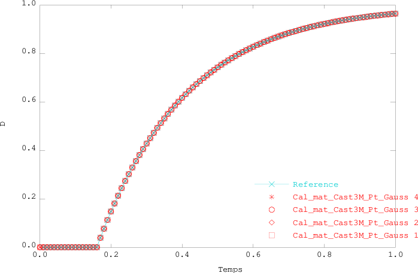
   
   Endommagement aux points de Gauss en fonction du temps.

Courbe d'évolution de la contrainte en fonction de la déformation
"""""""""""""""""""""""""""""""""""""""""""""""""""""""""""""""""

.. figure:: figures/mazars_trac_mono_s_2dpaf.png
   :width: 15cm
   :align: center
   
   Contrainte aux points de Gauss en fonction de la déformation moyenne.

L'écart relatif maximum en contrainte entre la solution calculée et la solution de référence est :

.. math::
   3,18393.10^{-15} < 1.10^{-10}
   
En conséquence, les résultats du cas-test ``01_traction.dgibi`` en mode 2D poutre à fibres sont jugés satisfaisants.

Courbe d'évolution de la force de réaction en fonction du déplacement imposé
""""""""""""""""""""""""""""""""""""""""""""""""""""""""""""""""""""""""""""

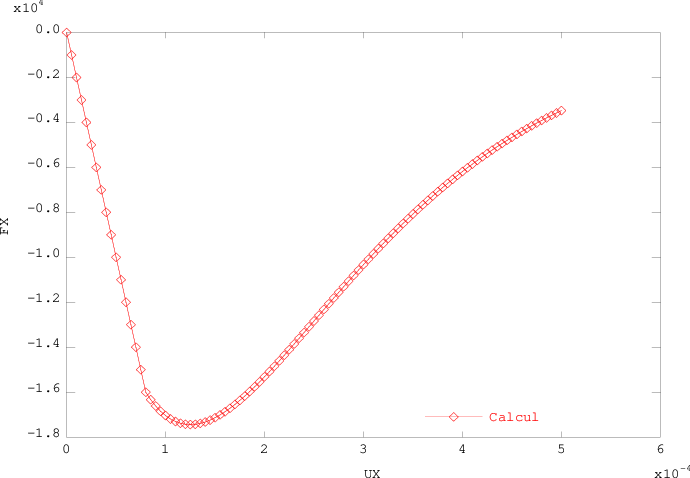
   
   Force de réaction en fonction du déplacement imposé.

Résultats du cas 3D volumique
+++++++++++++++++++++++++++++

Solution de référence
"""""""""""""""""""""
La traction est uniaxiale dans la direction :math:`x`, d'où l'expression du tenseur des déformations :

.. math::

   \boldsymbol{\epsilon} = 
      \begin{bmatrix}
         \epsilon_{xx} & 0 & 0 \\
         0 & -\nu\epsilon_{xx} & 0 \\
         0 & 0 & -\nu\epsilon_{xx}
      \end{bmatrix}

Sachant que :math:`\epsilon_{xx}>0` (traction), on a :

- :math:`\langle\epsilon_{xx}\rangle=\epsilon_{xx}`
- :math:`\epsilon_{yy}=\epsilon_{zz}=-\nu\epsilon_{xx}<0`, donc :math:`\langle\epsilon_{yy}\rangle=\langle\epsilon_{zz}\rangle=0`

La déformation équivalente s'exprime donc par :

.. math::
   {e} = \sqrt{\langle\epsilon_{xx}\rangle^{2}+\langle\epsilon_{yy}\rangle^{2}+\langle\epsilon_{zz}\rangle^{2}}=\epsilon_{xx}

On en déduit la solution de référence de l'endommagement :

.. math::
   D_t = 1 - \frac{e_0 (1 - A_t)}{\epsilon_{xx}} - A_t\exp\left[-B_t (\epsilon_{xx} - e_0)\right]

Puis la solution de référence de la contrainte dans la direction :math:`x` :

.. math::
   \sigma_{xx}=(1-D_t) E \epsilon_{xx}

Dans Cast3M, 

- :math:`\epsilon_{xx}` correspond à la composante ``'EPXX'`` du tenseur des déformations ``TAB.'DEFORMATIONS'`` en sortie de ``PASAPAS``.

- :math:`\sigma_{xx}` correspond à la composante ``'SMXX'`` du tenseur des contraintes ``TAB1.'CONTRAINTES'`` en sortie de ``PASAPAS``.

Courbe d'évolution de l'endommagement
"""""""""""""""""""""""""""""""""""""

.. figure:: figures/mazars_trac_mono_d_3d.png
   :width: 15cm
   :align: center
   
   Endommagement moyen en fonction du temps.

Courbe d'évolution de la contrainte en fonction de la déformation
"""""""""""""""""""""""""""""""""""""""""""""""""""""""""""""""""

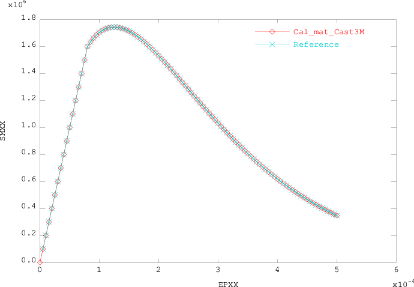
   
   Contrainte moyenne en fonction de la déformation moyenne.

L'écart relatif maximum en contrainte entre la solution calculée et la solution de référence est :

.. math::
   5,57047.10^{-15} < 1.10^{-10}
   
En conséquence, les résultats du cas-test ``01_traction.dgibi`` en mode 3D volumique sont jugés satisfaisants.

Courbe d'évolution de la force de réaction en fonction du déplacement imposé
""""""""""""""""""""""""""""""""""""""""""""""""""""""""""""""""""""""""""""

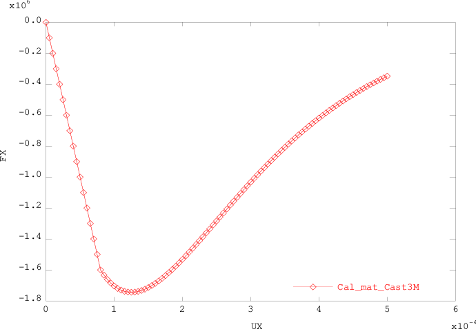
   
   Force de réaction en fonction du déplacement imposé.

Résultats du cas 2D contraintes planes
++++++++++++++++++++++++++++++++++++++

Solution de référence
"""""""""""""""""""""
La traction est uniaxiale dans la direction :math:`x` et, en contraintes planes, la déformation est libre dans la direction :math:`z` orthogonale au plan de représentation géométrique 2D (contration par effet de Poisson), d'où l'expression du tenseur des déformations :

.. math::

   \boldsymbol{\epsilon} = 
      \begin{bmatrix}
         \epsilon_{xx} & 0 & 0 \\
         0 & -\nu\epsilon_{xx} & 0 \\
         0 & 0 & -\nu\epsilon_{xx}
      \end{bmatrix}

Sachant que :math:`\epsilon_{xx}>0` (traction), on a :

- :math:`\langle\epsilon_{xx}\rangle=\epsilon_{xx}`
- :math:`\epsilon_{yy}=\epsilon_{zz}=-\nu\epsilon_{xx}<0`, donc :math:`\langle\epsilon_{yy}\rangle=\langle\epsilon_{zz}\rangle=0`

La déformation équivalente s'exprime donc par :

.. math::
   {e} = \sqrt{\langle\epsilon_{xx}\rangle^{2}+\langle\epsilon_{yy}\rangle^{2}+\langle\epsilon_{zz}\rangle^{2}}=\epsilon_{xx}

On en déduit la solution de référence de l'endommagement :

.. math::
   D_t = 1 - \frac{e_0 (1 - A_t)}{\epsilon_{xx}} - A_t\exp\left[-B_t (\epsilon_{xx} - e_0)\right]

Puis la solution de référence de la contrainte dans la direction :math:`x` :

.. math::
   \sigma_{xx}=(1-D_t) E \epsilon_{xx}

Dans Cast3M, 

- :math:`\epsilon_{xx}` correspond à la composante ``'EPXX'`` du tenseur des déformations ``TAB.'DEFORMATIONS'`` en sortie de ``PASAPAS``.

- :math:`\sigma_{xx}` correspond à la composante ``'SMXX'`` du tenseur des contraintes ``TAB1.'CONTRAINTES'`` en sortie de ``PASAPAS``.

Courbe d'évolution de l'endommagement
"""""""""""""""""""""""""""""""""""""

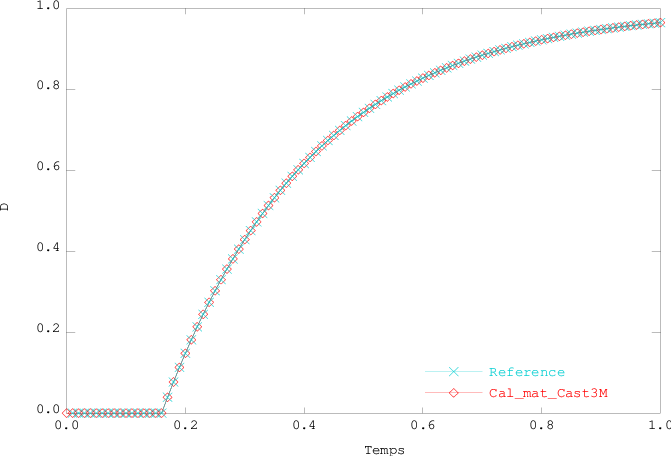
   
   Endommagement moyen en fonction du temps.

Courbe d'évolution de la contrainte en fonction de la déformation
"""""""""""""""""""""""""""""""""""""""""""""""""""""""""""""""""

.. figure:: figures/mazars_trac_mono_s_2dplan.png
   :width: 15cm
   :align: center
   
   Contrainte moyenne en fonction de la déformation moyenne.

L'écart relatif maximum en contrainte entre la solution calculée et la solution de référence est :

.. math::
   5,74126.10^{-15} < 1.10^{-10}
   
En conséquence, les résultats du cas-test ``01_traction.dgibi`` en mode 2D contraintes planes sont jugés satisfaisants.

Courbe d'évolution de la force de réaction en fonction du déplacement imposé
""""""""""""""""""""""""""""""""""""""""""""""""""""""""""""""""""""""""""""

   
   Force de réaction en fonction du déplacement imposé.

Résultats du cas 2D axisymétrique
+++++++++++++++++++++++++++++++++

Solution de référence
"""""""""""""""""""""
La traction est uniaxiale dans la direction :math:`z`, d'où l'expression du tenseur des déformations :

.. math::

   \boldsymbol{\epsilon} = 
      \begin{bmatrix}
         -\nu\epsilon_{zz} & 0 & 0 \\
         0 & -\nu\epsilon_{zz} & 0 \\
         0 & 0 & \epsilon_{zz}
      \end{bmatrix}

Sachant que :math:`\epsilon_{zz}>0` (traction), on a :

- :math:`\epsilon_{rr}=\epsilon_{\theta\theta}=-\nu\epsilon_{zz}<0`, donc :math:`\langle\epsilon_{rr}\rangle=\langle\epsilon_{\theta\theta}\rangle=0`
- :math:`\langle\epsilon_{zz}\rangle=\epsilon_{zz}`

La déformation équivalente s'exprime donc par :

.. math::
   {e} = \sqrt{\langle\epsilon_{rr}\rangle^{2}+\langle\epsilon_{\theta\theta}\rangle^{2}+\langle\epsilon_{zz}\rangle^{2}}=\epsilon_{zz}

On en déduit la solution de référence de l'endommagement :

.. math::
   D_t = 1 - \frac{e_0 (1 - A_t)}{\epsilon_{zz}} - A_t\exp\left[-B_t (\epsilon_{zz} - e_0)\right]

Puis la solution de référence de la contrainte dans la direction :math:`z` :

.. math::
   \sigma_{zz}=(1-D_t) E \epsilon_{zz}

Dans Cast3M, 

- :math:`\epsilon_{zz}` correspond à la composante ``'EPZZ'`` du tenseur des déformations ``TAB.'DEFORMATIONS'`` en sortie de ``PASAPAS``.

- :math:`\sigma_{zz}` correspond à la composante ``'SMZZ'`` du tenseur des contraintes ``TAB1.'CONTRAINTES'`` en sortie de ``PASAPAS``.

Courbe d'évolution de l'endommagement
"""""""""""""""""""""""""""""""""""""

.. figure:: figures/mazars_trac_mono_d_2daxi.png
   :width: 15cm
   :align: center
   
   Endommagement moyen en fonction du temps.

Courbe d'évolution de la contrainte en fonction de la déformation
"""""""""""""""""""""""""""""""""""""""""""""""""""""""""""""""""

   
   Contrainte moyenne en fonction de la déformation moyenne.

L'écart relatif maximum en contrainte entre la solution calculée et la solution de référence est :

.. math::
   5,61645.10^{-15} < 1.10^{-10}
   
En conséquence, les résultats du cas-test ``01_traction.dgibi`` en mode 2D axisymétrique sont jugés satisfaisants.

Courbe d'évolution de la force de réaction en fonction du déplacement imposé
""""""""""""""""""""""""""""""""""""""""""""""""""""""""""""""""""""""""""""

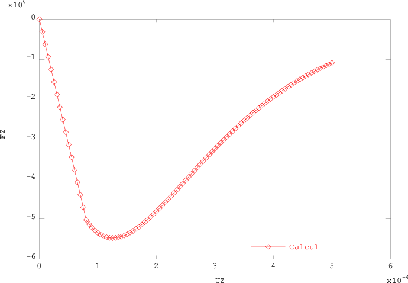
   
   Force de réaction en fonction du déplacement imposé.

.. _sec:mazars_ana_comp:

Compression monotone
~~~~~~~~~~~~~~~~~~~~
Le cas-test se dénomme ``02_compression.dgibi``

On applique le cas de chargement de compression simple pour les modélisations :ref:`poutre <sec:modeles_beton_test_pout_comp_mono>` et :ref:`massif <sec:modeles_beton_test_mass_comp_mono>` en déplacement imposé négatif, croissant en valeur absolue, jusqu’à atteindre l’endommagement autour de 0,9.

Pour tous les modes de calcul le déplacement imposé vaut :math:`u_{max}=-5.10^{-3}` m.

L’objectif est d’évaluer la limite en compression puis le comportement post-pic du modèle.

L'analyse des résultats porte sur les courbes :

- d'endomagemment soit en chaque point de Gauss de la section de la poutre pour les modèles poutre à fibres, soit moyen pour les modèles massifs, en fonction du temps ;
- de la contrainte soit en chaque point de Gauss de la section de la poutre pour les modèles poutre à fibres, soit moyenne pour les modèles massifs, en fonction de la déformation moyenne ;
- de la force de réaction globale en fonction du déplacement imposé.

Solution de référence
+++++++++++++++++++++
La solution de référence est obtenue de manière analytique à partir de l'équation donnant la loi de l'évolution de l'endommagement en compression.

Endommagement
"""""""""""""

.. math::
   D_c = 1 - \frac{e_0 (1 - A_c)}{e} - A_c\exp\left[-B_c (e - e_0)\right]
   
où :

- :math:`A_c` et :math:`B_c` sont les paramètres de la loi de Mazars en compression ;
- :math:`e_0` est le seuil d'endommagement en déformation ;
- :math:`e` est la déformation équivalente selon la formulation proposée par Mazars :

.. math::
   {e} = \sqrt{\sum_{i=1}^{^{n}}\langle\epsilon_{i}\rangle^{2}}
   
où :math:`\langle\epsilon_{i}\rangle` est la partie positive de la i-ème déformation principale et :math:`n` répresente la dimension du problème consideré (cf. chapitre :ref:`mazars`).
   
L'expression de la déformation équivalente :math:`e` dépend du mode de représentation géométrique (choix de modélisation E.F. et dimension spatiale) et doit donc être spécifiée dans chaque cas.

Contrainte
""""""""""
Pour un problème en déplacement imposé (i.e. en déformation imposée dans la cas présent unitaire géométrique), l'expression de la contrainte se déduit de la relation contrainte-déformation et de l'expression de l'endommagement :

.. math::

   \boldsymbol{\sigma} = (1-D_{t}) \mathbb{E} : \boldsymbol{\varepsilon}

Résultats du cas 3D poutre à fibres
+++++++++++++++++++++++++++++++++++

Solution de référence
"""""""""""""""""""""
Dans la source fibmaz.eso décrivant le modèle Mazars pour la poutre à fibres, quelque soit la dimension géométrique du problème, le tenseur des déformations est défini en 3D de la façon suivante :

.. math::

   \boldsymbol{\epsilon} = 
      \begin{bmatrix}
         \epsilon_{xx} & \epsilon_{xy} & \epsilon_{xz} \\
         \epsilon_{xy} & -\nu\epsilon_{xx} & 0 \\
         \epsilon_{xz} & 0 & -\nu\epsilon_{xx}
      \end{bmatrix}

Or, la compression est uniaxiale dans la direction :math:`x`, donc :math:`\epsilon_{xy}=\epsilon_{xz}=0`, d'où :

.. math::

   \boldsymbol{\epsilon} = 
      \begin{bmatrix}
         \epsilon_{xx} & 0 & 0 \\
         0 & -\nu\epsilon_{xx} & 0 \\
         0 & 0 & -\nu\epsilon_{xx}
      \end{bmatrix}

Sachant que :math:`\epsilon_{xx}<0` (compression), on a :

- :math:`\langle\epsilon_{xx}\rangle=0`
- :math:`\epsilon_{yy}=\epsilon_{zz}=-\nu\epsilon_{xx}>0`, donc :math:`\langle\epsilon_{yy}\rangle=\langle\epsilon_{zz}\rangle=-\nu\epsilon_{xx}`

La déformation équivalente s'exprime donc par :

.. math::
   {e} = \sqrt{\langle\epsilon_{xx}\rangle^{2}+\langle\epsilon_{yy}\rangle^{2}+\langle\epsilon_{zz}\rangle^{2}}=\sqrt{2}\nu|\epsilon_{xx}|

On en déduit la solution de référence de l'endommagement :

.. math::
   D_c = 1 - \frac{e_0 (1 - A_c)}{\sqrt{2}\nu|\epsilon_{xx}|} - A_c\exp\left[-B_c (\sqrt{2}\nu|\epsilon_{xx}| - e_0)\right]

Puis la solution de référence de la contrainte dans la direction de la poutre :

.. math::
   \sigma_{xx}=(1-D_c) E \epsilon_{xx}

Dans Cast3M, 

- :math:`\epsilon_{xx}` correspond à la composante ``'VISXX'``, rebaptisée ci-dessous ``'EPXX'``, du sous-champs ``'VAIS'`` du champs des variables internes ``TAB1.'VARIABLES_INTERNES'`` en sortie de ``PASAPAS``.

- :math:`\sigma_{xx}` correspond à la composante ``'SMXX'`` du sous-champs ``'VONS'`` du champs des variables internes ``TAB1.'VARIABLES_INTERNES'`` en sortie de ``PASAPAS``.

Courbe d'évolution de l'endommagement
"""""""""""""""""""""""""""""""""""""

.. figure:: figures/mazars_comp_mono_d_3dpaf.png
   :width: 15cm
   :align: center
   
   Endommagement aux points de Gauss en fonction du temps.

Courbe d'évolution de la contrainte en fonction de la déformation
"""""""""""""""""""""""""""""""""""""""""""""""""""""""""""""""""

.. figure:: figures/mazars_comp_mono_s_3dpaf.png
   :width: 15cm
   :align: center
   
   Contrainte aux points de Gauss en fonction de la déformation moyenne.

L'écart relatif maximum en contrainte entre la solution calculée et la solution de référence est :

.. math::
   8,35516.10^{-09} > 1.10^{-10}
   
En conséquence, les résultats du cas-test ``02_compression.dgibi`` en mode 3D poutre à fibres sont jugés *[nh145313 : non satisfaisants ?]*.

Courbe d'évolution de la force de réaction en fonction du déplacement imposé
""""""""""""""""""""""""""""""""""""""""""""""""""""""""""""""""""""""""""""

.. figure:: figures/mazars_comp_mono_f_3dpaf.png
   :width: 15cm
   :align: center
   
   Force de réaction en fonction du déplacement imposé.

Résultats du cas 2D poutre à fibres
+++++++++++++++++++++++++++++++++++

Solution de référence
"""""""""""""""""""""
Dans la mesure où le tenseur des déformations est défini en 3D dans le modèle Mazars pour la poutre à fibres, son expression dans le cas 2D est la même que dans le cas 3D :

.. math::

   \boldsymbol{\epsilon} = 
      \begin{bmatrix}
         \epsilon_{xx} & \epsilon_{xy} & \epsilon_{xz} \\
         \epsilon_{xy} & -\nu\epsilon_{xx} & 0 \\
         \epsilon_{xz} & 0 & -\nu\epsilon_{xx}
      \end{bmatrix}

Or, la compression est uniaxiale dans la direction :math:`x`, donc :math:`\epsilon_{xy}=\epsilon_{xz}=0`, d'où :

.. math::

   \boldsymbol{\epsilon} = 
      \begin{bmatrix}
         \epsilon_{xx} & 0 & 0 \\
         0 & -\nu\epsilon_{xx} & 0 \\
         0 & 0 & -\nu\epsilon_{xx}
      \end{bmatrix}

Sachant que :math:`\epsilon_{xx}<0` (compression), on a :

- :math:`\langle\epsilon_{xx}\rangle=0`
- :math:`\epsilon_{yy}=\epsilon_{zz}=-\nu\epsilon_{xx}>0`, donc :math:`\langle\epsilon_{yy}\rangle=\langle\epsilon_{zz}\rangle=-\nu\epsilon_{xx}`

La déformation équivalente s'exprime donc par :

.. math::
   {e} = \sqrt{\langle\epsilon_{xx}\rangle^{2}+\langle\epsilon_{yy}\rangle^{2}+\langle\epsilon_{zz}\rangle^{2}}=\sqrt{2}\nu|\epsilon_{xx}|

On en déduit la solution de référence de l'endommagement :

.. math::
   D_c = 1 - \frac{e_0 (1 - A_c)}{\sqrt{2}\nu|\epsilon_{xx}|} - A_c\exp\left[-B_c (\sqrt{2}\nu|\epsilon_{xx}| - e_0)\right]

Puis la solution de référence de la contrainte dans la direction de la poutre :

.. math::
   \sigma_{xx}=(1-D_c) E \epsilon_{xx}

Dans Cast3M, 

- :math:`\epsilon_{xx}` correspond à la composante ``'VISXX'``, rebaptisée ci-dessous ``'EPXX'``, du sous-champs ``'VAIS'`` du champs des variables internes ``TAB1.'VARIABLES_INTERNES'`` en sortie de ``PASAPAS``.

- :math:`\sigma_{xx}` correspond à la composante ``'SMXX'`` du sous-champs ``'VONS'`` du champs des variables internes ``TAB1.'VARIABLES_INTERNES'`` en sortie de ``PASAPAS``.

Courbe d'évolution de l'endommagement
"""""""""""""""""""""""""""""""""""""

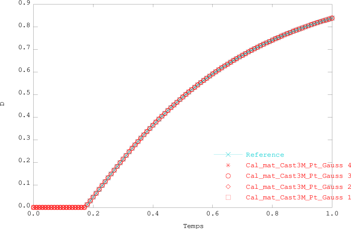
   
   Endommagement aux points de Gauss en fonction du temps.

Courbe d'évolution de la contrainte en fonction de la déformation
"""""""""""""""""""""""""""""""""""""""""""""""""""""""""""""""""

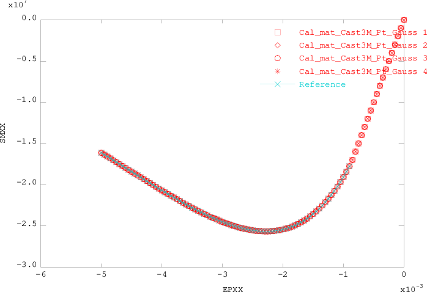
   
   Contrainte aux points de Gauss en fonction de la déformation moyenne.

L'écart relatif maximum en contrainte entre la solution calculée et la solution de référence est :

.. math::
   8,35516.10^{-09} > 1.10^{-10}
   
En conséquence, les résultats du cas-test ``02_compression.dgibi`` en mode 2D poutre à fibres sont jugés *[nh145313 : non satisfaisants ?]*.

Courbe d'évolution de la force de réaction en fonction du déplacement imposé
""""""""""""""""""""""""""""""""""""""""""""""""""""""""""""""""""""""""""""

   
   Force de réaction en fonction du déplacement imposé.

Résultats du cas 3D volumique
+++++++++++++++++++++++++++++

Solution de référence
"""""""""""""""""""""
La compression est uniaxiale dans la direction :math:`x`, d'où l'expression du tenseur des déformations :

.. math::

   \boldsymbol{\epsilon} = 
      \begin{bmatrix}
         \epsilon_{xx} & 0 & 0 \\
         0 & -\nu\epsilon_{xx} & 0 \\
         0 & 0 & -\nu\epsilon_{xx}
      \end{bmatrix}

Sachant que :math:`\epsilon_{xx}<0` (compression), on a :

- :math:`\langle\epsilon_{xx}\rangle=0`
- :math:`\epsilon_{yy}=\epsilon_{zz}=-\nu\epsilon_{xx}>0`, donc :math:`\langle\epsilon_{yy}\rangle=\langle\epsilon_{zz}\rangle=-\nu\epsilon_{xx}`

La déformation équivalente s'exprime donc par :

.. math::
   {e} = \sqrt{\langle\epsilon_{xx}\rangle^{2}+\langle\epsilon_{yy}\rangle^{2}+\langle\epsilon_{zz}\rangle^{2}}=\sqrt{2}\nu|\epsilon_{xx}|

On en déduit la solution de référence de l'endommagement :

.. math::
   D_c = 1 - \frac{e_0 (1 - A_c)}{\sqrt{2}\nu|\epsilon_{xx}|} - A_c\exp\left[-B_c (\sqrt{2}\nu|\epsilon_{xx}| - e_0)\right]

Puis la solution de référence de la contrainte dans la direction :math:`x` :

.. math::
   \sigma_{xx}=(1-D_t) E \epsilon_{xx}

Dans Cast3M, 

- :math:`\epsilon_{xx}` correspond à la composante ``'EPXX'`` du tenseur des déformations ``TAB.'DEFORMATIONS'`` en sortie de ``PASAPAS``.

- :math:`\sigma_{xx}` correspond à la composante ``'SMXX'`` du tenseur des contraintes ``TAB1.'CONTRAINTES'`` en sortie de ``PASAPAS``.

Courbe d'évolution de l'endommagement
"""""""""""""""""""""""""""""""""""""

.. figure:: figures/mazars_comp_mono_d_3d.png
   :width: 15cm
   :align: center
   
   Endommagement moyen en fonction du temps.

Courbe d'évolution de la contrainte en fonction de la déformation
"""""""""""""""""""""""""""""""""""""""""""""""""""""""""""""""""

   
   Contrainte moyenne en fonction de la déformation moyenne.

L'écart relatif maximum en contrainte entre la solution calculée et la solution de référence est :

.. math::
   9,13189.10^{-09} > 1.10^{-10}
   
En conséquence, les résultats du cas-test ``02_compression.dgibi`` en mode 3D volumique sont jugés *[nh145313 : non satisfaisants ?]*.

Courbe d'évolution de la force de réaction en fonction du déplacement imposé
""""""""""""""""""""""""""""""""""""""""""""""""""""""""""""""""""""""""""""

   
   Force de réaction en fonction du déplacement imposé.

Résultats du cas 2D contraintes planes
++++++++++++++++++++++++++++++++++++++

Solution de référence
"""""""""""""""""""""
La compression est uniaxiale dans la direction :math:`x` et, en contraintes planes, la déformation est libre dans la direction :math:`z` orthogonale au plan de représentation géométrique 2D (expansion par effet de Poisson), d'où l'expression du tenseur des déformations :

.. math::

   \boldsymbol{\epsilon} = 
      \begin{bmatrix}
         \epsilon_{xx} & 0 & 0 \\
         0 & -\nu\epsilon_{xx} & 0 \\
         0 & 0 & -\nu\epsilon_{xx}
      \end{bmatrix}

Sachant que :math:`\epsilon_{xx}<0` (compression), on a :

- :math:`\langle\epsilon_{xx}\rangle=0`
- :math:`\epsilon_{yy}=\epsilon_{zz}=-\nu\epsilon_{xx}>0`, donc :math:`\langle\epsilon_{yy}\rangle=\langle\epsilon_{zz}\rangle=-\nu\epsilon_{xx}`

La déformation équivalente s'exprime donc par :

.. math::
   {e} = \sqrt{\langle\epsilon_{xx}\rangle^{2}+\langle\epsilon_{yy}\rangle^{2}+\langle\epsilon_{zz}\rangle^{2}}=\sqrt{2}\nu|\epsilon_{xx}|

On en déduit la solution de référence de l'endommagement :

.. math::
   D_c = 1 - \frac{e_0 (1 - A_c)}{\sqrt{2}\nu|\epsilon_{xx}|} - A_c\exp\left[-B_c (\sqrt{2}\nu|\epsilon_{xx}| - e_0)\right]

Puis la solution de référence de la contrainte dans la direction :math:`x` :

.. math::
   \sigma_{xx}=(1-D_c) E \epsilon_{xx}

Dans Cast3M, 

- :math:`\epsilon_{xx}` correspond à la composante ``'EPXX'`` du tenseur des déformations ``TAB.'DEFORMATIONS'`` en sortie de ``PASAPAS``.

- :math:`\sigma_{xx}` correspond à la composante ``'SMXX'`` du tenseur des contraintes ``TAB1.'CONTRAINTES'`` en sortie de ``PASAPAS``.

Courbe d'évolution de l'endommagement
"""""""""""""""""""""""""""""""""""""

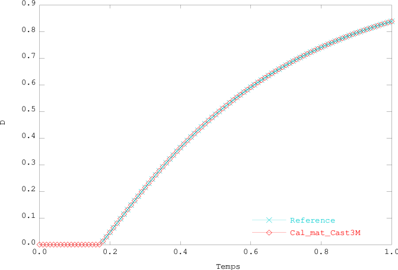
   
   Endommagement moyen en fonction du temps.

Courbe d'évolution de la contrainte en fonction de la déformation
"""""""""""""""""""""""""""""""""""""""""""""""""""""""""""""""""

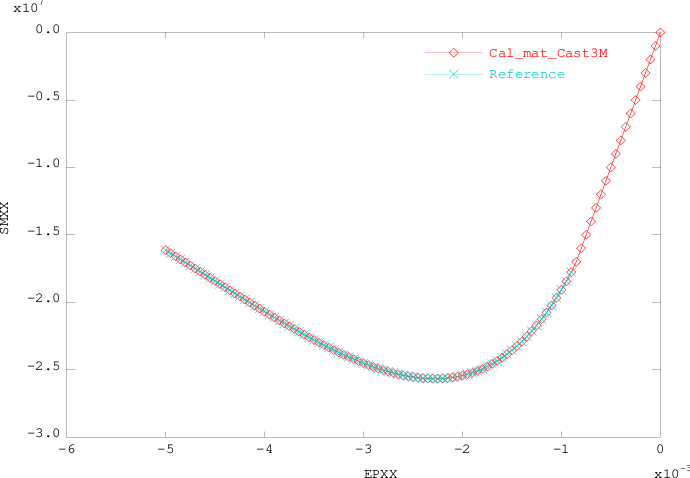
   
   Contrainte moyenne en fonction de la déformation moyenne.

L'écart relatif maximum en contrainte entre la solution calculée et la solution de référence est :

.. math::
   1,26037.10^{-15} < 1.10^{-10}
   
En conséquence, les résultats du cas-test ``02_compression.dgibi`` en mode 2D contraintes planes sont jugés satisfaisants.

Courbe d'évolution de la force de réaction en fonction du déplacement imposé
""""""""""""""""""""""""""""""""""""""""""""""""""""""""""""""""""""""""""""

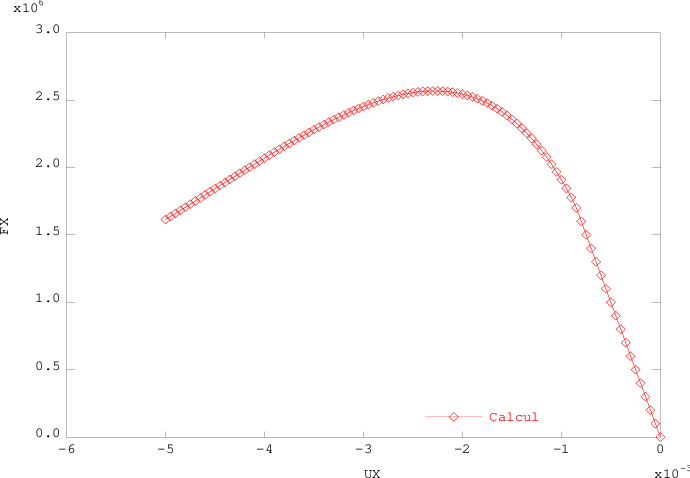
   
   Force de réaction en fonction du déplacement imposé.

Résultats du cas 2D axisymétrique
+++++++++++++++++++++++++++++++++

Solution de référence
"""""""""""""""""""""
La compression est uniaxiale dans la direction :math:`z`, d'où l'expression du tenseur des déformations :

.. math::

   \boldsymbol{\epsilon} = 
      \begin{bmatrix}
         -\nu\epsilon_{zz} & 0 & 0 \\
         0 & -\nu\epsilon_{zz} & 0 \\
         0 & 0 & \epsilon_{zz}
      \end{bmatrix}

Sachant que :math:`\epsilon_{zz}<0` (compression), on a :

- :math:`\epsilon_{rr}=\epsilon_{\theta\theta}=-\nu\epsilon_{zz}>0`, donc :math:`\langle\epsilon_{rr}\rangle=\langle\epsilon_{\theta\theta}\rangle=-\nu\epsilon_{zz}`
- :math:`\langle\epsilon_{zz}\rangle=0`

La déformation équivalente s'exprime donc par :

.. math::
   {e} = \sqrt{\langle\epsilon_{rr}\rangle^{2}+\langle\epsilon_{\theta\theta}\rangle^{2}+\langle\epsilon_{zz}\rangle^{2}}=\sqrt{2}\nu|\epsilon_{zz}|

On en déduit la solution de référence de l'endommagement :

.. math::
   D_c = 1 - \frac{e_0 (1 - A_c)}{\sqrt{2}\nu|\epsilon_{zz}|} - A_c\exp\left[-B_c (\sqrt{2}\nu|\epsilon_{zz}| - e_0)\right]

Puis la solution de référence de la contrainte dans la direction :math:`z` :

.. math::
   \sigma_{zz}=(1-D_c) E \epsilon_{zz}

Dans Cast3M, 

- :math:`\epsilon_{zz}` correspond à la composante ``'EPZZ'`` du tenseur des déformations ``TAB.'DEFORMATIONS'`` en sortie de ``PASAPAS``.

- :math:`\sigma_{zz}` correspond à la composante ``'SMZZ'`` du tenseur des contraintes ``TAB1.'CONTRAINTES'`` en sortie de ``PASAPAS``.

Courbe d'évolution de l'endommagement
"""""""""""""""""""""""""""""""""""""

.. figure:: figures/mazars_comp_mono_d_2daxi.png
   :width: 15cm
   :align: center
   
   Endommagement moyen en fonction du temps.

Courbe d'évolution de la contrainte en fonction de la déformation
"""""""""""""""""""""""""""""""""""""""""""""""""""""""""""""""""

   
   Contrainte moyenne en fonction de la déformation moyenne.

L'écart relatif maximum en contrainte entre la solution calculée et la solution de référence est :

.. math::
   1,15429.10^{-15} < 1.10^{-10}
   
En conséquence, les résultats du cas-test ``02_compression.dgibi`` en mode 2D axisymétrique sont jugés satisfaisants.

Courbe d'évolution de la force de réaction en fonction du déplacement imposé
""""""""""""""""""""""""""""""""""""""""""""""""""""""""""""""""""""""""""""

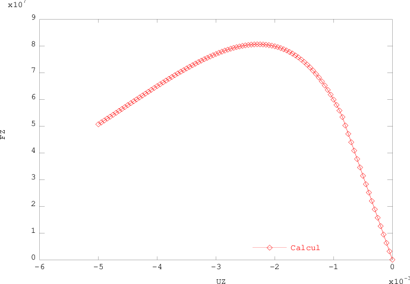
   
   Force de réaction en fonction du déplacement imposé.

Traction cyclique
~~~~~~~~~~~~~~~~~
Le cas-test se dénomme ``03_traction_cyclique.dgibi``

On applique le cas de chargement de traction simple pour les modélisations :ref:`poutre <sec:modeles_beton_test_pout_trac_cycl>`
et :ref:`massif <sec:modeles_beton_test_mass_trac_cycl>` en déplacement imposé entre 0 et un pic de façon cyclique avec retour à 0 entre chaque cycle. La valeur du déplacement au pic augmente progressivement jusqu’à atteindre l’endommagement autour de 0,9.

Pour tous les modes de calcul le déplacement imposé vaut :math:`u_{max}=5.10^{-4}` m.

On choisit l'incrément du déplacement au pic de chaque cycle de façon à ce que le seuil d'endommagement soit franchi à chaque fois. Le module élastique est alors multiplié par :math:`(1 - D_{e})`, où :math:`D_{e}` est l'endommagement élémentaire consécutif à chaque franchissement du seuil. Il en résulte une diminution du module élastique avec l'endommagement. Du fait de l'accroissement du déplacement au pic des cycles, l'endommagement s'accroit, ce qui conduit à une diminution du module élastique.

L’objectif est de vérifier la dégradation progressive des propriétés mécaniques du matériau au cours du chargement via la diminution du module élastique à chaque cycle.

L'analyse des résultats porte sur les courbes :

- d'endomagemment soit en chaque point de Gauss de la section de la poutre pour les modèles poutre à fibres, soit moyen pour les modèles massifs, en fonction du temps ;
- de la contrainte soit en chaque point de Gauss de la section de la poutre pour les modèles poutre à fibres, soit moyenne pour les modèles massifs, en fonction de la déformation moyenne ;
- de la force de réaction globale en fonction du déplacement imposé.

Pour chaque configuration géométrique, la solution de référence est identique à celle décrite dans le chapitre :ref:`Traction monotone <sec:mazars_ana_trac>`.

Résultats du cas 3D poutre à fibres
+++++++++++++++++++++++++++++++++++

Courbe d'évolution de l'endommagement
"""""""""""""""""""""""""""""""""""""

.. figure:: figures/mazars_trac_cycl_d_3dpaf.png
   :width: 15cm
   :align: center
   
   Endommagement aux points de Gauss en fonction du temps.

Courbe d'évolution de la contrainte en fonction de la déformation
"""""""""""""""""""""""""""""""""""""""""""""""""""""""""""""""""

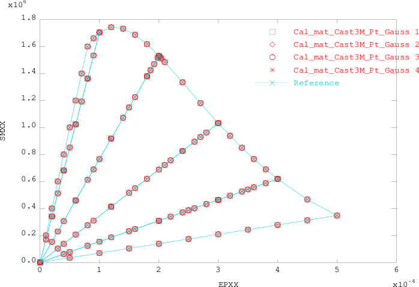
   
   Contrainte aux points de Gauss en fonction de la déformation moyenne.

On observe que :

- La solution calculée (parties linéaires rouges) reproduit correctement la diminution à chaque cycle du module élastique prévue par la solution de référence (parties linéaires bleues) ;
- L'écart relatif maximum en contrainte entre la solution calculée et la solution de référence est :

.. math::
   3,35150.10^{-15} < 1.10^{-10}
   
En conséquence, les résultats du cas-test ``03_traction_cyclique.dgibi`` en mode 3D poutre à fibres sont jugés satisfaisants.

Courbe d'évolution de la force de réaction en fonction du déplacement imposé
""""""""""""""""""""""""""""""""""""""""""""""""""""""""""""""""""""""""""""

.. figure:: figures/mazars_trac_cycl_f_3dpaf.png
   :width: 15cm
   :align: center
   
   Force de réaction en fonction du déplacement imposé.

Résultats du cas 2D poutre à fibres
+++++++++++++++++++++++++++++++++++

Courbe d'évolution de l'endommagement
"""""""""""""""""""""""""""""""""""""

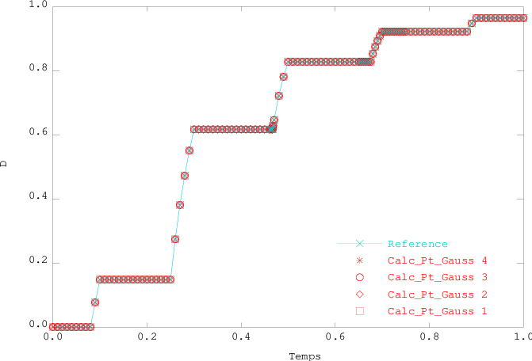
   
   Endommagement aux points de Gauss en fonction du temps.

Courbe d'évolution de la contrainte en fonction de la déformation
"""""""""""""""""""""""""""""""""""""""""""""""""""""""""""""""""

.. figure:: figures/mazars_trac_cycl_s_2dpaf.png
   :width: 15cm
   :align: center
   
   Contrainte aux points de Gauss en fonction de la déformation moyenne.

On observe que :

- La solution calculée (parties linéaires rouges) reproduit correctement la diminution à chaque cycle du module élastique prévue par la solution de référence (parties linéaires bleues) ;
- L'écart relatif maximum en contrainte entre la solution calculée et la solution de référence est :

.. math::
   3,35150.10^{-15} < 1.10^{-10}
   
En conséquence, les résultats du cas-test ``03_traction_cyclique.dgibi`` en mode 2D poutre à fibres sont jugés satisfaisants.

Courbe d'évolution de la force de réaction en fonction du déplacement imposé
""""""""""""""""""""""""""""""""""""""""""""""""""""""""""""""""""""""""""""

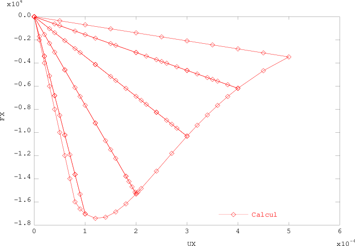
   
   Force de réaction en fonction du déplacement imposé.

Résultats du cas 3D volumique
+++++++++++++++++++++++++++++

Courbe d'évolution de l'endommagement
"""""""""""""""""""""""""""""""""""""

.. figure:: figures/mazars_trac_cycl_d_3d.png
   :width: 15cm
   :align: center
   
   Endommagement moyen en fonction du temps.

Courbe d'évolution de la contrainte en fonction de la déformation
"""""""""""""""""""""""""""""""""""""""""""""""""""""""""""""""""

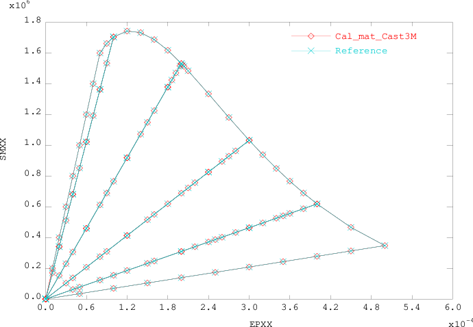
   
   Contrainte moyenne en fonction de la déformation moyenne.

On observe que :

- La solution calculée (parties linéaires rouges) reproduit correctement la diminution à chaque cycle du module élastique prévue par la solution de référence (parties linéaires bleues) ;
- L'écart relatif maximum en contrainte entre la solution calculée et la solution de référence est :

.. math::
   7,86303.10^{-15} < 1.10^{-10}
   
En conséquence, les résultats du cas-test ``03_traction_cyclique.dgibi`` en mode 3D volumique sont jugés satisfaisants.

Courbe d'évolution de la force de réaction en fonction du déplacement imposé
""""""""""""""""""""""""""""""""""""""""""""""""""""""""""""""""""""""""""""

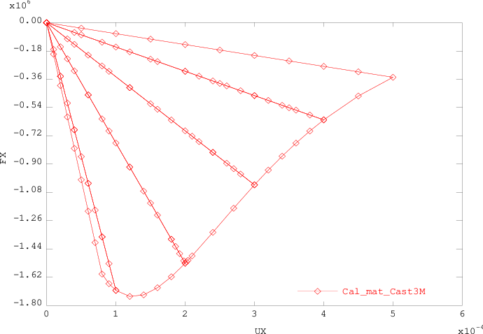
   
   Force de réaction en fonction du déplacement imposé.

Résultats du cas 2D contraintes planes
++++++++++++++++++++++++++++++++++++++

Courbe d'évolution de l'endommagement
"""""""""""""""""""""""""""""""""""""

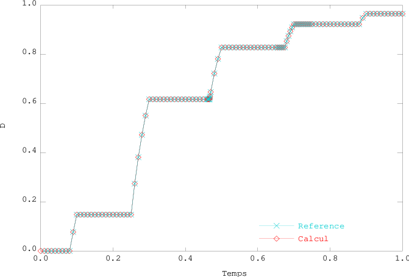
   
   Endommagement moyen en fonction du temps.

Courbe d'évolution de la contrainte en fonction de la déformation
"""""""""""""""""""""""""""""""""""""""""""""""""""""""""""""""""

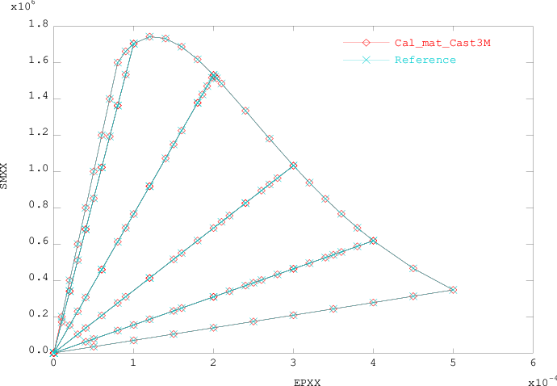
   
   Contrainte moyenne en fonction de la déformation moyenne.

On observe que :

- La solution calculée (parties linéaires rouges) reproduit correctement la diminution à chaque cycle du module élastique prévue par la solution de référence (parties linéaires bleues) ;
- L'écart relatif maximum en contrainte entre la solution calculée et la solution de référence est :

.. math::
   4,11873.10^{-15} < 1.10^{-10}
   
En conséquence, les résultats du cas-test ``03_traction_cyclique.dgibi`` en mode 2D contraintes planes sont jugés satisfaisants.

Courbe d'évolution de la force de réaction en fonction du déplacement imposé
""""""""""""""""""""""""""""""""""""""""""""""""""""""""""""""""""""""""""""

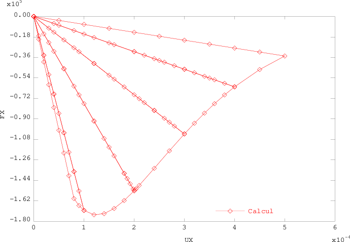
   
   Force de réaction en fonction du déplacement imposé.

Résultats du cas 2D axisymétrique
+++++++++++++++++++++++++++++++++

Courbe d'évolution de l'endommagement
"""""""""""""""""""""""""""""""""""""

.. figure:: figures/mazars_trac_cycl_d_2daxi.png
   :width: 15cm
   :align: center
   
   Endommagement moyen en fonction du temps.

Courbe d'évolution de la contrainte en fonction de la déformation
"""""""""""""""""""""""""""""""""""""""""""""""""""""""""""""""""

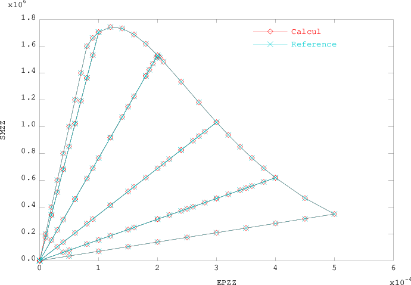
   
   Contrainte moyenne en fonction de la déformation moyenne.

On observe que :

- La solution calculée (parties linéaires rouges) reproduit correctement la diminution à chaque cycle du module élastique prévue par la solution de référence (parties linéaires bleues) ;
- L'écart relatif maximum en contrainte entre la solution calculée et la solution de référence est :

.. math::
   3,92767.10^{-15} < 1.10^{-10}
   
En conséquence, les résultats du cas-test ``03_traction_cyclique.dgibi`` en mode 2D axisymétrique sont jugés satisfaisants.

Courbe d'évolution de la force de réaction en fonction du déplacement imposé
""""""""""""""""""""""""""""""""""""""""""""""""""""""""""""""""""""""""""""

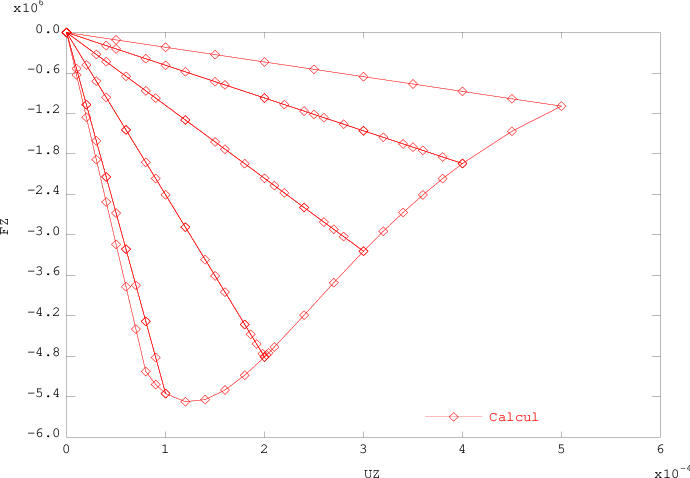
   
   Force de réaction en fonction du déplacement imposé.

Compression cyclique
~~~~~~~~~~~~~~~~~~~~
Le cas-test se dénomme ``04_compression_cyclique.dgibi``

On applique le cas de chargement de compression simple pour les modélisations :ref:`poutre <sec:modeles_beton_test_pout_comp_cycl>` et :ref:`massif <sec:modeles_beton_test_mass_comp_cycl>` en déplacement imposé négatif entre 0 et un pic de façon cyclique avec retour à 0 entre chaque cycle. La valeur absolue du déplacement au pic augmente progressivement jusqu’à atteindre l’endommagement autour de 0,9.

Pour tous les modes de calcul le déplacement imposé vaut :math:`u_{max}=-5.10^{-3}` m.

On choisit l'incrément du déplacement au pic de chaque cycle de façon à ce que le seuil d'endommagement soit franchi à chaque fois. Le module élastique est alors multiplié par :math:`(1 - D_{e})`, où :math:`D_{e}` est l'endommagement élémentaire consécutif à chaque franchissement du seuil. Il en résulte une diminution du module élastique avec l'endommagement. Du fait de l'accroissement de la valeur absolue du déplacement au pic des cycles, l'endommagement s'accroit, ce qui conduit à une diminution du module élastique.

L’objectif est de vérifier la dégradation progressive des propriétés mécaniques du matériau au cours du chargement via la diminution du module élastique à chaque cycle.

L'analyse des résultats porte sur les courbes :

- d'endomagemment soit en chaque point de Gauss de la section de la poutre pour les modèles poutre à fibres, soit moyen pour les modèles massifs, en fonction du temps ;
- de la contrainte soit en chaque point de Gauss de la section de la poutre pour les modèles poutre à fibres, soit moyenne pour les modèles massifs, en fonction de la déformation moyenne ;
- de la force de réaction globale en fonction du déplacement imposé.

Pour chaque configuration géométrique, la solution de référence est identique à celle décrite dans le chapitre :ref:`Compression monotone <sec:mazars_ana_comp>`.

Résultats du cas 3D poutre à fibres
+++++++++++++++++++++++++++++++++++

Courbe d'évolution de l'endommagement
"""""""""""""""""""""""""""""""""""""

.. figure:: figures/mazars_comp_cycl_d_3dpaf.png
   :width: 15cm
   :align: center
   
   Endommagement aux points de Gauss en fonction du temps.

Courbe d'évolution de la contrainte en fonction de la déformation
"""""""""""""""""""""""""""""""""""""""""""""""""""""""""""""""""

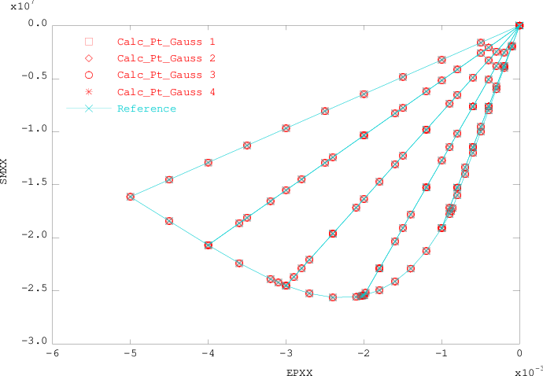
   
   Contrainte aux points de Gauss en fonction de la déformation moyenne.

On observe que :

- La solution calculée (parties linéaires rouges) reproduit correctement la diminution à chaque cycle du module élastique prévue par la solution de référence (parties linéaires bleues) ;
- L'écart relatif maximum en contrainte entre la solution calculée et la solution de référence est :

.. math::
   3,66400.10^{-9} > 1.10^{-10}
   
En conséquence, les résultats du cas-test ``04_compression_cyclique.dgibi`` en mode 3D poutre à fibres sont jugés *[nh145313 : non satisfaisants ?]*.

Courbe d'évolution de la force de réaction en fonction du déplacement imposé
""""""""""""""""""""""""""""""""""""""""""""""""""""""""""""""""""""""""""""

   
   Force de réaction en fonction du déplacement imposé.

Résultats du cas 2D poutre à fibres
+++++++++++++++++++++++++++++++++++

Courbe d'évolution de l'endommagement
"""""""""""""""""""""""""""""""""""""

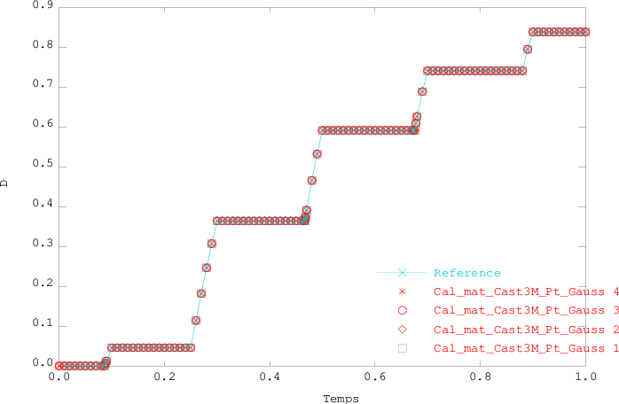
   
   Endommagement aux points de Gauss en fonction du temps.

Courbe d'évolution de la contrainte en fonction de la déformation
"""""""""""""""""""""""""""""""""""""""""""""""""""""""""""""""""

.. figure:: figures/mazars_comp_cycl_s_2dpaf.png
   :width: 15cm
   :align: center
   
   Contrainte aux points de Gauss en fonction de la déformation moyenne.

On observe que :

- La solution calculée (parties linéaires rouges) reproduit correctement la diminution à chaque cycle du module élastique prévue par la solution de référence (parties linéaires bleues) ;
- L'écart relatif maximum en contrainte entre la solution calculée et la solution de référence est :

.. math::
   3,66400.10^{-9} > 1.10^{-10}
   
En conséquence, les résultats du cas-test ``04_compression_cyclique.dgibi`` en mode 2D poutre à fibres sont jugés *[nh145313 : non satisfaisants ?]*.

Courbe d'évolution de la force de réaction en fonction du déplacement imposé
""""""""""""""""""""""""""""""""""""""""""""""""""""""""""""""""""""""""""""

.. figure:: figures/mazars_comp_cycl_f_2dpaf.png
   :width: 15cm
   :align: center
   
   Force de réaction en fonction du déplacement imposé.

Résultats du cas 3D volumique
+++++++++++++++++++++++++++++

Courbe d'évolution de l'endommagement
"""""""""""""""""""""""""""""""""""""

.. figure:: figures/mazars_comp_cycl_d_3d.png
   :width: 15cm
   :align: center
   
   Endommagement moyen en fonction du temps.

Courbe d'évolution de la contrainte en fonction de la déformation
"""""""""""""""""""""""""""""""""""""""""""""""""""""""""""""""""

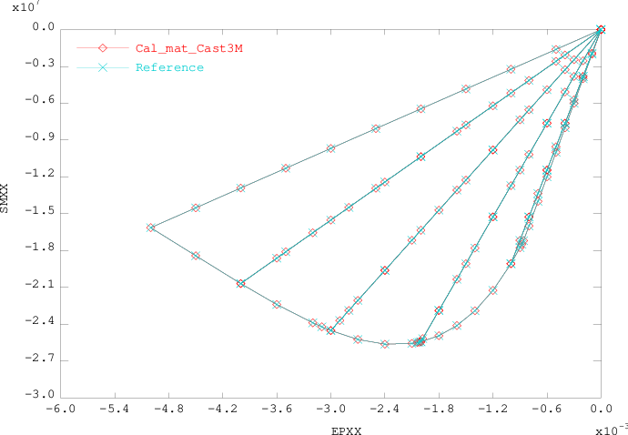
   
   Contrainte moyenne en fonction de la déformation moyenne.

On observe que :

- La solution calculée (parties linéaires rouges) reproduit correctement la diminution à chaque cycle du module élastique prévue par la solution de référence (parties linéaires bleues) ;
- L'écart relatif maximum en contrainte entre la solution calculée et la solution de référence est :

.. math::
   3,29566.10^{-9} > 1.10^{-10}
   
En conséquence, les résultats du cas-test ``04_compression_cyclique.dgibi`` en mode 3D volumique sont jugés *[nh145313 : non satisfaisants ?]*.

Courbe d'évolution de la force de réaction en fonction du déplacement imposé
""""""""""""""""""""""""""""""""""""""""""""""""""""""""""""""""""""""""""""

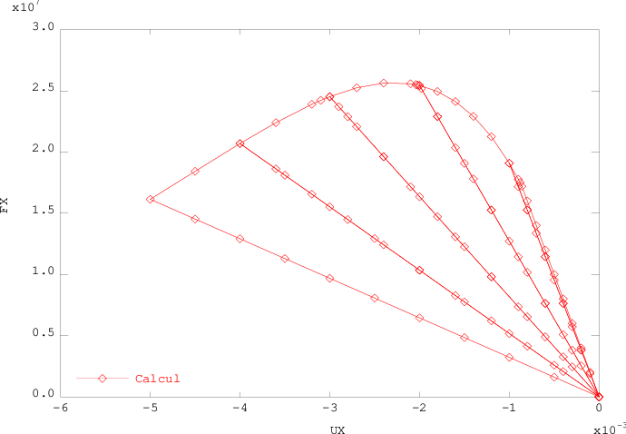
   
   Force de réaction en fonction du déplacement imposé.

Résultats du cas 2D contraintes planes
++++++++++++++++++++++++++++++++++++++

Courbe d'évolution de l'endommagement
"""""""""""""""""""""""""""""""""""""

.. figure:: figures/mazars_comp_cycl_d_2dplan.png
   :width: 15cm
   :align: center
   
   Endommagement moyen en fonction du temps.

Courbe d'évolution de la contrainte en fonction de la déformation
"""""""""""""""""""""""""""""""""""""""""""""""""""""""""""""""""

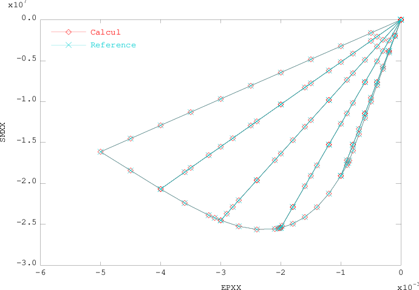
   
   Contrainte moyenne en fonction de la déformation moyenne.

On observe que :

- La solution calculée (parties linéaires rouges) reproduit correctement la diminution à chaque cycle du module élastique prévue par la solution de référence (parties linéaires bleues) ;
- L'écart relatif maximum en contrainte entre la solution calculée et la solution de référence est :

.. math::
   6,59015.10^{-15} < 1.10^{-10}
   
En conséquence, les résultats du cas-test ``04_compression_cyclique.dgibi`` en mode 2D contraintes planes sont jugés satisfaisants.

Courbe d'évolution de la force de réaction en fonction du déplacement imposé
""""""""""""""""""""""""""""""""""""""""""""""""""""""""""""""""""""""""""""

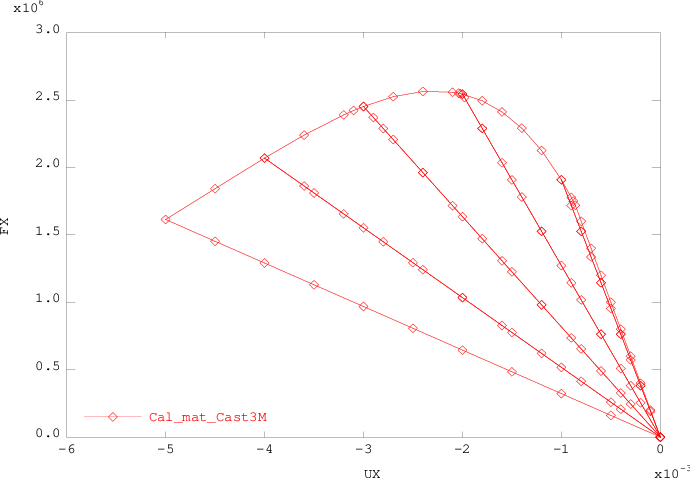
   
   Force de réaction en fonction du déplacement imposé.

Résultats du cas 2D axisymétrique
+++++++++++++++++++++++++++++++++

Courbe d'évolution de l'endommagement
"""""""""""""""""""""""""""""""""""""

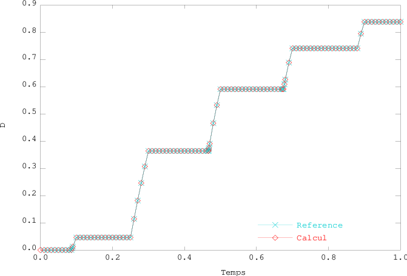
   
   Endommagement moyen en fonction du temps.

Courbe d'évolution de la contrainte en fonction de la déformation
"""""""""""""""""""""""""""""""""""""""""""""""""""""""""""""""""

   
   Contrainte moyenne en fonction de la déformation moyenne.

On observe que :

- La solution calculée (parties linéaires rouges) reproduit correctement la diminution à chaque cycle du module élastique prévue par la solution de référence (parties linéaires bleues) ;
- L'écart relatif maximum en contrainte entre la solution calculée et la solution de référence est :

.. math::
   1,02395.10^{-14} < 1.10^{-10}
   
En conséquence, les résultats du cas-test ``04_compression_cyclique.dgibi`` en mode 2D axisymétrique sont jugés satisfaisants.

Courbe d'évolution de la force de réaction en fonction du déplacement imposé
""""""""""""""""""""""""""""""""""""""""""""""""""""""""""""""""""""""""""""

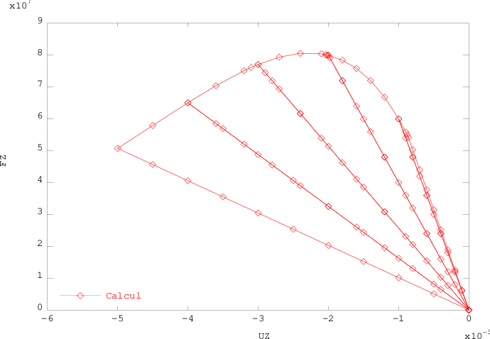
   
   Force de réaction en fonction du déplacement imposé.

Traction compression
~~~~~~~~~~~~~~~~~~~~
Le cas-test se dénomme ``05_traction_compression.dgibi``

On applique le cas de chargement de traction compression alternées pour les modélisations :ref:`poutre <sec:modeles_beton_test_pout_trac_comp>`
et :ref:`massif <sec:modeles_beton_test_mass_trac_comp>` en déplacement imposé croissant en valeur absolue (positif en traction, puis négatif en compression) jusqu’à atteindre l’endommagement autour de 0,9.

Pour tous les modes de calcul le déplacement imposé vaut, en traction :math:`u_{tmax}=2.10^{-4}` m et en compression :math:`u_{cmax}=-5.10^{-3}` m.

L’objectif est de vérifier, lorsque le chargement passe de la traction à la compression pendant le calcul, que le modèle commute correctement d'un mode d'endommagement à l'autre.

L'analyse des résultats porte sur les courbes :

- d'endomagemment soit en chaque point de Gauss de la section de la poutre pour les modèles poutre à fibres, soit moyen pour les modèles massifs, en fonction du temps ;
- de la contrainte soit en chaque point de Gauss de la section de la poutre pour les modèles poutre à fibres, soit moyenne pour les modèles massifs, en fonction de la déformation moyenne ;
- de la force de réaction globale en fonction du déplacement imposé.

Solution de référence
+++++++++++++++++++++
La solution de référence est obtenue de manière analytique à partir des équations donnant la loi de l'évolution de l'endommagement en traction et en compression. Ces deux lois sont fonctions de la déformation équivalente selon la formulation de Mazars qui est dépendante du mode de chargement et du mode de représentation géométrique.

Résultats du cas 3D poutre à fibres
+++++++++++++++++++++++++++++++++++

Solution de référence
"""""""""""""""""""""

On a montré précédemment que la déformation équivalente s'exprime par :

- en traction (:math:`\epsilon_{xx}>0`) : :math:`e=\epsilon_{xx}` ;
- en compression (:math:`\epsilon_{xx}<0`) : :math:`e=\sqrt{2}\nu|\epsilon_{xx}|`.

On en déduit les solutions de référence de l'endommagement :

- en traction (:math:`\epsilon_{xx}>0`) :

.. math::
   D_t = 1 - \frac{e_0 (1 - A_t)}{\epsilon_{xx}} - A_t\exp\left[-B_t (\epsilon_{xx} - e_0)\right]

- en compression (:math:`\epsilon_{xx}<0`) :
   
.. math::
   D_c = 1 - \frac{e_0 (1 - A_c)}{\sqrt{2}\nu|\epsilon_{xx}|} - A_c\exp\left[-B_c (\sqrt{2}\nu|\epsilon_{xx}| - e_0)\right]
   
Puis la solution de référence de la contrainte dans la direction de la poutre :

- en traction (:math:`\epsilon_{xx}>0`) :
   
.. math::
   \sigma_{xx}=(1-D_t) E \epsilon_{xx}

- en compression (:math:`\epsilon_{xx}<0`) :
   
.. math::
   \sigma_{xx}=(1-D_c) E \epsilon_{xx}

Dans Cast3M, 

- :math:`\epsilon_{xx}` correspond à la composante ``'VISXX'``, rebaptisée ci-dessous ``'EPXX'``, du sous-champs ``'VAIS'`` du champs des variables internes ``TAB1.'VARIABLES_INTERNES'`` en sortie de ``PASAPAS``.

- :math:`\sigma_{xx}` correspond à la composante ``'SMXX'`` du sous-champs ``'VONS'`` du champs des variables internes ``TAB1.'VARIABLES_INTERNES'`` en sortie de ``PASAPAS``.

Courbe d'évolution de l'endommagement
"""""""""""""""""""""""""""""""""""""

.. figure:: figures/mazars_trac_comp_d_3dpaf.png
   :width: 15cm
   :align: center
   
   Endommagement aux points de Gauss en fonction du temps.

Courbe d'évolution de la contrainte en fonction de la déformation
"""""""""""""""""""""""""""""""""""""""""""""""""""""""""""""""""

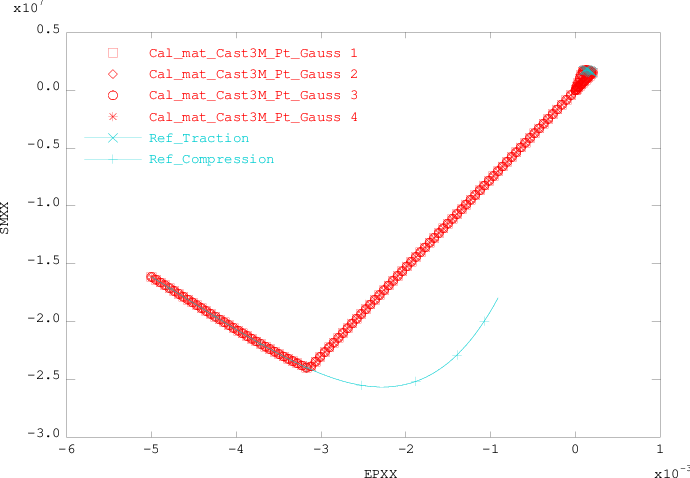
   
   Contrainte aux points de Gauss en fonction de la déformation moyenne.

L'écart relatif maximum en contrainte entre la solution calculée et la solution de référence est :

- en traction : :math:`6,98622.10^{-16} < 1.10^{-10}` ;
- en compression : :math:`9,55546.10^{-09} > 1.10^{-10}`.
   
En conséquence, les résultats du cas-test ``05_traction_compression.dgibi`` en mode 3D poutre à fibres sont jugés *[nh145313 : non satisfaisants ?]*.

Courbe d'évolution de la force de réaction en fonction du déplacement imposé
""""""""""""""""""""""""""""""""""""""""""""""""""""""""""""""""""""""""""""

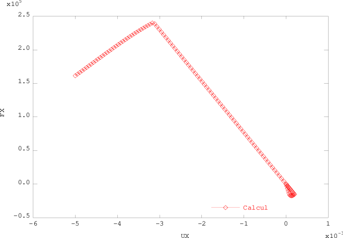
   
   Force de réaction en fonction du déplacement imposé.

Résultats du cas 2D poutre à fibres
+++++++++++++++++++++++++++++++++++

On a montré précédemment que la déformation équivalente s'exprime par :

- en traction (:math:`\epsilon_{xx}>0`) : :math:`e=\epsilon_{xx}` ;
- en compression (:math:`\epsilon_{xx}<0`) : :math:`e=\sqrt{2}\nu|\epsilon_{xx}|`.

On en déduit les solutions de référence de l'endommagement :

- en traction (:math:`\epsilon_{xx}>0`) :

.. math::
   D_t = 1 - \frac{e_0 (1 - A_t)}{\epsilon_{xx}} - A_t\exp\left[-B_t (\epsilon_{xx} - e_0)\right]

- en compression (:math:`\epsilon_{xx}<0`) :
   
.. math::
   D_c = 1 - \frac{e_0 (1 - A_c)}{\sqrt{2}\nu|\epsilon_{xx}|} - A_c\exp\left[-B_c (\sqrt{2}\nu|\epsilon_{xx}| - e_0)\right]
   
Puis la solution de référence de la contrainte dans la direction de la poutre :

- en traction (:math:`\epsilon_{xx}>0`) :
   
.. math::
   \sigma_{xx}=(1-D_t) E \epsilon_{xx}

- en compression (:math:`\epsilon_{xx}<0`) :
   
.. math::
   \sigma_{xx}=(1-D_c) E \epsilon_{xx}

Dans Cast3M, 

- :math:`\epsilon_{xx}` correspond à la composante ``'VISXX'``, rebaptisée ci-dessous ``'EPXX'``, du sous-champs ``'VAIS'`` du champs des variables internes ``TAB1.'VARIABLES_INTERNES'`` en sortie de ``PASAPAS``.

- :math:`\sigma_{xx}` correspond à la composante ``'SMXX'`` du sous-champs ``'VONS'`` du champs des variables internes ``TAB1.'VARIABLES_INTERNES'`` en sortie de ``PASAPAS``.

Courbe d'évolution de l'endommagement
"""""""""""""""""""""""""""""""""""""

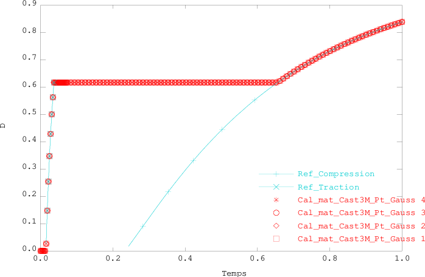
   
   Endommagement aux points de Gauss en fonction du temps.

Courbe d'évolution de la contrainte en fonction de la déformation
"""""""""""""""""""""""""""""""""""""""""""""""""""""""""""""""""

.. figure:: figures/mazars_trac_comp_s_2dpaf.png
   :width: 15cm
   :align: center
   
   Contrainte aux points de Gauss en fonction de la déformation moyenne.

L'écart relatif maximum en contrainte entre la solution calculée et la solution de référence est :

- en traction : :math:`6,98622.10^{-16} < 1.10^{-10}` ;
- en compression : :math:`9,55546.10^{-09} > 1.10^{-10}`.
   
En conséquence, les résultats du cas-test ``05_traction_compression.dgibi`` en mode 2D poutre à fibres sont jugés *[nh145313 : non satisfaisants ?]*.

Courbe d'évolution de la force de réaction en fonction du déplacement imposé
""""""""""""""""""""""""""""""""""""""""""""""""""""""""""""""""""""""""""""

   
   Force de réaction en fonction du déplacement imposé.

Résultats du cas 3D volumique
+++++++++++++++++++++++++++++

On a montré précédemment que la déformation équivalente s'exprime par :

- en traction (:math:`\epsilon_{xx}>0`) : :math:`e=\epsilon_{xx}` ;
- en compression (:math:`\epsilon_{xx}<0`) : :math:`e=\sqrt{2}\nu|\epsilon_{xx}|`.

On en déduit les solutions de référence de l'endommagement :

- en traction (:math:`\epsilon_{xx}>0`) :

.. math::
   D_t = 1 - \frac{e_0 (1 - A_t)}{\epsilon_{xx}} - A_t\exp\left[-B_t (\epsilon_{xx} - e_0)\right]

- en compression (:math:`\epsilon_{xx}<0`) :
   
.. math::
   D_c = 1 - \frac{e_0 (1 - A_c)}{\sqrt{2}\nu|\epsilon_{xx}|} - A_c\exp\left[-B_c (\sqrt{2}\nu|\epsilon_{xx}| - e_0)\right]
   
Puis la solution de référence de la contrainte dans la direction de la poutre :

- en traction (:math:`\epsilon_{xx}>0`) :
   
.. math::
   \sigma_{xx}=(1-D_t) E \epsilon_{xx}

- en compression (:math:`\epsilon_{xx}<0`) :
   
.. math::
   \sigma_{xx}=(1-D_c) E \epsilon_{xx}

Dans Cast3M, 

- :math:`\epsilon_{xx}` correspond à la composante ``'EPXX'`` du tenseur des déformations ``TAB.'DEFORMATIONS'`` en sortie de ``PASAPAS``.

- :math:`\sigma_{xx}` correspond à la composante ``'SMXX'`` du tenseur des contraintes ``TAB1.'CONTRAINTES'`` en sortie de ``PASAPAS``.

Courbe d'évolution de l'endommagement
"""""""""""""""""""""""""""""""""""""

.. figure:: figures/mazars_trac_comp_d_3d.png
   :width: 15cm
   :align: center
   
   Endommagement moyen en fonction du temps.

Courbe d'évolution de la contrainte en fonction de la déformation
"""""""""""""""""""""""""""""""""""""""""""""""""""""""""""""""""

.. figure:: figures/mazars_trac_comp_s_3d.png
   :width: 15cm
   :align: center
   
   Contrainte moyenne en fonction de la déformation moyenne.

L'écart relatif maximum en contrainte entre la solution calculée et la solution de référence est :

- en traction : :math:`5,58898.10^{-16} < 1.10^{-10}` ;
- en compression : :math:`1,10157.10^{-08} > 1.10^{-10}`.
   
En conséquence, les résultats du cas-test ``05_traction_compression.dgibi`` en mode 3D volumique sont jugés *[nh145313 : non satisfaisants ?]*.

Courbe d'évolution de la force de réaction en fonction du déplacement imposé
""""""""""""""""""""""""""""""""""""""""""""""""""""""""""""""""""""""""""""

   
   Force de réaction en fonction du déplacement imposé.

Résultats du cas 2D contraintes planes
++++++++++++++++++++++++++++++++++++++

On a montré précédemment que la déformation équivalente s'exprime par :

- en traction (:math:`\epsilon_{xx}>0`) : :math:`e=\epsilon_{xx}` ;
- en compression (:math:`\epsilon_{xx}<0`) : :math:`e=\sqrt{2}\nu|\epsilon_{xx}|`.

On en déduit les solutions de référence de l'endommagement :

- en traction (:math:`\epsilon_{xx}>0`) :

.. math::
   D_t = 1 - \frac{e_0 (1 - A_t)}{\epsilon_{xx}} - A_t\exp\left[-B_t (\epsilon_{xx} - e_0)\right]

- en compression (:math:`\epsilon_{xx}<0`) :
   
.. math::
   D_c = 1 - \frac{e_0 (1 - A_c)}{\sqrt{2}\nu|\epsilon_{xx}|} - A_c\exp\left[-B_c (\sqrt{2}\nu|\epsilon_{xx}| - e_0)\right]
   
Puis la solution de référence de la contrainte dans la direction de la poutre :

- en traction (:math:`\epsilon_{xx}>0`) :
   
.. math::
   \sigma_{xx}=(1-D_t) E \epsilon_{xx}

- en compression (:math:`\epsilon_{xx}<0`) :
   
.. math::
   \sigma_{xx}=(1-D_c) E \epsilon_{xx}

Dans Cast3M, 

- :math:`\epsilon_{xx}` correspond à la composante ``'EPXX'`` du tenseur des déformations ``TAB.'DEFORMATIONS'`` en sortie de ``PASAPAS``.

- :math:`\sigma_{xx}` correspond à la composante ``'SMXX'`` du tenseur des contraintes ``TAB1.'CONTRAINTES'`` en sortie de ``PASAPAS``.

Courbe d'évolution de l'endommagement
"""""""""""""""""""""""""""""""""""""

.. figure:: figures/mazars_trac_comp_d_2dplan.png
   :width: 15cm
   :align: center
   
   Endommagement moyen en fonction du temps.

Courbe d'évolution de la contrainte en fonction de la déformation
"""""""""""""""""""""""""""""""""""""""""""""""""""""""""""""""""

   
   Contrainte moyenne en fonction de la déformation moyenne.

L'écart relatif maximum en contrainte entre la solution calculée et la solution de référence est :

- en traction : :math:`4,01321.10^{-16} < 1.10^{-10}` ;
- en compression : :math:`1,64633.10^{-15} < 1.10^{-10}`.
   
En conséquence, les résultats du cas-test ``05_traction_compression.dgibi`` en mode 2D contraintes planes sont jugés satisfaisants.

Courbe d'évolution de la force de réaction en fonction du déplacement imposé
""""""""""""""""""""""""""""""""""""""""""""""""""""""""""""""""""""""""""""

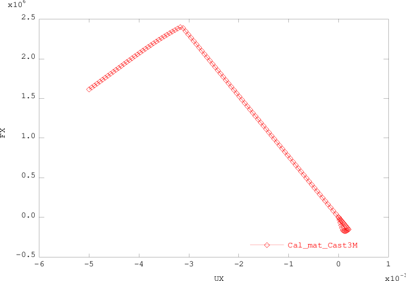
   
   Force de réaction en fonction du déplacement imposé.

Résultats du cas 2D axisymétrique
+++++++++++++++++++++++++++++++++

On a montré précédemment que la déformation équivalente s'exprime par :

- en traction (:math:`\epsilon_{zz}>0`) : :math:`e=\epsilon_{zz}` ;
- en compression (:math:`\epsilon_{zz}<0`) : :math:`e=\sqrt{2}\nu|\epsilon_{zz}|`.

On en déduit les solutions de référence de l'endommagement :

- en traction (:math:`\epsilon_{zz}>0`) :

.. math::
   D_t = 1 - \frac{e_0 (1 - A_t)}{\epsilon_{zz}} - A_t\exp\left[-B_t (\epsilon_{zz} - e_0)\right]

- en compression (:math:`\epsilon_{zz}<0`) :
   
.. math::
   D_c = 1 - \frac{e_0 (1 - A_c)}{\sqrt{2}\nu|\epsilon_{zz}|} - A_c\exp\left[-B_c (\sqrt{2}\nu|\epsilon_{zz}| - e_0)\right]
   
Puis la solution de référence de la contrainte dans la direction de la poutre :

- en traction (:math:`\epsilon_{zz}>0`) :
   
.. math::
   \sigma_{zz}=(1-D_t) E \epsilon_{zz}

- en compression (:math:`\epsilon_{zz}<0`) :
   
.. math::
   \sigma_{zz}=(1-D_c) E \epsilon_{zz}

Dans Cast3M, 

- :math:`\epsilon_{zz}` correspond à la composante ``'EPZZ'`` du tenseur des déformations ``TAB.'DEFORMATIONS'`` en sortie de ``PASAPAS``.

- :math:`\sigma_{zz}` correspond à la composante ``'SMZZ'`` du tenseur des contraintes ``TAB1.'CONTRAINTES'`` en sortie de ``PASAPAS``.

Courbe d'évolution de l'endommagement
"""""""""""""""""""""""""""""""""""""

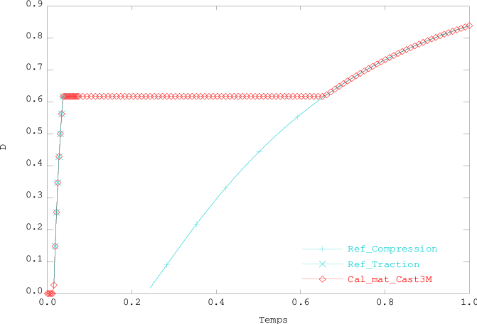
   
   Endommagement moyen en fonction du temps.

Courbe d'évolution de la contrainte en fonction de la déformation
"""""""""""""""""""""""""""""""""""""""""""""""""""""""""""""""""

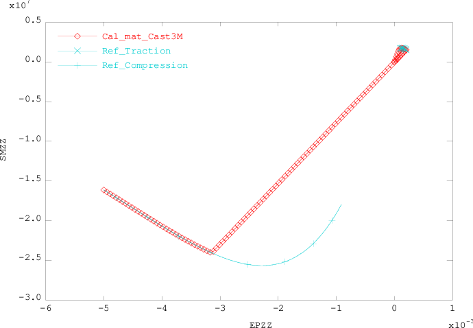
   
   Contrainte moyenne en fonction de la déformation moyenne.

L'écart relatif maximum en contrainte entre la solution calculée et la solution de référence est :

- en traction : :math:`4,35418.10^{-16} < 1.10^{-10}` ;
- en compression : :math:`1,56858.10^{-15} < 1.10^{-10}`.
   
En conséquence, les résultats du cas-test ``05_traction_compression.dgibi`` en mode 2D axisymétrique sont jugés satisfaisants.

Courbe d'évolution de la force de réaction en fonction du déplacement imposé
""""""""""""""""""""""""""""""""""""""""""""""""""""""""""""""""""""""""""""

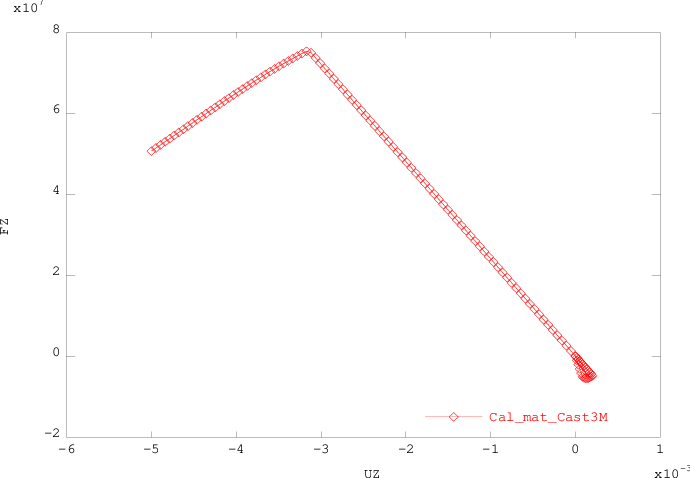
   
   Force de réaction en fonction du déplacement imposé.

Traction compression traction
~~~~~~~~~~~~~~~~~~~~~~~~~~~~~
Le cas-test se dénomme ``06_traction_compression_traction.dgibi``

On applique le cas de chargement de traction compression traction alternées pour les modélisations :ref:`poutre <sec:modeles_beton_test_pout_trac_comp_trac>`
et :ref:`massif <sec:modeles_beton_test_mass_trac_comp_trac>` en déplacement imposé dont la valeur absolue est croissante dans chacun des sens, jusqu’à atteindre un endommagement supérieur à 0,95.

Pour tous les modes de calcul, le déplacement imposé maximum vaut, dans la première phase de traction :math:`u_{t1max}=2.10^{-4}` m, dans la deuxième phase de  compression :math:`u_{c2max}=-4.10^{-3}` m, puis dans la troisième phase de traction :math:`u_{t3max}=5.10^{-4}` m.

L’objectif est de vérifier, lorsque le chargement passe pendant le calcul de la traction à la compression puis à nouveau à la traction, que le modèle commute correctement d'un mode d'endommagement à l'autre.

L'analyse des résultats porte sur les courbes :

- d'endomagemment soit en chaque point de Gauss de la section de la poutre pour les modèles poutre à fibres, soit moyen pour les modèles massifs, en fonction du temps ;
- de la contrainte soit en chaque point de Gauss de la section de la poutre pour les modèles poutre à fibres, soit moyenne pour les modèles massifs, en fonction de la déformation moyenne ;
- de la force de réaction globale en fonction du déplacement imposé.

Solution de référence
+++++++++++++++++++++
La solution de référence est obtenue de manière analytique à partir des équations donnant la loi de l'évolution de l'endommagement en traction et en compression. Ces deux lois sont fonctions de la déformation équivalente selon la formulation de Mazars qui est dépendante du mode de chargement et du mode de représentation géométrique.

Résultats du cas 3D poutre à fibres
+++++++++++++++++++++++++++++++++++

Solution de référence
"""""""""""""""""""""

On a montré précédemment que la déformation équivalente s'exprime par :

- en traction, phases 1 et 3 (:math:`\epsilon_{xx}>0`) : :math:`e=\epsilon_{xx}` ;
- en compression, phase 2 (:math:`\epsilon_{xx}<0`) : :math:`e=\sqrt{2}\nu|\epsilon_{xx}|`.

On en déduit les solutions de référence de l'endommagement :

- en traction, phases 1 et 3 (:math:`\epsilon_{xx}>0`) :

.. math::
   D_t = 1 - \frac{e_0 (1 - A_t)}{\epsilon_{xx}} - A_t\exp\left[-B_t (\epsilon_{xx} - e_0)\right]

- en compression, phase 2 (:math:`\epsilon_{xx}<0`) :
   
.. math::
   D_c = 1 - \frac{e_0 (1 - A_c)}{\sqrt{2}\nu|\epsilon_{xx}|} - A_c\exp\left[-B_c (\sqrt{2}\nu|\epsilon_{xx}| - e_0)\right]
   
Puis la solution de référence de la contrainte dans la direction de la poutre :

- en traction, phases 1 et 3 (:math:`\epsilon_{xx}>0`) :
   
.. math::
   \sigma_{xx}=(1-D_t) E \epsilon_{xx}

- en compression, phase 2 (:math:`\epsilon_{xx}<0`) :
   
.. math::
   \sigma_{xx}=(1-D_c) E \epsilon_{xx}

Dans Cast3M, 

- :math:`\epsilon_{xx}` correspond à la composante ``'VISXX'``, rebaptisée ci-dessous ``'EPXX'``, du sous-champs ``'VAIS'`` du champs des variables internes ``TAB1.'VARIABLES_INTERNES'`` en sortie de ``PASAPAS``.

- :math:`\sigma_{xx}` correspond à la composante ``'SMXX'`` du sous-champs ``'VONS'`` du champs des variables internes ``TAB1.'VARIABLES_INTERNES'`` en sortie de ``PASAPAS``.

Courbe d'évolution de l'endommagement
"""""""""""""""""""""""""""""""""""""

.. figure:: figures/mazars_trac_comp_trac_d_3dpaf.png
   :width: 15cm
   :align: center
   
   Endommagement aux points de Gauss en fonction du temps.

Courbe d'évolution de la contrainte en fonction de la déformation
"""""""""""""""""""""""""""""""""""""""""""""""""""""""""""""""""

.. figure:: figures/mazars_trac_comp_trac_s_3dpaf.png
   :width: 15cm
   :align: center
   
   Contrainte aux points de Gauss en fonction de la déformation moyenne.

L'écart relatif maximum en contrainte entre la solution calculée et la solution de référence est :

- dans la phase 1 de traction : :math:`6,89936.10^{-16} < 1.10^{-10}` ;
- dans la phase 2 de compression : :math:`7,42313.10^{-09} > 1.10^{-10}`.
- dans la phase 3 de traction : :math:`3,35150.10^{-15} < 1.10^{-10}` ;
   
En conséquence, les résultats du cas-test ``06_traction_compression_traction.dgibi`` en mode 3D poutre à fibres sont jugés *[nh145313 : non satisfaisants ?]*.

Courbe d'évolution de la force de réaction en fonction du déplacement imposé
""""""""""""""""""""""""""""""""""""""""""""""""""""""""""""""""""""""""""""

.. figure:: figures/mazars_trac_comp_trac_f_3dpaf.png
   :width: 15cm
   :align: center
   
   Force de réaction en fonction du déplacement imposé.

Résultats du cas 2D poutre à fibres
+++++++++++++++++++++++++++++++++++

On a montré précédemment que la déformation équivalente s'exprime par :

- en traction, phases 1 et 3 (:math:`\epsilon_{xx}>0`) : :math:`e=\epsilon_{xx}` ;
- en compression, phase 2 (:math:`\epsilon_{xx}<0`) : :math:`e=\sqrt{2}\nu|\epsilon_{xx}|`.

On en déduit les solutions de référence de l'endommagement :

- en traction, phases 1 et 3 (:math:`\epsilon_{xx}>0`) :

.. math::
   D_t = 1 - \frac{e_0 (1 - A_t)}{\epsilon_{xx}} - A_t\exp\left[-B_t (\epsilon_{xx} - e_0)\right]

- en compression, phase 2 (:math:`\epsilon_{xx}<0`) :
   
.. math::
   D_c = 1 - \frac{e_0 (1 - A_c)}{\sqrt{2}\nu|\epsilon_{xx}|} - A_c\exp\left[-B_c (\sqrt{2}\nu|\epsilon_{xx}| - e_0)\right]
   
Puis la solution de référence de la contrainte dans la direction de la poutre :

- en traction, phases 1 et 3 (:math:`\epsilon_{xx}>0`) :
   
.. math::
   \sigma_{xx}=(1-D_t) E \epsilon_{xx}

- en compression, phase 2 (:math:`\epsilon_{xx}<0`) :
   
.. math::
   \sigma_{xx}=(1-D_c) E \epsilon_{xx}

Dans Cast3M, 

- :math:`\epsilon_{xx}` correspond à la composante ``'VISXX'``, rebaptisée ci-dessous ``'EPXX'``, du sous-champs ``'VAIS'`` du champs des variables internes ``TAB1.'VARIABLES_INTERNES'`` en sortie de ``PASAPAS``.

- :math:`\sigma_{xx}` correspond à la composante ``'SMXX'`` du sous-champs ``'VONS'`` du champs des variables internes ``TAB1.'VARIABLES_INTERNES'`` en sortie de ``PASAPAS``.

Courbe d'évolution de l'endommagement
"""""""""""""""""""""""""""""""""""""

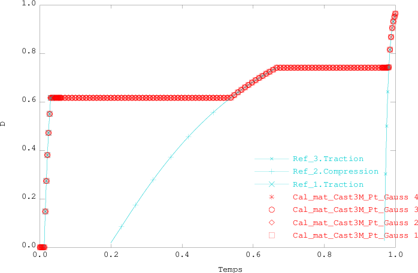
   
   Endommagement aux points de Gauss en fonction du temps.

Courbe d'évolution de la contrainte en fonction de la déformation
"""""""""""""""""""""""""""""""""""""""""""""""""""""""""""""""""

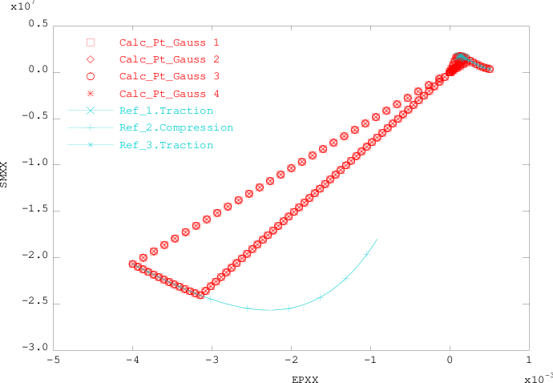
   
   Contrainte aux points de Gauss en fonction de la déformation moyenne.

L'écart relatif maximum en contrainte entre la solution calculée et la solution de référence est :

- dans la phase 1 de traction : :math:`6,89936.10^{-16} < 1.10^{-10}` ;
- dans la phase 2 de compression : :math:`7,42313.10^{-09} > 1.10^{-10}`.
- dans la phase 3 de traction : :math:`3,35150.10^{-15} < 1.10^{-10}` ;
   
En conséquence, les résultats du cas-test ``06_traction_compression_traction.dgibi`` en mode 2D poutre à fibres sont jugés *[nh145313 : non satisfaisants ?]*.

Courbe d'évolution de la force de réaction en fonction du déplacement imposé
""""""""""""""""""""""""""""""""""""""""""""""""""""""""""""""""""""""""""""

   
   Force de réaction en fonction du déplacement imposé.

Résultats du cas 3D volumique
+++++++++++++++++++++++++++++

On a montré précédemment que la déformation équivalente s'exprime par :

- en traction, phases 1 et 3 (:math:`\epsilon_{xx}>0`) : :math:`e=\epsilon_{xx}` ;
- en compression, phase 2 (:math:`\epsilon_{xx}<0`) : :math:`e=\sqrt{2}\nu|\epsilon_{xx}|`.

On en déduit les solutions de référence de l'endommagement :

- en traction, phases 1 et 3 (:math:`\epsilon_{xx}>0`) :

.. math::
   D_t = 1 - \frac{e_0 (1 - A_t)}{\epsilon_{xx}} - A_t\exp\left[-B_t (\epsilon_{xx} - e_0)\right]

- en compression, phase 2 (:math:`\epsilon_{xx}<0`) :
   
.. math::
   D_c = 1 - \frac{e_0 (1 - A_c)}{\sqrt{2}\nu|\epsilon_{xx}|} - A_c\exp\left[-B_c (\sqrt{2}\nu|\epsilon_{xx}| - e_0)\right]
   
Puis la solution de référence de la contrainte dans la direction de la poutre :

- en traction, phases 1 et 3 (:math:`\epsilon_{xx}>0`) :
   
.. math::
   \sigma_{xx}=(1-D_t) E \epsilon_{xx}

- en compression, phase 2 (:math:`\epsilon_{xx}<0`) :
   
.. math::
   \sigma_{xx}=(1-D_c) E \epsilon_{xx}

Dans Cast3M, 

- :math:`\epsilon_{xx}` correspond à la composante ``'EPXX'`` du tenseur des déformations ``TAB.'DEFORMATIONS'`` en sortie de ``PASAPAS``.

- :math:`\sigma_{xx}` correspond à la composante ``'SMXX'`` du tenseur des contraintes ``TAB1.'CONTRAINTES'`` en sortie de ``PASAPAS``.

Courbe d'évolution de l'endommagement
"""""""""""""""""""""""""""""""""""""

.. figure:: figures/mazars_trac_comp_trac_d_3d.png
   :width: 15cm
   :align: center
   
   Endommagement moyen en fonction du temps.

Courbe d'évolution de la contrainte en fonction de la déformation
"""""""""""""""""""""""""""""""""""""""""""""""""""""""""""""""""

.. figure:: figures/mazars_trac_comp_trac_s_3d.png
   :width: 15cm
   :align: center
   
   Contrainte moyenne en fonction de la déformation moyenne.

L'écart relatif maximum en contrainte entre la solution calculée et la solution de référence est :

- dans la phase 1 de traction : :math:`8,27923.10^{-16} < 1.10^{-10}` ;
- dans la phase 2 de compression : :math:`1,40855.10^{-09} > 1.10^{-10}`.
- dans la phase 3 de traction : :math:`1,18978.10^{-14} < 1.10^{-10}` ;
   
En conséquence, les résultats du cas-test ``06_traction_compression_traction.dgibi`` en mode 3D volumique sont jugés *[nh145313 : non satisfaisants ?]*.

Courbe d'évolution de la force de réaction en fonction du déplacement imposé
""""""""""""""""""""""""""""""""""""""""""""""""""""""""""""""""""""""""""""

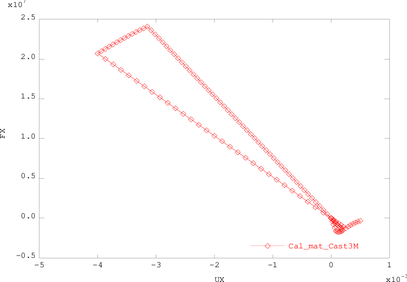
   
   Force de réaction en fonction du déplacement imposé.

Résultats du cas 2D contraintes planes
++++++++++++++++++++++++++++++++++++++

On a montré précédemment que la déformation équivalente s'exprime par :

- en traction, phases 1 et 3 (:math:`\epsilon_{xx}>0`) : :math:`e=\epsilon_{xx}` ;
- en compression, phase 2 (:math:`\epsilon_{xx}<0`) : :math:`e=\sqrt{2}\nu|\epsilon_{xx}|`.

On en déduit les solutions de référence de l'endommagement :

- en traction, phases 1 et 3 (:math:`\epsilon_{xx}>0`) :

.. math::
   D_t = 1 - \frac{e_0 (1 - A_t)}{\epsilon_{xx}} - A_t\exp\left[-B_t (\epsilon_{xx} - e_0)\right]

- en compression, phase 2 (:math:`\epsilon_{xx}<0`) :
   
.. math::
   D_c = 1 - \frac{e_0 (1 - A_c)}{\sqrt{2}\nu|\epsilon_{xx}|} - A_c\exp\left[-B_c (\sqrt{2}\nu|\epsilon_{xx}| - e_0)\right]
   
Puis la solution de référence de la contrainte dans la direction de la poutre :

- en traction, phases 1 et 3 (:math:`\epsilon_{xx}>0`) :
   
.. math::
   \sigma_{xx}=(1-D_t) E \epsilon_{xx}

- en compression, phase 2 (:math:`\epsilon_{xx}<0`) :
   
.. math::
   \sigma_{xx}=(1-D_c) E \epsilon_{xx}

Dans Cast3M, 

- :math:`\epsilon_{xx}` correspond à la composante ``'EPXX'`` du tenseur des déformations ``TAB.'DEFORMATIONS'`` en sortie de ``PASAPAS``.

- :math:`\sigma_{xx}` correspond à la composante ``'SMXX'`` du tenseur des contraintes ``TAB1.'CONTRAINTES'`` en sortie de ``PASAPAS``.

Courbe d'évolution de l'endommagement
"""""""""""""""""""""""""""""""""""""

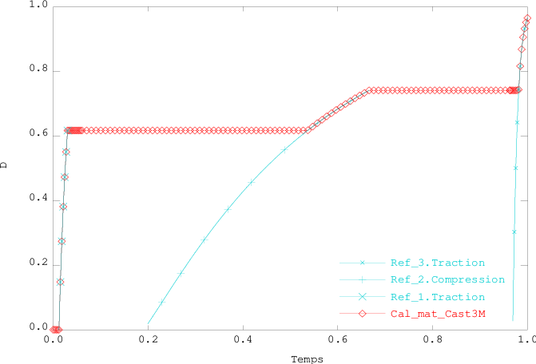
   
   Endommagement moyen en fonction du temps.

Courbe d'évolution de la contrainte en fonction de la déformation
"""""""""""""""""""""""""""""""""""""""""""""""""""""""""""""""""

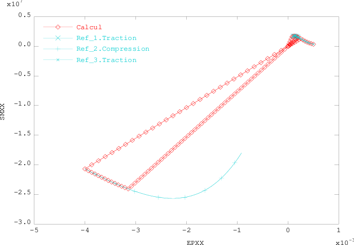
   
   Contrainte moyenne en fonction de la déformation moyenne.

L'écart relatif maximum en contrainte entre la solution calculée et la solution de référence est :

- dans la phase 1 de traction : :math:`3,04041.10^{-16} < 1.10^{-10}` ;
- dans la phase 2 de compression : :math:`1,24288.10^{-15} < 1.10^{-10}`.
- dans la phase 3 de traction : :math:`2,84878.10^{-15} < 1.10^{-10}` ;
   
En conséquence, les résultats du cas-test ``06_traction_compression_traction.dgibi`` en mode 2D contraintes planes sont jugés satisfaisants.

Courbe d'évolution de la force de réaction en fonction du déplacement imposé
""""""""""""""""""""""""""""""""""""""""""""""""""""""""""""""""""""""""""""

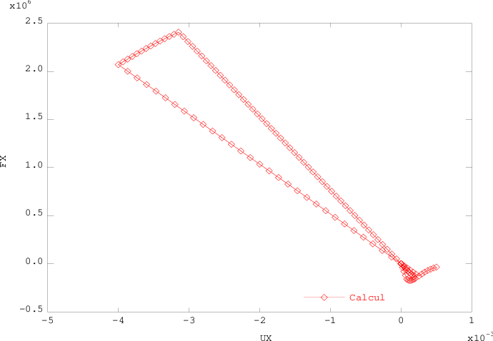
   
   Force de réaction en fonction du déplacement imposé.

Résultats du cas 2D axisymétrique
+++++++++++++++++++++++++++++++++

On a montré précédemment que la déformation équivalente s'exprime par :

- en traction, phases 1 et 3 (:math:`\epsilon_{zz}>0`) : :math:`e=\epsilon_{zz}` ;
- en compression, phase 2 (:math:`\epsilon_{zz}<0`) : :math:`e=\sqrt{2}\nu|\epsilon_{zz}|`.

On en déduit les solutions de référence de l'endommagement :

- en traction, phases 1 et 3 (:math:`\epsilon_{zz}>0`) :

.. math::
   D_t = 1 - \frac{e_0 (1 - A_t)}{\epsilon_{zz}} - A_t\exp\left[-B_t (\epsilon_{zz} - e_0)\right]

- en compression, phase 2 (:math:`\epsilon_{zz}<0`) :
   
.. math::
   D_c = 1 - \frac{e_0 (1 - A_c)}{\sqrt{2}\nu|\epsilon_{zz}|} - A_c\exp\left[-B_c (\sqrt{2}\nu|\epsilon_{zz}| - e_0)\right]
   
Puis la solution de référence de la contrainte dans la direction de la poutre :

- en traction, phases 1 et 3 (:math:`\epsilon_{zz}>0`) :
   
.. math::
   \sigma_{zz}=(1-D_t) E \epsilon_{zz}

- en compression, phase 2 (:math:`\epsilon_{zz}<0`) :
   
.. math::
   \sigma_{zz}=(1-D_c) E \epsilon_{zz}

Dans Cast3M, 

- :math:`\epsilon_{zz}` correspond à la composante ``'EPZZ'`` du tenseur des déformations ``TAB.'DEFORMATIONS'`` en sortie de ``PASAPAS``.

- :math:`\sigma_{zz}` correspond à la composante ``'SMZZ'`` du tenseur des contraintes ``TAB1.'CONTRAINTES'`` en sortie de ``PASAPAS``.

Courbe d'évolution de l'endommagement
"""""""""""""""""""""""""""""""""""""

.. figure:: figures/mazars_trac_comp_trac_d_2daxi.png
   :width: 15cm
   :align: center
   
   Endommagement moyen en fonction du temps.

Courbe d'évolution de la contrainte en fonction de la déformation
"""""""""""""""""""""""""""""""""""""""""""""""""""""""""""""""""

   
   Contrainte moyenne en fonction de la déformation moyenne.

L'écart relatif maximum en contrainte entre la solution calculée et la solution de référence est :

- dans la phase 1 de traction : :math:`1,52021.10^{-16} < 1.10^{-10}` ;
- dans la phase 2 de compression : :math:`7,96489.10^{-16} < 1.10^{-10}`.
- dans la phase 3 de traction : :math:`1,45408.10^{-14} < 1.10^{-10}` ;
   
En conséquence, les résultats du cas-test ``06_traction_compression_traction.dgibi`` en mode 2D axisymétrique sont jugés satisfaisants.

Courbe d'évolution de la force de réaction en fonction du déplacement imposé
""""""""""""""""""""""""""""""""""""""""""""""""""""""""""""""""""""""""""""

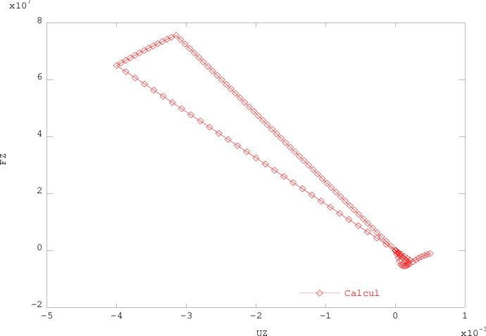
   
   Force de réaction en fonction du déplacement imposé.

Cisaillement
~~~~~~~~~~~~
Le cas-test se dénomme ``07_cisaillement.dgibi``

TODO

Biaxial
~~~~~~~
Le cas-test se dénomme ``08_biaxial.dgibi``

On n'applique le cas de chargement de traction-compression biaxial que pour la modélisation :ref:`massif <sec:modeles_beton_test_mass_biax>`. En effet, la biaxialité du chargement n'a pas de sens avec la modélisation poutre à fibres qui ne traîte que des chargements de type traction-compression dans la direction de la poutre et de cisaillement dans le plan de sa section.

Le chargement biaxial est en contraintes imposées croissante jusqu'à atteindre un endommagement proche de 1 (ruine complète).

Pour un calcul de valeur :math:`\theta` donnée, le chargement maximal est donné par :

.. math::
   \sigma_{xx}=\sigma_{max} \textrm{cos} \theta

.. math::
   \sigma_{yy}=\sigma_{max} \textrm{sin} \theta
   
avec :

.. math::
   \sigma_{max}=\frac{\sigma_{0}}{max(|cos\theta| ; |sin\theta|)}
   
- Pour le mode de calcul 3D volumique : :math:`\sigma_{0}=50~MPa`
- Pour le mode de calcul 2D contraintes planes : :math:`\sigma_{0}=5~MPa`

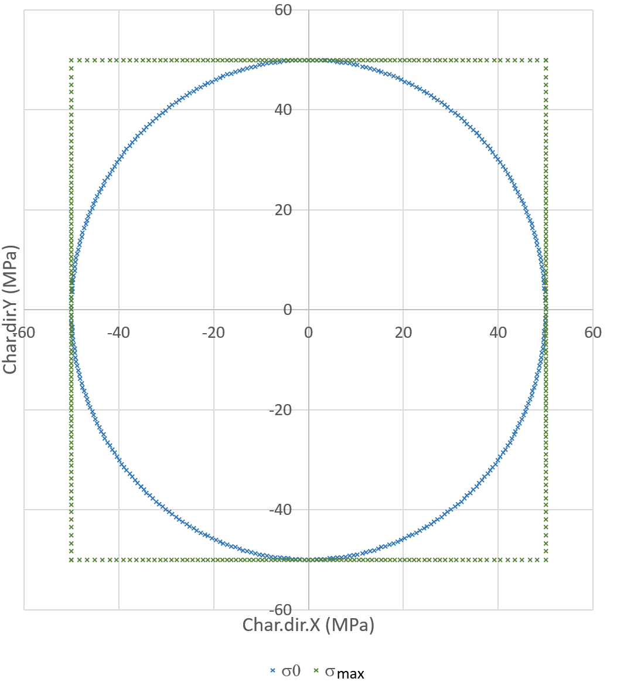
   
   Chargement biaxial du mode 3D volumique pour toutes les valeurs de :math:`\theta \in [0°;360°]` (:math:`\sigma_{0}` en bleu, :math:`\sigma_{max}` en vert)

Le calcul est interrompu avant d'atteindre le chargement maximal, lors de la détection de la ruine qui résulte de la combinaison de deux critères : l'un sur le nombre maximum de sous pas de convergence et l'autre sur l'incrément maximum de déformation entre deux pas de calcul. C'est au pas de calcul qui précéde cette détection que sont relevées les valeurs des contraintes maximales atteintes :math:`\sigma_{xx}` et :math:`\sigma_{yy}`.

L’objectif est de caractériser la courbe de biaxialité qui représente la surface de charge du modèle dans le plan :math:`(\sigma_{xx};\sigma_{yy})`.

Les modes de calcul testés sont :

- 3D volumique ;
- 2D contraintes planes.

L'analyse des résultats porte sur les courbes :

- de biaxialité :math:`(\sigma_{xx};\sigma_{yy})` ;
- de biaxialité normalisée :math:`(\frac{\sigma_{xx}}{|f_{c}|};\frac{\sigma_{yy}}{|f_{c}|})`.

Dans la courbe de biaxialité normalisée, :math:`f_{c}=-25,64~MPa` est la contrainte limite en compression déterminée dans un calcul de référence en contrainte imposée de compression monotone uniaxiale. la courbe calculée de biaxialité normalisée est jugée satisfaite si elle coupe les axes du repère aux deux points :math:`(-1~;~0)` et :math:`(0~;~-1)`.

Solution de référence
+++++++++++++++++++++

Contrairement aux cas de chargements en déplacement imposé traîtés précédemment, dans les cas de chargement en contrainte imposée comme ici l'évolution temporelle de l'endommagement n'est pas prévisible et celle du déplacement qui en dépend ne l'est pas non plus. Or, du fait des dimensions géométriques unitaires du cas-test, la déformation est équivalente au déplacement et donc l'évolution temporelle de la déformation n'est pas définie *a priori*. En conséquence, les évolutions temporelles de l'endommagement qui dépend de celle de la déformation ainsi que l'évolution temporelle de la contrainte qui dépend de celle de l'endommagement ne sont pas définies *a priori*, ce qui ne permet pas de donner une solution analytique au problème.

Néanmoins, il est possible de donner une solution numérique de référence issue de résultats de calculs dans lesquels on a confiance.
Cette solution de référence est obtenue dans les conditions de calcul suivantes qui sont comparées à celle du cas-test ``08_biaxial.dgibi`` dénommé "calcul standard" :

- Un pas de calcul deux fois plus fin que le calcul standard (:math:`1.10^{-3}` au lieu de :math:`2.10^{-3}`) ;
- La réalisation de 360 calculs sur le domaine :math:`\theta \in [0°;360°]`, avec un incrément d'angle :math:`\delta\theta=1°` au lieu de 144 calculs avec :math:`\delta\theta=2,5°` pour le calcul standard.

L'écart entre la solution calculée et la solution de référence est évalué via la surface de la courbe fermée :math:`(\sigma_{xx} ; \sigma_{yy})` :

.. math::
   Ecart_{relatif} = \frac{Surface_{calc.} - Surface_{ref.}} {Surface_{ref.}}

La surface de la courbe est calculée avec l'opérateur ``'INTG'``, option ``'ABS'`` de Cast3M. Cette commande permet de calculer séparément les surfaces des parties de la courbe d'abscisse négative et celles d'abscisse positive et de les additionner.

Par ailleurs, la qualité de la solution calculée est jugée sur la capacité de la courbe de biaxialité normalisée à couper les axes du repère aux deux points :math:`(-1~;~0)` et :math:`(0~;~-1)`.

Résultats du cas 3D volumique
+++++++++++++++++++++++++++++

Courbe de biaxialité :math:`(\sigma_{xx} ; \sigma_{yy})`
""""""""""""""""""""""""""""""""""""""""""""""""""""""""

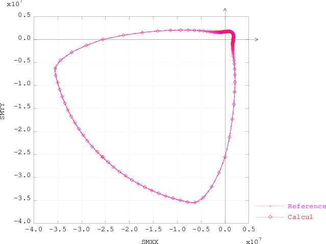
   
   Courbe de biaxialité :math:`(\sigma_{xx} ; \sigma_{yy})`

L'écart relatif sur la surface de la courbe entre la solution calculée et la solution de référence est : :math:`2.70981.10^{-3} < 3.10^{-2}`.

Courbe de biaxialité normalisée :math:`(\frac{\sigma_{xx}}{|f_{c}|} ; \frac{\sigma_{yy}}{|f_{c}|})`
"""""""""""""""""""""""""""""""""""""""""""""""""""""""""""""""""""""""""""""""""""""""""""""""""""""

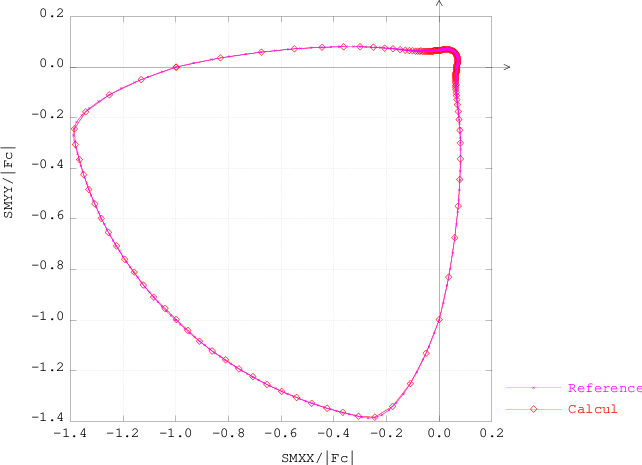
   
   Courbe de biaxialité :math:`(\sigma_{xx} ; \sigma_{yy})`

La courbe calculée de biaxialité normalisée coupe les axes du repère aux deux points :math:`(-1~;~0)` et :math:`(0~;~-1)`.
   
En conséquence de ces deux constats, les résultats du cas-test ``08_biaxial.dgibi`` en mode 3D volumique sont jugés satisfaisants.

Résultats du cas 2D contraintes planes
++++++++++++++++++++++++++++++++++++++

Courbe de biaxialité :math:`(\sigma_{xx} ; \sigma_{yy})`
""""""""""""""""""""""""""""""""""""""""""""""""""""""""

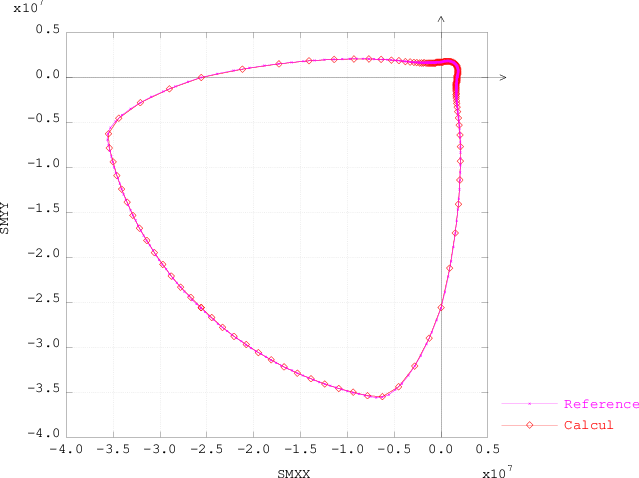
   
   Courbe de biaxialité :math:`(\sigma_{xx} ; \sigma_{yy})`

L'écart relatif sur la surface de la courbe entre la solution calculée et la solution de référence est : :math:`2.44110.10^{-3} < 3.10^{-2}`.

Courbe de biaxialité normalisée :math:`(\frac{\sigma_{xx}}{|f_{c}|} ; \frac{\sigma_{yy}}{|f_{c}|})`
"""""""""""""""""""""""""""""""""""""""""""""""""""""""""""""""""""""""""""""""""""""""""""""""""""""

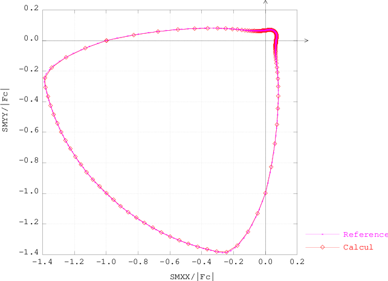
   
   Courbe de biaxialité :math:`(\sigma_{xx} ; \sigma_{yy})`

La courbe calculée de biaxialité normalisée coupe les axes du repère aux deux points :math:`(-1~;~0)` et :math:`(0~;~-1)`.
   
En conséquence de ces deux constats, les résultats du cas-test ``08_biaxial.dgibi`` en mode 2D contraintes planes sont jugés satisfaisants.

Triaxial
~~~~~~~~
Le cas-test se dénomme ``09_triaxial.dgibi``

On n'applique le cas de chargement triaxial que pour la modélisation :ref:`massif <sec:modeles_beton_test_mass_triax>`. En effet, la triaxialité du chargement n'a pas de sens avec la modélisation poutre à fibres qui ne traîte que des chargements de type traction-compression dans la direction de la poutre et de cisaillement dans le plan de sa section.

Le chargement triaxial est la combinaison de deux phases successives : La mise en place au préalable d'un état de confinement auquel on ajoute ensuite un chargement de compression simple en déplacement imposé négatif. On réalise le test dans quatre états de confinement différents qui correspondent aux quatre valeurs de pression hydrostatique, c'est-à-dire de contrainte normale de compression, suivantes : P = 0 Pa/ 1,5 MPa/ 4,5 MPa/ 9 MPa. On applique ensuite le chargement de compression en déplacement imposé négatif, croissant en valeur absolue, jusqu'à atteindre le déplacement maximal : :math:`u_{max}=-4,5.10^{-3}` m.

L'objectif est d'évaluer l'influence du confinement sur la limite en compression et le comportement post-pic du modèle.

L'analyse des résultats porte sur les courbes :

- d'endommagement moyen en fonction du temps ;
- de la contrainte moyenne en fonction de la déformation moyenne ;
- de la force de réaction globale en fonction du déplacement imposé.

Solution de référence
+++++++++++++++++++++

On dispose, pour les quatre valeurs de pression hydrostatique, de résultats expérimentaux en termes de contrainte moyenne et déformation moyenne auxquels les courbes calculées d'évolution de la contrainte en fonction de la déformation peuvent être comparées. 

L'écart entre la courbe calculée et la courbe expérimentale de référence est évalué via l'aire sous les courbes, jusqu'à l'abscisse maximale de l'une ou l'autre des courbes :

.. math::
   Ecart_{relatif} = \frac{Surface_{calc.} - Surface_{ref.}} {Surface_{ref.}}

Résultats du cas 3D volumique
+++++++++++++++++++++++++++++

Courbes d'évolution de l'endommagement
""""""""""""""""""""""""""""""""""""""

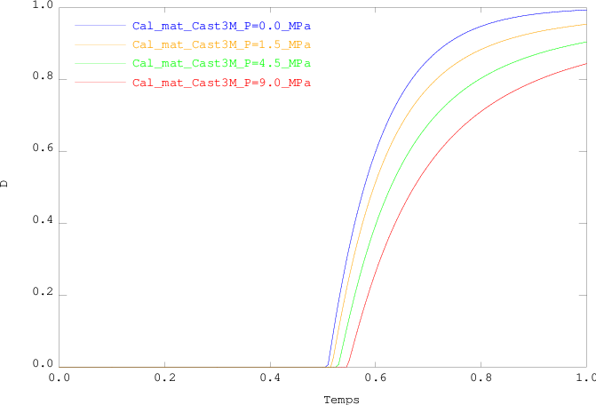
   
   Endommagement moyen en fonction du temps.

Courbes d'évolution de la contrainte en fonction de la déformation
""""""""""""""""""""""""""""""""""""""""""""""""""""""""""""""""""

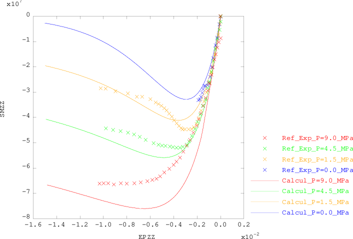
   
   Contrainte moyenne en fonction de la déformation moyenne.

Pour les quatre valeurs de pression hydrostatique, l'écart relatif sur l'aire sous la courbe entre la courbe calculée et la courbe expérimentale de référence est :

- Pour P = 0 MPa   : :math:`Ecart_{relatif} = -1.08171.10^{-1}` ;
- Pour P = 1,5 MPa : :math:`Ecart_{relatif} = -7.35369.10^{-3}` ;
- Pour P = 4,5 MPa : :math:`Ecart_{relatif} = 8.54961.10^{-2}` ;
- Pour P = 9 MPa   : :math:`Ecart_{relatif} = 1.68086.10^{-1}`.

En conséquence, les résultats du cas-test ``09_triaxial.dgibi`` en mode 3D volumique sont jugés ???.

Courbes d'évolution de la force de réaction en fonction du déplacement imposé
"""""""""""""""""""""""""""""""""""""""""""""""""""""""""""""""""""""""""""""

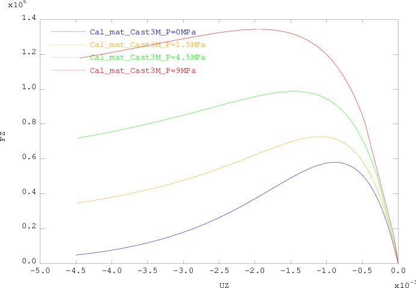
   
   Force de réaction en fonction du déplacement imposé.

Résultats du cas 2D axisymétrique
+++++++++++++++++++++++++++++++++

Courbes d'évolution de l'endommagement
""""""""""""""""""""""""""""""""""""""

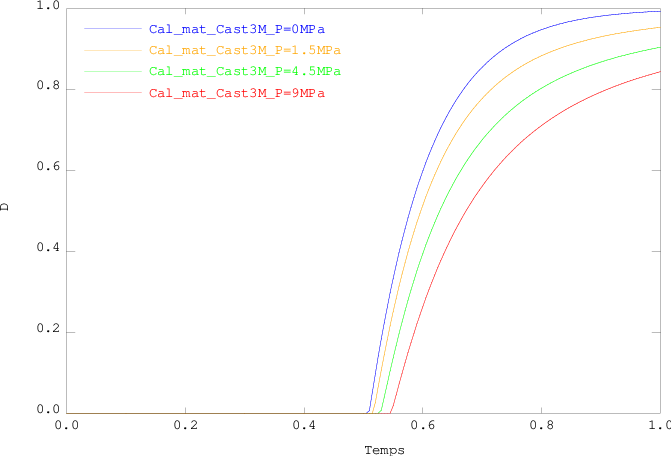
   
   Endommagement moyen en fonction du temps.

Courbes d'évolution de la contrainte en fonction de la déformation
""""""""""""""""""""""""""""""""""""""""""""""""""""""""""""""""""

   
   Contrainte moyenne en fonction de la déformation moyenne.

Pour les quatre valeurs de pression hydrostatique, l'écart relatif sur l'aire sous la courbe entre la courbe calculée et la courbe expérimentale de référence est :

- Pour P = 0 MPa   : :math:`Ecart_{relatif} = -1.08171.10^{-1}` ;
- Pour P = 1,5 MPa : :math:`Ecart_{relatif} = -7.37534.10^{-3}` ;
- Pour P = 4,5 MPa : :math:`Ecart_{relatif} = 8.55150.10^{-2}` ;
- Pour P = 9 MPa   : :math:`Ecart_{relatif} = 1.68078.10^{-1}`.

En conséquence, les résultats du cas-test ``09_triaxial.dgibi`` en mode 2D axisymétrique sont jugés ???.

Courbes d'évolution de la force de réaction en fonction du déplacement imposé
"""""""""""""""""""""""""""""""""""""""""""""""""""""""""""""""""""""""""""""

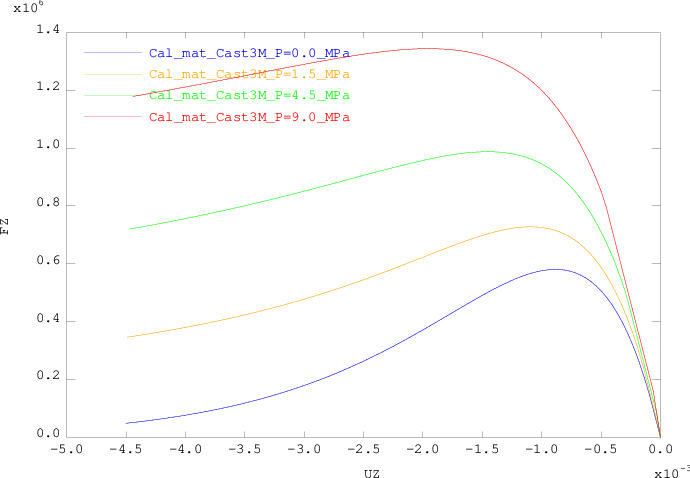
   
   Force de réaction en fonction du déplacement imposé.

Test de Willam
~~~~~~~~~~~~~~
Le cas-test se dénomme ``10_willam.dgibi``

On n'applique le cas test de Willam que pour la modélisation :ref:`massif <sec:modeles_beton_test_mass_willam>`. En effet, la biaxialité du chargement n'a pas de sens avec la modélisation poutre à fibres qui ne traîte que des chargements de type traction-compression dans la direction de la poutre et de cisaillement dans le plan de sa section.

Le chargement du test de Willam est consistué de deux phases successives. La phase 1 consiste en un chargement de traction simple en déformation imposée ``EPXX`` dans la direction X, jusqu'à atteindre le seuil d'endommagement en déformation. La phase 2, dans laquelle on vise l'endommagement complet proche de 1, est la combinaison de trois chargements superposés : tout d'abord le chargement de traction en déformation imposée ``EPXX`` de la phase 1 est poursuivi avec une amplitude de la moitié de ce dernier ; puis un deuxième chargement de traction en déformation imposée ``EPYY`` est appliqué dans la direction Y jusqu'à atteindre les trois quarts de la déformation maximale de la phase 1 ; enfin un troisième chargement de cisaillement en glissement imposé ``GAXY`` est appliqué dans le plan XY jusqu'à atteindre la moitié de la déformation maximale de la phase 1.

L'objectif est d'évaluer l'influence de la rotation du repère de chargement (repère des contraintes principales) sur la réponse post-pic du modèle.

L'analyse des résultats porte sur les courbes :

- d'endomagemment en chaque point de Gauss des modèles massifs en fonction du temps ;
- de la contrainte moyenne en fonction de la déformation moyenne.

Solution de référence
+++++++++++++++++++++

On dispose de résultats numériques de référence obtenus par une équipe participant au benchmark du projet MECA [2] avec un modèle d'endommagement isotrope du même type que le modèle Mazars de Cast3M. Il s'agit de courbes contraintes-déformation, nommées **4a. LGCNSN Iso** dans [2] et notées **Ref_xxxx** dans les figures suivantes, auxquelles les courbes calculées d'évolution de la contrainte en fonction de la déformation peuvent être comparées. 

L'écart entre la courbe calculée et la courbe de référence est évalué via l'aire sous les courbes, jusqu'à l'abscisse maximale de l'une ou l'autre des courbes :

.. math::
   Ecart_{relatif} = \frac{Surface_{calc.} - Surface_{ref.}} {Surface_{ref.}}

Résultats du cas 3D volumique
+++++++++++++++++++++++++++++

Courbes d'évolution de l'endommagement
""""""""""""""""""""""""""""""""""""""

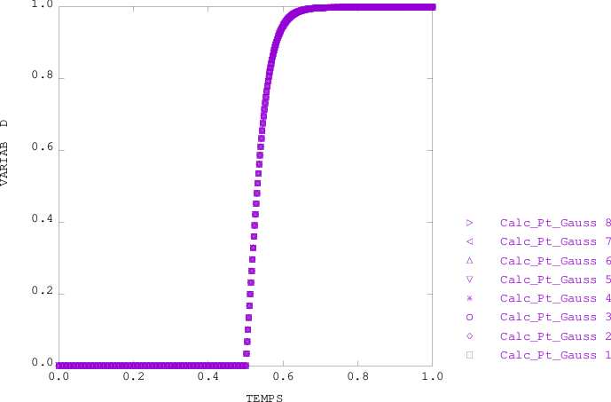
   
   Endommagement aux points de Gauss en fonction du temps.

Courbes d'évolution de la contrainte en fonction de la déformation
""""""""""""""""""""""""""""""""""""""""""""""""""""""""""""""""""

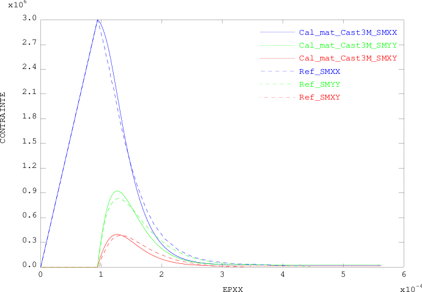
   
   Contrainte moyenne en fonction de la déformation moyenne.

Pour les trois composantes de contrainte, l'écart relatif sur l'aire sous la courbe entre la courbe calculée et la courbe de référence est :

- Pour ``SMXX`` : :math:`Ecart_{relatif} = -1.74385.10^{-2}` ;
- Pour ``SMYY`` : :math:`Ecart_{relatif} = -5.88999.10^{-2}` ;
- Pour ``SMXY`` : :math:`Ecart_{relatif} = -8.87497.10^{-2}` ;

En conséquence, les résultats du cas-test ``10_willam.dgibi`` en mode 3D volumique sont jugés satisfaisants.

Résultats du cas 2D contraintes planes
++++++++++++++++++++++++++++++++++++++

Courbes d'évolution de l'endommagement
""""""""""""""""""""""""""""""""""""""

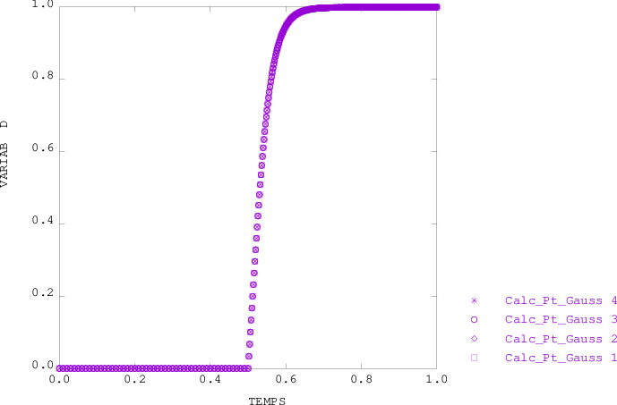
   
   Endommagement aux points de Gauss en fonction du temps.

Courbes d'évolution de la contrainte en fonction de la déformation
""""""""""""""""""""""""""""""""""""""""""""""""""""""""""""""""""

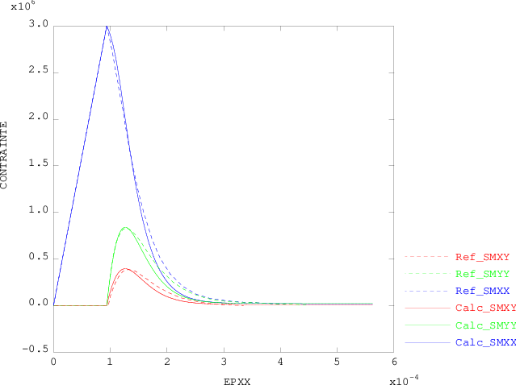
   
   Contrainte moyenne en fonction de la déformation moyenne.

Pour les trois composantes de contrainte, l'écart relatif sur l'aire sous la courbe entre la courbe calculée et la courbe de référence est :

- Pour ``SMXX`` : :math:`Ecart_{relatif} = -3.84282.10^{-2}` ;
- Pour ``SMYY`` : :math:`Ecart_{relatif} = -1.42927.10^{-1}` ;
- Pour ``SMXY`` : :math:`Ecart_{relatif} = -8.87497.10^{-2}` ;

En conséquence, les résultats du cas-test ``10_willam.dgibi`` en mode 2D contraintes planes sont jugés satisfaisants.

