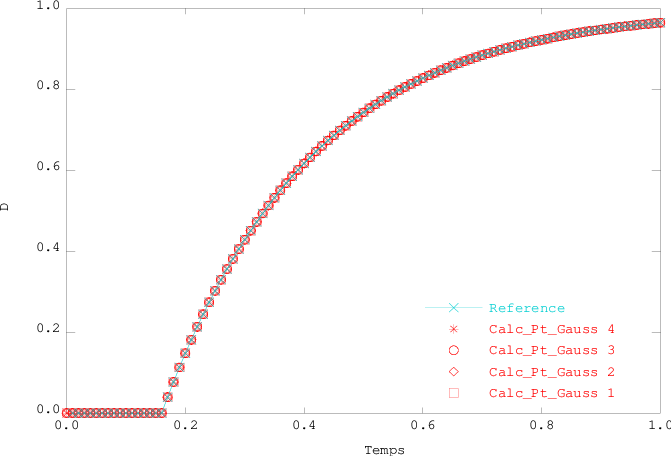

.. _sec:modeles_beton_verif:

Vérification
============

Ce chapitre présente la démarche de vérification élémentaire pour l'ensemble des lois de comportement pour
le béton disponibles dans Cast3M. Pour chaque loi de comportement y sont décrit :

- les cas de chargement appliqués (selon la :ref:`spécification des tests <sec:modeles_beton_tests>`) ;
- les phénomènes observés ;
- la solution de référence ;
- les résultats et leur comparaison à la référence.

Pour les tests unitaires, c'est-à-dire portant sur un seul élément fini, la géométrie considérée est toujours :

- en 3D/2D poutre à fibres : 1 élément **TIMO** avec :math:`L=1` m et 1 élément **QUAS** de section carré avec :math:`S=1` m² ;
- en 3D volumique : 1 élément **CUB8** avec :math:`L=1` m ;
- en 2D contraintes planes : 1 élément **QUA4** avec :math:`L=1` m et :math:`e=0,1` m (paramètre **DIM3**) ;
- en 2D axisymétrique : 1 élément **QUA4** avec :math:`R=1` m et :math:`H=1` m.

Loi MAZARS
----------

Traction monotone
~~~~~~~~~~~~~~~~~
Le cas-test se dénomme ``01_traction.dgibi``

On applique le cas de chargement de traction simple pour les modélisations :ref:`poutre <sec:modeles_beton_test_pout_trac_mono>`
et :ref:`massif <sec:modeles_beton_test_mass_trac_mono>` en déplacement imposé croissant jusqu’à atteindre l’endommagement autour de 0,9.

Pour tous les modes de calcul le déplacement imposé vaut :math:`u_{max}=5.10^{-4}` m.

L’objectif est d’évaluer la limite en traction puis le comportement post-pic du modèle.

L'analyse des résultats porte sur les courbes :

- d'endomagemment moyen en fonction du temps ;
- de la contrainte moyenne en fonction de la déformation moyenne ;
- de la force de réaction globale en fonction du déplacement imposé.

Solution de référence
+++++++++++++++++++++
La solution de référence est obtenue de manière analytique à partir de l'équation donnant la loi de l'évolution de l'endommagement en traction :

.. math::
   D_t = 1 - \frac{e_0 (1 - A_t)}{e} - A_t\exp\left[-B_t (e - e_0)\right]
   
où :

- :math:`A_t` et :math:`B_t` sont les paramètres de la loi de Mazars en traction ;
- :math:`e_0` est le seuil d'endommagement en déformation ;
- :math:`e` est la déformation équivalente selon la formulation proposée par Mazars :

.. math::
   {e} = \sqrt{\sum_{i=1}^{^{n}}\langle\epsilon_{i}\rangle^{2}}
   
où :math:`\langle\epsilon_{i}\rangle` est la partie positive de la i-ème déformation principale et :math:`n` répresente la dimension du problème consideré (cf. chapitre :ref:`mazars`).
   
L'expression de la déformation équivalente :math:`e` dépend du mode de représentation géométrique (choix de modélisation E.F. et dimension spatiale) et doit donc être spécifiée dans chaque cas.

Résultats du cas 3D poutre à fibre
++++++++++++++++++++++++++++++++++

Déformation équivalente
"""""""""""""""""""""""
Le tenseur des déformations s'obtient en inversant la relation contrainte-déformation en élasticité (loi de Hooke généralisée pour un matériau isotrope) :

.. math::

   \boldsymbol{\varepsilon} = \frac{1 + \nu}{E}\boldsymbol{\sigma} - \frac{\nu}{E} Tr(\boldsymbol{\sigma}) \boldsymbol{I}

La traction est uniaxiale dans la direction :math:`x` qui coincide avec la direction de la poutre, d'où l'expression du tenseur des contraintes :

.. math::

   \boldsymbol{\sigma} = 
      \begin{bmatrix}
         \sigma_{xx} & 0 & 0 \\
         0 & 0 & 0 \\
         0 & 0 & 0
      \end{bmatrix}

et de sa trace :

.. math::

   Tr(\boldsymbol{\sigma}) = \sigma_{xx}

Dans Cast3M, :math:`\sigma_{xx}` correspond à la composante ``SMXX`` du sous-champs ``VONS`` du champs des variables internes ``VARIABLES_INTERNES`` en sortie de ``PASAPAS``.

D'où l'expression du tenseur des déformations :

.. math::

   \boldsymbol{\varepsilon} = 
      \begin{bmatrix}
         \frac{1}{E}\sigma_{xx} & 0 & 0 \\
         0 & -\frac{\nu}{E}\sigma_{xx} & 0 \\
         0 & 0 & -\frac{\nu}{E}\sigma_{xx}
      \end{bmatrix}

Or, :math:`\sigma_{xx}>0` (traction)

D'où :

- :math:`\epsilon_{xx}=\frac{1}{E}\sigma_{xx}>0`, donc :math:`\langle\epsilon_{xx}\rangle=\frac{1}{E}\sigma_{xx}`
- :math:`\epsilon_{yy}=\epsilon_{zz}=-\frac{\nu}{E}\sigma_{xx}<0`, donc :math:`\langle\epsilon_{yy}\rangle=\langle\epsilon_{zz}\rangle=0`

La déformation équivalente s'exprime donc par :

.. math::
   {e} = \sqrt{\langle\epsilon_{xx}\rangle^{2}+\langle\epsilon_{yy}\rangle^{2}+\langle\epsilon_{zz}\rangle^{2}}=\frac{1}{E}\sigma_{xx}=\epsilon_{xx}

Dans Cast3M, :math:`\epsilon_{xx}` correspond à la composante ``VISXX``, rebaptisée ``EPXX``, du sous-champs ``VAIS`` du champs des variables internes ``VARIABLES_INTERNES`` en sortie de ``PASAPAS``.

Courbe d'évolution de l'endommagement
"""""""""""""""""""""""""""""""""""""

.. figure:: figures/mazars_trac_mono_d_3dpaf.png
   :width: 15cm
   :align: center
   
   Endommagement aux points de Gauss en fonction du temps.

Courbe d'évolution de la contrainte en fonction de la déformation
"""""""""""""""""""""""""""""""""""""""""""""""""""""""""""""""""

.. figure:: figures/mazars_trac_mono_s_3dpaf.png
   :width: 15cm
   :align: center
   
   Contrainte aux points de Gauss en fonction de la déformation moyenne.

L'écart relatif maximum en contrainte entre la solution calculée et la solution de référence est :

.. math::
   3.18393.10^{-15} < 1.10^{-10}
   
En conséquence, les résultats du cas-test ``01_traction.dgibi`` en mode 3D poutre à fibre sont jugés satisfaisants.

Courbe d'évolution de la force de réaction en fonction du déplacement imposé
""""""""""""""""""""""""""""""""""""""""""""""""""""""""""""""""""""""""""""

.. figure:: figures/mazars_trac_mono_f_3dpaf.png
   :width: 15cm
   :align: center
   
   Force de réaction en fonction du déplacement imposé.

Résultats du cas 2D poutre à fibre
++++++++++++++++++++++++++++++++++

Déformation équivalente
"""""""""""""""""""""""
Le tenseur des déformations s'obtient en inversant la relation contrainte-déformation en élasticité (loi de Hooke généralisée pour un matériau isotrope) :

.. math::

   \boldsymbol{\varepsilon} = \frac{1 + \nu}{E}\boldsymbol{\sigma} - \frac{\nu}{E} Tr(\boldsymbol{\sigma}) \boldsymbol{I}

La traction est uniaxiale dans la direction :math:`x` qui coincide avec la direction de la poutre, d'où l'expression du tenseur des contraintes :

.. math::

   \boldsymbol{\sigma} = 
      \begin{bmatrix}
         \sigma_{xx} & 0 \\
         0 & 0
      \end{bmatrix}

et de sa trace :

.. math::

   Tr(\boldsymbol{\sigma}) = \sigma_{xx}

Dans Cast3M, :math:`\sigma_{xx}` correspond à la composante ``SMXX`` du sous-champs ``VONS`` du champs des variables internes ``VARIABLES_INTERNES`` en sortie de ``PASAPAS``.

D'où l'expression du tenseur des déformations :

.. math::

   \boldsymbol{\varepsilon} = 
      \begin{bmatrix}
         \frac{1}{E}\sigma_{xx} & 0 \\
         0 & -\frac{\nu}{E}\sigma_{xx}
      \end{bmatrix}

Or, :math:`\sigma_{xx}>0` (traction)

D'où :

- :math:`\epsilon_{xx}=\frac{1}{E}\sigma_{xx}>0`, donc :math:`\langle\epsilon_{xx}\rangle=\frac{1}{E}\sigma_{xx}`
- :math:`\epsilon_{yy}=-\frac{\nu}{E}\sigma_{xx}<0`, donc :math:`\langle\epsilon_{yy}\rangle=0`

La déformation équivalente s'exprime donc par :

.. math::
   {e} = \sqrt{\langle\epsilon_{xx}\rangle^{2}+\langle\epsilon_{yy}\rangle^{2}}=\frac{1}{E}\sigma_{xx}=\epsilon_{xx}

Dans Cast3M, :math:`\epsilon_{xx}` correspond à la composante ``VISXX``, rebaptisée ``EPXX``, du sous-champs ``VAIS`` du champs des variables internes ``VARIABLES_INTERNES`` en sortie de ``PASAPAS``.

Courbe d'évolution de l'endommagement
"""""""""""""""""""""""""""""""""""""

   
   Endommagement aux points de Gauss en fonction du temps.

Courbe d'évolution de la contrainte en fonction de la déformation
"""""""""""""""""""""""""""""""""""""""""""""""""""""""""""""""""

.. figure:: figures/mazars_trac_mono_s_2dpaf.png
   :width: 15cm
   :align: center
   
   Contrainte aux points de Gauss en fonction de la déformation moyenne.

L'écart relatif maximum en contrainte entre la solution calculée et la solution de référence est :

.. math::
   3.18393.10^{-15} < 1.10^{-10}
   
En conséquence, les résultats du cas-test ``01_traction.dgibi`` en mode 2D poutre à fibre sont jugés satisfaisants.

Courbe d'évolution de la force de réaction en fonction du déplacement imposé
""""""""""""""""""""""""""""""""""""""""""""""""""""""""""""""""""""""""""""

.. figure:: figures/mazars_trac_mono_f_2dpaf.png
   :width: 15cm
   :align: center
   
   Force de réaction en fonction du déplacement imposé.

Résultats du cas 3D volumique
+++++++++++++++++++++++++++++

Déformation équivalente
"""""""""""""""""""""""
Le tenseur des déformations s'obtient en inversant la relation contrainte-déformation en élasticité (loi de Hooke généralisée pour un matériau isotrope) :

.. math::

   \boldsymbol{\varepsilon} = \frac{1 + \nu}{E}\boldsymbol{\sigma} - \frac{\nu}{E} Tr(\boldsymbol{\sigma}) \boldsymbol{I}

La traction est uniaxiale dans la direction :math:`x`, d'où l'expression du tenseur des contraintes :

.. math::

   \boldsymbol{\sigma} = 
      \begin{bmatrix}
         \sigma_{xx} & 0 & 0 \\
         0 & 0 & 0 \\
         0 & 0 & 0
      \end{bmatrix}

et de sa trace :

.. math::

   Tr(\boldsymbol{\sigma}) = \sigma_{xx}

Dans Cast3M, :math:`\sigma_{xx}` correspond à la composante ``SMXX`` du tenseur des contraintes ``TAB1.'CONTRAINTES'`` en sortie de ``PASAPAS``.

D'où l'expression du tenseur des déformations :

.. math::

   \boldsymbol{\varepsilon} = 
      \begin{bmatrix}
         \frac{1}{E}\sigma_{xx} & 0 & 0 \\
         0 & -\frac{\nu}{E}\sigma_{xx} & 0 \\
         0 & 0 & -\frac{\nu}{E}\sigma_{xx}
      \end{bmatrix}

Or, :math:`\sigma_{xx}>0` (traction)

D'où :

- :math:`\epsilon_{xx}=\frac{1}{E}\sigma_{xx}>0`, donc :math:`\langle\epsilon_{xx}\rangle=\frac{1}{E}\sigma_{xx}`
- :math:`\epsilon_{yy}=\epsilon_{zz}=-\frac{\nu}{E}\sigma_{xx}<0`, donc :math:`\langle\epsilon_{yy}\rangle=\langle\epsilon_{zz}\rangle=0`

La déformation équivalente s'exprime donc par :

.. math::
   {e} = \sqrt{\langle\epsilon_{xx}\rangle^{2}+\langle\epsilon_{yy}\rangle^{2}+\langle\epsilon_{zz}\rangle^{2}}=\frac{1}{E}\sigma_{xx}=\epsilon_{xx}

Dans Cast3M, :math:`\epsilon_{xx}` correspond à la composante ``EPXX`` du tenseur des déformations ``TAB1.'DEFORMATIONS'`` en sortie de ``PASAPAS``.

Courbe d'évolution de l'endommagement
"""""""""""""""""""""""""""""""""""""

.. figure:: figures/mazars_trac_mono_d_3d.png
   :width: 15cm
   :align: center
   
   Endommagement moyen en fonction du temps.

Courbe d'évolution de la contrainte en fonction de la déformation
"""""""""""""""""""""""""""""""""""""""""""""""""""""""""""""""""

.. figure:: figures/mazars_trac_mono_s_3d.png
   :width: 15cm
   :align: center
   
   Contrainte moyenne en fonction de la déformation moyenne.

L'écart relatif maximum en contrainte entre la solution calculée et la solution de référence est :

.. math::
   5.57047.10^{-15} < 1.10^{-10}
   
En conséquence, les résultats du cas-test ``01_traction.dgibi`` en mode 3D volumique sont jugés satisfaisants.

Courbe d'évolution de la force de réaction en fonction du déplacement imposé
""""""""""""""""""""""""""""""""""""""""""""""""""""""""""""""""""""""""""""

.. figure:: figures/mazars_trac_mono_f_3d.png
   :width: 15cm
   :align: center
   
   Force de réaction en fonction du déplacement imposé.

Résultats du cas 2D contraintes planes
++++++++++++++++++++++++++++++++++++++

Déformation équivalente
"""""""""""""""""""""""
Le tenseur des déformations s'obtient en inversant la relation contrainte-déformation en élasticité (loi de Hooke généralisée pour un matériau isotrope) :

.. math::

   \boldsymbol{\varepsilon} = \frac{1 + \nu}{E}\boldsymbol{\sigma} - \frac{\nu}{E} Tr(\boldsymbol{\sigma}) \boldsymbol{I}

La traction est uniaxiale dans la direction :math:`x`, d'où l'expression du tenseur des contraintes :

.. math::

   \boldsymbol{\sigma} = 
      \begin{bmatrix}
         \sigma_{xx} & 0 \\
         0 & 0
      \end{bmatrix}

et de sa trace :

.. math::

   Tr(\boldsymbol{\sigma}) = \sigma_{xx}

Dans Cast3M, :math:`\sigma_{xx}` correspond à la composante ``SMXX`` du tenseur des contraintes ``TAB1.'CONTRAINTES'`` en sortie de ``PASAPAS``.

D'où l'expression du tenseur des déformations :

.. math::

   \boldsymbol{\varepsilon} = 
      \begin{bmatrix}
         \frac{1}{E}\sigma_{xx} & 0 \\
         0 & -\frac{\nu}{E}\sigma_{xx}
      \end{bmatrix}

Or, :math:`\sigma_{xx}>0` (traction)

D'où :

- :math:`\epsilon_{xx}=\frac{1}{E}\sigma_{xx}>0`, donc :math:`\langle\epsilon_{xx}\rangle=\frac{1}{E}\sigma_{xx}`
- :math:`\epsilon_{yy}=-\frac{\nu}{E}\sigma_{xx}<0`, donc :math:`\langle\epsilon_{yy}\rangle=0`

La déformation équivalente s'exprime donc par :

.. math::
   {e} = \sqrt{\langle\epsilon_{xx}\rangle^{2}+\langle\epsilon_{yy}\rangle^{2}}=\frac{1}{E}\sigma_{xx}=\epsilon_{xx}

Dans Cast3M, :math:`\epsilon_{xx}` correspond à la composante ``EPXX`` du tenseur des déformations ``TAB1.'DEFORMATIONS'`` en sortie de ``PASAPAS``.

Courbe d'évolution de l'endommagement
"""""""""""""""""""""""""""""""""""""

.. figure:: figures/mazars_trac_mono_d_2dplan.png
   :width: 15cm
   :align: center
   
   Endommagement moyen en fonction du temps.

Courbe d'évolution de la contrainte en fonction de la déformation
"""""""""""""""""""""""""""""""""""""""""""""""""""""""""""""""""

.. figure:: figures/mazars_trac_mono_s_2dplan.png
   :width: 15cm
   :align: center
   
   Contrainte moyenne en fonction de la déformation moyenne.

L'écart relatif maximum en contrainte entre la solution calculée et la solution de référence est :

.. math::
   5.74126.10^{-15} < 1.10^{-10}
   
En conséquence, les résultats du cas-test ``01_traction.dgibi`` en mode 2D contraintes planes sont jugés satisfaisants.

Courbe d'évolution de la force de réaction en fonction du déplacement imposé
""""""""""""""""""""""""""""""""""""""""""""""""""""""""""""""""""""""""""""

   
   Force de réaction en fonction du déplacement imposé.

Résultats du cas 2D axisymétrique
+++++++++++++++++++++++++++++++++

Déformation équivalente
"""""""""""""""""""""""
Le tenseur des déformations s'obtient en inversant la relation contrainte-déformation en élasticité (loi de Hooke généralisée pour un matériau isotrope) :

.. math::

   \boldsymbol{\varepsilon} = \frac{1 + \nu}{E}\boldsymbol{\sigma} - \frac{\nu}{E} Tr(\boldsymbol{\sigma}) \boldsymbol{I}

La traction est uniaxiale dans la direction :math:`z`, d'où l'expression du tenseur des contraintes :

.. math::

   \boldsymbol{\sigma} = 
      \begin{bmatrix}
         0 & 0 \\
         0 & \sigma_{zz}
      \end{bmatrix}

et de sa trace :

.. math::

   Tr(\boldsymbol{\sigma}) = \sigma_{zz}

Dans Cast3M, :math:`\sigma_{zz}` correspond à la composante ``SMZZ`` du tenseur des contraintes ``TAB1.'CONTRAINTES'`` en sortie de ``PASAPAS``.

D'où l'expression du tenseur des déformations :

.. math::

   \boldsymbol{\varepsilon} = 
      \begin{bmatrix}
         -\frac{\nu}{E}\sigma_{zz} & 0 \\
         0 & \frac{1}{E}\sigma_{zz}
      \end{bmatrix}

Or, :math:`\sigma_{zz}>0` (traction)

D'où :

- :math:`\epsilon_{rr}=-\frac{\nu}{E}\sigma_{zz}<0`, donc :math:`\langle\epsilon_{rr}\rangle=0`
- :math:`\epsilon_{zz}=\frac{1}{E}\sigma_{zz}>0`, donc :math:`\langle\epsilon_{zz}\rangle=\frac{1}{E}\sigma_{zz}`

La déformation équivalente s'exprime donc par :

.. math::
   {e} = \sqrt{\langle\epsilon_{rr}\rangle^{2}+\langle\epsilon_{zz}\rangle^{2}}=\frac{1}{E}\sigma_{zz}=\epsilon_{zz}

Dans Cast3M, :math:`\epsilon_{zz}` correspond à la composante ``EPZZ`` du tenseur des déformations ``TAB1.'DEFORMATIONS'`` en sortie de ``PASAPAS``.

Courbe d'évolution de l'endommagement
"""""""""""""""""""""""""""""""""""""

.. figure:: figures/mazars_trac_mono_d_2daxi.png
   :width: 15cm
   :align: center
   
   Endommagement moyen en fonction du temps.

Courbe d'évolution de la contrainte en fonction de la déformation
"""""""""""""""""""""""""""""""""""""""""""""""""""""""""""""""""

.. figure:: figures/mazars_trac_mono_s_2daxi.png
   :width: 15cm
   :align: center
   
   Contrainte moyenne en fonction de la déformation moyenne.

L'écart relatif maximum en contrainte entre la solution calculée et la solution de référence est :

.. math::
   5.61645.10^{-15} < 1.10^{-10}
   
En conséquence, les résultats du cas-test ``01_traction.dgibi`` en mode 2D axisymétrique sont jugés satisfaisants.

Courbe d'évolution de la force de réaction en fonction du déplacement imposé
""""""""""""""""""""""""""""""""""""""""""""""""""""""""""""""""""""""""""""

.. figure:: figures/mazars_trac_mono_f_2daxi.png
   :width: 15cm
   :align: center
   
   Force de réaction en fonction du déplacement imposé.

Compression monotone
~~~~~~~~~~~~~~~~~~~~
Le cas-test se dénomme ``02_compression.dgibi``

TODO

Traction cyclique
~~~~~~~~~~~~~~~~~
Le cas-test se dénomme ``03_traction_cyclique.dgibi``

TODO

Compression cyclique
~~~~~~~~~~~~~~~~~~~~
Le cas-test se dénomme ``04_compression_cyclique.dgibi``

TODO

Traction-compression alternées
~~~~~~~~~~~~~~~~~~~~~~~~~~~~~~
Le cas-test se dénomme ``05_traction_compression.dgibi``

TODO

Traction-compression-traction alternées
~~~~~~~~~~~~~~~~~~~~~~~~~~~~~~~~~~~~~~~
Le cas-test se dénomme ``06_traction_compression_traction.dgibi``

TODO

Cisaillement monotone
~~~~~~~~~~~~~~~~~~~~~
Le cas-test se dénomme ``07_cisaillement.dgibi``

TODO

Chargement biaxial proportionnel élastique
~~~~~~~~~~~~~~~~~~~~~~~~~~~~~~~~~~~~~~~~~~
Le cas-test se dénomme ``08_biaxial.dgibi``

L'analyse des résultats porte sur la courbe :math:`\sigma_{yy} = f(\sigma_{xx})`.

Les modes de calcul testés sont :

- 3D volumique ;
- 2D contraintes planes.

Solution de référence
"""""""""""""""""""""
La solution de référence est obtenue de manière analytique à partir des équations de la loi.

Résultats
"""""""""

.. figure:: figures/mazars_biax_3d.png
   :width: 15cm
   :align: center
   
   Domaine élastique 3D.

.. figure:: figures/mazars_biax_2d.png
   :width: 15cm
   :align: center
   
   Domaine élastique 2D contraintes planes.

Chargement Triaxial proportionnel élastique
~~~~~~~~~~~~~~~~~~~~~~~~~~~~~~~~~~~~~~~~~~~
Le cas-test se dénomme ``09_triaxial.dgibi``

TODO

Chargement ?
~~~~~~~~~~~~
Le cas-test se dénomme ``10_willam.dgibi``

TODO

