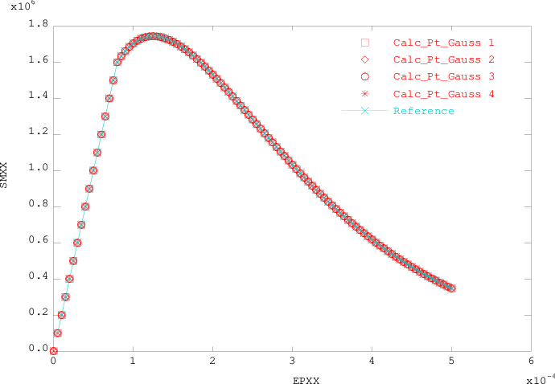

.. _sec:modeles_beton_verif:

Vérification
============

Ce chapitre présente la démarche de vérification élémentaire pour l'ensemble des lois de comportement pour
le béton disponibles dans Cast3M. Pour chaque loi de comportement y sont décrit :

- les cas de chargement appliqués (selon la :ref:`spécification des tests <sec:modeles_beton_tests>`) ;
- les phénomènes observés ;
- la solution de référence ;
- les résultats et leur comparaison à la référence.

Pour les tests unitaires, c'est-à-dire portant sur un seul élément fini, la géométrie considérée est toujours :

- en 3D/2D poutre à fibres : 1 élément **TIMO** avec :math:`L=1` m et 1 élément **QUAS** de section carré avec :math:`S=1` m² [nh145313 : actuellement :math:`S=10^{-2}` m²];
- en 3D volumique : 1 élément **CUB8** avec :math:`L=1` m ;
- en 2D contraintes planes : 1 élément **QUA4** avec :math:`L=1` m et :math:`e=0,1` m (paramètre **DIM3**) ;
- en 2D axisymétrique : 1 élément **QUA4** avec :math:`R=1` m et :math:`H=1` m.

Loi MAZARS
----------

Traction monotone
~~~~~~~~~~~~~~~~~
Le cas-test se dénomme ``01_traction.dgibi``

On applique le cas de chargement de traction simple pour les modélisations :ref:`poutre <sec:modeles_beton_test_pout_trac_mono>`
et :ref:`massif <sec:modeles_beton_test_mass_trac_mono>` en déplacement imposé croissant jusqu’à atteindre l’endommagement autour de 0,9.

Pour tous les modes de calcul le déplacement imposé vaut :math:`u_{max}=5.10^{-4}` m.

L’objectif est d’évaluer la limite en traction puis le comportement post-pic du modèle.

L'analyse des résultats porte sur les courbes :

- d'endomagemment soit en chaque point de Gauss de la section de la poutre pour les modèles poutre à fibres, soit moyen pour les modèles massifs, en fonction du temps ;
- de la contrainte soit en chaque point de Gauss de la section de la poutre pour les modèles poutre à fibres, soit moyenne pour les modèles massifs, en fonction de la déformation moyenne ;
- de la force de réaction globale en fonction du déplacement imposé.

Solution de référence
+++++++++++++++++++++
La solution de référence est obtenue de manière analytique à partir de l'équation donnant la loi de l'évolution de l'endommagement en traction.

Endommagement
"""""""""""""

.. math::
   D_t = 1 - \frac{e_0 (1 - A_t)}{e} - A_t\exp\left[-B_t (e - e_0)\right]
   
où :

- :math:`A_t` et :math:`B_t` sont les paramètres de la loi de Mazars en traction ;
- :math:`e_0` est le seuil d'endommagement en déformation ;
- :math:`e` est la déformation équivalente selon la formulation proposée par Mazars :

.. math::
   {e} = \sqrt{\sum_{i=1}^{^{n}}\langle\epsilon_{i}\rangle^{2}}
   
où :math:`\langle\epsilon_{i}\rangle` est la partie positive de la i-ème déformation principale et :math:`n` répresente la dimension du problème consideré (cf. chapitre :ref:`mazars`).
   
L'expression de la déformation équivalente :math:`e` dépend du mode de représentation géométrique (choix de modélisation E.F. et dimension spatiale) et doit donc être spécifiée dans chaque cas.

Contrainte
""""""""""
Pour un problème en déplacement imposé (i.e. en déformation imposée dans la cas présent unitaire géométrique), l'expression de la contrainte se déduit de la relation contrainte-déformation et de l'expression de l'endommagement :

.. math::

   \boldsymbol{\sigma} = (1-D_{t}) \mathbb{E} : \boldsymbol{\varepsilon}

Résultats du cas 3D poutre à fibres
+++++++++++++++++++++++++++++++++++

Solution de référence
"""""""""""""""""""""
Dans la source fibmaz.eso décrivant le modèle Mazars pour la poutre à fibres, quelque soit la dimension géométrique du problème, le tenseur des déformations est défini en 3D de la façon suivante :

.. math::

   \boldsymbol{\epsilon} = 
      \begin{bmatrix}
         \epsilon_{xx} & \epsilon_{xy} & \epsilon_{xz} \\
         \epsilon_{xy} & -\nu\epsilon_{xx} & 0 \\
         \epsilon_{xz} & 0 & -\nu\epsilon_{xx}
      \end{bmatrix}

Or, la traction est uniaxiale dans la direction :math:`x`, donc :math:`\epsilon_{xy}=\epsilon_{xz}=0`, d'où :

.. math::

   \boldsymbol{\epsilon} = 
      \begin{bmatrix}
         \epsilon_{xx} & 0 & 0 \\
         0 & -\nu\epsilon_{xx} & 0 \\
         0 & 0 & -\nu\epsilon_{xx}
      \end{bmatrix}

Sachant que :math:`\epsilon_{xx}>0` (traction), on a :

- :math:`\langle\epsilon_{xx}\rangle=\epsilon_{xx}`
- :math:`\epsilon_{yy}=\epsilon_{zz}=-\nu\epsilon_{xx}<0`, donc :math:`\langle\epsilon_{yy}\rangle=\langle\epsilon_{zz}\rangle=0`

La déformation équivalente s'exprime donc par :

.. math::
   {e} = \sqrt{\langle\epsilon_{xx}\rangle^{2}+\langle\epsilon_{yy}\rangle^{2}+\langle\epsilon_{zz}\rangle^{2}}=\epsilon_{xx}

On en déduit la solution de référence de l'endommagement :

.. math::
   D_t = 1 - \frac{e_0 (1 - A_t)}{\epsilon_{xx}} - A_t\exp\left[-B_t (\epsilon_{xx} - e_0)\right]

Puis la solution de référence de la contrainte dans la direction de la poutre :

.. math::
   \sigma_{xx}=(1-D_t) E \epsilon_{xx}

Dans Cast3M, 

- :math:`\epsilon_{xx}` correspond à la composante ``'VISXX'``, rebaptisée ci-dessous ``'EPXX'``, du sous-champs ``'VAIS'`` du champs des variables internes ``TAB1.'VARIABLES_INTERNES'`` en sortie de ``PASAPAS``.

- :math:`\sigma_{xx}` correspond à la composante ``'SMXX'`` du sous-champs ``'VONS'`` du champs des variables internes ``TAB1.'VARIABLES_INTERNES'`` en sortie de ``PASAPAS``.

Courbe d'évolution de l'endommagement
"""""""""""""""""""""""""""""""""""""

.. figure:: figures/mazars_trac_mono_d_3dpaf.png
   :width: 15cm
   :align: center
   
   Endommagement aux points de Gauss en fonction du temps.

Courbe d'évolution de la contrainte en fonction de la déformation
"""""""""""""""""""""""""""""""""""""""""""""""""""""""""""""""""

   
   Contrainte aux points de Gauss en fonction de la déformation moyenne.

L'écart relatif maximum en contrainte entre la solution calculée et la solution de référence est :

.. math::
   3.18393.10^{-15} < 1.10^{-10}
   
En conséquence, les résultats du cas-test ``01_traction.dgibi`` en mode 3D poutre à fibres sont jugés satisfaisants.

Courbe d'évolution de la force de réaction en fonction du déplacement imposé
""""""""""""""""""""""""""""""""""""""""""""""""""""""""""""""""""""""""""""

   
   Force de réaction en fonction du déplacement imposé.

Résultats du cas 2D poutre à fibres
+++++++++++++++++++++++++++++++++++

Solution de référence
"""""""""""""""""""""
Dans la mesure où le tenseur des déformations est défini en 3D dans le modèle Mazars pour la poutre à fibres, son expression dans le cas 2D est la même que dans le cas 3D :

.. math::

   \boldsymbol{\epsilon} = 
      \begin{bmatrix}
         \epsilon_{xx} & \epsilon_{xy} & \epsilon_{xz} \\
         \epsilon_{xy} & -\nu\epsilon_{xx} & 0 \\
         \epsilon_{xz} & 0 & -\nu\epsilon_{xx}
      \end{bmatrix}

Or, la traction est uniaxiale dans la direction :math:`x`, donc :math:`\epsilon_{xy}=\epsilon_{xz}=0`, d'où :

.. math::

   \boldsymbol{\epsilon} = 
      \begin{bmatrix}
         \epsilon_{xx} & 0 & 0 \\
         0 & -\nu\epsilon_{xx} & 0 \\
         0 & 0 & -\nu\epsilon_{xx}
      \end{bmatrix}

Sachant que :math:`\epsilon_{xx}>0` (traction), on a :

- :math:`\langle\epsilon_{xx}\rangle=\epsilon_{xx}`
- :math:`\epsilon_{yy}=\epsilon_{zz}=-\nu\epsilon_{xx}<0`, donc :math:`\langle\epsilon_{yy}\rangle=\langle\epsilon_{zz}\rangle=0`

La déformation équivalente s'exprime donc par :

.. math::
   {e} = \sqrt{\langle\epsilon_{xx}\rangle^{2}+\langle\epsilon_{yy}\rangle^{2}+\langle\epsilon_{zz}\rangle^{2}}=\epsilon_{xx}

On en déduit la solution de référence de l'endommagement :

.. math::
   D_t = 1 - \frac{e_0 (1 - A_t)}{\epsilon_{xx}} - A_t\exp\left[-B_t (\epsilon_{xx} - e_0)\right]

Puis la solution de référence de la contrainte dans la direction de la poutre :

.. math::
   \sigma_{xx}=(1-D_t) E \epsilon_{xx}

Dans Cast3M, 

- :math:`\epsilon_{xx}` correspond à la composante ``'VISXX'``, rebaptisée ci-dessous ``'EPXX'``, du sous-champs ``'VAIS'`` du champs des variables internes ``TAB1.'VARIABLES_INTERNES'`` en sortie de ``PASAPAS``.

- :math:`\sigma_{xx}` correspond à la composante ``'SMXX'`` du sous-champs ``'VONS'`` du champs des variables internes ``TAB1.'VARIABLES_INTERNES'`` en sortie de ``PASAPAS``.

Courbe d'évolution de l'endommagement
"""""""""""""""""""""""""""""""""""""

.. figure:: figures/mazars_trac_mono_d_2dpaf.png
   :width: 15cm
   :align: center
   
   Endommagement aux points de Gauss en fonction du temps.

Courbe d'évolution de la contrainte en fonction de la déformation
"""""""""""""""""""""""""""""""""""""""""""""""""""""""""""""""""

.. figure:: figures/mazars_trac_mono_s_2dpaf.png
   :width: 15cm
   :align: center
   
   Contrainte aux points de Gauss en fonction de la déformation moyenne.

L'écart relatif maximum en contrainte entre la solution calculée et la solution de référence est :

.. math::
   3.18393.10^{-15} < 1.10^{-10}
   
En conséquence, les résultats du cas-test ``01_traction.dgibi`` en mode 2D poutre à fibres sont jugés satisfaisants.

Courbe d'évolution de la force de réaction en fonction du déplacement imposé
""""""""""""""""""""""""""""""""""""""""""""""""""""""""""""""""""""""""""""

.. figure:: figures/mazars_trac_mono_f_2dpaf.png
   :width: 15cm
   :align: center
   
   Force de réaction en fonction du déplacement imposé.

Résultats du cas 3D volumique
+++++++++++++++++++++++++++++

Solution de référence
"""""""""""""""""""""
La traction est uniaxiale dans la direction :math:`x`, d'où l'expression du tenseur des déformations :

.. math::

   \boldsymbol{\epsilon} = 
      \begin{bmatrix}
         \epsilon_{xx} & 0 & 0 \\
         0 & -\nu\epsilon_{xx} & 0 \\
         0 & 0 & -\nu\epsilon_{xx}
      \end{bmatrix}

Sachant que :math:`\epsilon_{xx}>0` (traction), on a :

- :math:`\langle\epsilon_{xx}\rangle=\epsilon_{xx}`
- :math:`\epsilon_{yy}=\epsilon_{zz}=-\nu\epsilon_{xx}<0`, donc :math:`\langle\epsilon_{yy}\rangle=\langle\epsilon_{zz}\rangle=0`

La déformation équivalente s'exprime donc par :

.. math::
   {e} = \sqrt{\langle\epsilon_{xx}\rangle^{2}+\langle\epsilon_{yy}\rangle^{2}+\langle\epsilon_{zz}\rangle^{2}}=\epsilon_{xx}

On en déduit la solution de référence de l'endommagement :

.. math::
   D_t = 1 - \frac{e_0 (1 - A_t)}{\epsilon_{xx}} - A_t\exp\left[-B_t (\epsilon_{xx} - e_0)\right]

Puis la solution de référence de la contrainte dans la direction :math:`x` :

.. math::
   \sigma_{xx}=(1-D_t) E \epsilon_{xx}

Dans Cast3M, 

- :math:`\epsilon_{xx}` correspond à la composante ``'EPXX'`` du tenseur des déformations ``TAB.'DEFORMATIONS'`` en sortie de ``PASAPAS``.

- :math:`\sigma_{xx}` correspond à la composante ``'SMXX'`` du tenseur des contraintes ``TAB1.'CONTRAINTES'`` en sortie de ``PASAPAS``.

Courbe d'évolution de l'endommagement
"""""""""""""""""""""""""""""""""""""

   
   Endommagement moyen en fonction du temps.

Courbe d'évolution de la contrainte en fonction de la déformation
"""""""""""""""""""""""""""""""""""""""""""""""""""""""""""""""""

.. figure:: figures/mazars_trac_mono_s_3d.png
   :width: 15cm
   :align: center
   
   Contrainte moyenne en fonction de la déformation moyenne.

L'écart relatif maximum en contrainte entre la solution calculée et la solution de référence est :

.. math::
   5.57047.10^{-15} < 1.10^{-10}
   
En conséquence, les résultats du cas-test ``01_traction.dgibi`` en mode 3D volumique sont jugés satisfaisants.

Courbe d'évolution de la force de réaction en fonction du déplacement imposé
""""""""""""""""""""""""""""""""""""""""""""""""""""""""""""""""""""""""""""

.. figure:: figures/mazars_trac_mono_f_3d.png
   :width: 15cm
   :align: center
   
   Force de réaction en fonction du déplacement imposé.

Résultats du cas 2D contraintes planes
++++++++++++++++++++++++++++++++++++++

Solution de référence
"""""""""""""""""""""
La traction est uniaxiale dans la direction :math:`x` et, en contraintes planes, la déformation est libre dans la direction :math:`z` orthogonale au plan de représentation géométrique 2D (contration par effet de Poisson), d'où l'expression du tenseur des déformations :

.. math::

   \boldsymbol{\epsilon} = 
      \begin{bmatrix}
         \epsilon_{xx} & 0 & 0 \\
         0 & -\nu\epsilon_{xx} & 0 \\
         0 & 0 & -\nu\epsilon_{xx}
      \end{bmatrix}

Sachant que :math:`\epsilon_{xx}>0` (traction), on a :

- :math:`\langle\epsilon_{xx}\rangle=\epsilon_{xx}`
- :math:`\epsilon_{yy}=\epsilon_{zz}=-\nu\epsilon_{xx}<0`, donc :math:`\langle\epsilon_{yy}\rangle=\langle\epsilon_{zz}\rangle=0`

La déformation équivalente s'exprime donc par :

.. math::
   {e} = \sqrt{\langle\epsilon_{xx}\rangle^{2}+\langle\epsilon_{yy}\rangle^{2}+\langle\epsilon_{zz}\rangle^{2}}=\epsilon_{xx}

On en déduit la solution de référence de l'endommagement :

.. math::
   D_t = 1 - \frac{e_0 (1 - A_t)}{\epsilon_{xx}} - A_t\exp\left[-B_t (\epsilon_{xx} - e_0)\right]

Puis la solution de référence de la contrainte dans la direction :math:`x` :

.. math::
   \sigma_{xx}=(1-D_t) E \epsilon_{xx}

Dans Cast3M, 

- :math:`\epsilon_{xx}` correspond à la composante ``'EPXX'`` du tenseur des déformations ``TAB.'DEFORMATIONS'`` en sortie de ``PASAPAS``.

- :math:`\sigma_{xx}` correspond à la composante ``'SMXX'`` du tenseur des contraintes ``TAB1.'CONTRAINTES'`` en sortie de ``PASAPAS``.

Courbe d'évolution de l'endommagement
"""""""""""""""""""""""""""""""""""""

.. figure:: figures/mazars_trac_mono_d_2dplan.png
   :width: 15cm
   :align: center
   
   Endommagement moyen en fonction du temps.

Courbe d'évolution de la contrainte en fonction de la déformation
"""""""""""""""""""""""""""""""""""""""""""""""""""""""""""""""""

.. figure:: figures/mazars_trac_mono_s_2dplan.png
   :width: 15cm
   :align: center
   
   Contrainte moyenne en fonction de la déformation moyenne.

L'écart relatif maximum en contrainte entre la solution calculée et la solution de référence est :

.. math::
   5.74126.10^{-15} < 1.10^{-10}
   
En conséquence, les résultats du cas-test ``01_traction.dgibi`` en mode 2D contraintes planes sont jugés satisfaisants.

Courbe d'évolution de la force de réaction en fonction du déplacement imposé
""""""""""""""""""""""""""""""""""""""""""""""""""""""""""""""""""""""""""""

.. figure:: figures/mazars_trac_mono_f_2dplan.png
   :width: 15cm
   :align: center
   
   Force de réaction en fonction du déplacement imposé.

Résultats du cas 2D axisymétrique
+++++++++++++++++++++++++++++++++

Solution de référence
"""""""""""""""""""""
La traction est uniaxiale dans la direction :math:`z`, d'où l'expression du tenseur des déformations :

.. math::

   \boldsymbol{\epsilon} = 
      \begin{bmatrix}
         -\nu\epsilon_{zz} & 0 & 0 \\
         0 & -\nu\epsilon_{zz} & 0 \\
         0 & 0 & \epsilon_{zz}
      \end{bmatrix}

Sachant que :math:`\epsilon_{zz}>0` (traction), on a :

- :math:`\epsilon_{rr}=\epsilon_{\theta\theta}=-\nu\epsilon_{zz}<0`, donc :math:`\langle\epsilon_{rr}\rangle=\langle\epsilon_{\theta\theta}\rangle=0`
- :math:`\langle\epsilon_{zz}\rangle=\epsilon_{zz}`

La déformation équivalente s'exprime donc par :

.. math::
   {e} = \sqrt{\langle\epsilon_{rr}\rangle^{2}+\langle\epsilon_{\theta\theta}\rangle^{2}+\langle\epsilon_{zz}\rangle^{2}}=\epsilon_{zz}

On en déduit la solution de référence de l'endommagement :

.. math::
   D_t = 1 - \frac{e_0 (1 - A_t)}{\epsilon_{zz}} - A_t\exp\left[-B_t (\epsilon_{zz} - e_0)\right]

Puis la solution de référence de la contrainte dans la direction :math:`z` :

.. math::
   \sigma_{zz}=(1-D_t) E \epsilon_{zz}

Dans Cast3M, 

- :math:`\epsilon_{zz}` correspond à la composante ``'EPZZ'`` du tenseur des déformations ``TAB.'DEFORMATIONS'`` en sortie de ``PASAPAS``.

- :math:`\sigma_{zz}` correspond à la composante ``'SMZZ'`` du tenseur des contraintes ``TAB1.'CONTRAINTES'`` en sortie de ``PASAPAS``.

Courbe d'évolution de l'endommagement
"""""""""""""""""""""""""""""""""""""

.. figure:: figures/mazars_trac_mono_d_2daxi.png
   :width: 15cm
   :align: center
   
   Endommagement moyen en fonction du temps.

Courbe d'évolution de la contrainte en fonction de la déformation
"""""""""""""""""""""""""""""""""""""""""""""""""""""""""""""""""

.. figure:: figures/mazars_trac_mono_s_2daxi.png
   :width: 15cm
   :align: center
   
   Contrainte moyenne en fonction de la déformation moyenne.

L'écart relatif maximum en contrainte entre la solution calculée et la solution de référence est :

.. math::
   5.61645.10^{-15} < 1.10^{-10}
   
En conséquence, les résultats du cas-test ``01_traction.dgibi`` en mode 2D axisymétrique sont jugés satisfaisants.

Courbe d'évolution de la force de réaction en fonction du déplacement imposé
""""""""""""""""""""""""""""""""""""""""""""""""""""""""""""""""""""""""""""

   
   Force de réaction en fonction du déplacement imposé.

Compression monotone
~~~~~~~~~~~~~~~~~~~~
Le cas-test se dénomme ``02_compression.dgibi``

On applique le cas de chargement de compression simple pour les modélisations :ref:`poutre <sec:modeles_beton_test_pout_comp_mono>` et :ref:`massif <sec:modeles_beton_test_mass_comp_mono>` en déplacement imposé négatif, croissant en valeur absolue, jusqu’à atteindre l’endommagement autour de 0,9.

Pour tous les modes de calcul le déplacement imposé vaut :math:`u_{max}=-5.10^{-3}` m.

L’objectif est d’évaluer la limite en compression puis le comportement post-pic du modèle.

L'analyse des résultats porte sur les courbes :

- d'endomagemment soit en chaque point de Gauss de la section de la poutre pour les modèles poutre à fibres, soit moyen pour les modèles massifs, en fonction du temps ;
- de la contrainte soit en chaque point de Gauss de la section de la poutre pour les modèles poutre à fibres, soit moyenne pour les modèles massifs, en fonction de la déformation moyenne ;
- de la force de réaction globale en fonction du déplacement imposé.

Solution de référence
+++++++++++++++++++++
La solution de référence est obtenue de manière analytique à partir de l'équation donnant la loi de l'évolution de l'endommagement en compression.

Endommagement
"""""""""""""

.. math::
   D_c = 1 - \frac{e_0 (1 - A_c)}{e} - A_c\exp\left[-B_c (e - e_0)\right]
   
où :

- :math:`A_c` et :math:`B_c` sont les paramètres de la loi de Mazars en compression ;
- :math:`e_0` est le seuil d'endommagement en déformation ;
- :math:`e` est la déformation équivalente selon la formulation proposée par Mazars :

.. math::
   {e} = \sqrt{\sum_{i=1}^{^{n}}\langle\epsilon_{i}\rangle^{2}}
   
où :math:`\langle\epsilon_{i}\rangle` est la partie positive de la i-ème déformation principale et :math:`n` répresente la dimension du problème consideré (cf. chapitre :ref:`mazars`).
   
L'expression de la déformation équivalente :math:`e` dépend du mode de représentation géométrique (choix de modélisation E.F. et dimension spatiale) et doit donc être spécifiée dans chaque cas.

Contrainte
""""""""""
Pour un problème en déplacement imposé (i.e. en déformation imposée dans la cas présent unitaire géométrique), l'expression de la contrainte se déduit de la relation contrainte-déformation et de l'expression de l'endommagement :

.. math::

   \boldsymbol{\sigma} = (1-D_{t}) \mathbb{E} : \boldsymbol{\varepsilon}

Résultats du cas 3D poutre à fibres
+++++++++++++++++++++++++++++++++++

Solution de référence
"""""""""""""""""""""
Dans la source fibmaz.eso décrivant le modèle Mazars pour la poutre à fibres, quelque soit la dimension géométrique du problème, le tenseur des déformations est défini en 3D de la façon suivante :

.. math::

   \boldsymbol{\epsilon} = 
      \begin{bmatrix}
         \epsilon_{xx} & \epsilon_{xy} & \epsilon_{xz} \\
         \epsilon_{xy} & -\nu\epsilon_{xx} & 0 \\
         \epsilon_{xz} & 0 & -\nu\epsilon_{xx}
      \end{bmatrix}

Or, la compression est uniaxiale dans la direction :math:`x`, donc :math:`\epsilon_{xy}=\epsilon_{xz}=0`, d'où :

.. math::

   \boldsymbol{\epsilon} = 
      \begin{bmatrix}
         \epsilon_{xx} & 0 & 0 \\
         0 & -\nu\epsilon_{xx} & 0 \\
         0 & 0 & -\nu\epsilon_{xx}
      \end{bmatrix}

Sachant que :math:`\epsilon_{xx}<0` (compression), on a :

- :math:`\langle\epsilon_{xx}\rangle=0`
- :math:`\epsilon_{yy}=\epsilon_{zz}=-\nu\epsilon_{xx}>0`, donc :math:`\langle\epsilon_{yy}\rangle=\langle\epsilon_{zz}\rangle=-\nu\epsilon_{xx}`

La déformation équivalente s'exprime donc par :

.. math::
   {e} = \sqrt{\langle\epsilon_{xx}\rangle^{2}+\langle\epsilon_{yy}\rangle^{2}+\langle\epsilon_{zz}\rangle^{2}}=\sqrt{2}\nu|\epsilon_{xx}|

On en déduit la solution de référence de l'endommagement :

.. math::
   D_c = 1 - \frac{e_0 (1 - A_c)}{\sqrt{2}\nu|\epsilon_{xx}|} - A_c\exp\left[-B_c (\sqrt{2}\nu|\epsilon_{xx}| - e_0)\right]

Puis la solution de référence de la contrainte dans la direction de la poutre :

.. math::
   \sigma_{xx}=(1-D_c) E \epsilon_{xx}

Dans Cast3M, 

- :math:`\epsilon_{xx}` correspond à la composante ``'VISXX'``, rebaptisée ci-dessous ``'EPXX'``, du sous-champs ``'VAIS'`` du champs des variables internes ``TAB1.'VARIABLES_INTERNES'`` en sortie de ``PASAPAS``.

- :math:`\sigma_{xx}` correspond à la composante ``'SMXX'`` du sous-champs ``'VONS'`` du champs des variables internes ``TAB1.'VARIABLES_INTERNES'`` en sortie de ``PASAPAS``.

Courbe d'évolution de l'endommagement
"""""""""""""""""""""""""""""""""""""

.. figure:: figures/mazars_comp_mono_d_3dpaf.png
   :width: 15cm
   :align: center
   
   Endommagement aux points de Gauss en fonction du temps.

Courbe d'évolution de la contrainte en fonction de la déformation
"""""""""""""""""""""""""""""""""""""""""""""""""""""""""""""""""

   
   Contrainte aux points de Gauss en fonction de la déformation moyenne.

L'écart relatif maximum en contrainte entre la solution calculée et la solution de référence est :

.. math::
   8.35516.10^{-09} > 1.10^{-10}
   
En conséquence, les résultats du cas-test ``02_compression.dgibi`` en mode 3D poutre à fibres sont jugés *[nh145313 : non satisfaisants ?]*.

Courbe d'évolution de la force de réaction en fonction du déplacement imposé
""""""""""""""""""""""""""""""""""""""""""""""""""""""""""""""""""""""""""""

   
   Force de réaction en fonction du déplacement imposé.

Résultats du cas 2D poutre à fibres
+++++++++++++++++++++++++++++++++++

Solution de référence
"""""""""""""""""""""
Dans la mesure où le tenseur des déformations est défini en 3D dans le modèle Mazars pour la poutre à fibres, son expression dans le cas 2D est la même que dans le cas 3D :

.. math::

   \boldsymbol{\epsilon} = 
      \begin{bmatrix}
         \epsilon_{xx} & \epsilon_{xy} & \epsilon_{xz} \\
         \epsilon_{xy} & -\nu\epsilon_{xx} & 0 \\
         \epsilon_{xz} & 0 & -\nu\epsilon_{xx}
      \end{bmatrix}

Or, la compression est uniaxiale dans la direction :math:`x`, donc :math:`\epsilon_{xy}=\epsilon_{xz}=0`, d'où :

.. math::

   \boldsymbol{\epsilon} = 
      \begin{bmatrix}
         \epsilon_{xx} & 0 & 0 \\
         0 & -\nu\epsilon_{xx} & 0 \\
         0 & 0 & -\nu\epsilon_{xx}
      \end{bmatrix}

Sachant que :math:`\epsilon_{xx}<0` (compression), on a :

- :math:`\langle\epsilon_{xx}\rangle=0`
- :math:`\epsilon_{yy}=\epsilon_{zz}=-\nu\epsilon_{xx}>0`, donc :math:`\langle\epsilon_{yy}\rangle=\langle\epsilon_{zz}\rangle=-\nu\epsilon_{xx}`

La déformation équivalente s'exprime donc par :

.. math::
   {e} = \sqrt{\langle\epsilon_{xx}\rangle^{2}+\langle\epsilon_{yy}\rangle^{2}+\langle\epsilon_{zz}\rangle^{2}}=\sqrt{2}\nu|\epsilon_{xx}|

On en déduit la solution de référence de l'endommagement :

.. math::
   D_c = 1 - \frac{e_0 (1 - A_c)}{\sqrt{2}\nu|\epsilon_{xx}|} - A_c\exp\left[-B_c (\sqrt{2}\nu|\epsilon_{xx}| - e_0)\right]

Puis la solution de référence de la contrainte dans la direction de la poutre :

.. math::
   \sigma_{xx}=(1-D_c) E \epsilon_{xx}

Dans Cast3M, 

- :math:`\epsilon_{xx}` correspond à la composante ``'VISXX'``, rebaptisée ci-dessous ``'EPXX'``, du sous-champs ``'VAIS'`` du champs des variables internes ``TAB1.'VARIABLES_INTERNES'`` en sortie de ``PASAPAS``.

- :math:`\sigma_{xx}` correspond à la composante ``'SMXX'`` du sous-champs ``'VONS'`` du champs des variables internes ``TAB1.'VARIABLES_INTERNES'`` en sortie de ``PASAPAS``.

Courbe d'évolution de l'endommagement
"""""""""""""""""""""""""""""""""""""

.. figure:: figures/mazars_comp_mono_d_2dpaf.png
   :width: 15cm
   :align: center
   
   Endommagement aux points de Gauss en fonction du temps.

Courbe d'évolution de la contrainte en fonction de la déformation
"""""""""""""""""""""""""""""""""""""""""""""""""""""""""""""""""

.. figure:: figures/mazars_comp_mono_s_2dpaf.png
   :width: 15cm
   :align: center
   
   Contrainte aux points de Gauss en fonction de la déformation moyenne.

L'écart relatif maximum en contrainte entre la solution calculée et la solution de référence est :

.. math::
   8.35516.10^{-09} > 1.10^{-10}
   
En conséquence, les résultats du cas-test ``02_compression.dgibi`` en mode 2D poutre à fibres sont jugés *[nh145313 : non satisfaisants ?]*.

Courbe d'évolution de la force de réaction en fonction du déplacement imposé
""""""""""""""""""""""""""""""""""""""""""""""""""""""""""""""""""""""""""""

.. figure:: figures/mazars_comp_mono_f_2dpaf.png
   :width: 15cm
   :align: center
   
   Force de réaction en fonction du déplacement imposé.

Résultats du cas 3D volumique
+++++++++++++++++++++++++++++

Solution de référence
"""""""""""""""""""""
La compression est uniaxiale dans la direction :math:`x`, d'où l'expression du tenseur des déformations :

.. math::

   \boldsymbol{\epsilon} = 
      \begin{bmatrix}
         \epsilon_{xx} & 0 & 0 \\
         0 & -\nu\epsilon_{xx} & 0 \\
         0 & 0 & -\nu\epsilon_{xx}
      \end{bmatrix}

Sachant que :math:`\epsilon_{xx}<0` (compression), on a :

- :math:`\langle\epsilon_{xx}\rangle=0`
- :math:`\epsilon_{yy}=\epsilon_{zz}=-\nu\epsilon_{xx}>0`, donc :math:`\langle\epsilon_{yy}\rangle=\langle\epsilon_{zz}\rangle=-\nu\epsilon_{xx}`

La déformation équivalente s'exprime donc par :

.. math::
   {e} = \sqrt{\langle\epsilon_{xx}\rangle^{2}+\langle\epsilon_{yy}\rangle^{2}+\langle\epsilon_{zz}\rangle^{2}}=\sqrt{2}\nu|\epsilon_{xx}|

On en déduit la solution de référence de l'endommagement :

.. math::
   D_c = 1 - \frac{e_0 (1 - A_c)}{\sqrt{2}\nu|\epsilon_{xx}|} - A_c\exp\left[-B_c (\sqrt{2}\nu|\epsilon_{xx}| - e_0)\right]

Puis la solution de référence de la contrainte dans la direction :math:`x` :

.. math::
   \sigma_{xx}=(1-D_t) E \epsilon_{xx}

Dans Cast3M, 

- :math:`\epsilon_{xx}` correspond à la composante ``'EPXX'`` du tenseur des déformations ``TAB.'DEFORMATIONS'`` en sortie de ``PASAPAS``.

- :math:`\sigma_{xx}` correspond à la composante ``'SMXX'`` du tenseur des contraintes ``TAB1.'CONTRAINTES'`` en sortie de ``PASAPAS``.

Courbe d'évolution de l'endommagement
"""""""""""""""""""""""""""""""""""""

.. figure:: figures/mazars_comp_mono_d_3d.png
   :width: 15cm
   :align: center
   
   Endommagement moyen en fonction du temps.

Courbe d'évolution de la contrainte en fonction de la déformation
"""""""""""""""""""""""""""""""""""""""""""""""""""""""""""""""""

   
   Contrainte moyenne en fonction de la déformation moyenne.

L'écart relatif maximum en contrainte entre la solution calculée et la solution de référence est :

.. math::
   9.13189.10^{-09} > 1.10^{-10}
   
En conséquence, les résultats du cas-test ``02_compression.dgibi`` en mode 3D volumique sont jugés *[nh145313 : non satisfaisants ?]*.

Courbe d'évolution de la force de réaction en fonction du déplacement imposé
""""""""""""""""""""""""""""""""""""""""""""""""""""""""""""""""""""""""""""

   
   Force de réaction en fonction du déplacement imposé.

Résultats du cas 2D contraintes planes
++++++++++++++++++++++++++++++++++++++

Solution de référence
"""""""""""""""""""""
La compression est uniaxiale dans la direction :math:`x` et, en contraintes planes, la déformation est libre dans la direction :math:`z` orthogonale au plan de représentation géométrique 2D (expansion par effet de Poisson), d'où l'expression du tenseur des déformations :

.. math::

   \boldsymbol{\epsilon} = 
      \begin{bmatrix}
         \epsilon_{xx} & 0 & 0 \\
         0 & -\nu\epsilon_{xx} & 0 \\
         0 & 0 & -\nu\epsilon_{xx}
      \end{bmatrix}

Sachant que :math:`\epsilon_{xx}<0` (compression), on a :

- :math:`\langle\epsilon_{xx}\rangle=0`
- :math:`\epsilon_{yy}=\epsilon_{zz}=-\nu\epsilon_{xx}>0`, donc :math:`\langle\epsilon_{yy}\rangle=\langle\epsilon_{zz}\rangle=-\nu\epsilon_{xx}`

La déformation équivalente s'exprime donc par :

.. math::
   {e} = \sqrt{\langle\epsilon_{xx}\rangle^{2}+\langle\epsilon_{yy}\rangle^{2}+\langle\epsilon_{zz}\rangle^{2}}=\sqrt{2}\nu|\epsilon_{xx}|

On en déduit la solution de référence de l'endommagement :

.. math::
   D_c = 1 - \frac{e_0 (1 - A_c)}{\sqrt{2}\nu|\epsilon_{xx}|} - A_c\exp\left[-B_c (\sqrt{2}\nu|\epsilon_{xx}| - e_0)\right]

Puis la solution de référence de la contrainte dans la direction :math:`x` :

.. math::
   \sigma_{xx}=(1-D_c) E \epsilon_{xx}

Dans Cast3M, 

- :math:`\epsilon_{xx}` correspond à la composante ``'EPXX'`` du tenseur des déformations ``TAB.'DEFORMATIONS'`` en sortie de ``PASAPAS``.

- :math:`\sigma_{xx}` correspond à la composante ``'SMXX'`` du tenseur des contraintes ``TAB1.'CONTRAINTES'`` en sortie de ``PASAPAS``.

Courbe d'évolution de l'endommagement
"""""""""""""""""""""""""""""""""""""

   
   Endommagement moyen en fonction du temps.

Courbe d'évolution de la contrainte en fonction de la déformation
"""""""""""""""""""""""""""""""""""""""""""""""""""""""""""""""""

   
   Contrainte moyenne en fonction de la déformation moyenne.

L'écart relatif maximum en contrainte entre la solution calculée et la solution de référence est :

.. math::
   1.26037.10^{-15} < 1.10^{-10}
   
En conséquence, les résultats du cas-test ``02_compression.dgibi`` en mode 2D contraintes planes sont jugés satisfaisants.

Courbe d'évolution de la force de réaction en fonction du déplacement imposé
""""""""""""""""""""""""""""""""""""""""""""""""""""""""""""""""""""""""""""

.. figure:: figures/mazars_comp_mono_f_2dplan.png
   :width: 15cm
   :align: center
   
   Force de réaction en fonction du déplacement imposé.

Résultats du cas 2D axisymétrique
+++++++++++++++++++++++++++++++++

Solution de référence
"""""""""""""""""""""
La compression est uniaxiale dans la direction :math:`z`, d'où l'expression du tenseur des déformations :

.. math::

   \boldsymbol{\epsilon} = 
      \begin{bmatrix}
         -\nu\epsilon_{zz} & 0 & 0 \\
         0 & -\nu\epsilon_{zz} & 0 \\
         0 & 0 & \epsilon_{zz}
      \end{bmatrix}

Sachant que :math:`\epsilon_{zz}<0` (compression), on a :

- :math:`\epsilon_{rr}=\epsilon_{\theta\theta}=-\nu\epsilon_{zz}>0`, donc :math:`\langle\epsilon_{rr}\rangle=\langle\epsilon_{\theta\theta}\rangle=-\nu\epsilon_{zz}`
- :math:`\langle\epsilon_{zz}\rangle=0`

La déformation équivalente s'exprime donc par :

.. math::
   {e} = \sqrt{\langle\epsilon_{rr}\rangle^{2}+\langle\epsilon_{\theta\theta}\rangle^{2}+\langle\epsilon_{zz}\rangle^{2}}=\sqrt{2}\nu|\epsilon_{zz}|

On en déduit la solution de référence de l'endommagement :

.. math::
   D_c = 1 - \frac{e_0 (1 - A_c)}{\sqrt{2}\nu|\epsilon_{zz}|} - A_c\exp\left[-B_c (\sqrt{2}\nu|\epsilon_{zz}| - e_0)\right]

Puis la solution de référence de la contrainte dans la direction :math:`z` :

.. math::
   \sigma_{zz}=(1-D_c) E \epsilon_{zz}

Dans Cast3M, 

- :math:`\epsilon_{zz}` correspond à la composante ``'EPZZ'`` du tenseur des déformations ``TAB.'DEFORMATIONS'`` en sortie de ``PASAPAS``.

- :math:`\sigma_{zz}` correspond à la composante ``'SMZZ'`` du tenseur des contraintes ``TAB1.'CONTRAINTES'`` en sortie de ``PASAPAS``.

Courbe d'évolution de l'endommagement
"""""""""""""""""""""""""""""""""""""

.. figure:: figures/mazars_comp_mono_d_2daxi.png
   :width: 15cm
   :align: center
   
   Endommagement moyen en fonction du temps.

Courbe d'évolution de la contrainte en fonction de la déformation
"""""""""""""""""""""""""""""""""""""""""""""""""""""""""""""""""

.. figure:: figures/mazars_comp_mono_s_2daxi.png
   :width: 15cm
   :align: center
   
   Contrainte moyenne en fonction de la déformation moyenne.

L'écart relatif maximum en contrainte entre la solution calculée et la solution de référence est :

.. math::
   1.15429.10^{-15} < 1.10^{-10}
   
En conséquence, les résultats du cas-test ``02_compression.dgibi`` en mode 2D axisymétrique sont jugés satisfaisants.

Courbe d'évolution de la force de réaction en fonction du déplacement imposé
""""""""""""""""""""""""""""""""""""""""""""""""""""""""""""""""""""""""""""

.. figure:: figures/mazars_comp_mono_f_2daxi.png
   :width: 15cm
   :align: center
   
   Force de réaction en fonction du déplacement imposé.

Traction cyclique
~~~~~~~~~~~~~~~~~
Le cas-test se dénomme ``03_traction_cyclique.dgibi``

TODO

Compression cyclique
~~~~~~~~~~~~~~~~~~~~
Le cas-test se dénomme ``04_compression_cyclique.dgibi``

TODO

Traction compression
~~~~~~~~~~~~~~~~~~~~
Le cas-test se dénomme ``05_traction_compression.dgibi``

On applique le cas de chargement de traction compression alternées pour les modélisations :ref:`poutre <sec:modeles_beton_test_pout_trac_comp>`
et :ref:`massif <sec:modeles_beton_test_mass_trac_comp>` en déplacement imposé croissant en valeur absolue (positif en traction, puis négatif en compression) jusqu’à atteindre l’endommagement autour de 0,9.

Pour tous les modes de calcul le déplacement imposé vaut, en traction, :math:`u_{tmax}=2.10^{-4}` m et, en compression, :math:`u_{cmax}=-5.10^{-3}` m.

L’objectif est d’évaluer, lorsque le chargement passe de la traction à la compression pendant le calcul, que le modèle commute correctement d'un mode d'endommagement à l'autre.

L'analyse des résultats porte sur les courbes :

- d'endomagemment soit en chaque point de Gauss de la section de la poutre pour les modèles poutre à fibres, soit moyen pour les modèles massifs, en fonction du temps ;
- de la contrainte soit en chaque point de Gauss de la section de la poutre pour les modèles poutre à fibres, soit moyenne pour les modèles massifs, en fonction de la déformation moyenne ;
- de la force de réaction globale en fonction du déplacement imposé.

Solution de référence
+++++++++++++++++++++
La solution de référence est obtenue de manière analytique à partir des équations donnant la loi de l'évolution de l'endommagement en traction et en compression. Ces deux lois sont fonctions de la déformation équivalente selon la formulation de Mazars qui est dépendante du mode de chargement et du mode de représentation géométrique.

Résultats du cas 3D poutre à fibres
+++++++++++++++++++++++++++++++++++

Solution de référence
"""""""""""""""""""""

On a montré précédemment que la déformation équivalente s'exprime par :

- en traction (:math:`\epsilon_{xx}>0`) : :math:`e=\epsilon_{xx}` ;
- en compression (:math:`\epsilon_{xx}<0`) : :math:`e=\sqrt{2}\nu|\epsilon_{xx}|`.

On en déduit les solutions de référence de l'endommagement :

- en traction (:math:`\epsilon_{xx}>0`) :

.. math::
   D_t = 1 - \frac{e_0 (1 - A_t)}{\epsilon_{xx}} - A_t\exp\left[-B_t (\epsilon_{xx} - e_0)\right]

- en compression (:math:`\epsilon_{xx}<0`) :
   
.. math::
   D_c = 1 - \frac{e_0 (1 - A_c)}{\sqrt{2}\nu|\epsilon_{xx}|} - A_c\exp\left[-B_c (\sqrt{2}\nu|\epsilon_{xx}| - e_0)\right]
   
Puis la solution de référence de la contrainte dans la direction de la poutre :

- en traction (:math:`\epsilon_{xx}>0`) :
   
.. math::
   \sigma_{xx}=(1-D_t) E \epsilon_{xx}

- en compression (:math:`\epsilon_{xx}<0`) :
   
.. math::
   \sigma_{xx}=(1-D_c) E \epsilon_{xx}

Dans Cast3M, 

- :math:`\epsilon_{xx}` correspond à la composante ``'VISXX'``, rebaptisée ci-dessous ``'EPXX'``, du sous-champs ``'VAIS'`` du champs des variables internes ``TAB1.'VARIABLES_INTERNES'`` en sortie de ``PASAPAS``.

- :math:`\sigma_{xx}` correspond à la composante ``'SMXX'`` du sous-champs ``'VONS'`` du champs des variables internes ``TAB1.'VARIABLES_INTERNES'`` en sortie de ``PASAPAS``.

Courbe d'évolution de l'endommagement
"""""""""""""""""""""""""""""""""""""

.. figure:: figures/mazars_trac_comp_d_3dpaf.png
   :width: 15cm
   :align: center
   
   Endommagement aux points de Gauss en fonction du temps.

Courbe d'évolution de la contrainte en fonction de la déformation
"""""""""""""""""""""""""""""""""""""""""""""""""""""""""""""""""

.. figure:: figures/mazars_trac_comp_s_3dpaf.png
   :width: 15cm
   :align: center
   
   Contrainte aux points de Gauss en fonction de la déformation moyenne.

L'écart relatif maximum en contrainte entre la solution calculée et la solution de référence est :

- en traction : :math:`6.98622.10^{-16} < 1.10^{-10}` ;
- en compression : :math:`9.55546.10^{-09} > 1.10^{-10}`.
   
En conséquence, les résultats du cas-test ``05_traction_compression.dgibi`` en mode 3D poutre à fibres sont jugés *[nh145313 : non satisfaisants ?]*.

Courbe d'évolution de la force de réaction en fonction du déplacement imposé
""""""""""""""""""""""""""""""""""""""""""""""""""""""""""""""""""""""""""""

.. figure:: figures/mazars_trac_comp_f_3dpaf.png
   :width: 15cm
   :align: center
   
   Force de réaction en fonction du déplacement imposé.

Résultats du cas 2D poutre à fibres
+++++++++++++++++++++++++++++++++++

On a montré précédemment que la déformation équivalente s'exprime par :

- en traction (:math:`\epsilon_{xx}>0`) : :math:`e=\epsilon_{xx}` ;
- en compression (:math:`\epsilon_{xx}<0`) : :math:`e=\sqrt{2}\nu|\epsilon_{xx}|`.

On en déduit les solutions de référence de l'endommagement :

- en traction (:math:`\epsilon_{xx}>0`) :

.. math::
   D_t = 1 - \frac{e_0 (1 - A_t)}{\epsilon_{xx}} - A_t\exp\left[-B_t (\epsilon_{xx} - e_0)\right]

- en compression (:math:`\epsilon_{xx}<0`) :
   
.. math::
   D_c = 1 - \frac{e_0 (1 - A_c)}{\sqrt{2}\nu|\epsilon_{xx}|} - A_c\exp\left[-B_c (\sqrt{2}\nu|\epsilon_{xx}| - e_0)\right]
   
Puis la solution de référence de la contrainte dans la direction de la poutre :

- en traction (:math:`\epsilon_{xx}>0`) :
   
.. math::
   \sigma_{xx}=(1-D_t) E \epsilon_{xx}

- en compression (:math:`\epsilon_{xx}<0`) :
   
.. math::
   \sigma_{xx}=(1-D_c) E \epsilon_{xx}

Dans Cast3M, 

- :math:`\epsilon_{xx}` correspond à la composante ``'VISXX'``, rebaptisée ci-dessous ``'EPXX'``, du sous-champs ``'VAIS'`` du champs des variables internes ``TAB1.'VARIABLES_INTERNES'`` en sortie de ``PASAPAS``.

- :math:`\sigma_{xx}` correspond à la composante ``'SMXX'`` du sous-champs ``'VONS'`` du champs des variables internes ``TAB1.'VARIABLES_INTERNES'`` en sortie de ``PASAPAS``.

Courbe d'évolution de l'endommagement
"""""""""""""""""""""""""""""""""""""

.. figure:: figures/mazars_trac_comp_d_2dpaf.png
   :width: 15cm
   :align: center
   
   Endommagement aux points de Gauss en fonction du temps.

Courbe d'évolution de la contrainte en fonction de la déformation
"""""""""""""""""""""""""""""""""""""""""""""""""""""""""""""""""

.. figure:: figures/mazars_trac_comp_s_2dpaf.png
   :width: 15cm
   :align: center
   
   Contrainte aux points de Gauss en fonction de la déformation moyenne.

L'écart relatif maximum en contrainte entre la solution calculée et la solution de référence est :

- en traction : :math:`6.98622.10^{-16} < 1.10^{-10}` ;
- en compression : :math:`9.55546.10^{-09} > 1.10^{-10}`.
   
En conséquence, les résultats du cas-test ``05_traction_compression.dgibi`` en mode 2D poutre à fibres sont jugés *[nh145313 : non satisfaisants ?]*.

Courbe d'évolution de la force de réaction en fonction du déplacement imposé
""""""""""""""""""""""""""""""""""""""""""""""""""""""""""""""""""""""""""""

.. figure:: figures/mazars_trac_comp_f_2dpaf.png
   :width: 15cm
   :align: center
   
   Force de réaction en fonction du déplacement imposé.

Résultats du cas 3D volumique
+++++++++++++++++++++++++++++

On a montré précédemment que la déformation équivalente s'exprime par :

- en traction (:math:`\epsilon_{xx}>0`) : :math:`e=\epsilon_{xx}` ;
- en compression (:math:`\epsilon_{xx}<0`) : :math:`e=\sqrt{2}\nu|\epsilon_{xx}|`.

On en déduit les solutions de référence de l'endommagement :

- en traction (:math:`\epsilon_{xx}>0`) :

.. math::
   D_t = 1 - \frac{e_0 (1 - A_t)}{\epsilon_{xx}} - A_t\exp\left[-B_t (\epsilon_{xx} - e_0)\right]

- en compression (:math:`\epsilon_{xx}<0`) :
   
.. math::
   D_c = 1 - \frac{e_0 (1 - A_c)}{\sqrt{2}\nu|\epsilon_{xx}|} - A_c\exp\left[-B_c (\sqrt{2}\nu|\epsilon_{xx}| - e_0)\right]
   
Puis la solution de référence de la contrainte dans la direction de la poutre :

- en traction (:math:`\epsilon_{xx}>0`) :
   
.. math::
   \sigma_{xx}=(1-D_t) E \epsilon_{xx}

- en compression (:math:`\epsilon_{xx}<0`) :
   
.. math::
   \sigma_{xx}=(1-D_c) E \epsilon_{xx}

Dans Cast3M, 

- :math:`\epsilon_{xx}` correspond à la composante ``'EPXX'`` du tenseur des déformations ``TAB.'DEFORMATIONS'`` en sortie de ``PASAPAS``.

- :math:`\sigma_{xx}` correspond à la composante ``'SMXX'`` du tenseur des contraintes ``TAB1.'CONTRAINTES'`` en sortie de ``PASAPAS``.

Courbe d'évolution de l'endommagement
"""""""""""""""""""""""""""""""""""""

.. figure:: figures/mazars_trac_comp_d_3d.png
   :width: 15cm
   :align: center
   
   Endommagement moyen en fonction du temps.

Courbe d'évolution de la contrainte en fonction de la déformation
"""""""""""""""""""""""""""""""""""""""""""""""""""""""""""""""""

   
   Contrainte moyenne en fonction de la déformation moyenne.

L'écart relatif maximum en contrainte entre la solution calculée et la solution de référence est :

- en traction : :math:`5.58898.10^{-16} < 1.10^{-10}` ;
- en compression : :math:`1.10157.10^{-08} > 1.10^{-10}`.
   
En conséquence, les résultats du cas-test ``05_traction_compression.dgibi`` en mode 3D volumique sont jugés *[nh145313 : non satisfaisants ?]*.

Courbe d'évolution de la force de réaction en fonction du déplacement imposé
""""""""""""""""""""""""""""""""""""""""""""""""""""""""""""""""""""""""""""

.. figure:: figures/mazars_trac_comp_f_3d.png
   :width: 15cm
   :align: center
   
   Force de réaction en fonction du déplacement imposé.

Résultats du cas 2D contraintes planes
++++++++++++++++++++++++++++++++++++++

On a montré précédemment que la déformation équivalente s'exprime par :

- en traction (:math:`\epsilon_{xx}>0`) : :math:`e=\epsilon_{xx}` ;
- en compression (:math:`\epsilon_{xx}<0`) : :math:`e=\sqrt{2}\nu|\epsilon_{xx}|`.

On en déduit les solutions de référence de l'endommagement :

- en traction (:math:`\epsilon_{xx}>0`) :

.. math::
   D_t = 1 - \frac{e_0 (1 - A_t)}{\epsilon_{xx}} - A_t\exp\left[-B_t (\epsilon_{xx} - e_0)\right]

- en compression (:math:`\epsilon_{xx}<0`) :
   
.. math::
   D_c = 1 - \frac{e_0 (1 - A_c)}{\sqrt{2}\nu|\epsilon_{xx}|} - A_c\exp\left[-B_c (\sqrt{2}\nu|\epsilon_{xx}| - e_0)\right]
   
Puis la solution de référence de la contrainte dans la direction de la poutre :

- en traction (:math:`\epsilon_{xx}>0`) :
   
.. math::
   \sigma_{xx}=(1-D_t) E \epsilon_{xx}

- en compression (:math:`\epsilon_{xx}<0`) :
   
.. math::
   \sigma_{xx}=(1-D_c) E \epsilon_{xx}

Dans Cast3M, 

- :math:`\epsilon_{xx}` correspond à la composante ``'EPXX'`` du tenseur des déformations ``TAB.'DEFORMATIONS'`` en sortie de ``PASAPAS``.

- :math:`\sigma_{xx}` correspond à la composante ``'SMXX'`` du tenseur des contraintes ``TAB1.'CONTRAINTES'`` en sortie de ``PASAPAS``.

Courbe d'évolution de l'endommagement
"""""""""""""""""""""""""""""""""""""

   
   Endommagement moyen en fonction du temps.

Courbe d'évolution de la contrainte en fonction de la déformation
"""""""""""""""""""""""""""""""""""""""""""""""""""""""""""""""""

.. figure:: figures/mazars_trac_comp_s_2dplan.png
   :width: 15cm
   :align: center
   
   Contrainte moyenne en fonction de la déformation moyenne.

L'écart relatif maximum en contrainte entre la solution calculée et la solution de référence est :

- en traction : :math:`4.01321.10^{-16} < 1.10^{-10}` ;
- en compression : :math:`1.64633.10^{-15} < 1.10^{-10}`.
   
En conséquence, les résultats du cas-test ``05_traction_compression.dgibi`` en mode 2D contraintes planes sont jugés satisfaisants.

Courbe d'évolution de la force de réaction en fonction du déplacement imposé
""""""""""""""""""""""""""""""""""""""""""""""""""""""""""""""""""""""""""""

   
   Force de réaction en fonction du déplacement imposé.

Résultats du cas 2D axisymétrique
+++++++++++++++++++++++++++++++++

On a montré précédemment que la déformation équivalente s'exprime par :

- en traction (:math:`\epsilon_{xx}>0`) : :math:`e=\epsilon_{zz}` ;
- en compression (:math:`\epsilon_{xx}<0`) : :math:`e=\sqrt{2}\nu|\epsilon_{zz}|`.

On en déduit les solutions de référence de l'endommagement :

- en traction (:math:`\epsilon_{xx}>0`) :

.. math::
   D_t = 1 - \frac{e_0 (1 - A_t)}{\epsilon_{zz}} - A_t\exp\left[-B_t (\epsilon_{zz} - e_0)\right]

- en compression (:math:`\epsilon_{xx}<0`) :
   
.. math::
   D_c = 1 - \frac{e_0 (1 - A_c)}{\sqrt{2}\nu|\epsilon_{zz}|} - A_c\exp\left[-B_c (\sqrt{2}\nu|\epsilon_{zz}| - e_0)\right]
   
Puis la solution de référence de la contrainte dans la direction de la poutre :

- en traction (:math:`\epsilon_{xx}>0`) :
   
.. math::
   \sigma_{zz}=(1-D_t) E \epsilon_{zz}

- en compression (:math:`\epsilon_{xx}<0`) :
   
.. math::
   \sigma_{zz}=(1-D_c) E \epsilon_{zz}

Dans Cast3M, 

- :math:`\epsilon_{zz}` correspond à la composante ``'EPZZ'`` du tenseur des déformations ``TAB.'DEFORMATIONS'`` en sortie de ``PASAPAS``.

- :math:`\sigma_{zz}` correspond à la composante ``'SMZZ'`` du tenseur des contraintes ``TAB1.'CONTRAINTES'`` en sortie de ``PASAPAS``.

Courbe d'évolution de l'endommagement
"""""""""""""""""""""""""""""""""""""

.. figure:: figures/mazars_trac_comp_d_2daxi.png
   :width: 15cm
   :align: center
   
   Endommagement moyen en fonction du temps.

Courbe d'évolution de la contrainte en fonction de la déformation
"""""""""""""""""""""""""""""""""""""""""""""""""""""""""""""""""

   
   Contrainte moyenne en fonction de la déformation moyenne.

L'écart relatif maximum en contrainte entre la solution calculée et la solution de référence est :

- en traction : :math:`4.35418.10^{-16} < 1.10^{-10}` ;
- en compression : :math:`1.56858.10^{-15} < 1.10^{-10}`.
   
En conséquence, les résultats du cas-test ``05_traction_compression.dgibi`` en mode 2D axisymétrique sont jugés satisfaisants.

Courbe d'évolution de la force de réaction en fonction du déplacement imposé
""""""""""""""""""""""""""""""""""""""""""""""""""""""""""""""""""""""""""""

.. figure:: figures/mazars_trac_comp_f_2daxi.png
   :width: 15cm
   :align: center
   
   Force de réaction en fonction du déplacement imposé.

Traction-compression-traction alternées
~~~~~~~~~~~~~~~~~~~~~~~~~~~~~~~~~~~~~~~
Le cas-test se dénomme ``06_traction_compression_traction.dgibi``

TODO

Cisaillement monotone
~~~~~~~~~~~~~~~~~~~~~
Le cas-test se dénomme ``07_cisaillement.dgibi``

TODO

Chargement biaxial proportionnel élastique
~~~~~~~~~~~~~~~~~~~~~~~~~~~~~~~~~~~~~~~~~~
Le cas-test se dénomme ``08_biaxial.dgibi``

L'analyse des résultats porte sur la courbe :math:`\sigma_{yy} = f(\sigma_{xx})`.

Les modes de calcul testés sont :

- 3D volumique ;
- 2D contraintes planes.

Solution de référence
"""""""""""""""""""""
La solution de référence est obtenue de manière analytique à partir des équations de la loi.

Résultats
"""""""""

.. figure:: figures/mazars_biax_3d.png
   :width: 15cm
   :align: center
   
   Domaine élastique 3D.

.. figure:: figures/mazars_biax_2d.png
   :width: 15cm
   :align: center
   
   Domaine élastique 2D contraintes planes.

Chargement Triaxial proportionnel élastique
~~~~~~~~~~~~~~~~~~~~~~~~~~~~~~~~~~~~~~~~~~~
Le cas-test se dénomme ``09_triaxial.dgibi``

TODO

Chargement ?
~~~~~~~~~~~~
Le cas-test se dénomme ``10_willam.dgibi``

TODO

