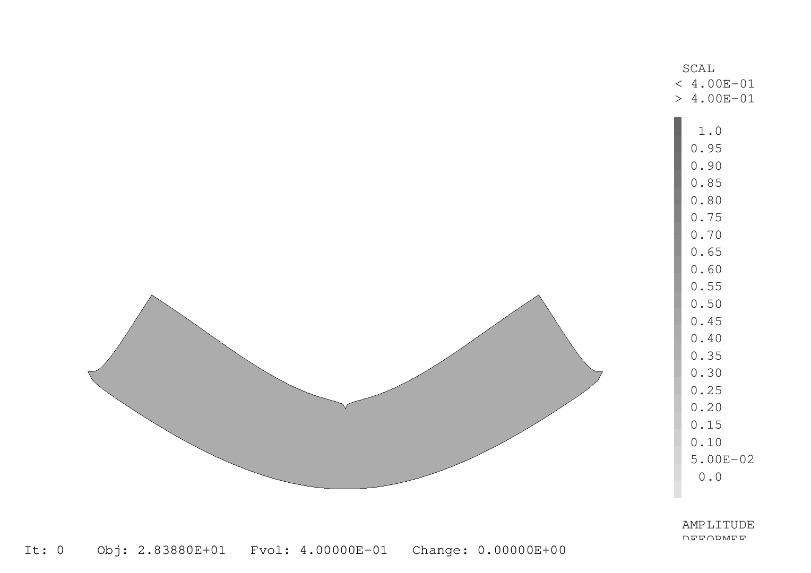

.. _sec:opti_topo_appli:

Illustration sur un cas mécanique
=================================

Une mise en donnée de :ref:`l'algorithme d'optimisation précédent <sec:opti_topo_oc>` est fournie en :ref:`annexe <ann:opti_topo_oc_dgibi>`
et disponible sur le site Cast3M dans `opti_topo_oc.dgibi <http://www-cast3m.cea.fr/index.php?page=exemples&exemple=opti_topo_oc>`_. On propose
ci-dessous une analyse détaillée des variables calculées et leur lien avec les éléments théoriques précedemment énoncés.

Définition du problème d'optimisation
-------------------------------------

Il s'agit d'optimiser la poutre en flexion présentée plus haut

.. figure:: figures/99_lines_img_1.png
   :width: 15cm
   :align: center

Pour l'optimisation, on choisit :

- une **fonction objectif** : la compliance :math:`\psi(\textbf{x}) = \textbf{U}^T(\textbf{x}).\mathbfcal{K}(\textbf{x}).\textbf{U}(\textbf{x})`
- une **contrainte sur le volume** : :math:`f=40\%` du domaine de conception
- les paramètres d'optimisation : :math:`p=3`, :math:`\eta=0,5`, :math:`m=0,1` et :math:`x_{\textrm{min}}=0,001`.

Initialisations
---------------

On initialise la topologie ``x`` avec des densités homogènes :math:`x_e=f` afin de satisfaire la contrainte de volume.
Le volume cible est nommé ``vcib``.

On calcule la matrice de filtrage ``kfil``, intervenant dans l'équation :eq:`eq:opti_topo_filtrage` avec
l'opérateur `MFIL <http://www-cast3m.cea.fr/index.php?page=notices&notice=MFIL>`_.
Notons que pour cela, il est nécessaire de disposer du maillage ``mcg`` des centres de gravité du maillage ainsi que
du champ par points ``wg`` des volumes :math:`V_e` de chaque éléments, exprimé sur ces centres de gravité.
Le champ des volumes élémentaires ``vole`` est obtenu grâce à l'opérateur `INTG 'ELEM' <http://www-cast3m.cea.fr/index.php?page=notices&notice=INTG>`_
en intégrant le champ ``un`` unitaire par élément.

Les volumes utiles sont aussi calculés : ``v0`` le volume du domaine de conception, ``vx`` le volume de la topologie ``x`` courante
et ``vcib`` le volume cible.

.. admonition:: Initialisation : topologie initiale et matrice de filtrage

   .. literalinclude:: dgibi/opti_topo_oc.dgibi
      :language: gibiane
      :lines: 46-61
      :lineno-start: 46

On démarre ensuite une boucle d'optimisation limitée à 100 itérations.

Pénalisation et résolution du problème mécanique
------------------------------------------------

On calcule alors ``rip``, la matrice de rigidité pénalisée :math:`\mathbfcal{K}(\textbf{x})` de la
topologie courante selon la loi puissance de la méthode SIMP. Le comportement étant isotrope,
le *module d'Young pénalisé* ``yop`` de chaque élément vaut :math:`E_e=(x_e)^pE_0` avec
:math:`E_0` le module d'Young du matériau.

On résoud ensuite le problème mécanique :math:`\mathbfcal{K}(\textbf{x}).\textbf{U}(\textbf{x}) =\textbf{F}` en calculant Les
déplacements ``u`` avec l'opérateur `RESO <http://www-cast3m.cea.fr/index.php?page=notices&notice=RESO>`_.

.. admonition:: Pénalisation de la rigidité et résolution

   .. literalinclude:: dgibi/opti_topo_oc.dgibi
      :language: gibiane
      :lines: 63-71
      :lineno-start: 63

Calcul de la fonction objectif et des sensibilités
--------------------------------------------------

On peut calculer la valeur ``psi`` de la fonction objectif :math:`\psi(\textbf{x}) = \textbf{F}^T(\textbf{x}).\textbf{U}(\textbf{x})`
en remarquant que si celle-ci est égale au travail des forces extérieures, elle est donc aussi égale au travail des
efforts intérieurs et peut donc s'obtenir par :

.. math::

   \psi(\textbf{x}) = \int_{\Omega} \sigma(\textbf{x}):\varepsilon(\textbf{x}) dV

où :math:`\sigma` et :math:`\varepsilon` désignent les champs de contraintes et déformations ``sig`` et ``eps``.
Le champ du double produit contracté :math:`\sigma:\varepsilon` est obtenu grâce à l'opérateur
`ENER <http://www-cast3m.cea.fr/index.php?page=notices&notice=ENER>`_ et son intégrale par
`INTG <http://www-cast3m.cea.fr/index.php?page=notices&notice=INTG>`_.

Le champ ``dpsi`` de sensibilité de la fonction objectif :eq:`eq:opti_topo_sensibilite_1` s'exprime alors en fonction
de la matrice de Hooke :math:`\mathbfcal{C}_0` du matériau plein :

.. math::

   \frac{\partial \psi}{\partial x_e} = -p(x_e)^{p-1} \varepsilon^T(x_e).\mathbfcal{C}_0.\varepsilon(x_e)

.. admonition:: Calcul de la fonction objectif et de sa sensibilités

   .. literalinclude:: dgibi/opti_topo_oc.dgibi
      :language: gibiane
      :lines: 72-80
      :lineno-start: 72

Filtrage
--------

L'étape de filtrage de la sensibilité est réalisée en multipliant la matrice de filtrage ``kfil`` par le
champ par point ``xdpsi = x * dpsi`` représentant le produit :math:`x_f\dfrac{\partial \psi}{\partial x_f}` dans
l'équation :eq:`eq:opti_topo_filtrage`.

.. admonition:: Filtrage de la sensibilité

   .. literalinclude:: dgibi/opti_topo_oc.dgibi
      :language: gibiane
      :lines: 81-86
      :lineno-start: 81

Optimisation par critère d'optimalité
-------------------------------------

La mise à jour de la topologie (passage du champ ``x`` à ``xnew``) suivant le schéma :eq:`eq:opti_topo_bendsoe`
est réalisée en suivant l':ref:`algorithme de dichotomie <algo:opti_topo_dichotomie>` pour la recherche du
multiplicateur de Lagrange ``lmid`` qui nécessite une nouvelle boucle (limitée à 100 itérations).

La limitation d'incrément :math:`m` et le recpect des bornes :math:`x_\textrm{min} \le x_e \le 1` sont réalisées
grâce aux opérateurs `BORN <http://www-cast3m.cea.fr/index.php?page=notices&notice=BORN>`_ et
`MASQ <http://www-cast3m.cea.fr/index.php?page=notices&notice=MASQ>`_.

La vérification de la contrainte de volume est faite en calculant le volume ``vxnew`` de chaque toplogie ``xnew``
et en le comparant au volume cible ``vcib``.

.. admonition:: Optimisation (critère d'optimalité)

   .. literalinclude:: dgibi/opti_topo_oc.dgibi
      :language: gibiane
      :lines: 94-116
      :lineno-start: 94

Un affichage bilan de l'itération est fait, puis un cirtère d'arrêt de la boucle d'optimisation
est proposé lorsque l'incrément maximal de densité ``chgx`` est inférieur à 0,01

.. admonition:: Fin de boucle et critère d'arrêt

   .. literalinclude:: dgibi/opti_topo_oc.dgibi
      :language: gibiane
      :lines: 117-127
      :lineno-start: 117

Les résultats de cette optimisation sont présentés dans l'animation ci-dessous qui montre les topologies
(champs par éléments de densités) obtenues au cours des itérations. La topologie finale est atteinte
après 42 itérations.

   Animation des topologies au cours de l'optimisation (déformée x 1000)
