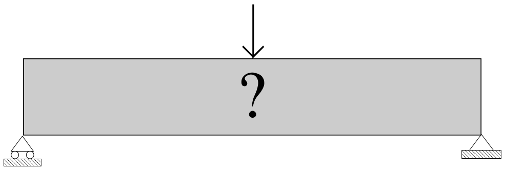

.. _sec:opti_topo_intro:

Éléments théoriques de base
===========================

Généralités
-----------

L'optimisation topologique consiste à chercher la **répartition optimale de la matière** dans une **pièce donnée**
soumise à des **chargements** et sous certaines **limitations**. L'inconnue de ce type de problème est la *topologie*,
c'est-à-dire *comment la matière est-elle répartie ?*

Dans un cadre mécanique, ce type de problème peut être formulé en : **trouver la distribution optimale de rigidité**
:math:`\mathbfcal{k}`, ce qui peut s'écrire :

.. math::
   :name: eq:opti_topo_1

   \min_{\mathbfcal{k}(m)} \quad & \psi(\mathbfcal{k})   & \\
   \textsf{tel que}     \quad & \chi_i(\mathbfcal{k}) &= 0 \\

Explicitons certains termes :

- Par **répartition optimale de la matière** on entend la distribution spatiale de rigidité :math:`\mathbfcal{k}(m)`
  en tout point :math:`m \in \Omega` qui minimise une fonction :math:`\psi` indicatrice du souhait de l'utilisateur.
- Par **pièce donnée** on entend que la recherche de la topologie se fait sur un domaine limité de l'espace :math:`\Omega`.
- Par **chargements** on entend que cette pièce subit des conditions aux limites, par exemple des déplacements
  imposés et des forces appliquées sur certaines zones.
- Par **limitations** on entend que l'optimisation se fait *sous contraintes*, représentées par l'ensemble de fonctions
  :math:`\chi_i(\mathbfcal{k}) = 0`. En effet, afin d'éviter les solutions triviales, il est nécessaire d'imposer des
  contraintes. Par exemple, on peut chercher à minimiser le volume d'une pièce sous contrainte que celle-ci ne se
  déplace par trop (sans quoi la solution à volume nul sera optimale).

Le problème est illustré ci-dessous dans le cas d'une poutre en flexion 3 points.

   Problème d'optimisation topologique sur une poutre en flexion [SIGMUND-2001]_

Plusieurs choix de fonctions :math:`\psi` et :math:`\chi_i` sont alors possibles pour optimiser une structure,
comme par exemple :

- chercher la pièce la plus rigide possible, sans dépasser un certain volume ;
- chercher la pièce la plus légère possible, sans dépasser une certaine fréquence de résonnance ;
- chercher la pièce avec les contraintes mécaniques les plus faibles, sans dépasser un certain niveau de déplacement.

Un choix très répendu de problème d'optimisation en mécanique des structures est de **minimiser la compliance** (c'est-à-dire
*l'énergie de déformation* ou encore *le travail des forces extérieures*) **sous contrainte de volume**. En introduisant une
discrétisation spatiale (maillage) et une **variable de conception** discrète :math:`\textbf{x}`, le problème d'optimisation
topologique peut être plus clairement formulé :

.. math::
   :name: eq:opti_topo_2

   \min_{\textbf{x}} \quad & \psi(\textbf{x}) = \textbf{F}^T.\textbf{U}(\textbf{x}) = \textbf{U}^T(\textbf{x}).\mathbfcal{K}(\textbf{x}).\textbf{U}(\textbf{x}) \\
   \textsf{tel que}  \quad & \chi(\textbf{x}) = V(\textbf{x}) - fV_0 = \sum_{e=1}^N x_eV_e - fV_0 = 0 \\
                           & \mathbfcal{K}(\textbf{x}).\textbf{U}(\textbf{x}) =\textbf{F} \\
                           & x_e \in \{0;1\} \\

Ce problème de *minimiser de la compliance* est équivalent à *maximiser la raideur de la structure*. Détaillons les variables :

- :math:`\textbf{x}` est le vecteur des **variables de conception** :math:`x_e`, traduisant la présence de matière
  :math:`(x_e=1)` ou bien l'absence de matière :math:`(x_e=0)` dans l'élément :math:`e`
- :math:`\textbf{U}` et :math:`\textbf{F}` sont les vecteurs déplacements et forces globaux aux noeuds du maillage
- :math:`\mathbfcal{K}=\sum_{e=1}^N \mathbfcal{k}_e` est la matrice de rigidité globale, assemblée sur les :math:`N` éléments du maillage
- :math:`V(\textbf{x})` est le volume de la topologie :math:`\textbf{x}` et :math:`V_e` le volume de
  l'élément :math:`e`
- :math:`f` est la fraction volumique imposée
- :math:`V_0` est le volume du domaine de conception :math:`\Omega`

.. _sec:opti_topo_simp:

La méthode SIMP
---------------

Dans ce document nous illustrerons brièvement la méthode SIMP, pour *Solid Isotropic Material with Penalization*,
qui est la méthode d'optimisation topologique la plus répendue dans les codes industriels et celle mise en oeuvre
dans Cast3M via la procédure `TOPOPTIM <http://www-cast3m.cea.fr/index.php?page=notices&notice=TOPOPTIM>`_.
Le lecteur intéressé pourra consulter de nombreux ouvrages sur le sujet, comme par exemple :

- Les livres de référence [BENDSOE-1995]_ et [BENDSOE-SIGMUND-2004]_ qui détaillent rigouresement la théorie
  derrière l'optimisation topologique.
- L'article pédagogique [SIGMUND-2001]_ qui présente une implémentation sur Matlab en 99 lignes d'un algorithme
  d'optimisation topologique. La procédure `TOPOPTIM <http://www-cast3m.cea.fr/index.php?page=notices&notice=TOPOPTIM>`_
  de Cast3M, ainsi que l'exemple utilisé dans ce document en sont grandement inspirés.

Les principales idées de la méthode sont les suivantes :

- Introduire des **variables de conception continues** :math:`x_e \in [0;1]`, appelées aussi **densités**.
- Pénaliser la rigidité :math:`\mathbfcal{K}` en fonction de :math:`\textbf{x}` par une loi puissance
  afin d'éviter la présence de densités intermédiaires. La matrice de rigidité de l'élément :math:`e`
  vaut ainsi :

.. math::
   \mathbfcal{k}_e=(x_e)^p\mathbfcal{k}_0

**Le problème d'optimisation de la compliance :eq:`opti_topo_2` devient finalement :**

.. math::
   :name: eq:opti_topo_3

   \min_{\textbf{x}} \quad & \psi(\textbf{x}) = \textbf{U}^T(\textbf{x}).\mathbfcal{K}(\textbf{x}).\textbf{U}(\textbf{x}) = \sum_{e=1}^N (x_e)^p \quad \textbf{u}_e^T.\mathbfcal{k}_0.\textbf{u}_e \\
   \textsf{tel que}  \quad & \chi(\textbf{x}) = \sum_{e=1}^{N}x_eV_e - fV_0 = 0 \\
                           & \mathbfcal{K}(\textbf{x}).\textbf{U}(\textbf{x}) =\textbf{F} \\
                           & 0 < x_{\textrm{min}} \le x_e \le 1 \\

avec :

- :math:`\textbf{u}_e` et :math:`\textbf{f}_e` les vecteurs déplacements et forces de l'élément :math:`e`
- :math:`\mathbfcal{k}_e` la matrice de rigidité de l'élément :math:`e`
- :math:`\mathbfcal{k}_0` la matrice de rigidité du matériau plein
- :math:`x_{\textrm{min}}` une densité minimale non nulle (pour éviter les singularités)
- :math:`p` le paramètre de pénalisation (en général :math:`p=3`)

.. _sec:opti_topo_oc:

Résolution du problème par Critère d'Optimalité
-----------------------------------------------

Un schéma de résolution heuristique et simple de ce type du problème :eq:`eq:opti_topo_3` est
proposé par [BENDSOE-1995]_ et consite à mettre à jour, de manière itérative, les densités
courantes :math:`\textbf{x}` vers une nouvelle valeur :math:`\textbf{x}^{\textrm{new}}` :

.. math::
   :name: eq:opti_topo_bendsoe

   x_e^{\textrm{new}} = \left\{
     \begin{array}{lll}
     x_e^-         & \textsf{si} & x_eB_e^{\eta} \le x_e^- \\
     x_eB_e^{\eta} & \textsf{si} & x_e^- < x_eB_e^{\eta} < x_e^+ \\
     x_e^+         & \textsf{si} & x_e^+ \le x_eB_e^{\eta} \\
     \end{array}
   \right.

avec :

- :math:`x_e^- = \max (x_{\textrm{min}},x_e-m)` une borne inférieure pour respecter l'inégalité :math:`x_{\textrm{min}} \le x_e^{\textrm{new}}`
- :math:`x_e^+ = \min (1,x_e+m)` une borne supérieure pour respecter l'inégalité :math:`x_e^{\textrm{new}} \le 1`
- :math:`\eta` est un coefficient d'amortissement (généralement :math:`\eta=0,5`)
- :math:`m` est une limite d'incrément de densité sur l'itération pour stabiliser la
  convergence

Le terme :math:`B_e` guidant la mise à jour de :math:`x_e` est obtenu par la condition d'optimalité :

.. math::
   :name: eq:opti_topo_optimalite

   B_e = \frac{-\dfrac{\partial \psi}{\partial x_e}}{\mathcal{L} \dfrac{\partial \chi}{\partial x_e}}

- :math:`\dfrac{\partial \psi}{\partial x_e}` est la **sensibilité** de la fonction objectif :math:`\psi`
- :math:`\dfrac{\partial \chi}{\partial x_e}` est la **sensibilité** de la fonction contrainte :math:`\chi`
- :math:`\mathcal{L}` est un **multiplicateur de Lagrange** pour satisfaire la contrainte de volume :math:`\chi`

En dérivant les expressions des fonctions, la sensibilité de la fonction objectif (compliance), en l'absence
de forces dépendantes de la densité, s'écrit :

.. math::
   :name: eq:opti_topo_sensibilite_1

   \frac{\partial \psi}{\partial x_e} = -p(x_e)^{p-1} \textbf{u}_e^T.\mathbfcal{k}_0.\textbf{u}_e

La sensibilité de la fonction contrainte (volume) s'écrit :

.. math::
   :name: eq:opti_topo_sensibilite_2

   \frac{\partial \chi}{\partial x_e} = V_e

La difficulté étant alors de trouver la valeur de :math:`\mathcal{L}` qui satisfait la contrainte.
Étant donné que la fonction contrainte :math:`\chi` a une décroissance monotone avec :math:`\mathcal{L}`,
on peut utiliser une **dichotomie** en initialisant des bornes inférieure :math:`\mathcal{L}^-` et supérieure :math:`\mathcal{L}^+`
puis en choisissant la valeur milieu de l'intervalle. Une évaluation de la fonction contrainte :math:`\chi`
est alors faite et le processus est répété dans le demi intervalle *ad hoc* :

.. _algo:opti_topo_dichotomie:

**Initialisation des bornes**

:math:`\mathcal{L}^- =0 \quad \mathcal{L}^+ =100000000`

**Tant que** \ :math:`(\mathcal{L}^+ - \mathcal{L}^-) > 0,0001` :

.. raw:: html

   

.. math::

   \begin{array}{ll}
     \mathcal{L}                   & = (\mathcal{L}^- + \mathcal{L}^+)/2 \\
     \textbf{x}^{\textrm{new}} & = \textsf{actualiser } \textbf{x} \textsf{ selon (4)} \\
     \textsf{si } \chi(\textbf{x}) & > 0 & \\
       \quad \mathcal{L}^- & = \mathcal{L} \\
     \textsf{sinon} & \\
       \quad \mathcal{L}^+ & = \mathcal{L} \\
     \textsf{finsi} &\\
   \end{array} \\

.. raw:: html

   

**Fin**

À l'issue de la dichotomie on obtient la valeur de :math:`\mathcal{L}` qui satisfait la contrainte
sur le volume ainsi que la nouvelle topologie :math:`\textbf{x}^{\textrm{new}}`.

.. _sec:opti_topo_filtre:

Filtrage de la sensibilité
--------------------------

Afin d'éviter l'effet de damier et diminuer la sensibilité des solutions au maillage, on applique une
procédure de filtrage (ou lissage) du champ de sensibilité. Sur chaque élément :math:`e` la sensibilité
de la compliance est remplacée par une valeur moyenne pondérée des sensibilités calculées sur les
éléments voisins :math:`f` dans un rayon :math:`r_{\textrm{min}}` :

.. math::
   :name: eq:opti_topo_filtrage

   \dfrac{\widehat{\partial \psi}}{\partial x_e} = \frac{1}{x_e}\dfrac{1}{\sum_{f=1}^{N_e}\hat{H}_f}\sum_{f=1}^{N_e}\hat{H}_fx_f\frac{\partial \psi}{\partial x_f}

L'opérateur de convolution :math:`\hat{H}_f` vaut :

.. math::

   \hat{H}_f = \left( 1 - \frac{\textrm{dist}(e,f)}{r_{\textrm{min}}} \right)^q V_f

et n'est définit que pour les :math:`N_e` éléments :math:`f` tels que :math:`\textrm{dist}(e,f) \le r_{\textrm{min}}`, avec :

- :math:`\textrm{dist}(e,f)` la distance entre les centres des éléments :math:`e` et :math:`f`
- :math:`V_f` le volume de l'élément `f` (ou bien une autre quantitié pour pondérer)
- :math:`r_{\textrm{min}}` le rayon du filtre, au dela duquel l'opérateur de convolution :math:`\hat{H}_f` est nul
- :math:`q` un coefficient

Dans Cast3M, ce filtrage est réalisé grâce à l'opérateur `MFIL <http://www-cast3m.cea.fr/index.php?page=notices&notice=MFIL>`_.

Notons que dans l'article 99 lignes de [SIGMUND-2001]_ l'opérateur de filtrage utilisé correspond au cas où :math:`q=1` et
où tous les éléments ont un volume :math:`V_f=1`.
